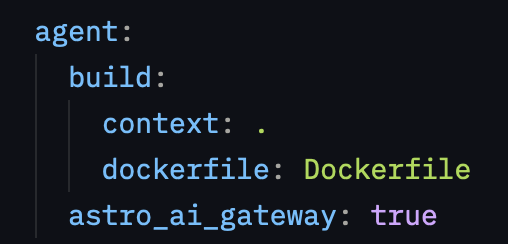
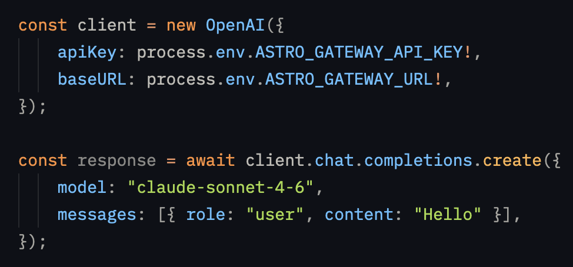
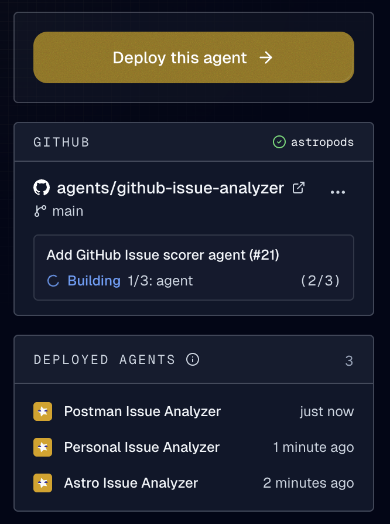
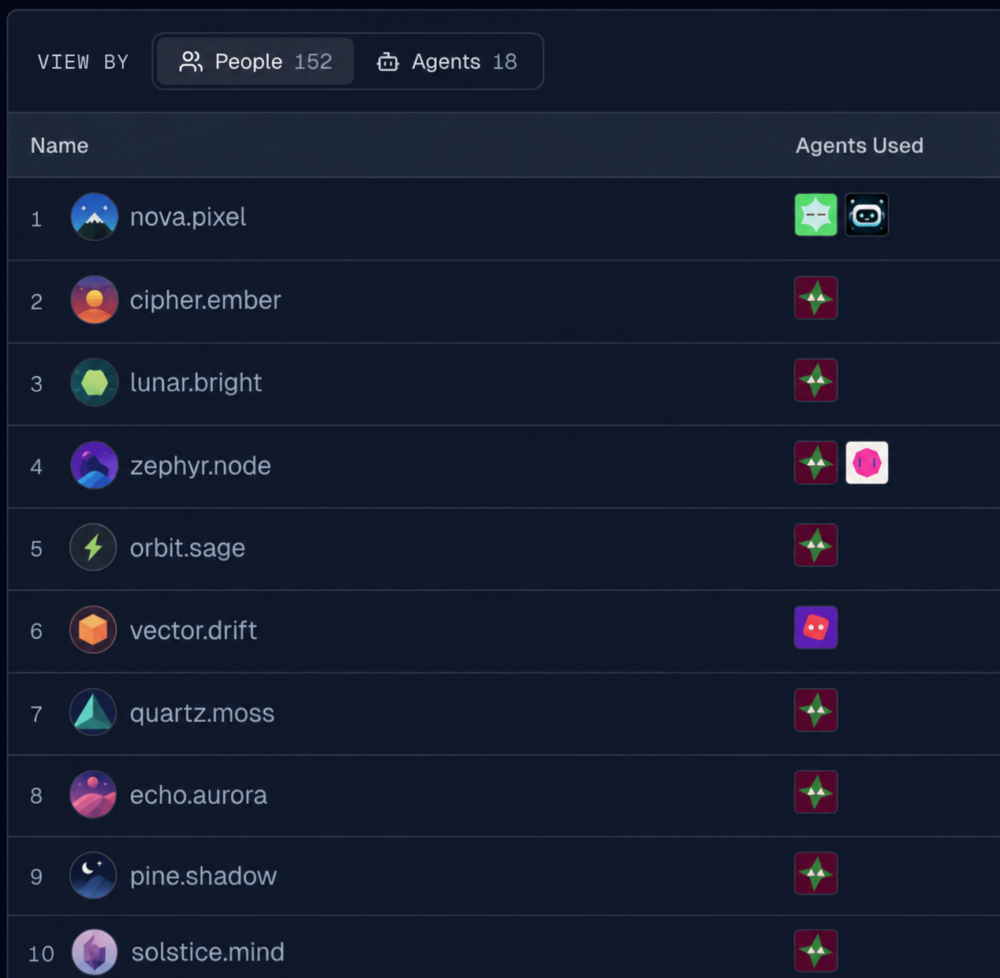

## AI Gateway
<div style="display: flex; gap: 1.5rem; align-items: flex-start; flex-wrap: wrap; margin-top: -1rem;">
  <div style="flex: 1 1 280px; min-width: 0;">
Stop wiring per-provider credentials into every agent.
Set `agent.astro_ai_gateway: true` in `astropods.yml` and the deployment receives a managed gateway URL and a virtual key that covers every supported model.

Each deployment gets its own key, reused on redeploy and revoked on undeploy, and `ast dev` mints a short-lived key automatically so the same agent code runs locally and in production against the same gateway. See the [supported models](/ai-gateway).

  </div>
  <div style="display: flex; flex-direction: column; gap: 1rem; flex-shrink: 0;">
    
    
  </div>
</div>

## Blueprints - see where you've deployed them
<div style="display: flex; gap: 1.5rem; align-items: flex-start; flex-wrap: wrap; margin-top: -1rem;">
  
  <div style="flex: 1 1 280px; min-width: 0;">
The blueprint detail page now lists the agents you've deployed from that blueprint across every account you belong to. Scope is private to your accounts.

The sidebar's **Authors** section is renamed to **Contributors** (it credits maintainers and commit authors, not just the original creator). The Repository row links to the repo and, when the blueprint points at a subdirectory, a second row deep-links into that subdirectory on GitHub, GitLab, or Bitbucket.

  </div>
</div>

## Slack users are first-class people
<div style="display: flex; gap: 1.5rem; align-items: flex-start; flex-wrap: wrap; margin-top: -1rem;">
  <div style="flex: 1 1 280px; min-width: 0;">
Members who linked their Slack identity now appear under their Astro identity in Insights. Spend they accumulated as a bare Slack user before linking is folded into the same row as spend tracked after linking, so each person shows up once instead of twice.

Slack users who haven't linked still surface in the People view with their workspace profile name, avatar, and a deep link into their Slack profile.
  </div>
  
</div>

## CLI

- **`ast agent trace`** is new. List traces (paginated, optionally bounded by `--start` / `--end`), pull a single trace's detail with `--trace-id`, or get an activity summary with `--summary` — total traces, last active, and a per-day sparkline of requests and tokens. `--json` on any mode emits the raw response for piping into `jq`.
- **`ast agent logs` works on any workload.** The new `--workload` flag takes `workload[/container]` and resolves by exact name, suffix (`vectors` → `my-agent-knowledge-vectors`), or component label (`agent`, `messaging`, `collector`). `ast agent get` now prints each workload's Kubernetes name next to its component so you know what to pass in.
- **`ast login` preserves your active org** across re-authentication. If you were working in an org when your token expired, you land back on that org instead of being bounced to personal. `ast login --account <name>` continues to override.
- **All `ast agent` subcommands now require `--name` or `--id`** to identify their target. Positional names are gone — quote multi-word display names in the shell. `--confirm` on delete still accepts either form.
- **`ast build` / `ast push` on Docker Desktop 4.77.0** is rebuilt on top of BuildKit's gRPC endpoint (the same path `docker buildx build` uses).
- **`ast dev` postgres** now auto-injects `POSTGRES_USER` and `POSTGRES_PASSWORD` for container-mode postgres knowledge stores, matching the prod deploy path. Existing workarounds in `agent.inputs` can be deleted.
- **Frontend agents** now receive `PORT` in the container env so frameworks that read `process.env.PORT` (Express, FastAPI/uvicorn, Next) bind to the right port without hardcoding.

Run `ast upgrade` to pick up the latest CLI.

## Fixes

- **Trace detail** loads instantly even on agents with large tool outputs (GitHub PR diffs, Confluence pages, project reports) — the tree renders right away and each node fetches its full input/output only when you click it.
- **Log viewer** now returns the most recent entries first; scrolling up at the top pulls older entries while preserving your scroll position. Previously widening the time range could make the newest log appear older.
- **Deployment status** is consistent across the agent toggle and the history tiles — same vocabulary, same colors, no flickering on pause/resume. Brief cluster blips no longer drag the badge into "Deploying", and the tooltip now shows a sentence like *"1 of 3 replicas ready"* instead of a guess.
- **Configure page select dropdowns** now preserve their stored value when the page is reopened.
- **Agents grid Launch button** is gated on the deployment being Running; it stays hidden when stopped, deploying, or in error.
- **Error badges** no longer turn red on paused or stopped deployments with stale messages.
- **Quick switcher** no longer keeps deleted agents around for a minute after they were dropped from the Agents page.
- **AGENT.md frontmatter** is now parsed leniently: a malformed YAML token or one bad field no longer drops the entire card — `ast push` / `ast dev` print a warning for what was skipped.
- **Vault secret edit dialog** lets you change a description without re-entering the secret value.

## Documentation

- New **Instrumentation** section in `ast docs agent` covers the right OTel library per stack (Mastra, LangChain/LangGraph via Traceloop, Claude Agent SDK via OpenInference, raw Anthropic/OpenAI) and the env vars the platform injects automatically.
- New [Messaging SDK guide](https://docs.astropods.com/messaging-sdk/node) covers the gRPC protocol in both Node and Python.
- New [Adapters guide](https://docs.astropods.com/adapters/overview) covers the framework-adapter layer with quickstarts for Mastra and LangChain plus custom-adapter guides for both languages.

## Claude Code skills

Astropods publishes a Claude Code plugin with skills to migrate an existing agent, build a new one from scratch, and improve your agent card. Install from your Claude Code session:

```
/plugin marketplace add astropods/agents
/plugin install astropods@astroai
/reload-plugins
```
