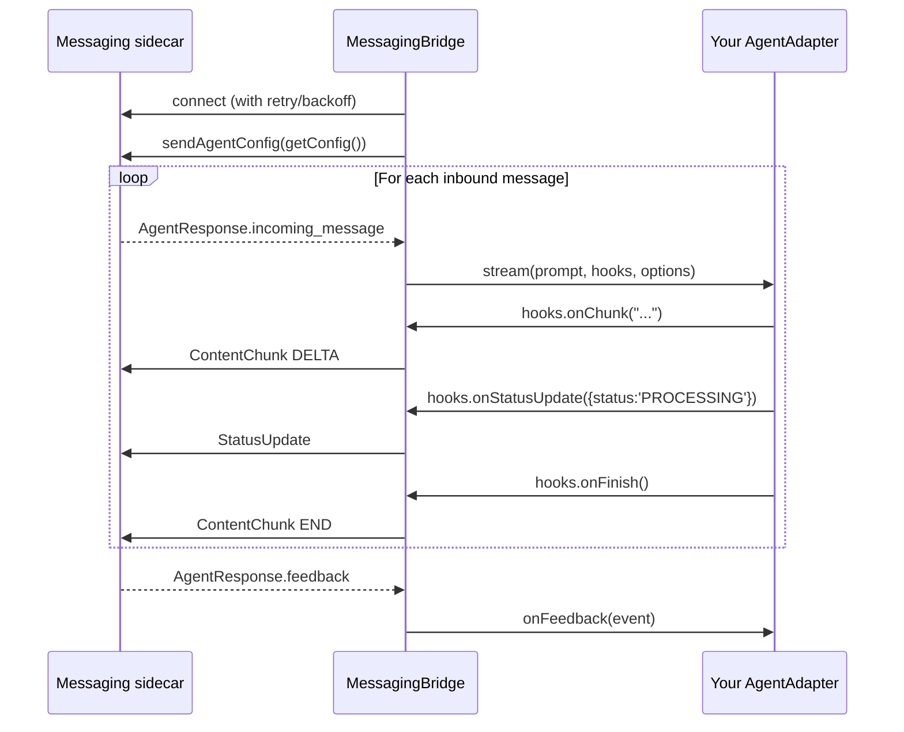

[`@astropods/adapter-core`](https://www.npmjs.com/package/@astropods/adapter-core) is the framework-agnostic core. Implement the `AgentAdapter` interface, hand it to `serve()`, and the bundled `MessagingBridge` handles the gRPC streaming loop, audio, feedback, reconnect, and shutdown.

Use this when there's no first-party adapter for your framework (or no framework at all — you're calling LLM APIs directly).

## Before you start

You need:

- An Astro AI agent project with `agent.interfaces.messaging: true` in `astropods.yml`, so the messaging sidecar runs alongside your agent.
- Node.js 18 or newer (or Bun).

## Install

```bash
bun add @astropods/adapter-core @astropods/messaging
# or: npm install @astropods/adapter-core @astropods/messaging
```

## Minimal adapter

```typescript
import { serve } from '@astropods/adapter-core';
import type { AgentAdapter } from '@astropods/adapter-core';

const adapter: AgentAdapter = {
  name: 'My Agent',

  async stream(prompt, hooks, options) {
    try {
      hooks.onChunk('Hello, ');
      hooks.onChunk(`${prompt}!`);
      hooks.onFinish();
    } catch (err) {
      hooks.onError(err as Error);
    }
  },

  getConfig() {
    return { systemPrompt: 'You are a helpful assistant.', tools: [] };
  },
};

serve(adapter);
```

`serve(adapter)` connects to `localhost:9090` (or `GRPC_SERVER_ADDR`) and runs until the process exits.

### Verify it works

Enable the web adapter in `astropods.yml` (`dev.interfaces.messaging.adapters: [web]`) and run your agent under `ast project`. Open the chat at `http://localhost:3100` and send a message. You should see the reply `Hello, <your message>!`.

## Lifecycle



## `AgentAdapter`

| Member                                  | Required | Notes                                                                   |
| --------------------------------------- | -------- | ----------------------------------------------------------------------- |
| `name: string`                          | yes      | Display name. Used in logs and `AgentConfig`.                           |
| `stream(prompt, hooks, options)`        | yes      | Stream a reply. Call `hooks.onChunk`/`onStatusUpdate`/etc. as you go.   |
| `getConfig(): MessagingAgentConfig`     | yes      | Returns `{ systemPrompt, tools }` for playground display.               |
| `streamAudio(audio, hooks, options)`    | no       | Handle audio messages. Omit to reject audio input with a friendly message. |
| `onFeedback(feedback)`                  | no       | Receive thumbs-up/down, text feedback, button clicks, etc.              |

### `StreamHooks`

Call these from inside `stream()` and `streamAudio()`. They translate directly into outbound `AgentResponse` messages on the gRPC stream.

| Method                          | Sends                                                  | When to call                                                       |
| ------------------------------- | ------------------------------------------------------ | ------------------------------------------------------------------ |
| `onChunk(text)`                 | `ContentChunk` (`START` first, then `DELTA`s)          | Each text fragment from the LLM. Bridge handles START/DELTA framing. |
| `onStatusUpdate(status)`        | `StatusUpdate`                                         | Pre-content typing indicator, tool execution status.               |
| `onTranscript(text)`            | `Transcript`                                           | After STT — replaces the "[audio]" placeholder.                   |
| `onAudioChunk(data)`            | `AudioChunk`                                           | TTS bytes back to the platform.                                    |
| `onAudioEnd()`                  | `AudioChunk { done: true }`                            | End-of-segment marker after TTS.                                   |
| `onFile(file)`                  | `FileAttachment` on the terminal `ContentChunk`        | After writing an output inside `AGENT_FILES_DIR`; call before `onFinish()`. |
| `onError(error)`                | `ErrorResponse`                                        | Generation failed. **Do not also call `onFinish()`.**             |
| `onFinish()`                    | `ContentChunk END`                                     | Response complete. **Call exactly once per request.**             |
| `onTraceContext({ traceparent })` | Stamps `traceContext` on the turn's `AgentResponse`s | Optional. Call once per turn to supply the W3C trace context of the assistant turn. Ignored when `traceparent` is empty. See [Trace context](#trace-context). |

`StatusUpdate.status` values: `THINKING`, `SEARCHING`, `GENERATING`, `PROCESSING`, `ANALYZING`, `CUSTOM`. Use `CUSTOM` with `customMessage`.

### `StreamOptions`

The bridge passes this to every `stream()` / `streamAudio()` call.

| Field             | Type              | Notes                                                                       |
| ----------------- | ----------------- | --------------------------------------------------------------------------- |
| `conversationId`  | string            | Stable across the conversation. Use as the memory/session key.              |
| `userId`          | string            | Sender's user ID. Use for memory scoping and trace attribution.            |
| `platformContext` | `PlatformContext` | Channel/thread IDs, workspace, event kind, raw platform user ID. Undefined when the message did not originate from a platform adapter (e.g. direct gRPC). See [Messaging SDK — PlatformContext](/messaging-sdk/node#inbound-message-anatomy). |
| `attachments`     | `AttachmentInput[]` | Files attached to this turn. Read the provided `path`; do not derive a path from the display name or scan the shared directory. See [Files in chat](/messaging-sdk/files-in-chat). |
| `saveConversation` | `(input) => Promise<SaveConversationResponse>` | Copy a conversation from another source into a user's Astro chat history. Optional: absent when the caller drives the gRPC stream itself. See [Saved conversations](/messaging-sdk/saved-conversations). |
| `getThreadHistory` | `(maxMessages?) => Promise<ThreadMessage[]>` | Read the source thread this turn belongs to, hydrated so edits and deletions are reflected. The prompt only carries the triggering message. |
| `images`          | `ImageInput[]`      | Images attached to this turn, with the bytes inline in a `data:` URI on `url`. Pass these to a vision model. See [Files in chat](/messaging-sdk/files-in-chat). |

### `AudioInput`

Passed to `streamAudio()`.

| Field      | Type                          | Notes                                                              |
| ---------- | ----------------------------- | ------------------------------------------------------------------ |
| `stream`   | `ReadableStream<Uint8Array>`  | Raw audio bytes. Pass directly to STT.                             |
| `config`   | `AudioStreamConfig`           | Encoding, sample rate, channels, language hint, source.            |
| `filetype` | string                        | Pre-mapped extension (`wav`, `webm`, `ogg`, `mp3`, `m4a`, `opus`, `flac`). |

### `FeedbackEvent`

Passed to `onFeedback()`. `kind` is a stable string discriminator so you don't have to import proto types to switch on it.

| Field            | Type   | Notes                                                                                              |
| ---------------- | ------ | -------------------------------------------------------------------------------------------------- |
| `conversationId` | string | Conversation the feedback is attached to.                                                          |
| `responseId`     | string | Platform message ID the feedback targets.                                                          |
| `traceContext`   | `TraceContext` | Trace context of the referenced assistant response, when the platform echoes it back. See [Trace context](#trace-context). |
| `kind`           | string | See table below.                                                                                   |
| `userId`         | string | Submitter's user ID. Empty for anonymous/system events.                                            |
| `userName`       | string | Submitter's display name.                                                                          |
| `text`           | string | Populated for `text` (the body), `reaction` (emoji name).                                          |
| `prompt`         | string | Populated for `text` (the modal label).                                                            |

**`FeedbackEvent.kind` values**

| Value               | Source                                                                                  |
| ------------------- | --------------------------------------------------------------------------------------- |
| `thumbs_up`         | `MessageReaction` with `THUMBS_UP`. Synthesized from the reaction enum.                |
| `thumbs_down`       | `MessageReaction` with `THUMBS_DOWN`.                                                  |
| `reaction`          | `MessageReaction` with `CUSTOM_EMOJI`. `text` holds the emoji name.                    |
| `text`              | `TextFeedback` modal submission. `text` is the body; `prompt` is the modal label.      |
| `button_click`      | `ButtonClick` from a `CardAttachment`.                                                 |
| `prompt_selection`  | User clicked a `SuggestedPrompts` entry.                                               |
| `stream_control`    | `StreamControl` (stop/pause/resume/regenerate).                                        |
| `message_edit`      | User edited their own previous message.                                                |
| `message_delete`    | User deleted their own previous message.                                               |

`onFeedback()` may return `void` or a Promise. The bridge does **not** await the result — so don't block the stream on slow I/O. Push to a queue or trigger an async write and return.

## Trace context

Call `hooks.onTraceContext({ traceparent })` once per turn to attach the turn's W3C trace context. The bridge stamps it on every `AgentResponse` it emits for the turn, so a consumer can correlate any response — and the feedback that references it — back to the trace. It's ignored when `traceparent` is empty.

`createTraceparent(input)` formats a native trace/span ID pair into a W3C `traceparent` string. It returns `""` for invalid or all-zero IDs, so it's safe to pass raw OpenTelemetry span context. `traceFlags` accepts a number or hex string and defaults to `01` (sampled).

```typescript
import { createTraceparent } from '@astropods/adapter-core';

const { traceId, spanId, traceFlags } = span.spanContext();
hooks.onTraceContext?.({ traceparent: createTraceparent({ traceId, spanId, traceFlags }) });
```

The first-party framework adapters already emit trace context from their root span — you only wire this up in a custom adapter. See the [Messaging SDK](/messaging-sdk/node#trace-context) for the underlying `TraceContext` wire shape.

## `serve(adapter, options?)`

Thin wrapper around `MessagingBridge` that handles process lifecycle.

| Parameter | Type           | Required | Notes                                                |
| --------- | -------------- | -------- | ---------------------------------------------------- |
| `adapter` | `AgentAdapter` | yes      | Your implementation.                                 |
| `options` | `ServeOptions` | no       | `{ serverAddress?: string }`.                        |

`ServeOptions.serverAddress` defaults to `process.env.GRPC_SERVER_ADDR || 'localhost:9090'`.

## Worked example: a plain OpenAI agent

No framework — calling OpenAI's streaming chat API and forwarding tokens.

```typescript
import OpenAI from 'openai';
import { serve } from '@astropods/adapter-core';
import type { AgentAdapter } from '@astropods/adapter-core';

const openai = new OpenAI({
  apiKey: process.env.ASTRO_GATEWAY_API_KEY,
  baseURL: process.env.ASTRO_GATEWAY_URL,
});

const adapter: AgentAdapter = {
  name: 'OpenAI Direct',

  async stream(prompt, hooks, options) {
    try {
      hooks.onStatusUpdate({ status: 'GENERATING' });

      const stream = await openai.chat.completions.create({
        model: 'claude-sonnet-4-6',
        messages: [
          { role: 'system', content: 'You are a helpful assistant.' },
          { role: 'user', content: prompt },
        ],
        stream: true,
      });

      for await (const chunk of stream) {
        const text = chunk.choices[0]?.delta?.content;
        if (text) hooks.onChunk(text);
      }

      hooks.onFinish();
    } catch (err) {
      hooks.onError(err as Error);
    }
  },

  getConfig() {
    return { systemPrompt: 'You are a helpful assistant.', tools: [] };
  },

  onFeedback(event) {
    // Push to your evals pipeline, Airtable, etc. Don't block.
    void recordFeedback(event);
  },
};

serve(adapter);
```

## Rules of thumb

- Call **exactly one** of `onFinish()` or `onError()` per request. Skipping either leaves the user staring at a half-rendered reply.
- Catch your own exceptions inside `stream()`. If you let the promise reject, the user sees nothing.
- Don't block in `onFeedback()` — push to a queue or trigger async work and return.
- Use `options.conversationId` (not `platformContext.threadId`) as your memory key.
- Use only `options.attachments` as file input for the turn. Write output files to `AGENT_FILES_DIR` and call `onFile` before `onFinish`; see [Files in chat](/messaging-sdk/files-in-chat).
- Set up OTEL manually before calling `serve()` if you want traces. Framework adapters auto-configure this; the raw core does not.

## Re-exported types

```typescript
import type {
  AgentAdapter, AudioInput, FeedbackEvent,
  StreamHooks, StreamOptions, ServeOptions,
  PlatformContext, PlatformContextEventKind,
  TraceContext, TraceparentInput,
} from '@astropods/adapter-core';

import { serve, MessagingBridge, logger, createTraceparent } from '@astropods/adapter-core';
```

`logger` is a Pino instance. Use it for adapter logs so output stays consistent with the bridge.

See [Messaging SDK (Node)](/messaging-sdk/node) for the underlying proto shapes referenced by `StreamHooks` and `PlatformContext`.
