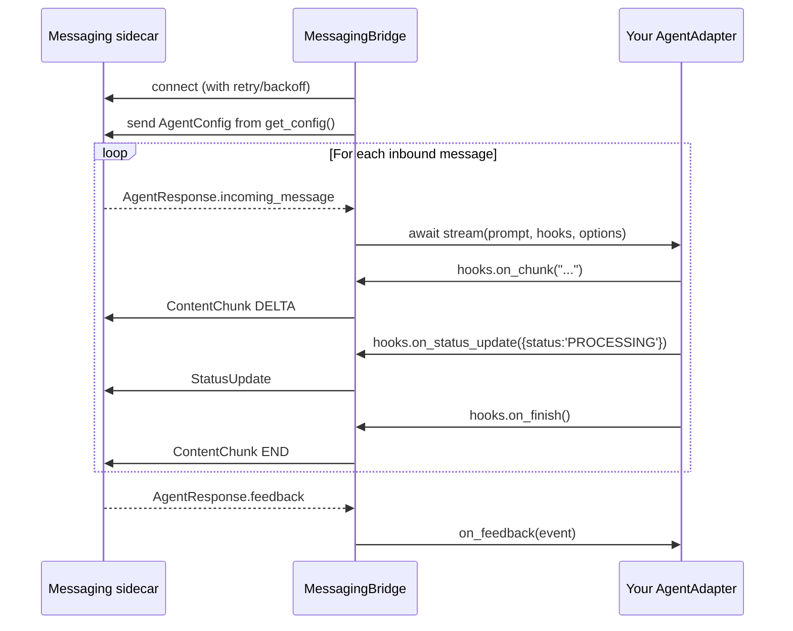

[`astropods-adapter-core`](https://pypi.org/project/astropods-adapter-core/) is the framework-agnostic Python core. Implement the `AgentAdapter` protocol, hand it to `serve()`, and the bundled `MessagingBridge` handles the gRPC streaming loop, audio, feedback, and shutdown.

Use this when there's no first-party adapter for your framework (or no framework at all — you're calling LLM APIs directly).

## Install

```bash
pip install astropods-adapter-core
```

Requires Python 3.10+.

## Minimal adapter

```python
from astropods_adapter_core import StreamHooks, StreamOptions, serve

class MyAdapter:
    name = "My Agent"

    async def stream(self, prompt: str, hooks: StreamHooks, options: StreamOptions) -> None:
        try:
            hooks.on_chunk("Hello, ")
            hooks.on_chunk(f"{prompt}!")
            hooks.on_finish()
        except Exception as e:
            hooks.on_error(e)

    def get_config(self) -> dict:
        return {"system_prompt": "You are a helpful assistant.", "tools": []}

serve(MyAdapter())
```

`serve(adapter)` connects to `localhost:9090` (or `GRPC_SERVER_ADDR`) and blocks until `SIGINT` / `SIGTERM`.

## Lifecycle



## `AgentAdapter` protocol

The interface is a `typing.Protocol` — duck-typed. Any class with these members satisfies it.

| Member                                       | Required | Notes                                                                            |
| -------------------------------------------- | -------- | -------------------------------------------------------------------------------- |
| `name: str`                                  | yes      | Display name. Used in logs and `AgentConfig`.                                    |
| `async stream(prompt, hooks, options)`       | yes      | Stream a reply. Call `hooks.on_chunk` / `on_status_update` / etc. as you go.    |
| `get_config() -> dict`                       | yes      | Returns `{"system_prompt": str, "tools": [...]}` for the playground.             |
| `async stream_audio(audio, hooks, options)`  | no       | Handle audio messages. Omit to reject audio input with a friendly message.       |
| `on_feedback(feedback)`                      | no       | Receive thumbs-up/down, text feedback, button clicks, etc. May be sync or async. |

### `StreamHooks`

Call these from inside `stream()` and `stream_audio()`. They translate directly into outbound `AgentResponse` messages on the gRPC stream.

| Method                              | Sends                                                  | When to call                                                       |
| ----------------------------------- | ------------------------------------------------------ | ------------------------------------------------------------------ |
| `on_chunk(text)`                    | `ContentChunk` (`START` first, then `DELTA`s)          | Each text fragment from the LLM.                                  |
| `on_status_update(status)`          | `StatusUpdate`                                         | Pre-content typing indicator, tool execution status.               |
| `on_transcript(text)`               | `Transcript`                                           | After STT — replaces the "[audio]" placeholder.                   |
| `on_audio_chunk(data)`              | `AudioChunk`                                           | TTS bytes back to the platform.                                    |
| `on_audio_end()`                    | `AudioChunk(done=True)`                                | End-of-segment marker after TTS.                                   |
| `on_file(name, mime_type, size)`    | `FileAttachment` on the terminal `ContentChunk`        | After writing an output inside `AGENT_FILES_DIR`; call before `on_finish()`. |
| `on_error(exception)`               | `ErrorResponse`                                        | Generation failed. **Do not also call `on_finish()`.**            |
| `on_finish()`                       | `ContentChunk END`                                     | Response complete. **Call exactly once per request.**             |
| `on_trace_context(trace_context)`   | Stamps `trace_context` on the turn's `AgentResponse`s  | Optional. Call once per turn to supply the W3C trace context of the assistant turn. Probe with `getattr` — see [Trace context](#trace-context). |

`on_status_update` takes a `dict` with a `"status"` key. Valid values: `"THINKING"`, `"SEARCHING"`, `"GENERATING"`, `"PROCESSING"`, `"ANALYZING"`, `"CUSTOM"`. For `CUSTOM`, include `"custom_message"`:

```python
hooks.on_status_update({"status": "CUSTOM", "custom_message": "Fetching data..."})
```

### `StreamOptions`

The bridge passes this to every `stream()` / `stream_audio()` call.

| Field              | Type                | Notes                                                                       |
| ------------------ | ------------------- | --------------------------------------------------------------------------- |
| `conversation_id`  | `str`               | Stable across the conversation. Use as the memory/session key.              |
| `user_id`          | `str`               | Sender's user ID. Use for memory scoping and trace attribution.            |
| `platform_context` | `Optional[PlatformContext]` | Channel/thread IDs, workspace, event_kind, raw platform user_id. `None` when the message did not originate from a platform adapter. See [Messaging SDK — PlatformContext](../messaging-sdk/python#inbound-message-anatomy). |
| `attachments`      | `list[AttachmentInput]` | Files attached to this turn. Read the provided `path`; do not derive a path from the display name or scan the shared directory. See [Files in chat](../messaging-sdk/files-in-chat). |

### `AudioInput`

Passed to `stream_audio()`.

| Field    | Type     | Notes                                                              |
| -------- | -------- | ------------------------------------------------------------------ |
| `data`   | `bytes`  | Raw audio bytes accumulated from the segment.                      |
| `config` | proto    | `AudioStreamConfig` — encoding, sample_rate, channels, language, source. |

### `VoiceProvider`

Optional protocol for STT. Pass an instance to your adapter, then call its `listen()` method in `stream_audio()`.

| Method                                | Notes                                          |
| ------------------------------------- | ---------------------------------------------- |
| `async listen(data: bytes, config) -> str` | Transcribe raw audio bytes to text.       |

### `FeedbackEvent`

Passed to `on_feedback()`. `kind` is a stable string discriminator — no proto imports needed.

| Field             | Type    | Notes                                                                                              |
| ----------------- | ------- | -------------------------------------------------------------------------------------------------- |
| `conversation_id` | `str`   | Conversation the feedback is attached to.                                                          |
| `response_id`     | `str`   | Platform message ID the feedback targets.                                                          |
| `trace_context`   | `Optional[TraceContext]` | Trace context of the referenced assistant response, when the platform echoes it back. See [Trace context](#trace-context). |
| `kind`            | `str`   | See table below.                                                                                   |
| `user_id`         | `str`   | Submitter's user ID. `""` for anonymous/system events.                                             |
| `user_name`       | `str`   | Submitter's display name.                                                                          |
| `text`            | `Optional[str]` | Populated for `"text"` (the body), `"reaction"` (emoji name).                              |
| `prompt`          | `Optional[str]` | Populated for `"text"` (the modal label).                                                  |

**`FeedbackEvent.kind` values**

| Value                | Source                                                                                  |
| -------------------- | --------------------------------------------------------------------------------------- |
| `"thumbs_up"`        | `MessageReaction` with `THUMBS_UP`. Synthesized from the reaction enum.                |
| `"thumbs_down"`      | `MessageReaction` with `THUMBS_DOWN`.                                                  |
| `"reaction"`         | `MessageReaction` with `CUSTOM_EMOJI`. `text` holds the emoji name.                    |
| `"text"`             | `TextFeedback` modal submission. `text` is the body; `prompt` is the modal label.      |
| `"button_click"`     | `ButtonClick` from a `CardAttachment`.                                                 |
| `"prompt_selection"` | User clicked a `SuggestedPrompts` entry.                                               |
| `"stream_control"`   | `StreamControl` (stop/pause/resume/regenerate).                                        |
| `"message_edit"`     | User edited their own previous message.                                                |
| `"message_delete"`   | User deleted their own previous message.                                               |

`on_feedback` may be sync or async — the bridge probes with `hasattr` and dispatches. It does **not** await the result, so don't block on slow I/O. Push to a queue or trigger an async write and return.

## Trace context

Call `on_trace_context` once per turn to attach the turn's W3C trace context. The bridge stamps it on every `AgentResponse` it emits for the turn, so a consumer can correlate any response — and the feedback that references it — back to the trace. The hook is optional, so probe for it with `getattr` before calling.

`create_traceparent(*, trace_id, span_id, trace_flags="01")` formats a native trace/span ID pair into a W3C `traceparent` string. It returns `""` for invalid or all-zero IDs, so it's safe to pass raw OpenTelemetry span context. `trace_flags` accepts an int or hex string and defaults to `"01"` (sampled).

```python
from astropods_messaging import TraceContext
from astropods_adapter_core import create_traceparent

ctx = span.get_span_context()
traceparent = create_traceparent(
    trace_id=f"{ctx.trace_id:032x}",
    span_id=f"{ctx.span_id:016x}",
    trace_flags=int(ctx.trace_flags),
)
if traceparent:
    on_trace_context = getattr(hooks, "on_trace_context", None)
    if on_trace_context is not None:
        on_trace_context(TraceContext(traceparent=traceparent))
```

The first-party framework adapters already emit trace context from their root span — you only wire this up in a custom adapter. See the [Messaging SDK](../messaging-sdk/python#trace-context) for the underlying `TraceContext` wire shape.

## `serve(adapter, options?)`

Thin wrapper that handles process lifecycle. Sets up JSON-formatted logging, runs `asyncio.run(bridge.start())`, and exits on `SIGINT` / `SIGTERM`.

| Parameter | Type           | Required | Notes                                                |
| --------- | -------------- | -------- | ---------------------------------------------------- |
| `adapter` | `AgentAdapter` | yes      | Your implementation.                                 |
| `options` | `ServeOptions` | no       | `ServeOptions(server_address=...)`.                  |

`ServeOptions.server_address` defaults to `os.environ.get("GRPC_SERVER_ADDR", "localhost:9090")`.

## Worked example: a plain Anthropic agent

No framework — just calling Anthropic's streaming messages API.

```python
import os
from anthropic import AsyncAnthropic
from astropods_adapter_core import StreamHooks, StreamOptions, serve

client = AsyncAnthropic(
    api_key=os.environ["ASTRO_GATEWAY_API_KEY"],
    base_url=os.environ["ASTRO_GATEWAY_URL"],
)

class AnthropicDirect:
    name = "Anthropic Direct"

    async def stream(self, prompt: str, hooks: StreamHooks, options: StreamOptions) -> None:
        try:
            hooks.on_status_update({"status": "GENERATING"})

            async with client.messages.stream(
                model="claude-sonnet-4-6",
                max_tokens=1024,
                system="You are a helpful assistant.",
                messages=[{"role": "user", "content": prompt}],
            ) as stream:
                async for text in stream.text_stream:
                    hooks.on_chunk(text)

            hooks.on_finish()
        except Exception as e:
            hooks.on_error(e)

    def get_config(self) -> dict:
        return {"system_prompt": "You are a helpful assistant.", "tools": []}

    def on_feedback(self, event) -> None:
        # Push to your evals pipeline, Airtable, etc. Don't block.
        record_feedback_async(event)

serve(AnthropicDirect())
```

## Worked example: audio with STT

```python
from astropods_adapter_core import AudioInput, StreamHooks, StreamOptions, serve

class MyAdapter:
    name = "My Agent"

    def __init__(self, voice):
        self._voice = voice  # any object with: async listen(bytes, config) -> str

    async def stream(self, prompt, hooks, options):
        # ... text handling as usual

    async def stream_audio(self, audio: AudioInput, hooks: StreamHooks, options: StreamOptions) -> None:
        try:
            hooks.on_status_update({"status": "PROCESSING", "custom_message": "Transcribing audio"})
            transcript = await self._voice.listen(audio.data, audio.config)
            hooks.on_transcript(transcript)

            # Now run the agent on the transcript as if it were a text message
            await self.stream(transcript, hooks, options)
        except Exception as e:
            hooks.on_error(e)

    def get_config(self):
        return {"system_prompt": "...", "tools": []}
```

## Rules of thumb

- Call **exactly one** of `on_finish()` or `on_error()` per request. Skipping either leaves the user staring at a half-rendered reply.
- Catch your own exceptions inside `stream()`. If you let the coroutine raise, the user sees nothing.
- Don't block in `on_feedback()` — push to a queue or trigger async work and return.
- Use `options.conversation_id` (not `platform_context.thread_id`) as your memory key.
- Use only `options.attachments` as file input for the turn. Write output files to `AGENT_FILES_DIR` and call `on_file` before `on_finish`; see [Files in chat](../messaging-sdk/files-in-chat).
- Configure OTEL manually before calling `serve()` if you want traces. Framework adapters auto-configure this; the raw core does not.

## Exported symbols

```python
from astropods_adapter_core import (
    # Protocols / interfaces
    AgentAdapter,
    StreamHooks,
    VoiceProvider,
    # Dataclasses
    StreamOptions,
    AudioInput,
    FeedbackEvent,
    ServeOptions,
    # Re-exported from astropods_messaging
    PlatformContext,
    TraceContext,
    # Tracing helper
    create_traceparent,
    # Entry points
    serve,
    MessagingBridge,
)
```

See [Messaging SDK (Python)](../messaging-sdk/python) for the underlying proto shapes referenced by `StreamHooks` and `PlatformContext`.
