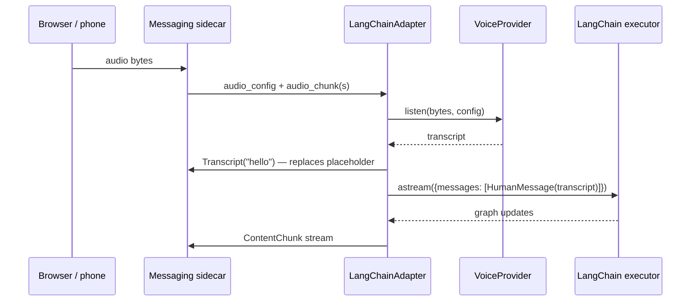

[`astropods-adapter-langchain`](https://pypi.org/project/astropods-adapter-langchain/) wraps a LangChain executor — either `langchain.agents.create_agent` or `langgraph.prebuilt.create_react_agent` — and connects it to the Astro AI messaging sidecar. It runs `astream(stream_mode="updates")` under the hood, translates graph updates into the shared `StreamHooks` lifecycle, and auto-configures OTEL tracing.

## Install

```bash
pip install astropods-adapter-langchain
```

Requires Python 3.10+.

## Quick start

```python
from langchain_anthropic import ChatAnthropic
from langchain.agents import create_agent
from astropods_adapter_langchain import LangChainAdapter, serve

llm = ChatAnthropic(model="claude-sonnet-4-6")
system_prompt = "You are a helpful assistant."
agent = create_agent(llm, tools=[], system_prompt=system_prompt)

adapter = LangChainAdapter(agent, name="My Agent", system_prompt=system_prompt)
serve(adapter)
```

`serve(adapter)` connects to the messaging sidecar at `localhost:9090` (or `GRPC_SERVER_ADDR`) and blocks until `SIGINT` / `SIGTERM`. Under `ast dev` and in production the address is injected for you.

## API

### `LangChainAdapter(executor, name, system_prompt?, tools?, voice?)`

| Parameter       | Type                  | Required | Notes                                                                |
| --------------- | --------------------- | -------- | -------------------------------------------------------------------- |
| `executor`      | LangChain agent       | yes      | A compiled executor, e.g. from `create_agent` or `create_react_agent`. |
| `name`          | `str`                 | no       | Display name. Defaults to `"LangChain Agent"`.                       |
| `system_prompt` | `str`                 | no       | Shown in the playground's config panel.                              |
| `tools`         | `list`                | no       | LangChain tool objects. Populates the playground tool list.          |
| `voice`         | `VoiceProvider`       | no       | Optional STT provider (e.g. `OpenAIVoice`).                          |

### `serve(adapter, options?)`

Re-exported from `astropods-adapter-core`. Connects the adapter and blocks until shutdown. Also calls `setup_observability()` so OTEL tracing comes up automatically when `OTEL_EXPORTER_OTLP_ENDPOINT` is set.

**`ServeOptions`**

| Field            | Type    | Default                                                | Notes                              |
| ---------------- | ------- | ------------------------------------------------------ | ---------------------------------- |
| `server_address` | `str`   | `os.environ.get("GRPC_SERVER_ADDR", "localhost:9090")` | Override the messaging gRPC address. |

```python
from astropods_adapter_langchain import ServeOptions, serve
serve(adapter, ServeOptions(server_address="astro-messaging:9090"))
```

## How the executor maps to hooks

`LangChainAdapter` consumes `executor.astream(..., stream_mode="updates")`. Each graph update produces zero or more hook calls:

| Update key | Source                                                  | Hook call                                                              |
| ---------- | ------------------------------------------------------- | ---------------------------------------------------------------------- |
| `model`    | `langchain.agents.create_agent` (LangChain ≥ 0.3)       | `on_chunk(text)` for the assistant message body, then `on_finish()`.   |
| `agent`    | `langgraph.prebuilt.create_react_agent` (LangGraph < 1.0) | Same as `model`. The adapter handles both node names transparently. |
| `tools`    | Tool execution step                                     | `on_status_update({status: 'PROCESSING', custom_message: '...'})` and `on_status_update({status: 'ANALYZING', ...})` around the tool call. |

LangChain streams **complete messages**, not token-by-token deltas — so the user sees the reply appear all at once, not as a typing animation. (This is a LangChain limitation, not the adapter's.) Choose the [Mastra adapter](/adapters/mastra) if streaming-per-token UX matters.

The adapter also handles two LangChain content shapes:

- **OpenAI-style** — `content: "string"` directly.
- **Anthropic-style** — `content: [{"type": "text", "text": "..."}, ...]` content blocks.

Both shapes are flattened to text before calling `on_chunk()`.

## Memory

LangChain doesn't have built-in conversation memory. To persist context across turns, pass `options.conversation_id` into your own store (Redis, a database, a LangGraph checkpointer, etc.) inside your tool or executor wiring.

## Voice (STT)

Pass an optional `voice` provider to enable audio input:

```python
from astropods_adapter_langchain import LangChainAdapter, OpenAIVoice, serve

adapter = LangChainAdapter(
    agent,
    name="My Agent",
    voice=OpenAIVoice(),  # uses OPENAI_API_KEY
)
serve(adapter)
```

`OpenAIVoice` is bundled — it implements the `VoiceProvider` protocol against OpenAI's Whisper API. You can pass any object with an `async listen(data: bytes, config) -> str` method.

The voice flow:



LangChain has no native TTS path, so the adapter does STT only. If you need TTS, post-process `on_chunk()` text and call `hooks.on_audio_chunk()` yourself (or use the Mastra adapter, which has TTS built in).

## Tracing

When `OTEL_EXPORTER_OTLP_ENDPOINT` is set, `serve()` automatically instruments LangChain so every LLM call and tool invocation produces a trace span. No code changes needed — Astro AI sets the env var on deployed agents.

The adapter also derives the turn's W3C trace context from its root span and attaches it to the responses it emits, so any response — and the feedback that references it — can be correlated back to its trace. This is automatic; see [Trace context](/messaging-sdk/python#trace-context) for the wire shape.

## Example: an agent with tools

```python
from langchain_core.tools import tool
from langchain_anthropic import ChatAnthropic
from langchain.agents import create_agent
from astropods_adapter_langchain import LangChainAdapter, serve

@tool
def customer_lookup(customer_id: str) -> dict:
    """Look up a customer by ID."""
    import requests
    return requests.get(f"https://api.example.com/customers/{customer_id}").json()

llm = ChatAnthropic(model="claude-sonnet-4-6")
system_prompt = "Help the user troubleshoot. Use customer_lookup when you need account details."

agent = create_agent(llm, tools=[customer_lookup], system_prompt=system_prompt)

adapter = LangChainAdapter(
    agent,
    name="Support Agent",
    system_prompt=system_prompt,
    tools=[customer_lookup],  # Populates the playground tool list
)
serve(adapter)
```

The `tools=` argument on `LangChainAdapter` is for **playground display only** — the actual tool wiring happens when you pass tools into `create_agent`. Pass the same list to both so the playground reflects what the agent can actually do.

## Local development

```bash
ast dev
```

`ast dev` runs the messaging sidecar on `localhost:9090`, sets `GRPC_SERVER_ADDR`, and serves the chat interface at `http://localhost:3100`. The same `serve(adapter)` code works locally and in production.

## Troubleshooting

| Symptom                                              | Likely cause                                                                          |
| ---------------------------------------------------- | ------------------------------------------------------------------------------------- |
| Response appears all at once, not streamed           | LangChain's `astream` returns complete messages per node. Use Mastra for token-by-token streaming. |
| `Could not transcribe audio`                         | STT returned an empty string. Check the audio encoding matches what your `VoiceProvider` expects. |
| Tools show up in code but not in the playground      | You passed tools into `create_agent` but not into `LangChainAdapter(..., tools=...)`. |
| No traces in the OTEL backend                        | `OTEL_EXPORTER_OTLP_ENDPOINT` not set, or the `opentelemetry-instrumentation-langchain` package isn't installed. |
