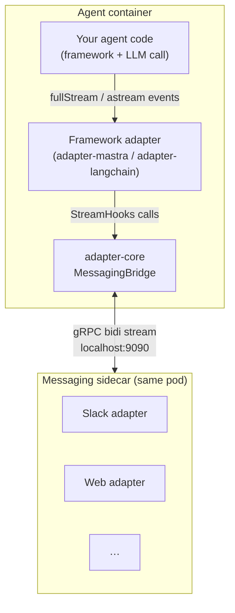

Adapters are the bridge between your agent code and the Astro AI runtime. They handle the gRPC streaming loop with the messaging sidecar, translate framework-specific events into the messaging protocol (status updates, content chunks, audio, feedback), and you keep using whatever framework you already chose. You write `serve(myAgent)`; the adapter handles the rest.

## Available adapters

| Package                                                                | Language   | Wraps                | Use when                                                    |
| ---------------------------------------------------------------------- | ---------- | -------------------- | ----------------------------------------------------------- |
| [`@astropods/adapter-mastra`](/adapters/mastra)                                | TypeScript | Mastra `Agent`       | You're building with Mastra.                                |
| [`astropods-adapter-langchain`](/adapters/langchain)                           | Python     | LangChain / LangGraph| You're using `create_agent` / `create_react_agent`.         |
| [`@astropods/adapter-core`](/adapters/custom-node)                             | TypeScript | Anything             | Custom Node adapter for a framework not yet supported.      |
| [`astropods-adapter-core`](/adapters/custom-python)                            | Python     | Anything             | Custom Python adapter for a framework not yet supported.    |

The `*-core` packages contain the framework-agnostic `AgentAdapter` interface, the `MessagingBridge` that drives the gRPC streaming loop, and a `serve()` entry point. The framework adapters (`-mastra`, `-langchain`) are thin wrappers that translate framework-specific stream events (Mastra `fullStream` chunks, LangChain `astream` updates) into the shared `StreamHooks` lifecycle.

## When to use what

| Scenario                                                          | Pick                                       |
| ----------------------------------------------------------------- | ------------------------------------------ |
| Mastra agent (Node/TypeScript)                                    | [`@astropods/adapter-mastra`](/adapters/mastra)    |
| LangChain or LangGraph agent (Python)                             | [`astropods-adapter-langchain`](/adapters/langchain) |
| Different framework, but Node-based                               | [`@astropods/adapter-core`](/adapters/custom-node) — implement `AgentAdapter` |
| Different framework, but Python-based                             | [`astropods-adapter-core`](/adapters/custom-python) — implement `AgentAdapter` |
| No framework — calling LLM APIs directly                          | `*-core`. Treat the LLM stream as your `fullStream`. |
| Talking to the messaging service from a non-agent (admin, batch)  | Skip the adapter and use the [Messaging SDK](/messaging-sdk/node) directly. |

## How they fit together

The boundary between adapter-core and the messaging sidecar is the [Messaging SDK](/messaging-sdk/node) gRPC stream. You only touch the SDK directly when you write a custom adapter or skip the adapter layer entirely.

## What an adapter handles for you

- Connecting to the messaging sidecar with automatic reconnect.
- Announcing your agent's name, system prompt, and tools so they appear in the playground.
- Streaming each user message into your code and streaming each chunk of the reply back.
- Receiving feedback (thumbs up/down, free-form text, button clicks) and routing it to your handler.
- Handling audio messages — STT before your agent runs, optional TTS on the reply.
- Tracing — when an OTEL endpoint is set, the framework adapters auto-wire it.

## Environment

All adapters share the same environment contract:

| Variable                          | Default            | Notes                                                            |
| --------------------------------- | ------------------ | ---------------------------------------------------------------- |
| `GRPC_SERVER_ADDR`                | `localhost:9090`   | Messaging sidecar address. `ast dev` injects this automatically. |
| `AGENT_FILES_DIR`                 | `/data/files`      | Shared file store for web-chat uploads and agent-produced downloads. See [Files in chat](/messaging-sdk/files-in-chat). |
| `OTEL_EXPORTER_OTLP_ENDPOINT`     | unset              | When set, the framework adapter wires OTEL tracing automatically.|
| `DEBUG`                           | unset              | When set, adapter-core logs at debug level.                      |

Local development with `ast dev` injects `GRPC_SERVER_ADDR` so the same `serve(agent)` call works both locally and in production.
