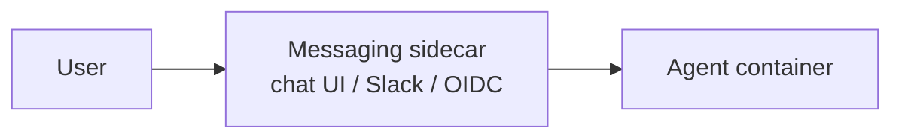
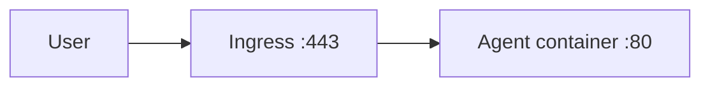

By default, Astro AI wraps your agent in a messaging sidecar that gives it a chat UI, Slack adapter, and OIDC-authenticated web view. If you'd rather serve your own web interface — a custom dashboard, a static SPA, a server-rendered app — set `agent.interfaces.frontend: true` and the platform will route incoming traffic straight to your container.

## What `frontend: true` does

Declaring `frontend: true` changes the deployment topology in three ways:

1. **No messaging sidecar.** The platform skips the chat adapter container that's normally attached to your agent.
2. **Direct ingress to your container.** A dedicated HTTPS hostname is provisioned and routes straight to your agent on **port 80**.
3. **`--adapter` is ignored at deploy time.** Adapters (`web`, `insecure-web`, `slack`) only apply to messaging agents. A frontend agent serves whatever your container serves.

**Default (messaging agent):**



**`frontend: true`:**



You give up the built-in chat UI and OIDC wrapper. You gain full control over the request/response lifecycle.

---

## Minimal configuration

```yaml astropods.yml
spec: blueprint/v1
name: my-dashboard

agent:
  build:
    context: .
    dockerfile: Dockerfile
  interfaces:
    frontend: true
    messaging: false
```

A few rules to know:

- `interfaces` MUST be nested under `agent`. Putting it at the top level is silently ignored.
- Omitting `interfaces` entirely defaults to `messaging: true`. As soon as you declare `interfaces`, `messaging` defaults to `false` — you have to opt back in if you want both.
- When `frontend: true`, your container MUST listen on port 80 in production. This is enforced by validation rule 15 of the [Astropods Spec](/astropods-package-spec).

---

## Example agent

A minimal server that returns a static page. Pick your language:

<Tabs>
  <Tab title="Node.js">
    ```javascript server.js
    import express from "express";

    const app = express();
    const PORT = process.env.PORT || 80;

    app.get("/", (_req, res) => {
      res.send(`
        <!doctype html>
        <html>
          <head><title>My Agent</title></head>
          <body>
            <h1>Hello from my agent</h1>
            <p>Served directly from the agent container.</p>
          </body>
        </html>
      `);
    });

    app.listen(PORT, "0.0.0.0", () => {
      console.log(`Listening on :${PORT}`);
    });
    ```

    ```dockerfile Dockerfile
    FROM node:20-alpine
    WORKDIR /app
    COPY package*.json ./
    RUN npm ci --omit=dev
    COPY . .
    EXPOSE 80
    CMD ["node", "server.js"]
    ```
  </Tab>
  <Tab title="Python">
    ```python main.py
    from fastapi import FastAPI
    from fastapi.responses import HTMLResponse

    app = FastAPI()

    @app.get("/", response_class=HTMLResponse)
    def root():
        return "<h1>Hello from my agent</h1>"
    ```

    ```dockerfile Dockerfile
    FROM python:3.12-slim
    WORKDIR /app
    COPY requirements.txt ./
    RUN pip install --no-cache-dir -r requirements.txt
    COPY . .
    EXPOSE 80
    CMD ["uvicorn", "main:app", "--host", "0.0.0.0", "--port", "80"]
    ```
  </Tab>
</Tabs>

---

## Local development on a different port

Most frameworks default to a higher port locally (Express `3000`, Vite `5173`, FastAPI `8000`) and binding to `:80` typically requires elevated privileges. Use `dev.interfaces.frontend.port` so `ast project start` runs your dev server on its native port; the platform proxies `:80` to it.

```yaml astropods.yml
agent:
  interfaces:
    frontend: true
    messaging: false

dev:
  interfaces:
    frontend:
      port: 3000
  command: bun --watch run start
```

With this in place, `ast project start` runs your container on `3000` locally and routes incoming traffic to it. In production the container still serves `:80` directly — no proxy involved.

<Warning>
`dev.interfaces.frontend.port` only affects local dev. In production your container MUST listen on `:80` — otherwise the pod will crash-loop behind the ingress. If your framework defaults to a different port, set it explicitly (via `PORT`, a CLI flag, or your entrypoint) so the deployed container binds to `:80`.
</Warning>

---

## Combining frontend with messaging

Setting both interfaces to `true` deploys your frontend container **and** a messaging sidecar. The frontend gets the dedicated hostname; the sidecar handles chat / Slack on its own routes.

```yaml astropods.yml
agent:
  interfaces:
    frontend: true
    messaging: true
```

Use this when you want a custom UI plus the platform's built-in Slack integration, for example.

---

## Authentication

The default messaging adapter wraps the agent in OIDC sign-in. A frontend agent does not — your container receives raw HTTP. If your frontend needs auth, handle it inside the container (a session middleware, a JWT verifier, a third-party identity provider, etc.). For internal-only tooling, the [`anyone` grant](/accounts) controls who can reach the hostname but does not gate the request itself with a sign-in.

<Callout intent="info">
Want Astro AI's built-in login gate (the same OIDC sign-in the messaging adapter provides) in front of your frontend agent? It's not supported today — [open a feature request](https://github.com/astropods/.github/issues/new) and we'll prioritize based on demand.
</Callout>

---

## Deploy

Frontend agents deploy the same way as any other blueprint:

```bash
ast blueprint deploy my-dashboard
```

After deploy, `ast agent list` shows the assigned hostname. Open it in a browser to confirm your container is serving traffic.

If your container fails to bind to `:80` in production, the pod will crash-loop. Check `ast agent logs <name>` and verify the listen port matches the spec.

## Next steps

- [Managing your agents](/managing-agents): inspect and control the deployed agent
- [Connect to OAuth-protected MCP servers](/mcp-oauth): add OAuth flows to a frontend agent
