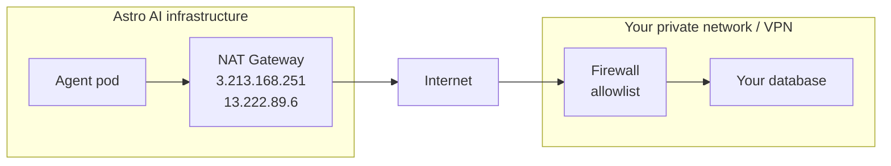

Agents run in Astro AI's managed cloud. If your database sits behind a firewall but is reachable over the public network, you can let agents through by allowlisting Astro AI's outbound IPs — no AWS account or infrastructure changes needed on your side.

<Note>
If your database is in an AWS VPC and you don't want any inbound public access, connect it privately over AWS PrivateLink instead — see [Knowledge stores](/knowledge-stores#connect-a-private-database).
</Note>

<Steps>
  <Step title="Get Astro AI's egress IPs">
    All agent workloads egress through the following static Elastic IPs. These are fixed and do not change unless a change is announced in advance:

    | IP | CIDR |
    |---|---|
    | `3.213.168.251` | `3.213.168.251/32` |
    | `13.222.89.6` | `13.222.89.6/32` |
  </Step>
  <Step title="Allowlist the IPs in your network">
    Add each IP to the inbound rules of whatever controls access to your database:

    | Setup | Where to add the rule |
    |---|---|
    | AWS RDS / Aurora | Security group inbound rule: TCP on your DB port from each IP (`/32`) |
    | GCP Cloud SQL | Authorized networks: add each IP with `/32` mask |
    | Azure Database | Firewall rules: one rule per IP |
    | Self-hosted (on-prem) | Firewall / VPN policy: allow TCP from each IP to your DB host and port |
    | Corporate VPN with split tunneling | Add Astro AI's IPs to your VPN's allowed-source list for the DB subnet |

    Use the port your database listens on. Common defaults: PostgreSQL `5432`, MySQL `3306`, MSSQL `1433`, MongoDB `27017`, Redis `6379`. Check your database's documentation if you're unsure.
  </Step>
  <Step title="Connect the database to your agent">
    Once the IPs are allowlisted, connect the database as a [knowledge store](/knowledge-stores) and bind it to your agent at deploy time — your agent receives the connection details as environment variables. See [Using Knowledge stores](/knowledge-store-agent) for the full walkthrough.
  </Step>
</Steps>

## Verifying the connection

The quickest check is to have your agent attempt a connection on startup and log the result before doing any real work; the exact approach depends on your database driver. If the agent starts successfully after deploy, the network path is clear. If it times out, the IPs are not yet allowlisted — double-check the firewall rules.

If the connection stays stuck after you've completed the steps above, reach out to [support@astropods.com](mailto:support@astropods.com).
