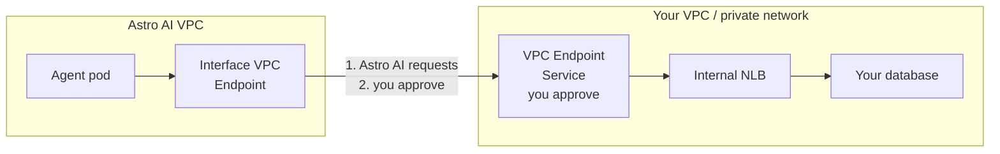

A **knowledge store** is a database you connect to your account from the **Knowledge** section of the dashboard. Once connected, any of your agents can use it — so several agents can read and write the same data instead of each keeping its own copy.

## Connect a store

In the dashboard, go to **Knowledge** > **Add store** and enter your database's host, port, and credentials. Postgres, MySQL, Redis, Qdrant, Neo4j, and Pinecone are supported. Your credentials are encrypted and never shown in plain text again.

Once the store shows as **Ready**, it's available to use with your agents.

If your database is behind a firewall but reachable over the public network, allowlist Astro AI's outbound IPs first — see [Allowlist Astro AI's egress IPs](/ip-allowlisting).

## Connect a private database

If your database runs in an AWS VPC and you don't want to expose it to the public internet, connect it over **AWS PrivateLink**. Traffic flows entirely within the AWS backbone and never touches the public internet.

You'll need a database reachable inside an AWS VPC (RDS, Aurora, EC2-hosted, or anything behind an internal load balancer) and the ability to create a VPC Endpoint Service in that VPC.



<Steps>
  <Step title="Expose your database through a VPC Endpoint Service">
    In your AWS VPC, put an internal Network Load Balancer (NLB) in front of your database, then create a VPC Endpoint Service pointing to that NLB. In the AWS Console go to **VPC** > **Endpoint Services** > **Create endpoint service**, select your NLB, and note the generated service name:

    ```
    com.amazonaws.vpce.us-east-1.vpce-svc-xxxxxxxxxxxxxxxxx
    ```

    If your database already sits behind an NLB or endpoint service, reuse it.
  </Step>
  <Step title="Connect it in the dashboard">
    Go to **Knowledge** > **Add store**, then:

    - Give the store a name and select your database type.
    - Turn **PrivateLink** on.
    - Paste the `com.amazonaws.vpce.*` service name from step 1.
    - Fill in the port, database, and credentials.
    - Click **Connect**.

    The store moves to **Pending** while it waits for your approval.
  </Step>
  <Step title="Approve the connection in AWS">
    The store's detail page links you to the right AWS console page. In **VPC** > **Endpoints**, approve the pending connection request from Astro AI.
  </Step>
  <Step title="Wait for Ready">
    Astro AI completes the connection and verifies reachability automatically. The store turns **Ready** when the path is live — no further action needed.
  </Step>
</Steps>

## Use a store with an agent

When you deploy an agent that needs a database, the deploy form lets you choose, for each database the agent declares:

- **Shared** — use one of your connected knowledge stores. The agent gets its connection details automatically, and the same store can be used by as many agents as you like.
- **Local** — spin up a fresh database just for that deployment. This isn't a knowledge store and isn't shared with anything else.

A store can only be used by an agent that asks for the same type of database. Because this is chosen at deploy time, the same agent can use a shared store in one environment and a local one in another.

For the end-to-end walkthrough — declaring a database in your agent, running it locally, and binding a store at deploy — see [Using Knowledge stores](/knowledge-store-agent).

## Manage a store

Each store has a detail page in the dashboard where you can check whether it's connected and healthy, view its logs and activity, and see the connection details your agents receive. If a store gets stuck connecting, the page shows what's blocking it — most often a PrivateLink connection still waiting for approval in your AWS console.

## Next steps

- [Using Knowledge stores](/knowledge-store-agent): build and deploy an agent that uses a store, step by step
- [Allowlist Astro AI's egress IPs](/ip-allowlisting): reach a firewalled database over the public network
