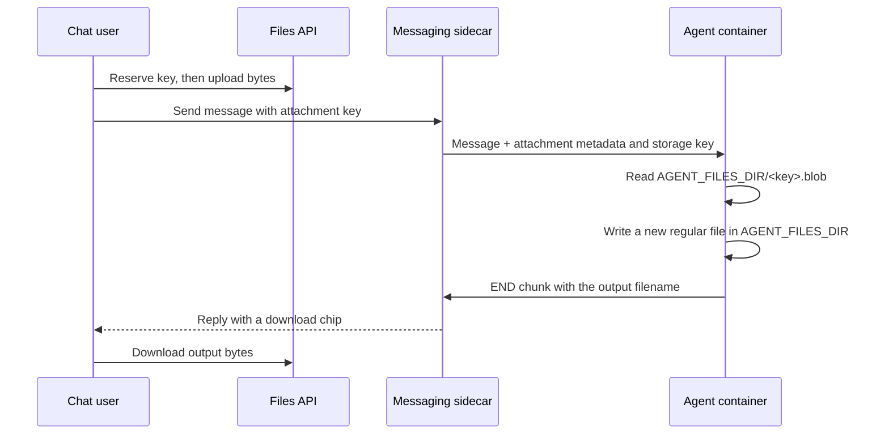

Astro AI's web chat can send files to an agent and render files from the agent as download chips. The transfer has two parts:

- The **Files API** moves bytes between the browser and the deployment's persistent file store.
- The **messaging API** associates an uploaded file key with a user or assistant message.

The browser never puts file bytes in a chat message. The agent normally does not call the Files API either: Astro AI mounts the same file store into the agent container and sets `AGENT_FILES_DIR` to its location (normally `/data/files`).



## Enable file-enabled chat

File-enabled chat needs two things: a messaging deployment with the web adapter (which provisions and mounts the file store automatically), and an agent that declares it consumes files.

First, declare a messaging agent. The file store is mounted automatically; there is no separate storage setting.

```yaml
agent:
  build:
    context: .
    dockerfile: Dockerfile
  interfaces:
    messaging: true

dev:
  interfaces:
    messaging:
      adapters: [web]
```

Then set `supportsFiles` in the config your agent sends at startup. The chat's upload controls (the paperclip, drag-and-drop, paste, and the Files tab) appear only for agents that set this flag, so an agent that ignores uploads never shows controls that do nothing. The flag defaults to off; having the file store mounted is not enough on its own. It gates only the upload affordances; agent-produced download chips render regardless.

<Tabs>
  <Tab title="Node.js">

```typescript
getConfig() {
  return { systemPrompt: "Analyze user-provided documents.", tools: [], supportsFiles: true };
}
```

  </Tab>
  <Tab title="Python">

```python
def get_config(self) -> dict:
    return {
        "system_prompt": "Analyze user-provided documents.",
        "tools": [],
        "supports_files": True,
    }
```

  </Tab>
</Tabs>

In local development, open the chat URL printed by `ast project` (normally `http://localhost:3100`). Users can attach a file with the paperclip, drag and drop, or paste. The chat uploads the bytes when the message is sent and passes the resulting key with that message.

## Read files attached by a user

When you use an Astro AI adapter, each call to your agent receives the current turn's files in `StreamOptions.attachments`. Treat this list as the authority for the turn. Do not enumerate the whole shared directory to decide which files belong to the current user.

Each attachment contains:

| Node       | Python      | Meaning                                                              |
| ---------- | ----------- | -------------------------------------------------------------------- |
| `key`      | `key`       | Opaque Files API key. Do not show it as the filename.                |
| `name`     | `name`      | Original display filename. Do not use it to construct an input path. |
| `path`     | `path`      | Absolute path to the stored bytes. Read this path when present.      |
| `mimeType` | `mime_type` | MIME type reported at upload time, if known.                         |
| `size`     | `size`      | Size in bytes, if known.                                             |

<Tabs>
  <Tab title="Node.js">

```typescript
import { readFile } from "node:fs/promises";
import type { AgentAdapter } from "@astropods/adapter-core";

const adapter: AgentAdapter = {
  name: "Document analyst",

  async stream(prompt, hooks, options) {
    try {
      for (const attachment of options.attachments ?? []) {
        if (!attachment.path) {
          throw new Error(
            `Cannot resolve ${attachment.name}; update the messaging and adapter packages`,
          );
        }

        const bytes = await readFile(attachment.path);
        await analyzeFile({
          bytes,
          name: attachment.name,
          mimeType: attachment.mimeType,
          prompt,
        });
      }

      hooks.onChunk("I finished analyzing the attached file.");
      hooks.onFinish();
    } catch (error) {
      hooks.onError(error as Error);
    }
  },

  getConfig() {
    return { systemPrompt: "Analyze user-provided documents.", tools: [], supportsFiles: true };
  },
};
```

  </Tab>
  <Tab title="Python">

```python
from pathlib import Path
from astropods_adapter_core import StreamHooks, StreamOptions

class DocumentAnalyst:
    name = "Document analyst"

    async def stream(
        self, prompt: str, hooks: StreamHooks, options: StreamOptions
    ) -> None:
        try:
            for attachment in options.attachments:
                if attachment.path is None:
                    raise RuntimeError(
                        f"Cannot resolve {attachment.name}; update the messaging "
                        "and adapter packages"
                    )

                data = Path(attachment.path).read_bytes()
                await analyze_file(
                    data=data,
                    name=attachment.name,
                    mime_type=attachment.mime_type,
                    prompt=prompt,
                )

            hooks.on_chunk("I finished analyzing the attached file.")
            hooks.on_finish()
        except Exception as error:
            hooks.on_error(error)

    def get_config(self) -> dict:
        return {
            "system_prompt": "Analyze user-provided documents.",
            "tools": [],
            "supports_files": True,
        }
```

  </Tab>
</Tabs>

`path` is absent only when an older sidecar or SDK did not carry the storage key. Never guess `AGENT_FILES_DIR/<original filename>`: API-managed uploads are stored by opaque key, not by their display name. Update the messaging and adapter packages before relying on file input.

## Return a file to the user

Write the complete output as a regular file directly inside `AGENT_FILES_DIR`, then register it with the response hook **before** finishing the response. The bridge sends the file reference on the `END` chunk, and the chat renders a download chip.

Use a new, single-segment filename for every output. A UUID prefix prevents concurrent conversations or different users from colliding on a shared filename. Do not use subdirectories, symlinks, or names ending in `.blob`, `.meta.json`, or `.tmp`; those are reserved storage artifacts and are not exposed as agent outputs.

<Tabs>
  <Tab title="Node.js">

```typescript
import { randomUUID } from "node:crypto";
import { mkdir, stat, writeFile } from "node:fs/promises";
import { join } from "node:path";
import type { StreamHooks } from "@astropods/adapter-core";

const filesDir = process.env.AGENT_FILES_DIR ?? "/data/files";

async function attachCsv(hooks: StreamHooks, csv: string) {
  const name = `${randomUUID()}-analysis.csv`;
  await mkdir(filesDir, { recursive: true });
  await writeFile(join(filesDir, name), csv, { encoding: "utf8", flag: "wx" });

  const file = await stat(join(filesDir, name));
  hooks.onFile({ name, mimeType: "text/csv", size: file.size });
  hooks.onChunk("Your analysis is ready.");
  hooks.onFinish();
}
```

  </Tab>
  <Tab title="Python">

```python
import os
from pathlib import Path
from uuid import uuid4

from astropods_adapter_core import StreamHooks

files_dir = Path(os.environ.get("AGENT_FILES_DIR", "/data/files"))

def attach_csv(hooks: StreamHooks, csv: str) -> None:
    name = f"{uuid4()}-analysis.csv"
    files_dir.mkdir(parents=True, exist_ok=True)
    output = files_dir / name
    output.write_text(csv, encoding="utf-8")

    hooks.on_file(name, mime_type="text/csv", size=output.stat().st_size)
    hooks.on_chunk("Your analysis is ready.")
    hooks.on_finish()
```

  </Tab>
</Tabs>

The file must exist before `onFile` / `on_file`, and the hook's name must exactly match the basename on disk. If the sidecar cannot find that regular file when it processes the terminal chunk, it omits the download chip rather than creating a broken link.

## Use the raw messaging SDK

If you manage the gRPC stream yourself, the same rules apply without the adapter conveniences.

For an inbound web attachment:

- Select attachments with type `FILE`.
- Use `storageKey` (Node) or `storage_key` (Python), not `filename`, to locate the bytes.
- Filesystem-backed uploads are stored at `AGENT_FILES_DIR/<storage key>.blob`.

For an outbound file:

1. Write a uniquely named regular file directly inside `AGENT_FILES_DIR`.
2. Send a `FileAttachment` on the terminal `ContentChunk`.
3. Set `filename` to the file's basename. Leave `url` empty for a filesystem file.

<Tabs>
  <Tab title="Node.js">

```typescript
import { randomUUID } from "node:crypto";
import { readFile, writeFile } from "node:fs/promises";
import { join } from "node:path";

const filesDir = process.env.AGENT_FILES_DIR ?? "/data/files";
const input = message.attachments?.find((a) => a.type === "FILE");
if (input?.storageKey) {
  const inputPath = join(filesDir, `${input.storageKey}.blob`);
  const bytes = await readFile(inputPath);
  // Process bytes...
}

const outputName = `${randomUUID()}-analysis.csv`;
const outputBytes = new TextEncoder().encode(await buildCsv());
await writeFile(join(filesDir, outputName), outputBytes, { flag: "wx" });
conversation.sendContentChunk(message.conversationId, {
  type: "END",
  content: "Your export is ready.",
  attachments: [
    {
      file: {
        filename: outputName,
        mimeType: "text/csv",
        sizeBytes: outputBytes.byteLength,
      },
    },
  ],
});
```

  </Tab>
  <Tab title="Python">

```python
import os
from pathlib import Path
from uuid import uuid4

from astropods_messaging import AgentResponse, Attachment, ContentChunk
from astropods_messaging.astro.messaging.v1.response_pb2 import (
    FileAttachment,
    ResponseAttachment,
)

files_dir = Path(os.environ.get("AGENT_FILES_DIR", "/data/files"))
input_file = next(
    (item for item in message.attachments if item.type == Attachment.FILE),
    None,
)
if input_file and input_file.storage_key:
    input_path = files_dir / f"{input_file.storage_key}.blob"
    data = input_path.read_bytes()
    # Process data...

output_path = files_dir / f"{uuid4()}-analysis.csv"
output_bytes = build_csv().encode("utf-8")
output_path.write_bytes(output_bytes)
send(AgentResponse(
    conversation_id=message.conversation_id,
    content=ContentChunk(
        type=ContentChunk.END,
        content="Your export is ready.",
        attachments=[ResponseAttachment(file=FileAttachment(
            filename=output_path.name,
            mime_type="text/csv",
            size_bytes=len(output_bytes),
        ))],
    ),
))
```

  </Tab>
</Tabs>

See the [Node messaging SDK](/messaging-sdk/node#inbound-message-anatomy) or [Python messaging SDK](/messaging-sdk/python#inbound-message-anatomy) for the full message and response shapes.

## Build a custom chat client

Astro AI's built-in chat already implements this flow. A custom client must use both APIs in order:

<Steps>
  <Step title="Reserve a file key">

Call `POST /api/v1/deployments/{deploymentId}/files` with the display metadata and exact byte size.

```json
{
  "name": "quarterly-results.csv",
  "content_type": "text/csv",
  "size": 18420
}
```

The response contains an opaque `key` and an `upload` descriptor:

```json
{
  "key": "2df6a4ac-cb4a-4ef0-8b8d-833d635b91cf",
  "file": {
    "key": "2df6a4ac-cb4a-4ef0-8b8d-833d635b91cf",
    "name": "quarterly-results.csv",
    "content_type": "text/csv",
    "size": 18420,
    "updated_at": "2026-07-16T16:00:00Z"
  },
  "upload": {
    "url": "2df6a4ac-cb4a-4ef0-8b8d-833d635b91cf/content",
    "method": "PUT"
  }
}
```

  </Step>
  <Step title="Upload the bytes">

Resolve a relative `upload.url` against `/api/v1/deployments/{deploymentId}/files/`. Absolute URLs are presigned storage URLs and must be used unchanged. Send the bytes with the returned method and headers. Include the user's Astro AI credentials only for a same-origin Astro AI URL; never forward them to a presigned cross-origin URL.

The upload is not attachable until this request succeeds. A `413` means the declared or received file is too large; `507` means the deployment volume cannot fit it.

  </Step>
  <Step title="Attach the key to a message">

Send only the key with the user's text. Up to 16 files can be attached to one message, and text may be empty when at least one attachment is present.

```http
POST /api/v1/deployments/{deploymentId}/messaging/conversations/{conversationId}/messages
Content-Type: application/json

{
  "content": "Summarize this report",
  "attachments": [
    { "key": "2df6a4ac-cb4a-4ef0-8b8d-833d635b91cf" }
  ]
}
```

The server reloads the file's authoritative metadata and rejects unknown, incomplete, or differently owned keys.

  </Step>
  <Step title="Render and download response files">

Assistant attachments arrive on the terminal SSE chunk and are also stored in chat history:

```text
event: chunk
data: {"type":"chunk","chunk_type":"end","content":"Your analysis is ready.","attachments":[{"key":"0d94b92d-analysis.csv","name":"0d94b92d-analysis.csv","content_type":"text/csv","size":9321}]}
```

Download bytes from `GET /api/v1/deployments/{deploymentId}/files/{key}/content`. Follow redirects so the same client works with filesystem and presigned-object storage.

  </Step>
</Steps>

## Ownership and storage rules

<Warning>
Setting `supportsFiles` changes what your agent ingests: it starts accepting user uploads. Treat attachment bytes, display names, and MIME types as untrusted input, and apply the same parser limits and content validation you would use for any user upload. The agent container shares the underlying volume, so use only the current turn's attachment paths for input — do not scan or expose unrelated files.
</Warning>

- Files are scoped to the authenticated user, even when several users share a deployment. List, read, download, delete, and message-attachment checks all enforce that scope.
- Agent-produced files are assigned to the conversation owner when the reply is finalized. A file already assigned to another user is not transferred or attached.
- Upload limits depend on the active deployment path and storage backend. Clients should treat `413 Payload Too Large` as authoritative and prompt the user to choose a smaller file. The store also reserves free space for chat data; clients should surface `507 Insufficient Storage` and let the user delete files before retrying.
- Agent code writes outputs directly to the shared volume, so it must bound output size and handle disk-full write errors; direct agent writes do not pass through the upload limit or capacity reservation.
- Symlinks are never adopted or served. Only regular files directly inside `AGENT_FILES_DIR` can become agent-produced downloads.
- File metadata and chat history persist, so upload and download chips survive a page reload. If a user later deletes a file, its old message metadata remains but its bytes are no longer downloadable.
