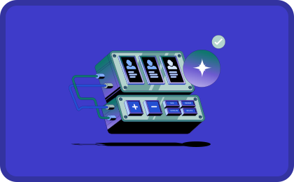

  

    

      

        
Get started

        <h1>Welcome to Astro AI</h1>
        

          Astro AI is a platform for deploying and running AI agents. It provides agent-native infrastructure including models, knowledge bases, tool integrations, and observability. Agents are defined with a declarative spec, built and pushed with the CLI, and deployed through the API or dashboard.
        

        

          <a class="button" href="/get-started">Quickstart</a>
        

      

      

        

          
        

      

    

  

## What you can do

<CardGroup cols={2}>
  <Card
    title="Install the CLI"
    icon="duotone download"
    href="/install-cli"
  >
    Download and install the `ast` CLI for your platform
  </Card>
  <Card
    title="Your first project"
    icon="duotone rocket"
    href="/get-started"
  >
    Install the CLI, create an agent, and run locally in three steps
  </Card>
  <Card
    title="Make your agent discoverable"
    icon="duotone id-card"
    href="/agent-card"
  >
    Describe your agent with an AGENT.md file for discovery and display
  </Card>
  <Card
    title="Publish to registry"
    icon="duotone cloud-arrow-up"
    href="/publish-to-registry"
  >
    Log in and push your agent to the Astro AI registry (requires account)
  </Card>
  <Card
    title="Authentication"
    icon="duotone key"
    href="/authentication"
  >
    Log in with `ast login` and manage credentials
  </Card>
</CardGroup>

## Concepts

- **Astropods Spec** — Declarative YAML format (<code>astropods.yml</code>) that describes an agent's topology: container, models, knowledge stores, tools, and ingestion. See [Astropods Spec](/astropods-package-spec).
- **Agent Card** — A Markdown file with YAML frontmatter (<code>AGENT.md</code>) that describes what an agent does, who built it, and what it connects to. See [Make your agent discoverable](/agent-card).
- **Agent** — A deployable unit defined by an <code>astropods.yml</code> spec: container image, models, knowledge stores, tools, and integrations.
- **Registry** — Astro AI registry where agent images and spec artifacts are published.

## Next steps

<Steps>
  <Step title="Install the CLI">
    Run <code>curl -fsSL https://astropods.com/install | sh</code> or see [Install the CLI](/install-cli).
  </Step>
  <Step title="Create and run an agent">
    Follow [Your first project](/get-started): <code>ast create hello-astro</code>, then <code>cd hello-astro && ast dev</code>.
  </Step>
</Steps>
