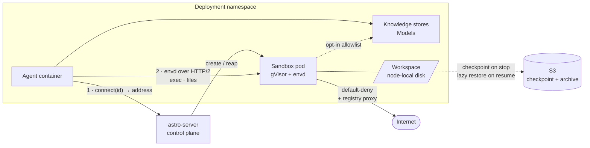
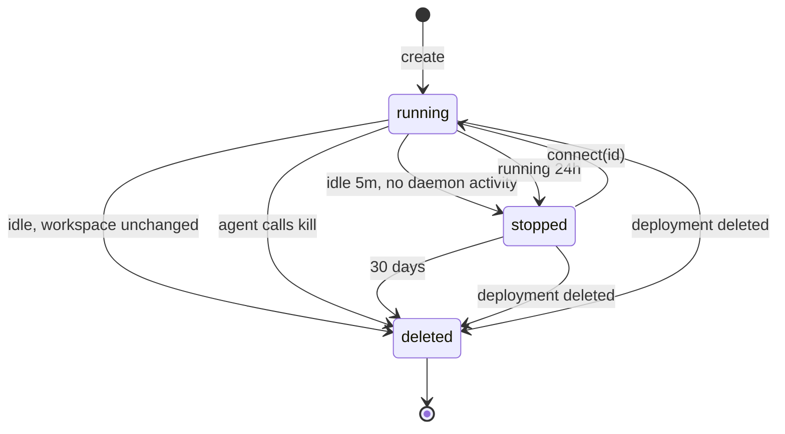
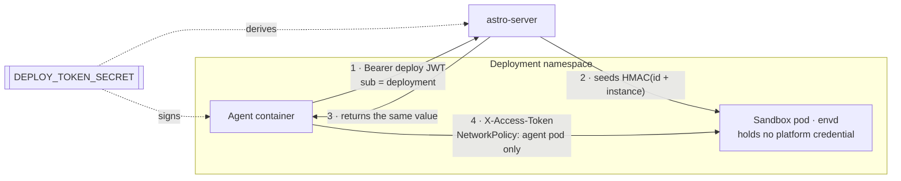
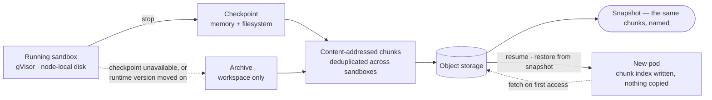
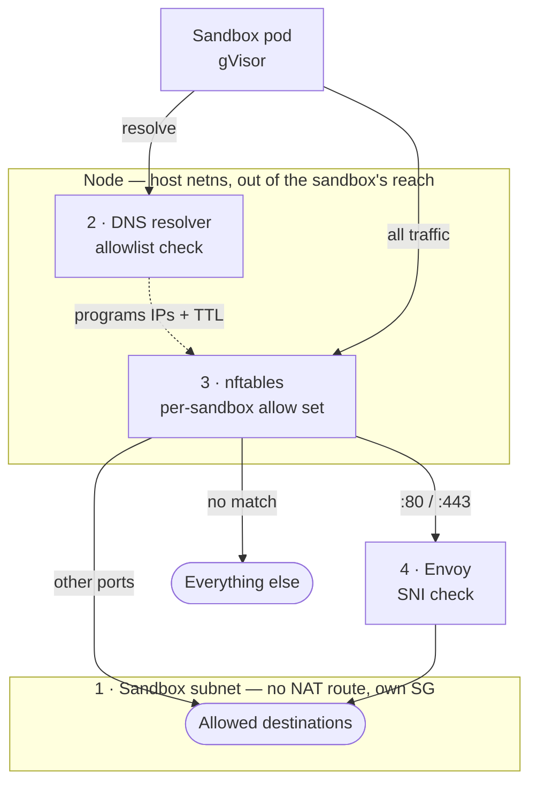

# Agent-Controlled Sandbox

**Status:** Design intent, pre-implementation. No sandbox code exists yet
(see [docs/06-plan/agent-controlled-sandbox-plan.md](../06-plan/agent-controlled-sandbox-plan.md)
for the milestone sequencing). Moved here from `03-architecture` because
that folder is for how a system actually works today; this is the design
this system will follow once M1 ships.

Research on giving an Astro agent a **sandbox it drives as a tool** — a separate, isolated compute environment external to the agent container.

This is a different question from [container-vs-microvm.md](../03-architecture/container-vs-microvm.md). That doc asks *"how do we harden the box the agent itself runs in?"* This one asks *"what second box do we hand the agent so it can run untrusted code, install packages, and keep a workspace?"* The two are complementary: the first is a runtime-hardening decision, this is a **product primitive**. An agent can have a hardened runtime and no sandbox, or a plain container runtime and a strongly isolated sandbox. The latter is cheaper and more useful, because the sandbox is where the dangerous work actually happens.

**Settled: we build this, not buy it.** Reselling a hosted sandbox puts the one place customer code and customer data actually execute outside our infrastructure, which contradicts the private-namespace, private-DNS, private-store story the rest of the platform tells. The differentiator is not that the sandbox reaches private services — by default it reaches nothing — but that it runs inside the customer's boundary at all: their VPC, their egress policy, their audit trail, no third party in the data path.

This doc covers the landscape — what the frameworks expect, what the hosted providers set as the bar — and the architecture we intend to support. [docs/06-plan/agent-controlled-sandbox-plan.md](../06-plan/agent-controlled-sandbox-plan.md) sequences it into milestones.

---

## The shape the industry converged on

Every framework and provider that shipped this in 2025–2026 landed on the same architecture, and it is worth stating plainly because it constrains our design:

**A sandbox is a remote, addressable, stateful box with a very small control surface.** The control surface is essentially one method — `exec(command) -> {stdout, stderr, exit_code}` — plus a file-transfer side channel. Everything else the agent sees (`read_file`, `write_file`, `ls`, `glob`, `grep`, `edit_file`) is *derived* by the framework, which composes shell scripts and runs them through `exec`.

LangChain's `BaseSandbox` states this explicitly: implement `execute()`, optionally `upload_files()`/`download_files()`, and the framework synthesizes the entire filesystem toolset on top. Mastra's provider contract is the same shape with background-process management added (`spawn`, `get_process_output`, `kill_process`).

Three consequences for us:

1. **The integration surface is tiny.** Being a sandbox provider for any major framework is a few hundred lines, not a subsystem.
2. **The hard parts are not the API.** They are lifecycle (when is it created, when does it die, who pays for idle), isolation (it runs untrusted code by definition), networking (what can it reach), and state (does the workspace survive the turn).
3. **The agent never talks to the sandbox directly at the transport level.** It calls framework tools; the framework calls a provider SDK; the SDK talks to a control plane. Whatever we build sits at the provider-SDK boundary.

---

## Framework support

| Framework | Abstraction | Providers shipped | Contract to implement |
|---|---|---|---|
| **Mastra** | `Workspace` = filesystem layer + sandbox layer, composed independently | Local, Docker, Apple Container, E2B, Daytona, Modal, Railway, Blaxel, Vercel (microVM + serverless), AgentCore, Mastra Platform | Command exec with cwd/env/timeout; optional background processes (spawn, poll output, kill) |
| **LangChain / Deep Agents** | `BaseSandbox` backend; tools synthesized from `execute()` | LangSmith (first-party), Daytona, E2B, Modal, Runloop, Vercel, AgentCore, NVIDIA OpenShell | `execute(command)`; optional `upload_files()`/`download_files()` |
| **OpenAI Agents SDK** | Native sandbox support + a `Manifest` describing the agent's workspace (mounted files, output dirs, storage backends S3/GCS/Azure/R2) | Cloudflare, Vercel, E2B, Modal, plus BYO | Sandbox provider interface; pluggable |
| **Anthropic Managed Agents** | **Self-hosted sandboxes** — Anthropic keeps orchestration, tool execution moves to your infra via an *environment worker* that polls a queue | AWS Lambda MicroVMs, Blaxel, Cloudflare, Daytona, E2B, GKE Agent Sandbox, Modal, Namespace, Superserve, Vercel | Run a worker (always-on poller or webhook-triggered) authenticated with an environment key; worker spawns a sandbox per session |
| **CrewAI, AutoGen, LangGraph (core), DSPy, Pydantic AI** | None built in — agents run in-process with the developer's privileges | — | — |
| **smolagents** | Sandboxed execution is explicit and first-class | — | — |

**Mastra is the most relevant model for Astro.** Its filesystem/sandbox split is the right decomposition: *where the workspace lives* (local disk, S3, GCS) is orthogonal to *where commands run*. Any filesystem pairs with any sandbox. It also has the best-developed provider matrix and a `LocalSandbox` for dev-to-prod parity — the same pattern `ast dev` needs.

**Anthropic's self-hosted-sandbox model is the most relevant to our positioning.** It inverts the usual control: the model provider orchestrates, but tool execution, filesystem, and network egress stay inside the customer's boundary. Tool inputs/outputs still cross to the control plane. That is precisely the argument Astro makes about running agents on customer-adjacent infrastructure, and it means a customer already using Managed Agents could point their environment worker at an Astro sandbox.

---

## The bar hosted providers set

We are not buying any of these, but customers will compare against them and framework docs list them as the alternatives. They define the acceptance criteria. Numbers are as reported by vendors and third-party benchmarks; treat as directional.

| Provider | Isolation | Cold start | Persistence | Notable |
|---|---|---|---|---|
| **E2B** | Firecracker microVM | ~150ms | Pause/resume preserving **memory + filesystem**; snapshots seed new sandboxes | REST for lifecycle, gRPC (`envd`) inside the box for fs/commands/PTY. Infra repo Apache-2.0. Indefinite pause billed at storage only. De facto reference API. |
| **Daytona** | Docker default, Kata optional | ~90ms (fastest) | Persistent volumes, snapshots | **Went closed-source June 2026.** Runner Helm charts self-hostable; control plane is theirs only. |
| **Modal** | gVisor (systrap) | Sub-second | Snapshot primitives | Only major option with **GPU inside the sandbox** (`nvproxy`). Python-first. |
| **Vercel Sandbox** | Firecracker | Sub-second | Persistent sandboxes in beta | GA Jan 2026. Bills active CPU but provisioned memory for wall-clock. |
| **Cloudflare Sandbox** | Containers on Workers | Very low at edge | Sleeps to zero | 10ms billing increments; only sensible if you already live on Workers/DOs. |
| **Fly.io Machines / Sprites** | Firecracker | ~300ms resume | Checkpoint/restore | Persistent stateful VMs. |
| **Northflank** | Firecracker / gVisor / Kata / Cloud Hypervisor | Seconds | — | BYOC across AWS/GCP/Azure; multi-runtime; GPU. |
| **Blaxel** | — | — | TTL-based | Nine language runtimes, port exposure. |
| **Runloop, Namespace, Superserve, Railway** | — | — | — | Present in framework provider matrices; smaller. |

Targets that fall out of the table: **sub-second create** (warm-pooled, since a cold gVisor pod plus image pull will not hit 90ms), **pause/resume that preserves the workspace**, **port exposure** for dev-server workflows, and an **idle-cost policy no worse than E2B's** — paused sandboxes billed at storage rates. Pricing clusters tightly (E2B and Daytona ~$0.0504/vCPU-hr, Fly ~$0.07, Cloudflare ~$0.072 + platform fees, Vercel $0.128/vCPU-hr, Modal ~$0.1419/physical-core-hr), so the headline rate is not where we differentiate. Idle policy differs more than rate does, and that is the part customers actually feel.

---

## Architecture



- **`astro-server` creates and reaps** the sandbox pod. Control plane only — not in the data path.
- **The agent gets an address from the control plane, then talks straight to the sandbox pod IP** over the envd protocol. No Service, no ingress, no API server in the data path. Addresses are not cacheable — a resumed sandbox is a new pod with a new IP.
- **The sandbox reaches nothing by default.** The agent owns the knowledge stores and models and passes data in; the sandbox only gets a route to them as an explicit, opt-in allowlist entry.
- **Egress is denied by default**, with a package registry proxy as the one way out.
- **The differentiator is that the sandbox runs inside the customer's boundary at all** — their VPC, their egress policy, their audit trail, no third party in the data path. That holds even with zero access granted.

Same-namespace placement means deny-by-default is enforced by policy rather than by a namespace boundary, so it fails open if misconfigured. The controls that matter: one egress NetworkPolicy selecting sandbox-labelled pods (allowlisting only kube-dns, the registry proxy, and optionally the gateway), matching ingress denials on the stores as a second independent control, ingress on the sandbox restricted to the agent pod, and `automountServiceAccountToken: false`. The label the policy selects on must be set by a single code path, with an admission check rather than trust.

### No public reach

Sandboxes are never exposed outside the cluster. No preview URLs, no ingress, no Service.

E2B and Daytona both offer them, routed at `{port}-{sandboxId}.{domain}`, for one use case: a human viewing an app the agent built. We decline it — a public URL fronting code we did not write, running in a customer namespace, is not worth that. If a human needs to see something, the agent fetches it and serves it through its own frontend.

The agent already reaches any port on the sandbox pod IP; that is ordinary pod networking and needs nothing built.

### Plain Pods, not the Sandbox CRD

`astro-server` creates Pods directly with the templating it already has. We do not adopt the `kubernetes-sigs/agent-sandbox` CRDs.

The CRD is built for a stateful pod with a PVC and a stable identity — the model we rejected. We use none of it: no stable hostname (addresses come from `connect(id)`), no PVC, no PVC-based pause, no template (one image), no claim API. Idle reaping keys on daemon activity the CRD cannot see, so we write a reaper either way.

What we need is a pod with a gVisor RuntimeClass on a node pool, deleted on demand, with a known IP. `runtimeClassName` is a PodSpec field, so a later move to Kata does not need the CRD either.

### Isolation

gVisor, one tier, no spec field. It is a `runtimeClassName` on an ordinary pod, so scheduling, NetworkPolicy, labels and metering all keep working unchanged, and its checkpoint/restore is what the `stopped` tier is built on.

A second runtime stays open. The affordable version is Kata, not Firecracker on its own orchestrator — that is a second control plane beside EKS, which is the same argument as not self-hosting E2B's infra. Most of this design would not notice the switch:

| Unaffected | Why |
|---|---|
| Control plane API, `envd`, spec | The runtime is a pod field; nothing above it changes |
| Egress layers 1, 2 and 4 | Subnet, resolver and Envoy all sit outside the pod |
| Egress layer 3 | The allow set keys on pod source IP at host netns, and a Kata VM's TAP interface still traverses it — E2B runs this exact combination |

What it would cost:

| Cost | Detail |
|---|---|
| A bare-metal node pool | Permanent, not one-time. Worse bin-packing and a higher cost per CU, so tier pricing diverges |
| Node setup | kata-deploy, containerd runtime handlers, and the devmapper snapshotter — Firecracker has no virtio-fs, so Kata falls back to block devices |
| Stop and resume, built twice | gVisor checkpoints at the Sentry, Firecracker snapshots the VM. Different formats, and neither restores into the other |
| Slower create | VM boot plus a kernel. E2B's 150ms comes from restoring snapshots outside Kubernetes, not from Firecracker booting fast |

**Stored state records the runtime that produced it, from the first chunk written.** A gVisor chunk set cannot restore into a Kata sandbox. Without the tag that is a corrupted workspace instead of a refused restore — cheap to add now, expensive once there is data. It is the only part of a second runtime worth paying for today; `isolation:` in the spec is additive whenever it is wanted.


### Lifecycle

The agent creates sandboxes; the platform reaps them. Only the agent knows when a session starts, so the platform's job is an API, a reaper, and a way to reconnect.

This means **we need no session concept**. The agent stores the sandbox ID in its own conversation state and calls `connect(id)` on the next turn — which is what LangChain's docs tell people to do anyway. No integration with `astro-proxy` session routing.

| State | Meaning | Cost |
|---|---|---|
| `running` | pod exists, daemon reachable | compute + storage |
| `stopped` | pod gone, state checkpointed to object storage | storage only |
| `deleted` | stored state dropped | zero |



Resuming resets the 24h clock, so pausing is how an agent works past the ceiling. E2B does the same.

Only `running` counts against the concurrency cap; otherwise stopped sandboxes block new work.

**On the numbers.** 5 minutes is E2B's default and is informed by their production, not by us guessing — it only works because stopping is non-destructive. E2B *terminates* on timeout by default and makes pausing opt-in; we stop instead, because we store state anyway and losing work by default is the worse failure. To avoid storing state nobody will ever resume, stop deletes rather than checkpoints when the workspace is unchanged. E2B keeps paused sandboxes indefinitely; we cap at 30 days, because unbounded storage with no forcing function is not a cost model.

### Control plane API

Our own, not E2B-compatible. Framework providers call the E2B *SDK*, so compatibility is all-or-nothing — and end-to-end fails on two points: their SDK derives hosts as `{port}-{sandboxId}.{domain}`, which needs the routing layer we removed, and `templateID` names an image we do not have. Partial compatibility buys nothing, so we write three small providers instead (LangChain is one method; Mastra is exec plus background processes; OpenAI Agents SDK a third). The data plane stays `envd` — that is a protocol, with no assumptions about addressing or templates.

Bearer `SANDBOX_API_TOKEN` on every call. It is deployment-scoped, so the agent never names its own account or deployment.

| Method | Path | Returns |
|---|---|---|
| `POST` | `/v1/sandboxes` | `{id, address, token}` — body optionally names a spec entry |
| `POST` | `/v1/sandboxes/{id}/connect` | `{address, token}` — resumes if `stopped`, blocks until running |
| `POST` | `/v1/sandboxes/{id}/stop` | checkpoints and releases compute |
| `DELETE` | `/v1/sandboxes/{id}` | drops the stored state |
| `GET` | `/v1/sandboxes/{id}` | `{id, state, created_at, last_active_at}` |
| `GET` | `/v1/sandboxes` | the deployment's sandboxes |

`address` is the pod IP and envd port, and is not cacheable — a resumed sandbox is a new pod. `token` is what envd checks in `X-Access-Token`; `connect` reissues it.

No heartbeat endpoint. The daemon reports activity, so the reaper tracks idleness without the agent doing anything. Exceeding the concurrency cap returns 402, matching every other quota on the platform.

### Auth

Three boundaries, three different answers.



**Agent → control plane.** `SANDBOX_API_TOKEN` is a deploy token — the existing HS256 JWT in `apps/astro-server/internal/deploytoken`, deployment ID in `sub`, signed at apply time with `DEPLOY_TOKEN_SECRET` and injected as an env var. No new scheme. Three properties come with it: no `exp`, so it lives as long as the deployment and rotates by redeploy; no mutable claims, so account, tier and quota are looked up by deployment ID per request and cannot go stale; and an unset secret fails the apply rather than falling back to unauthenticated, which is what messaging already does with grants.

Every `/v1/sandboxes/{id}` path checks the sandbox belongs to the token's deployment. A mismatch returns 404 — a 403 confirms the ID exists.

**Agent → sandbox.** envd compares `X-Access-Token` against a fixed string handed to it at start, so this cannot be a JWT. Derive it: `HMAC(secret, sandbox_id ‖ instance)`, where `instance` increments on resume. Nothing is stored, the control plane recomputes it on `connect`, and a resumed sandbox necessarily gets a different token.

The token is scoped to one running instance and dies with the pod, so its lifetime is bounded by the 24h running ceiling. No rotation inside that window — envd has no RPC for it and adding one means forking upstream. It is also not the only control: ingress NetworkPolicy limits the sandbox to the agent pod, so a leaked token still needs a foothold in the namespace. Traffic is plaintext HTTP/2 like the rest of our east-west traffic; reading it needs the node.

**Sandbox → everything.** The sandbox holds no platform credential: no `SANDBOX_API_TOKEN`, and the agent's environment is not forwarded into `exec`. Without that, code in the sandbox creates its own sandboxes and the concurrency cap means nothing. `automountServiceAccountToken: false` it gets for free — `hardenPodSpec` already sets it on every pod we create.

**The sandbox pod does not get the restricted Pod Security Standard.** `hardenPodSpec` forces `runAsNonRoot`, uid 1000 and `drop ALL`, and a sandbox that cannot `apt install` is not a sandbox. Root inside gVisor is not root on the node — the Sentry is the kernel the process talks to — so this is the trade gVisor exists to make. It has to be a deliberate, sandbox-only divergence with the RuntimeClass as its precondition, not a `hardenPodSpec` flag some other workload can pass.

### Workspace

**Network-attached storage loses on small-file IOPS, and that is the workload.** A dev workspace is tens of thousands of tiny files with constant `stat`, `readdir` and rename — `node_modules` and `.venv` are the canonical case.

| Approach | Problem |
|---|---|
| EBS PVC per sandbox | ~1,400–30,000 IOPS depending on type, but EBS caps attachments per node at ~25–40, so density is capped regardless of CPU and memory |
| EFS | no attachment limit, but NFS small-file latency is the wrong shape for this |
| Amazon S3 Files (GA Apr 2026) | real POSIX over NFS 4.2, mounts in EKS via the EFS CSI driver ≥3.0.0, no attachment limit — but **~1,400 read IOPS on 1 KB files**, and AWS calls it unsuitable for metadata-intensive workloads |
| **Local disk, state to object storage on stop** | needs a checkpoint and restore path of our own |
| No persistence | idle reaping becomes data loss |

Take local disk. The sandbox writes to node-local scratch while running — fast, no attachment ceiling.

### Stopping and resuming

Two mechanisms, in order of preference.



| Mechanism | What survives | Why |
|---|---|---|
| **gVisor checkpoint/restore** — preferred | Memory and filesystem: running processes, shell variables, packages installed anywhere | The Sentry owns all application state, so save and restore are first-class rather than the fragile reconstruction CRIU does for ordinary containers. GKE productised this as Pod Snapshots, so it is proven rather than theoretical. Open network connections do not survive — the same contract every VM snapshot offers. |
| **Workspace archive** — fallback | The workspace directory | For when a checkpoint cannot be taken or restored. Cheaper to store, and it survives a kernel or gVisor version change that would invalidate a checkpoint. That also makes it the long-term format: a sandbox stopped for weeks keeps its workspace, not its memory. |

**Restore is lazy in both cases.** Write a chunk index and fetch on access rather than unpacking everything before the pod starts. This is the same shape as E2B's `fetch_session` and SOCI for container images, and it is what makes resume time independent of workspace size — the number that actually matters, since resume happens on every turn after an idle gap while create happens once.

**Chunks are content-addressed and deduplicated.** The second sandbox with the same `node_modules` costs almost nothing to store. This is how E2B keeps paused sandboxes cheap enough to hold indefinitely.

Without this, reaping destroys the user's work, so people set long timeouts and we pay for idle. The two decisions are one: if nothing survives a stop, `stopped` and `deleted` collapse and the whole pause tier disappears.

Compared with E2B, whose `pkg/sandbox/block` is a page-granular copy-on-write store over object storage:

| | E2B | Ours |
|---|---|---|
| Granularity | page-level diff | chunk-level diff |
| Resume | lazy page-in | lazy chunk fetch |
| Storage | deduplicated | deduplicated |
| Preserves | disk and memory | disk and memory via checkpoint; workspace only on fallback |

Firecracker hands them a block device, which is finer-grained than anything we get from a container filesystem. The remaining gap is granularity, not capability.

### Snapshots

A snapshot is a stop that keeps its chunks and gets a name. No new machinery.

| Method | Path | Returns |
|---|---|---|
| `POST` | `/v1/sandboxes/{id}/snapshot` | snapshot id |
| `POST` | `/v1/sandboxes` with `from: <snapshot-id>` | a sandbox restored from it |
| `DELETE` | `/v1/snapshots/{id}` | — |

| What it gives | How |
|---|---|
| Cheap storage | Deduplicated against chunks already stored, so a snapshot costs its delta |
| Reuse beyond one sandbox | Account-scoped, and does not expire with the sandbox it came from |
| Warm start without warm pools | Install a dependency tree once and snapshot it; later sandboxes start warm rather than pre-warming empty ones |
| Fork | N copy-on-write sandboxes from one snapshot, for parallel exploration |
| Memory, optionally | Pins the snapshot to one runtime and version, so the filesystem-only form is the one that keeps for months |

| What it is not | Why |
|---|---|
| An OCI image | Daytona commits to an internal registry; OCI cannot carry memory state and we want none of the registry semantics |
| A base image the author picks | The platform names a state the agent produced, so the no-image-field decision stands |

### Shared volumes

One volume mounted into every sandbox that asks for it, `ReadWriteMany` on S3 Files or EFS.

The small-file IOPS argument that ruled out network storage was about the workspace. This is a different access pattern:

| | Workspace | Shared volume |
|---|---|---|
| Holds | source trees, `node_modules`, `.venv` | datasets, dependency caches, collected output |
| Shape | tens of thousands of tiny files | fewer, larger files |
| Access | constant `stat`, `readdir`, rename | mostly sequential reads |
| Storage | node-local disk | S3 Files or EFS |

NFS handles the second shape well, and the EBS attachment limit does not apply to it.

Two constraints:

| Constraint | Why |
|---|---|
| Scoped to one deployment, never crossing deployments | A shared volume is a channel between sandboxes, so it has to stay inside one trust domain |
| Declared in the spec, not created by an agent at runtime | Sharing is then visible in review |

Not a substitute for a snapshot. Fork gives a copy-on-write base frozen at fork time; a volume is for live shared state, and for data too large to copy per sandbox.

### Cleanup

The reaper is a River periodic job, like `metering.heartbeat` and `deployment.staleness_sweep`. Nothing new: River's `ByPeriod` uniqueness already stops several server replicas from reaping the same sandbox twice.

The pod and the database row can each outlive the other, so the sweep reconciles in both directions.

| Case | Left alone | Rule |
|---|---|---|
| Pod exists, no `running` row | Compute nobody is billed for, running until the node dies | Delete it. Sweep by label, not by walking rows — the row is the thing that is missing |
| Row says `running`, no pod | `connect` returns a dead address, and the row holds a slot against the concurrency cap | `stopped` if a checkpoint exists, `deleted` if not |
| Node drained or pod evicted | A bare Pod is never rescheduled, so the workspace is gone with no error anyone sees | `preStop` checkpoints and the row moves to `stopped`; the agent's next `connect` resumes it on another node |
| Deployment deleted | Namespace deletion takes the pods, but chunks and volumes live outside it and leak forever | Cascade explicitly on the delete path, and again in the sweep for the deletes that failed halfway |

`terminationGracePeriodSeconds` has to cover a checkpoint of the largest workspace we allow, or eviction silently degrades to data loss — the failure it was added to prevent.

**Chunks need refcounting, not ownership.** Deduplication means one chunk backs several sandboxes and snapshots, so deleting a sandbox cannot delete the chunks it referenced. Count references, decrement on delete, and collect unreferenced chunks only after a grace period — a chunk is written before the row that references it commits, and without the grace period the collector races that window and eats live data.

**Sandboxes must stay out of spec-driven reconciliation.** `cleanupOrphanedResources` derives the resources a spec implies and deletes everything else carrying the agent label. A sandbox is runtime state and appears in no spec, so the day Pods join the swept kinds, every live sandbox dies on the next deploy. Give sandboxes their own label and keep that path unaware of them.

### Metering

Same currency as everything else. `metering.heartbeat` already emits `deployment_compute_usage` in `cu_hours`, where one CU is `max(cpuCores, memGB/2)`. Sandboxes reuse the formula under their own event types.

| Event | Unit | Covers |
|---|---|---|
| `sandbox_compute_usage` | `cu_hours` | time in `running` |
| `sandbox_storage_usage` | GB-hours | chunks and snapshots the account holds |

**Bill from transitions, not from samples.** The deployment heartbeat samples every five minutes and bills the whole interval, which is correct for something that lives for days. A sandbox lives for minutes and is often created and killed between two ticks — sampling either misses it or rounds it up to five. Integrate over the row instead: each tick bills `now - last_billed_at` for whatever is running, and the stop and delete paths bill the final partial interval. Same cadence, different arithmetic.

**Storage bills what an account's partition holds.** Deduplication means one chunk backs several sandboxes, and splitting it by reference count makes one customer's bill move when another customer deletes something. So dedup within an account, not across. Cross-account dedup would be cheaper for us and is not worth it: shared chunks make the existence of identical content probeable between accounts.

**The concurrency cap is a quota, enforced before the fact.** `quota.DBChecker` already counts per-account resources and returns 402, so this is a new resource key counting rows in `running` — not new machinery. It has to be checked on create *and* on resume, since resume is what turns stored state back into compute. Checking it only in the reaper is not a cap.

### Observability

| Stream | Destination | Carries |
|---|---|---|
| Exec audit | Loki, labelled per sandbox | command, exit code, duration, bytes in and out |
| Traces | Langfuse, through the existing collector | one span per exec, child of the agent's turn |
| Denials | Loki, plus a counter | every nftables drop and every resolver NXDOMAIN, with the name or address |

**Command output stays between the sandbox and the agent.** It is customer data, it is unbounded, and the agent can already put it in its own trace if it wants it there. We record the metadata. The command string itself we do keep — there is no audit without it — which makes the audit log as sensitive as the agent's own logs and subject to the same retention.

**Traces need `traceparent` forwarded into envd.** A span raised inside the sandbox is an orphan unless the caller propagates context. envd is ConnectRPC over HTTP/2, so the header rides along for free: the provider SDK injects it, the daemon continues the trace. Without it, a slow exec appears nowhere near the turn that caused it, which is the only view that explains the turn.

**Pod logs tell us almost nothing here.** Command output goes back over the protocol, so the daemon's stdout carries the daemon's own lifecycle and not the agent's work. The existing Loki path gives us the pod; the exec audit is what actually makes a sandbox observable.

**Denials are the security signal.** Layers 2 and 3 drop silently by construction, so a correctly blocked sandbox is indistinguishable from a broken network until the drop is recorded. That one stream is both the answer to "why can't my agent reach X" and the only way the wildcard-DNS hole becomes visible — it shows up as a volume of distinct resolved names, nothing else.

Three metrics matter beyond that: sandbox count by state, resume latency, and checkpoint size and duration. Resume latency is the number the whole storage design is built around, so it cannot be an anecdote.

### `ast dev` parity

`ast dev` builds a Docker Compose project from the spec. A sandbox never appears in that project, because nothing exists until the agent asks at runtime — so dev needs a local control plane rather than one more service in the file.

It runs as a compose service, not inside the CLI process. The CLI is the tempting host since it already holds a Docker client, but `ast dev --background` exits and leaves the agent running, and a control plane in that process would go with it. The handlers belong in a package both `astro-server` and the local runner import, the way `deploytoken` is already shared.

| Concern | Production | `ast dev` |
|---|---|---|
| Data plane | envd over the pod IP | envd over the compose network — **identical** |
| Control plane | astro-server, Kubernetes | same handlers, Docker API |
| Isolation | gVisor | plain container; Docker Desktop has no gVisor |
| Egress | four layers | the Envoy container only |
| Stop and resume | checkpoint of memory and disk | container stop against a named volume; memory is lost |
| Snapshot | chunk set | tar of the workspace volume |
| Shared volume | S3 Files or EFS | named Docker volume |

The data plane row is the one that has to be exact, and is: same image, same daemon, same protocol, so framework provider code is unchanged between dev and production.

**Parity of failure, not parity of mechanism.** Dev cannot reproduce four enforcement layers, but it has to reproduce the error — a hostname missing from `egress` fails locally too, with the same message. A dev environment that permits what production denies is worse than none, because the code ships before anyone finds out.

**The isolation gap gets printed, not buried.** Local sandboxes run untrusted code in a plain container on a developer's machine. Fine for building an agent, not fine as a way to run somebody else's code, and the difference should not be something you discover.

---

## Spec

A sandbox entry is a **template**, not something we deploy. Nothing exists until the agent asks for one at runtime. That is why we inject an API for creating sandboxes rather than a host and port — the only place this differs from the rest of the spec.

The spec carries only what we cannot work out ourselves. Image, workspace path, CPU, memory, disk and timeouts are our defaults and tier limits. What is left is the one thing only the author knows: what the sandbox is allowed to reach.

```yaml
volumes:
  cache:                        # shared by every sandbox in this deployment

sandboxes:
  default:
    egress:                     # outside the cluster
      - api.github.com          #   hostname, wildcards allowed
      - 10.2.0.0/24             #   CIDR
    grants: [gateway]           # inside the namespace
    volumes: [cache]
```

All three fields are optional. A bare entry gets the default essentials and nothing else.

It is a named map, like `models`, `knowledge` and `integrations`. Not a boolean — `astro_ai_gateway` is the in-repo example of a flag we had to deprecate.

`grants` lists spec keys rather than hostnames. The server builds the NetworkPolicy straight from the spec, and a typo fails at parse time instead of silently never working.

`volumes` names top-level entries, for the same reason — a typo would otherwise create a second, empty volume and the sharing would silently not happen. Mounted at `/mnt/<name>`. Nothing to configure: S3 Files is elastic, so there is no size to declare.

`egress` takes hostnames and CIDRs. Both end up in the same allow set — hostnames through DNS, CIDRs directly — and any protocol works with either. A CIDR is the blunter grant: you allow a range of addresses and cannot see what is sent over it. Fine for a known database, bad for a wide range.

**No image field.** One image, managed by us, pre-pulled on the sandbox nodes. It guarantees a shell, which matters because frameworks build `read_file`, `grep` and `ls` out of shell commands, so distroless images cannot work. It also gives us one thing to patch and takes image pull time out of create latency. Adding `image:` and `build:` is additive, so nothing here forecloses it.

**Injection.** Two variables:

| Variable | Scope |
|---|---|
| `SANDBOX_API_URL` | control-plane endpoint |
| `SANDBOX_API_TOKEN` | deployment-scoped credential |

Nothing per-entry. The token says which deployment is asking, so with one entry the server already knows which rules to apply. With more than one, the agent passes the name — which the author knows, because they wrote it.

Avoid the word "template" in the API. In E2B and Daytona a template is an image; here an entry is a set of network rules.

**Set by the platform.** Resources come from the account tier — Daytona's 4 CPU / 8GiB / 10GiB is a sensible starting point. Idle timeout, max lifetime and the concurrency cap are cost controls and belong to account policy. The workspace mounts at a fixed path. No isolation setting — gVisor is the only tier, and adding one later is additive.

### Egress enforcement

Four layers. Each one holds if the layer above it fails.



| # | Layer | Why it exists | What it stops |
|---|---|---|---|
| 1 | **Own subnet + security group** (VPC CNI `ENIConfig`) | The only control that does not depend on software we run. No NAT gateway on the route table means no path to the internet exists at all. The SG attaches to sandbox pods, not the node, so nothing else is affected. A fixed, known CIDR also lets us install a blanket `DROP` before any pod exists. | A pod that starts before its rules are ready. A missing label. A crashed daemon. Also blocks IMDS (`169.254.169.254`) — without that, code in the sandbox takes the node's AWS credentials and nothing else matters. |
| 2 | **DNS resolver we control** (DaemonSet, host netns) | Hostnames have to become IP addresses somewhere, and that moment is the only place a name can be checked. Doing it outside the sandbox means agent code cannot bypass or replace it. | Any name not in `egress` or `grants` — it returns NXDOMAIN. Since nothing unlisted resolves, DNS tunnelling has nowhere to go. |
| 3 | **nftables** (host netns, keyed on pod source IP) | Matches on address rather than protocol, which is what makes SSH, Postgres and anything else work — not just HTTPS. The set is filled from spec CIDRs, the package endpoint, the proxy, and whatever DNS learned, and expires its own entries on the DNS TTL. | Traffic to any address that was never allowlisted or resolved. This is the layer that actually drops packets. |
| 4 | **Envoy** (mandatory for `:80`/`:443`) | One IP can serve thousands of sites. Layer 3 alone would allow every site sharing a CDN address, so HTTPS needs a second check on the hostname itself. Dropping direct `:80`/`:443` makes using the proxy mandatory rather than optional. | A request to an allowed IP but a disallowed host. Other protocols have no hostname to check, so layer 3 is correctly the last word for them. |

Rules at layer 3:

```
table inet sandbox {
  set sb_<id>_allow {
    type ipv4_addr
    flags interval, timeout        # entries expire on their DNS TTL
  }

  chain prerouting {
    type filter hook prerouting priority -150
    policy accept                  # only sandbox traffic is ours to judge
    ip saddr $sandbox_subnet jump egress
  }

  chain egress {
    meta nfproto ipv6 drop         # no allow path for v6
    ip daddr $resolver udp dport 53 accept
    tcp dport { 80, 443 } drop     # force the proxy
    ip daddr @sb_<id>_allow accept
    drop
  }
}
```

Per-sandbox dispatch is a verdict map keyed on source IP, so adding a sandbox is a map entry rather than another rule to walk.

**Why nftables rather than iptables and ipset.** The deciding reason is the Go netlink API (`google/nftables`): the resolver programs a set entry on every allowed lookup, and with ipset that means forking a binary per DNS answer. Beyond that, sets are native rather than a bolted-on tool; `family inet` covers v4 and v6 in one ruleset, so the IPv6 drop is a single line instead of a parallel `ip6tables` chain; and set and map lookups beat a linear rule walk once there are many sandboxes on a node. E2B runs this exact combination in production. The cost is that other things on the node write iptables rules, so debugging means looking in two places.

`grants` uses NetworkPolicy instead of any of this. Pod selectors are the natural fit for traffic inside the cluster.

### Defaults

Common hosts are allowed out of the box — package registries, git hosts, popular AI APIs. Daytona does the same. Most authors will never write an `egress` list.

Packages come from **AWS CodeArtifact**, which mirrors npm, PyPI, Maven, NuGet and Cargo. We reach it over a VPC endpoint, so installing dependencies needs no internet at all. We have nothing like this today; the ECR pull-through cache only mirrors container images. `apt` is not covered.

The proxy is **Envoy**. Contour already runs it in the cluster, so we know how to operate it. It reads SNI without decrypting anything, and xDS pushes per-sandbox rules without restarts.

### When things break

| Condition | What happens |
|---|---|
| DNS DaemonSet dies | nftables rules stay, so nothing new resolves and nothing new is reachable |
| Pod starts before its rules exist | Blocked by the subnet-wide `DROP` |
| Sandbox pod unlabelled, or NetworkPolicy missing | Subnet, route table and security group still apply — none of them depend on a label |
| Pod IP reused | The subnet is sandbox-only, so a reused address belongs to another sandbox and gets its own set |

Two things we cannot fully fix.

**Wildcards.** Allow `*.github.com` and the resolver will answer `secret-data.github.com`, and that query reaches GitHub's nameservers. That is a way to leak data. Capping how many different names a sandbox resolves makes it too slow to be useful, and the volume is a good alert signal, but the hole only closes if we ban wildcards.

**TTL races.** An IP can be reassigned while we still trust it. Small, and the SNI check catches it for HTTPS.

### IPv4 only

- The cluster is IPv4. No `ip_family` in the terraform, so it defaults to that.
- It has to stay IPv4. `ENIConfig` cannot do IPv6, and layer 1 depends on `ENIConfig`.
- Daytona is IPv4-only too, so we lose nothing competitively.
- We lose no reach either — almost nothing is IPv6-only.
- **The risk is the reverse: any v6 path a sandbox has bypasses every layer.**
- So block v6 explicitly, do not assume it is absent:
  - `meta nfproto ipv6 drop` in the egress chain
  - no AAAA records from the resolver
  - IPv6 off on the pod interface
- Explicit because link-local v6 exists anyway, and a v6 CIDR added later would turn a missing rule into a silent hole.
- `family inet` is why that is one line rather than a second ruleset to keep in sync.
- Moving to IPv6 later is a fork, not a setting. It costs custom networking, and with it the dedicated subnet and per-pod SG. The fallback is a node-level SG, which covers every pod on the node.

---

## Capability comparison

| Capability | Daytona | E2B | Us |
|---|---|---|---|
| Memory-preserving pause | VM sandboxes only | yes | yes — gVisor checkpoint/restore |
| Snapshot a running sandbox | OCI image in an internal registry | yes, seeds new sandboxes | yes, as a chunk set |
| Volumes shared across sandboxes | S3-backed, multi-mount | yes | yes, deployment-scoped |
| PTY / terminal sessions | yes | yes | yes |
| Filesystem watch | — | yes | yes |
| Preview URLs | signed or public at `{port}-{id}.{domain}` | public URL per sandbox | **no** |
| SSH into the sandbox | port 22222 | no, PTY over the protocol | **no** |
| Custom images, declarative builds | Dockerfile or registry image | templates built from a Dockerfile | **no** |
| Resize a running sandbox | yes | no | **no** |
| GPU | 0–1 per sandbox | no | **no** |
| Git and computer use as API surface | Toolbox API | no | **no** |
| Warm pools | per snapshot | pre-warmed snapshot pool | **no** |
| IPv6 | no | — | **no** |
| Non-TLS egress to a moving hostname | domain allowlist, mechanism undisclosed | IP/CIDR only | **no** |

Why the nos:

- **Preview URLs and SSH** — a public URL over code we did not write. The agent proxies what a human needs to see.
- **Custom images** — one platform image, pre-pulled. Guarantees a shell and takes pull time out of create.
- **Resize and GPU** — resources come from the account tier.
- **Git and computer use** — derivable from `exec`; `envd` has no git service either.
- **Warm pools** — they optimise create. For session-scoped sandboxes resume is the number that matters, and snapshots already cover starting warm.
- **IPv6** — `ENIConfig` cannot do it, and layer 1 depends on `ENIConfig`.
- **Non-TLS egress to a moving hostname** — no SNI to match. CIDRs cover fixed addresses.

Where we go further: gVisor by default rather than Docker with Kata optional; egress denied by default rather than tier-dependent; and opt-in private reach to the deployment's own services, which a hosted sandbox cannot offer at all.

## Before we build

**gVisor compatibility needs a soak test.** The one open question, and it is empirical rather than a design decision. Syscall gaps are why Cloud Run Gen 2 moved off gVisor, and a sandbox runs arbitrary toolchains by definition. Node, Python and Go builds plus Playwright against a real sandbox, before gVisor is the only tier we offer.

---

## References

- [Mastra — Sandbox docs](https://mastra.ai/docs/workspace/sandbox) · [Introducing remote sandboxes](https://mastra.ai/blog/introducing-remote-sandboxes)
- [LangChain Deep Agents — Sandboxes](https://docs.langchain.com/oss/python/deepagents/sandboxes)
- [OpenAI — The next evolution of the Agents SDK](https://openai.com/index/the-next-evolution-of-the-agents-sdk/)
- [Anthropic — Self-hosted sandboxes](https://platform.claude.com/docs/en/managed-agents/self-hosted-sandboxes) · [Code execution tool](https://docs.anthropic.com/en/docs/agents-and-tools/tool-use/code-execution-tool)
- [kubernetes-sigs/agent-sandbox](https://github.com/kubernetes-sigs/agent-sandbox) · [docs](https://agent-sandbox.sigs.k8s.io/docs/getting_started/overview/) · [Northflank analysis](https://northflank.com/blog/agent-sandbox-on-kubernetes)
- [E2B SDK reference](https://e2b.dev/docs) · [E2B architecture](https://deepwiki.com/e2b-dev/E2B/1.1-system-architecture) · [self-hosting analysis](https://www.agenticwire.news/article/e2b-self-hosted-guide)
- [AI sandbox pricing comparison](https://northflank.com/blog/ai-sandbox-pricing) · [Daytona vs E2B](https://northflank.com/blog/daytona-vs-e2b-ai-code-execution-sandboxes)
- [agent-sandbox/agent-sandbox — E2B-compatible K8s sandboxes](https://github.com/agent-sandbox/agent-sandbox)
