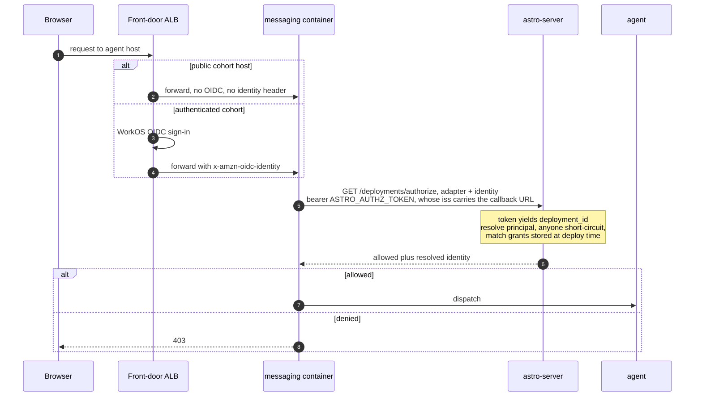
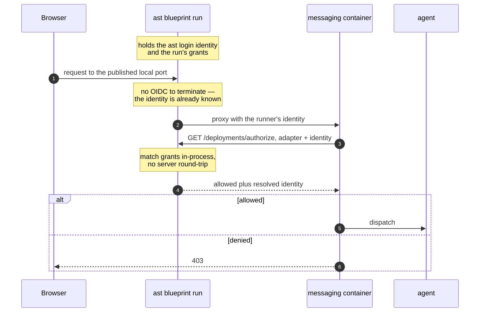
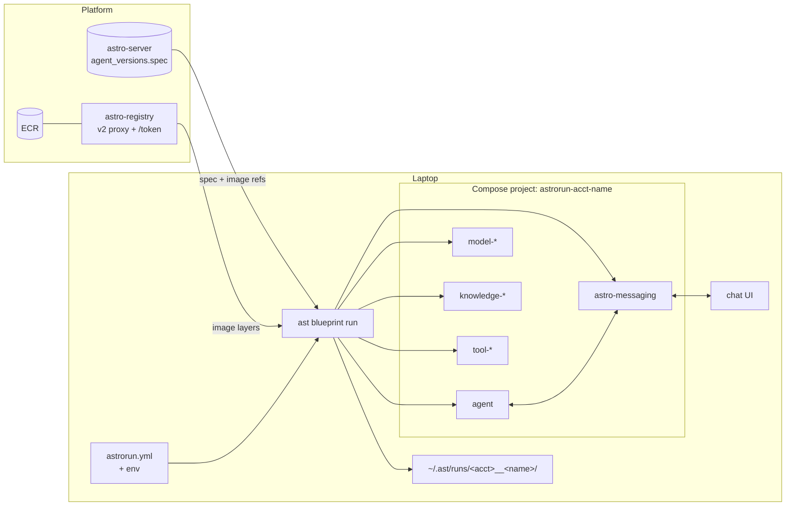
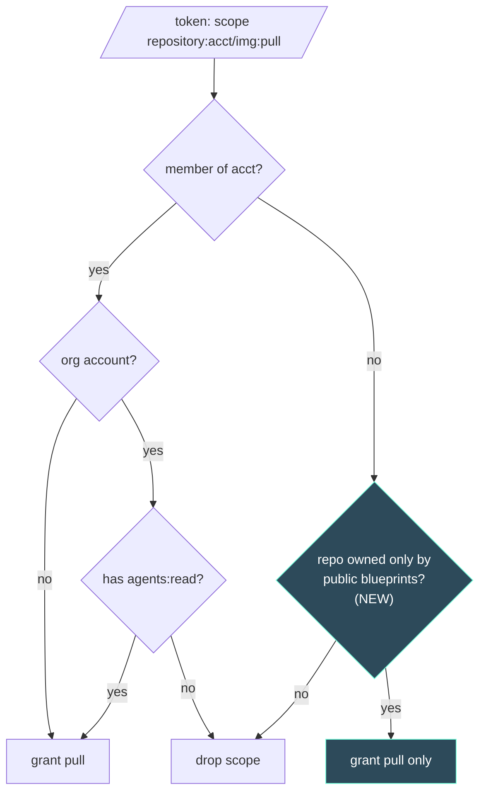
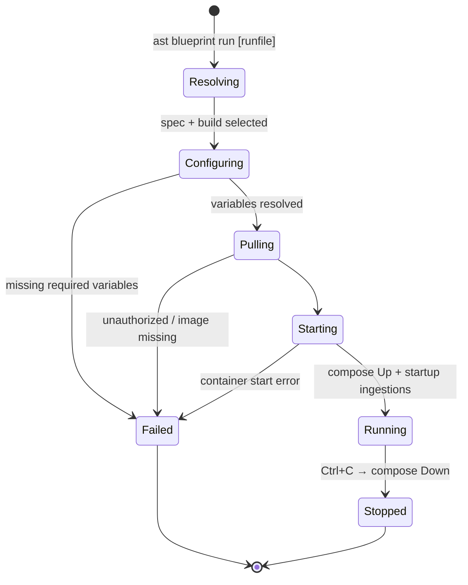
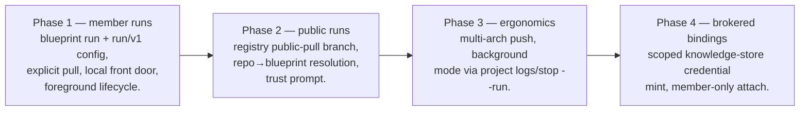

# Local Run of Registry Blueprints (`ast blueprint run`)

**Version**: 1.0
**Status**: Draft
**Date**: 2026-08-04
**Branch**: `docs/blueprint-local-run-spec`

## Overview

`ast project start` runs an agent from a **source tree**: parse `astropods.yml`, build every component from its `build:` block, start the Compose project. `ast push` inverts that — build, push images to astro-registry, register a **transformed spec** (every `build:` replaced by an image reference) with astro-server.

Nothing closes the loop. A published blueprint can only be run by deploying it; there is no way to pull one and run it on a laptop.

This spec adds `ast blueprint run [runfile]`: read a run config naming a blueprint, fetch the registered spec, pull its images, resolve variables, start the same Compose topology — no source tree, no Dockerfile, no build.

The registered spec is already the right artifact. `TransformSpecForRegistry` leaves everything but `build:` intact (`dev:`, `inputs:`, `models:`, `knowledge:`, `integrations:`, `ingestion:`), and `compose.BuildProject` falls back to `service.Image` when a component has no build block. **The topology needs no structural change**; the work is fetch, pull-auth, variable resolution, port exposure, and run lifecycle.

## Goals

1. **Run any blueprint you can see.** Full topology: agent, models, knowledge, integrations, messaging sidecar, chat UI. `--init-config` bootstraps the run config; from then on it is one command.
2. **Declarative, committable configuration.** The run config is the unit of invocation, not a pile of flags. No interactive prompts, no secrets in the file.
3. **Reuse the dev runtime's machinery, not its posture.** Same `BuildProject`, sidecar, chat UI, log/stop verbs. But `project start` is a development loop optimizing for inspection, and `blueprint run` is a production-like run optimizing for fidelity. Where those pull apart they differ; §5 enumerates every place.
4. **No source tree, no Docker build.** Pull-only.
5. **Public blueprints are runnable by non-members.** The adoption path, and the reason the feature exists.

## Non-Goals

1. **Kubernetes parity.** No HPA, PVC classes, or GPU scheduling — the gap `project start` already has.
2. **Editing a pulled blueprint.** Modifying one means owning its source.
3. **Scheduled ingestion.** No local scheduler, matching `project start`. `startup` and `webhook` triggers work; manual triggering is available.
4. **Replacing `ast blueprint deploy`.** No public URL, no managed vault. `interfaces.auth` is honoured with the CLI as front door (§2.1), but that is a stand-in for the OIDC ingress, not the ingress.
5. **Multi-arch builds.** Emulation for now (§6.3); manifest-list push is Phase 3.
6. **Running an observability stack.** No collector sidecar, no managed pipeline, no provisioned telemetry credential. A run can *export* to an endpoint the user already has (§2.2).
7. **Managing the image cache.** Pulled images are Docker's to keep or reclaim, and `docker image prune` already does it. No `--rmi` teardown flag: the normal loop is run, kill, run again, so discarding layers on exit would re-pull gigabytes for nothing, and the try-once case is served well enough by a documented prune.

---

## 1. Command surface

| Command | Description |
|---|---|
| `ast blueprint run [runfile]` | Pull and start the blueprint named by a run config. Foreground; Ctrl+C stops and removes the containers. |

**The positional argument is the run config, not a blueprint ref**, defaulting to `./astrorun.yml`. Since `blueprint:` lives in that file (§2), the file is the artifact you run, and it is the single place the blueprint is named — no precedence rule between a command-line ref and a config one, because there is only one.

```
ast blueprint run --init-config acme/demo-bot   # write ./astrorun.yml, then edit
ast blueprint run                               # ./astrorun.yml
ast blueprint run prod.yml                      # a named runfile
```

`--init-config` is the only place a `<ref>` (`[account/]name[:build]`) is typed: a bare `name` resolves against the active account, `:build` pins a build, default latest published. It writes to the positional path, or `./astrorun.yml`.

Running a blueprint therefore always takes a config, even a two-line one. A ref-only invocation would have to invent defaults for a blueprint's variables, and the failure mode — a run that starts and misbehaves because a required value silently defaulted — is worse than a first step that writes the file and shows what must be filled in.

| Flag | Purpose |
|---|---|
| `--init-config <ref>` | Write a starter run config for the blueprint and exit without running |
| `--force` | With `--init-config`, overwrite an existing run config |
| `--vars-file <file>` | File that `${env:*}` references resolve against (default: `./.env`) |
| `--build <id>` | Override the build pinned by the config |
| `--no-pull` | Use only images already present locally |
| `--pull` | Force re-pull |
| `--yes, -y` | Skip the first-run trust confirmation (§9) |

**No top-level `ast run` alias, no run sub-tree.** `build` / `push` / `deploy` have aliases because they are everyday operations on a project you own. A bare `ast run` would need `ls` / `logs` / `stop` children that collide with blueprint names (`ast run ls` vs. a blueprint named `ls`). Registering only under `blueprint` avoids that.

**Foreground only in v1.** Ctrl+C tears the project down, as `runForeground` does today. This fits the use case — pull, talk to it, kill it — and removes the entire run-registry design (state enumeration, orphan cleanup, stale-marker recovery) from v1. §7 covers the extension point.

---

## 2. Run config file (`run/v1`)

`run/v1` **borrows the shape of `deployment-template/v1` without depending on it**: same field names, nesting, and `variables` semantics, but its own parser, and no call to the template endpoint.

The separation matters because `deployment-template/v1` is a cluster artifact — finalized, HMAC-signed, POSTed to `/deploy`, carrying `provisioning`, `target`, and `observability`. Depending on it would drag a network round-trip and an auth requirement into a path whose value is running on a laptop, and would make the deploy endpoint's schema a compatibility surface for a local command.

**Divergence is prevented by the shared library, not the endpoint.** astro-server's template builder derives its variables from astro-spec primitives — `spec.Input` declarations, `spec.CloudCredentialKeys`, `spec.CustomProviderCredentialKeys`. Those live in `github.com/astropods/astro-spec`, which the CLI already imports and `compose.BuildEnvironment` already uses. Both sides compute the same names from the same code.

**Shape alignment is a test, not a promise.** The two formats agree by convention, and convention decays: a field added to the template for the deploy UI will not appear here, which is usually right, since most such additions are cluster-only. A schema conformance test carries an allowlist of the deliberate divergences — `blueprint: <ref>` for `source{}`, the added `ports{}` and `telemetry{}`, the unsupported `target{}` / `observability{}` / `provisioning{}` / `schedules{}` — and fails on anything else. The allowlist is the feature: growing it should require someone to say why. `variables{}`, `models{}`, `interfaces.*`, and `bindings{}` are shared enough to make this worth having.

```yaml
spec: run/v1

blueprint: acme/support-bot:b_20260731_a1b2c3   # :build optional, default = latest

variables:
  OPENAI_API_KEY:
    value: ${env:OPENAI_API_KEY}   # never a literal secret
  SUPPORT_INBOX:
    value: support@acme.com

models:
  chat: claude-sonnet-5

interfaces:
  adapters: [web]
  auth:
    web:
      type: oidc
      grants:
        - org: acme

bindings:                        # validated in v1, resolved in Phase 4 (§10)
  knowledge:
    docs: arn:astro:knowledge:us-east-1:acme:store/kb_7f3a

telemetry:                       # run-only: export to an endpoint you already run
  endpoint: http://localhost:4318
  headers:
    Authorization: ${env:OTEL_INGEST_KEY}

ports:                           # run-only: opt in to exposing a sidecar (§5.1)
  knowledge-docs: 6335
```

`variables` keeps the template's map-of-objects shape so a future `datatype` or `options` lands where it lands there.

### Borrowed, and omitted

| `deployment-template/v1` field | In `run/v1` | Rationale |
|---|---|---|
| `spec` | Borrowed as `run/v1` | A run config is not deployable and must not be mistaken for one |
| `source.{account,name,build}` | Replaced by `blueprint: <ref>`, required | The template decomposes it for a form with three widgets; a run config wants the one-line ref `--init-config` takes. It is the only place a run names its blueprint (§1), so it cannot be omitted |
| `variables{}.value` | Borrowed | The whole point |
| `variables{}.ref` | Rejected | Vault refs resolve server-side. Pulling account secrets onto a laptop to feed a third party's container is exfiltration (§9) |
| `models{}` | Borrowed | Gateway model selection. Dev silently defaults to a model's *first* option; this makes it explicit |
| `interfaces.adapters` | Borrowed | Drives the messaging sidecar, same as dev |
| `interfaces.auth.<adapter>.type` | Borrowed | The CLI is the local front door and holds the identity, so it can vouch for the caller (§2.1) |
| `interfaces.auth.<adapter>.grants` | Borrowed | Enforced by the CLI. Mostly ceremony with one identity, but keeps a blueprint's access config meaningful in both places |
| `bindings{}` | Borrowed, deferred | A binding is a server-side authorization decision, not a cluster feature (§2.1). Validated in v1, resolved in Phase 4 |
| `schedules{}` | Omitted | No local scheduler |
| `provisioning{}` | Omitted | K8s QoS knobs with no Compose analogue |
| `target{}` | Not supported | Nothing is user-settable: `runtime` is an enum whose only legal value is `kubernetes` (parser Rule 3), false for a Compose run; the rest is server-assigned identity |
| `observability{}` | Not supported; see `telemetry{}` | The field provisions a collector sidecar aimed at managed Langfuse. Nothing local provisions anything, so the shape is wrong rather than unavailable (§2.2) |
| — | `ports{}` added | Run-only. A production-like run publishes nothing by default (§5.1); this is the opt-in |
| — | `telemetry{}` added | Run-only. Export to an endpoint the user already runs (§2.2) |

An unsupported key is a parse error naming the field, not a silent ignore — `observability:` should say the field is deploy-only and point at `telemetry{}`. Same call as unresolved `bindings{}` (§10).

### 2.1 The CLI is the local front door

Auth, grants, and bindings look like cluster concepts, but only their implementation is. Each needs an authenticated party between the user and the workload that can decide authorization on the user's behalf. In a deployment that is the front door; locally it is the CLI, which publishes the ports, serves the chat UI, and holds a WorkOS identity after `ast login`.

**Deployed today** — the front door terminates OIDC; the messaging container calls back to decide authorization:



Two details carry over. The callback address arrives in the **deploy token's `iss` claim**, so the messaging container is told where to ask rather than configured with an address. And with no callback URL configured — local dev today — messaging **falls back to allow-all**, with `WEB_AUTHN_TEST_USER_ID` pinning an identity. Local dev already fakes this; it fakes it by disabling it.

**Locally** — the same shape, CLI standing in for both the ALB and the callback:



The ALB's two jobs split cleanly: OIDC termination is unnecessary because the CLI holds the identity, and routing it already does for the chat UI. What remains is the callback, and the CLI can serve the same contract astro-server serves. One participant is swapped; nothing is invented.

The brokering pattern also already exists. `provider: astro-gateway` needs a credential no laptop can hold, and the answer was not to drop gateway support: astro-server mints a short-lived scoped dev key and the CLI injects it (`cmd/dev.go`). **Server authorizes, CLI brokers, container receives a narrow self-expiring credential.** `ResolveBindings` is the same shape — resolve an ARN, check `store.AccountID` against the caller.

Three consequences:

- **Auth.** The CLI presents the logged-in user as the caller identity the OIDC front door would inject, so a blueprint reading its caller behaves as deployed.
- **Grants are default-deny.** Honouring a pulled blueprint's grants verbatim locks the runner out whenever those grants name an org they are not in. The CLI self-grants a `user_id` for the runner unless the config says otherwise — the same defaulting the messaging adapter gets (§5), and what `seedFreshAuthGrants` already does for the deployer.
- **Inert grants are enforced and reported.** `org:` resolves against the runner's memberships and `anyone:` allows everything, but a `user_id:` naming someone else can never match — that person cannot reach a laptop's listener. It is still evaluated, because dropping it would make local behaviour diverge from deployed for no gain, and the ready block names such grants as having no local effect so the run does not look more permissive than it is.
- **Bindings are member-only.** Brokering into your own team's blueprint is the boundary `project start` already crosses; handing a credential to an untrusted **public** blueprint is not. The store-ownership check prevents reaching another account's store, not a hostile blueprint reaching your own.

This narrows §9.2 rather than contradicting it: what is rejected is bulk vault access, not one store the user named explicitly.

### 2.2 Telemetry: export, don't provision

A deployed agent already reads `OTEL_EXPORTER_OTLP_ENDPOINT` (`spec_resolver.go` writes it into the ConfigMap). The contract exists; what is missing locally is a value, since the compose builder injects no OTEL variables at all.

`telemetry{}` supplies it. `endpoint` and `headers` map to the standard `OTEL_EXPORTER_OTLP_ENDPOINT` and `OTEL_EXPORTER_OTLP_HEADERS`; `OTEL_SERVICE_NAME` defaults to the blueprint name. Omit the block and nothing is injected. Because these are the standard names, an agent instrumented for production needs no local special-casing.

This is the inverse of the template's `observability{}`, which provisions a collector at a port with resources shipping to managed Langfuse. This points at infrastructure the user already has. Nothing is created and no platform credential is minted, so §2.1's brokering is not involved — the endpoint and any key are the user's, the key held in the vars-file like any other secret.

Pointing it at `astro-otel` is then a special case rather than an integration: it already serves OTLP at `/v1/traces` and `/v1/metrics` against per-account ingest keys, so a user with a key ships local traces to their own Langfuse with no new server surface.

### Generating it: `--init-config`

`--init-config <ref>` fetches the spec, derives its variable set, and writes a commented starter file to the positional path or `./astrorun.yml` — no server call beyond the fetch. It walks the same three sources the server's builder walks:

- declared `inputs` at top level and on `agent` / `models` / `knowledge` / `integrations` / `ingestion`, carrying `description`, `datatype`, `display-as`, `options`, `default`, `secret`, `optional`;
- `spec.CloudCredentialKeys` and `spec.CustomProviderCredentialKeys`, whose `CredentialMeta` carries `Description` and `Optional`;
- gateway models, for the `models{}` selectors.

Required variables are emitted filled-in, secrets as `${env:NAME}` placeholders so the safe form is the default, optional ones commented out with defaults shown. The file is stamped `blueprint: <ref>`, unpinned unless the invocation pinned a build, and refuses to overwrite an existing file without `--force` — a generated config is edited by hand, so clobbering it would discard the user's work. It is the writable cousin of `blueprint get --template`, needing neither membership nor the template endpoint.

**One helper should move.** `GatewayModelSelections` (astro-server `internal/deployment/template.go`) wraps astro-spec accessors that `compose.BuildEnvironment` open-codes. Lifting it into astro-spec removes the only real duplication between the run and deploy paths.

### Validation

**The spec declares which variables exist; the config only supplies values.** The set comes from the blueprint — `spec.Input` declarations plus credential keys plus gateway selectors — never from the config's own keys.

Validation is local and runs before any pull, so a missing credential fails in milliseconds rather than after a multi-gigabyte download:

- every non-optional variable resolves non-empty;
- every `${env:...}` resolves against the vars-file;
- every value with declared `options` is one of them;
- every key in `variables{}` matches a declared input. An unmatched one is almost always a typo of a real name, and ignoring it is the worst outcome: the intended variable silently falls back to its default and the run misbehaves later. Errors name the unmatched key and suggest the closest declared input.

Errors list missing keys with their descriptions.

Narrower than the deploy endpoint's — no view of the vault or cluster quotas. Binding ARNs are checked for shape and membership only (§10). Where the two overlap they agree, reading the same `spec.Input` metadata.

### Variable precedence

```
config variables (with ${env:*})  >  spec input defaults
```

One source over a base case. The runfile supplies a value for every variable it sets; a variable it does not set falls back to the blueprint's declared default, or fails validation if required.

**The vars-file is not a precedence tier.** `${env:NAME}` dereferences it — the vars-file is *where `${env:*}` looks*, not a parallel way to supply variables. So a value reaches a container through exactly one path: the runfile names the variable, and either gives a literal or points at a key in the vars-file. `--vars-file` chooses which file that is, defaulting to `./.env`.

This is the property that makes the runfile the unit of invocation. Every variable used is named in it, so reading it tells you what the run consumes and where each value comes from — no ambient layer supplying anything the file never mentions, and no question about which of two sources won. It also makes swapping secret sets a matter of pointing at a different file (`--vars-file prod.env`) without touching the runfile.

**No `--var` flag.** It would be a second path to the same place, and every real use of it is a secret — for which the command line is the worst channel, landing in shell history and visible in `ps` to any other process on the machine. Editing the vars-file costs a keystroke more and leaves the value somewhere it can be seen and corrected.

An unresolved `${env:NAME}` on a required variable is a hard error, not an empty string, and the message names both the key and the vars-file searched. The process environment is not consulted: one lookup path, not two.

The `ast configure` project store is **not** consulted either: it is keyed by project directory and a run has none. The run config plays that role.

---

## 3. End-to-end flow

```mermaid
sequenceDiagram
    participant U as User
    participant CLI as ast blueprint run
    participant S as astro-server
    participant R as astro-registry
    participant D as Docker / Compose
    participant C as Containers

    U->>CLI: ast blueprint run astrorun.yml
    CLI->>CLI: parse run config, read blueprint: ref
    CLI->>S: GET /api/v1/agents/acme/support-bot
    S-->>CLI: versions[] (transformed spec, build ids, visibility)
    Note over CLI: pick build (latest or pinned)<br/>spec.Parse(yaml(version.spec))
    CLI->>CLI: resolve ${env:*} against the vars-file
    Note over CLI: derive required variables from the spec<br/>validate locally → fail fast before any pull
    CLI->>U: trust prompt (non-member blueprint, first run)
    CLI->>S: POST /ai-gateway/dev-key  (only if spec uses provider:astro-gateway)
    S-->>CLI: short-lived gateway key
    CLI->>R: GET /token (Basic: WorkOS bearer, scope repository:acme/*:pull)
    R-->>CLI: registry token
    loop each astro-registry image in spec
        CLI->>D: ImagePull(ref, RegistryAuth)
        D->>R: v2 pull → 307 → S3 blobs
    end
    CLI->>D: BuildProject(spec, runDir, envVars) → compose Up
    D->>C: start model / knowledge / integration / messaging / agent
    CLI->>CLI: serve authorize callback; start chat UI only if the<br/>blueprint uses web; run startup ingestions
    CLI-->>U: ready block (URLs per declared adapter, or none)
    CLI->>C: follow agent logs until Ctrl+C → Down
```

---

## 4. Architecture



Everything in the Compose box comes from the existing `BuildProject`. The new surface is the left column: fetch, pull-auth, config resolution, run state.

---

## 5. What differs from `ast project start`

`project start` is a development loop optimizing for inspection — open the dashboard, curl the sidecar, reload the source. `blueprint run` is a production-like run of a published artifact, optimizing for behaving as it will deployed. Where a dev affordance makes the local run *less* faithful, it is dropped.

`BuildProject` is reused, but the caller differs in six places:

| Concern | `project start` | `blueprint run` | Why |
|---|---|---|---|
| Compose project name | `ProjectName(spec)` → agent name | `astrorun-<account>-<name>` | A source checkout must not share containers or volumes with a pulled run |
| Working dir | `os.Getwd()` | `~/.ast/runs/<account>__<name>/` | No source tree; holds compose labels and chat-UI state |
| `dev.command` | Applied as container command | **Ignored**, with no escape hatch | Points at source paths (`uv run --reload agent/main.py`) absent from a pulled run; honouring it guarantees a crash loop. Not a preference to flag past: an author who wants their dev command wants `project start` in the tree that has those paths, and a deployment would not run it either |
| Hot-reload bind mount | Bind-mounts `./agent` when `agent.build != nil` | Never | Automatic — no build block exists |
| Published ports | Every component, fixed port, all interfaces | Nothing but what the CLI must reach, loopback and ephemeral (§5.1) | A deployment exposes one front door. Publishing a pulled image's store dashboard to the LAN is neither faithful nor safe |
| Image platform | Native | `platform: linux/amd64` on astro-registry images | Push builds amd64-only (`resolveBuildPlatform`); without it, arm64 hosts fail manifest selection instead of emulating |

Four behaviours are new rather than different:

- **Local front door.** `project start` has no caller identity — it is your own source tree. `blueprint run` honours `interfaces.auth`, presenting the logged-in user and enforcing grants, self-granting the runner because grants are default-deny (§2.1).
- **Adapter defaulting, only into a vacuum.** `BuildProject` starts the messaging sidecar only when `dev.interfaces.messaging` lists an adapter. A pulled blueprint's author may not have set one and the runner cannot edit the spec, so `web` is injected when the blueprint declares **none** — otherwise a perfectly good blueprint starts with no way to talk to it. It is never added alongside a declared adapter: a blueprint that says `slack` has chosen its interface, and bolting a chat UI onto it would invent a surface the deployment does not have. Set in the run config only, never a flag.
- **Gateway model selection.** `BuildEnvironment` defaults `MODEL_<name>` to a gateway model's first option. `models{}` is merged into `envVars` before `BuildProject`, so a run can pick what the deploy form would.
- **Telemetry export.** `BuildEnvironment` injects no OTEL variables. When `telemetry{}` is set, the standard OTLP variables are injected (§2.2) — the one case where a pulled run is better instrumented than a source run, and a reason to give `project start` the same field later.

### 5.1 Port exposure

`BuildProject` publishes a host port for every model, knowledge store (its own port, its dashboard, and any provider extras), tool container, webhook ingestion, the messaging sidecar's gRPC and HTTP ports, and the agent frontend — each at a fixed number bound to all interfaces, since no host IP is set. Right for a dev loop.

For a production-like run it is wrong twice: a deployment exposes one front door and keeps sidecars internal, so publishing them is *less* faithful; and binding pulled third-party images to `0.0.0.0` puts someone else's container on the LAN, which §9 exists to prevent.

Every service already joins the `astro-dev` network and reaches peers by service name, so publishing is never needed for the topology. Three changes, in decreasing order of payoff:

1. **Publish nothing by default.** Models, knowledge, tools, messaging gRPC lose their mappings.
2. **Bind the remainder to `127.0.0.1`.** One field, and the LAN is out of scope.
3. **Let Docker assign the port.** An empty `Published` yields a free port the CLI reads back after `Up`. Collisions cease to exist rather than being reported.

What stays reachable is the CLI's own listeners — one per browser-facing surface (§5.2), never a container port. A deployment likewise gives the chat and an agent's own UI separate hostnames while keeping every sidecar off the network.

`ports{}` inverts: no longer a collision escape hatch, it is the opt-in for exposing a sidecar you want to inspect. Its entries take `[host:]port`, borrowing Docker's own spelling and defaulting to `127.0.0.1`:

```yaml
ports:
  knowledge-docs: 6335              # 127.0.0.1:6335
  ingest-hook: 0.0.0.0:3001         # reachable off-box, deliberately
```

Loopback otherwise breaks the one legitimate inbound case, a tunnelled webhook reaching a local ingestion endpoint. Per-entry rather than an `--expose` flag: only that surface needs widening, and the choice is then recorded in a file someone can review rather than living in a shell command that is easy to reach for wholesale.

One cost remains: `chatui` hardcodes `MessagingWebHostPort`, so the resolved port must be threaded through to it.

**`project start` is unchanged.** Its dashboards are the point of a dev loop. This is the divergence Goal 3 anticipates.

### 5.2 The interaction surface is the CLI's chat UI

`chatui` is how a user talks to a locally-run blueprint over the `web` adapter — the single such surface, and the only thing §5.1 leaves published.

**A blueprint without `web` gets no chat UI, and that is correct.** A `slack`-only blueprint is reached through Slack: the sidecar connects outbound over Socket Mode with the app-level token supplied as a variable, and the CLI starts no listener and no chat UI at all. Its job for that run is to bring the topology up, serve the authorization callback, and stream logs. Adding a local chat surface would be inventing an interface the deployment does not have — the same reason `dev.command` is ignored.

Grants still apply, through the same callback: messaging asks with `identity_type=slack` and a `team_id` scope. Server-side that resolves to a linked WorkOS user via `slack_identity_mappings`, which the CLI cannot consult, so it takes the fallback the server itself takes when no mapping exists and treats the caller as the run's account. Coarser than deployed, and the ready block says so.

Less new work than it sounds: `chatui` is already a local stand-in for astro-server, not a bare UI. It embeds the shipped chat client, serves the deployment-shaped responses that client expects (`summary`, `list`, `status`, `runtime`) from local state, and proxies `messaging`, `chat`, and `files` to the sidecar — performing, per its own comment, "the same rewrite astro-server's messaging proxy performs in production." A run therefore presents the production client against a production-shaped contract.

So `chatui` is where §2.1's front door lives: it terminates the connection, attaches the runner's identity, and answers the authorization callback. Its habit of synthesizing a deployment identity is convenient rather than incidental — the authorize contract is keyed by `deployment_id`.

**The agent's own UI is a second surface.** An agent may serve its own interface (`Agent.HasFrontend()`), published on a fixed port today. `chatui` has no route for it, so §5.1's default alone would make such a blueprint unreachable — a regression dressed as a security improvement. Production treats it as a distinct `custom` adapter with three properties worth copying exactly:

- **Its own hostname.** `resolveAgentIngressHost` gives it an ingress separate from messaging's.
- **The front door authenticates but does not authorize it** — "the platform does not enforce custom at the ingress."
- **The agent authorizes itself**, calling `/deployments/authorize` with `adapter=custom`. This is why `ASTRO_AUTHZ_TOKEN` is injected into the agent container and not only into messaging.

Locally that maps to:

- **Its own origin, not a path.** The CLI serves the agent frontend on a second loopback listener rather than a subpath of the chat UI. A frontend built to be served at `/` breaks under `/custom/` once its assets resolve relative — production gives it a separate hostname for the same reason, and forcing a subpath locally would break apps that deploy fine.
- **Passthrough, not enforcement.** `chatui` attaches the runner identity and proxies, as the ALB does; it must not evaluate `custom` grants itself. An agent that never calls authorize would otherwise look protected locally and be wide open deployed — precisely the failure a production-like run exists to surface rather than mask.
- **The agent gets a token too.** The CLI mints `ASTRO_AUTHZ_TOKEN` for the agent container as well as messaging, `iss` pointing at its own listener, carrying the `anyone_adapters` claim derived from the run config's grants — as the deploy path derives it from the spec's.

---

## 6. Image pull and authorization

The one place the platform must change.

### 6.1 Pull mechanics

Compose's SDK service is built from `command.NewDockerCli`, so a Compose-driven pull authenticates from `~/.docker/config.json` — which has no astro-registry credentials. `blueprint run` therefore **pulls explicitly before `Up`**, mirroring the push path: fetch an account-scoped token, build `registry.AuthConfig{Username: "token", Password: token}`, base64 it, call `ImagePull` with `RegistryAuth` — the inverse of `getDockerRegistryAuth` + `dockerPushWithRetry` in `cmd/push_streaming.go`. Pre-pulled services get `PullPolicyNever`; images not from astro-registry — the messaging sidecar, any provider image — keep default behaviour and the user's Docker credentials.

Writing credentials into `~/.docker/config.json` was rejected: it mutates shared machine state the CLI does not own, and outlives the command.

### 6.2 The authorization gap

`authorizeScope` grants a scope **only** when `IsMemberWithID(namespace, subject)` returns true, then intersects requested actions with `agents:read` / `agents:write` for org accounts. There is no non-member pull path and no notion of blueprint visibility in the registry — visibility lives in astro-server's agent index; the registry knows only repository names.

The spec is already public: `GET /api/v1/agents/:account/:name` sits behind `OptionalAuth`, so anyone can read a public blueprint's image references and then fail to pull them. Phase 2 closes that.



**Repo → blueprint.** The scope is `<account>/<repo>`. The account half needs no work — it is the namespace, already the key for the membership check. Only the repository half is in question: does it belong to a public blueprint?

**Look it up; do not parse it.** Push derives repository names from `ComponentImageName` (`{agent}` for the agent, `{agent}-{kind}-{sub}` for components), so the mapping is reversible in principle by prefix-matching blueprint names. It should not be. That scheme collides — an account holding both `foo` and `foo-model-bar` produces one repository from two blueprints — so a name-based rule needs longest-match tiebreaking and a grammar check on the remainder, and still cannot say which blueprint truly owns the repo. All of it re-derives something already recorded: `agent_versions.spec_json` is the transformed spec, in which every `build:` is a fully-qualified image reference.

Phase 2 therefore writes a derived table at publish, alongside the version:

```
blueprint_repositories(account_id, name, build_id, repository)
```

and the authorization check is one indexed lookup — do rows exist for this account and repository, and is every matching blueprint `visibility = 'public'` and non-archived?

**No backfill.** Rows are written going forward only, so a blueprint published before the migration has none and stays un-pullable by non-members until its next publish. Nothing regresses, because public pull does not exist yet — and the alternative, parsing every historical `spec_json`, means trusting the shape of specs written before parts of the current transform existed, to enable a path nobody is using. Publishing again is the remedy and a reasonable thing to ask of someone who wants the feature. The denial must say so rather than reading as a permissions error. The collision case needs no special handling: two blueprints sharing a repository produce two rows, and requiring all of them to qualify is the correct rule anyway, since the images live in one repository and granting pull for the public one would expose the private one's layers.

A qualifying match grants `pull` and nothing else — never `push` or `delete`, whatever was requested.

This makes public pull anonymous-capable in principle, but v1 still requires a valid IdP credential at `/token`, so pulls stay attributable and rate-limitable.

**That is also where a usage signal comes from.** `blueprint run` reports nothing to astro-server. A publisher's "is anyone running this" is answerable from token issuance, which already records who pulled what, so a second telemetry channel would add a write to a command that otherwise needs none, a failure mode when offline, and something to unpick if pull is ever opened to anonymous callers. The one thing pulls miss is a run against cached images; that is a worthwhile trade for keeping the local path observation-free.

### 6.3 Architecture caveat

Pushed images are amd64 only, so Apple Silicon runs the agent under emulation — correct but slow, and native amd64 extensions behave as in production. `blueprint run` prints a one-line notice on non-amd64 hosts. Two-platform manifest lists are the real fix (Phase 3); since they double build time for every publisher, they should be opt-in (`push --platform`) before default.

---

## 7. Run state and lifecycle

A foreground run needs almost no persistent state. `~/.ast/runs/<account>__<name>/` exists to give Compose a stable `WorkingDirLabel` and host chat-UI files — never the working directory, since a run is not a project.



Teardown — `svc.Down(projectName)`, `stopChatUI`, marker removal — is exactly `runForeground`'s. Both commands should call one shared helper parameterized by project name and run directory, so a fix to one cannot skip the other.

**Orphan recovery.** A force-killed CLI leaves containers with no marker. `project start` calls `Down` unconditionally before `Up`; `blueprint run` does the same on its deterministic project name. Containers from a blueprint never re-run are reachable via `docker compose -p astrorun-<account>-<name> down`, which the failure message prints.

**If background mode is added**, the natural home is `project logs` / `project stop` gaining `--run <ref>`, reusing the verbs rather than growing a parallel tree. It is also where an out-of-process proxy would earn its place: with no CLI process, something else must hold the port and route.

---

## 8. Changes required

| Component | Change | Size |
|---|---|---|
| `astro-cli` `cmd/blueprint_run.go` | Command: runfile resolution, build selection, trust prompt, `--init-config` ref parsing, ready block | New, ~250 LOC |
| `astro-cli` `internal/runconfig` | `run/v1` parse, `${env:*}` interpolation, variable derivation from the spec, validation (including unmatched `variables{}` keys), `--init-config` rendering, reject deploy-only keys | New |
| `astro-cli` local front door | Serve `/deployments/authorize` in-process against the run's grants; mint `ASTRO_AUTHZ_TOKEN` for the messaging **and agent** containers with `iss` pointing at the CLI listener and an `anyone_adapters` claim from the config's grants; pin and self-grant the runner (§2.1, §5.2) | New, small |
| `astro-cli` telemetry | Inject `OTEL_EXPORTER_OTLP_ENDPOINT` / `_HEADERS` / `OTEL_SERVICE_NAME` (§2.2) | New, trivial |
| `astro-cli` bindings | Parse and validate `bindings.knowledge`; reject for non-members; error that resolution is unimplemented | New, small |
| `astro-cli` `cmd/pull_streaming.go` | `pullImageFromRegistryStreaming` — mirror of the push helper, with retry and progress | New, small |
| `astro-cli` `cmd/dev.go` | Extract `startLocalProject` / `stopLocalProject` shared with `project start` | Refactor |
| `astro-cli` `internal/compose` | Explicit project name; `PlatformOverride`, `IgnoreDevCommand`, and a port-exposure policy (§5.1) | Small |
| `astro-cli` `internal/chatui` | Resolved messaging port instead of the constant; attach identity and answer the authorize callback; second listener proxying the agent frontend on its own origin, without enforcing `custom` grants (§5.2) | Small |
| `astro-cli` blueprint fetch | Reuse `blueprintItem` / `apiCall`; add version→`spec.Parse` and build selection | Small |
| `astro-registry` `handlers/token.go` | Public-blueprint pull branch in `authorizeScope` | Small |
| `astro-registry` `internal/account` | `RepositoryIsPublic(accountID, repository)` — indexed lookup against `blueprint_repositories`, requiring every owning blueprint to be public and non-archived | New, small |
| `astro-server` `internal/agentindex` | Write `blueprint_repositories` rows at publish from the transformed spec's image refs | Small |
| `astro-server` | None for Phase 1. Phase 4 adds a scoped knowledge-store credential mint modelled on `/ai-gateway/dev-key` | — |
| `astro-spec` | Lift `GatewayModelSelections` out of astro-server so all three callers share one implementation | Small |
| Tests | `run/v1` ↔ `deployment-template/v1` conformance test with the divergence allowlist (§2) | Small |
| Docs | `docs/01-spec/cli-command-tree.md`, `docs-public` CLI reference and a "Run a blueprint locally" guide | — |

Deliberately unchanged: `BuildProject`'s topology logic, the push pipeline, the deploy path, `deployment/v1`.

---

## 9. Security

Running a pulled blueprint executes a third party's image on the user's machine with the user's network. This is `docker run` of untrusted code.

1. **Trust confirmation.** First run of a non-member blueprint prints the account, blueprint, build ID, and images, and requires confirmation (`--yes` skips; recorded per blueprint so it prompts once).
2. **No bulk vault access.** `variables{}.ref` is rejected: it would resolve arbitrary account secrets onto the laptop and into a third party's container. One store the user named explicitly is different — see 3.
3. **No ambient credentials; brokered ones are narrow.** No WorkOS, refresh, or account token enters a container. Platform access arrives as a minted credential, short-lived and scoped to one resource — the gateway dev key today, a knowledge-store credential later (§2.1). Brokered bindings are refused for non-member blueprints, so an untrusted image cannot be handed a credential to the runner's own store.
4. **Pull-only scope.** The public-pull branch grants `pull` and drops every other action.
5. **Secrets out of the config file.** Secrets live in the vars-file, which is not committed; the runfile carries only `${env:NAME}` references and is. `--init-config` emits those placeholders rather than blanks, so the safe form is the default.
6. **Archived and private blueprints.** Archived resolve to no public grant; private fall through to the membership path.
7. **Grants are enforced, not decorative.** The local front door applies them. Because they are default-deny the CLI self-grants the runner (§2.1) — a widening of the pulled spec, and deliberately the only one.
8. **Nothing is published to the LAN.** Container ports bind loopback or not at all (§5.1).
9. **A Slack run is reachable by its workspace.** Loopback binding constrains inbound traffic, and Socket Mode is outbound, so it constrains nothing here: anyone who can message the app can reach a `slack`-only run, and local grant evaluation is coarser than deployed (§5.2). Running someone else's Slack blueprint means pointing their code at your workspace, which the trust prompt names explicitly.

---

## 10. Phasing



Phase 1 stands alone: "run my team's blueprint without cloning it", exercising the whole fetch/pull/compose path against the existing authorization model. Phase 2 is the adoption story and the only phase touching a platform service; it should not ship until Phase 1's pull path is proven.

**Bindings are specified but unbuilt.** Phase 1 validates `bindings{}` so the format is settled, but resolving one is a hard error rather than a silent no-op — a run that ignored its binding and started against an empty store would be worse than one that refuses. Attaching to the real store is the intended end state, and it is last because it is the only part that both adds a platform endpoint and widens what a local container can reach.

**Until then, an empty store is announced, not blocked.** A blueprint whose knowledge is populated by a `startup` ingestion works today; one expecting a pre-seeded managed store comes up empty and merely seems to have forgotten everything. So the ready block names any knowledge component with neither a `startup` ingestion nor a binding. It warns rather than refuses: an empty store is often exactly what someone wants when they are exercising something else, and blocking that would be the tool overriding a judgement it is not in a position to make.

---

## 11. Open questions

None outstanding. Each is settled in the section it governs: non-loopback exposure and the image cache (§5.1, Non-Goal 7), run metrics (§6.2), `dev.command` (§5), shape alignment (§2), knowledge seeding (§10), inert grants (§2.1), the Slack-only interaction surface (§5.2), and repository backfill (§6.2).

The last to close was the shape of a scoped knowledge-store credential, which mattered only while stores could be self-hosted with static credentials. With managed stores the only kind, scoping is a property of the store rather than a per-provider question, and Phase 4 can assume it.
