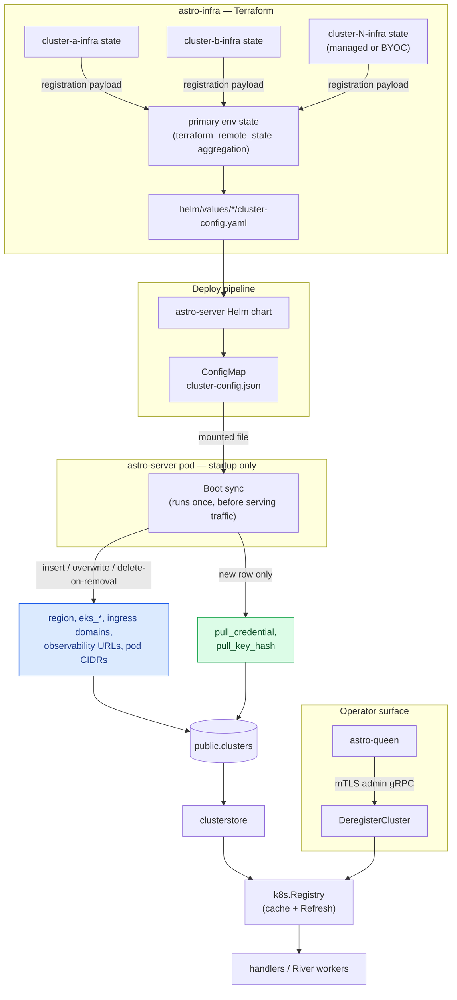

# Config-Driven Cluster Registration — astro-infra ↔ astro-server Contract

**Version**: 2.0
**Status**: Draft
**Date**: 2026-08-12

## Overview

Today, cluster registration is manual: astro-infra renders a JSON payload (`cluster-registration-payload` module, `scripts/byoc-output.sh`), and an operator pastes it into astro-queen to call an admin RPC.

This spec makes astro-infra's Terraform output the sole source of truth for a cluster's connectivity/identity data, delivered as part of astro-server's deploy artifact — same mechanism as the primary cluster's env vars, just a list instead of a singleton. Connectivity data can only change via a reviewed Terraform change + redeploy. No background process, no poller, no RPC can write it.

Every row present in `public.clusters` is usable — there's no enabled/disabled gate. A cluster removed from config is deleted on the next boot sync (or left in place, logged, if still referenced by an account or deployment); `pull_credential`/`pull_key_hash` are the only server-generated, runtime state.

**Revision note**: two earlier drafts used a background reconciler (S3-polling, or writing straight into the RPC-mutable table). Both rejected — see Alternatives Considered.

Builds on [`multi-region-cluster-support-spec.md`](multi-region-cluster-support-spec.md).

## Architecture

Blue = config-owned (boot sync only). Green = server-generated (nobody supplies a value). astro-queen has no register/edit/enable/disable action — it's read-only plus deregister and health-check.

## Terminology

- **Registration payload** — the JSON `cluster-registration-payload` already renders. Unchanged.
- **Cluster config** — combined list of every additional cluster's payload, rendered into astro-server's Helm values and mounted into its pods. Never includes the primary/default cluster, which keeps its own env vars.
- **Boot sync** — one-time step at astro-server startup: reads the mounted config, upserts config-owned fields. Not a background loop.
- **Config-owned field** — region, EKS coordinates, ingress domains, observability URLs, pod CIDRs. Boot sync only, overwritten every startup. `eks_cluster_ca` and `langfuse_vpce_ips` are the two exceptions that stay optional (Design).
- **Server-generated field** — `pull_credential`, `pull_key_hash`. astro-server mints these; no config or operator input.

## Goals

1. One authoritative source for connectivity data — astro-infra's Terraform output, baked into the deploy artifact.
2. Connectivity data changes only via Terraform + redeploy. No RPC, not even as an override — astro-queen cannot register or edit connectivity fields.
3. Config removed → next boot deletes the row (or leaves it, logged, if still referenced) — no disabled state to manage separately.
4. Malformed config fails the deploy/readiness check, not a silent runtime drift.

## Non-Goals

1. Onboarding without a redeploy — given up in exchange for routing every change through the deploy pipeline.
2. Changing `DeregisterCluster`'s manual, FK-gated semantics.
3. RBAC on the admin gRPC surface — stays mTLS-only.
4. Changing the primary cluster's env-var model.

## Current State

An operator pastes `byoc-output.sh`'s JSON into astro-queen, which calls `RegisterCluster`. `19-onboard-byoc-cluster.md` Phase 6 already aggregates other per-cluster outputs into the primary env's Terraform (`managed_clusters.tf`) — this spec extends that same pattern.

## Design

### Delivery

The primary env's Terraform (whichever `preview`/`prod` state owns astro-server's Helm release) pulls every cluster's `astro_server_registration_payload` via `terraform_remote_state`, renders the combined **cluster config** to `helm/values/*/cluster-config.yaml`. The chart renders a `ConfigMap` from it, mounted into the pod (`/etc/astro-server/cluster-config.json`), pointed to by `CLUSTER_CONFIG_PATH`. Payload carries `schema_version` for forward compatibility.

Onboarding is now two Terraform applies (cluster's own `-infra`, then the primary env — both already true today) plus a redeploy. No new manual step.

### Ownership split

| Field group | Fields | Writer |
|---|---|---|
| Config-owned | `region`, `eks_cluster_name`, `eks_cluster_endpoint`, `eks_cluster_ca`, `agent_ingress_domain`, `ingestion_ingress_domain`, `langfuse_base_url_ext`, `langfuse_vpce_ips`, `pod_subnet_cidrs`, `pod_subnet_ipv6_cidrs`, `loki_url`, `prometheus_url`, `tenant_router_internal_url` | Boot sync, exclusively. No RPC, no manual override. |
| Server-generated | `pull_credential`, `pull_key_hash` | `generatePullCredential`, called only from boot sync on row creation. |

`eks_cluster_ca` is required for every cluster except the default (the one astro-server itself runs in — no cross-account client to build). `langfuse_vpce_ips` is optional everywhere: only clusters needing a PrivateLink netpol exception to reach Langfuse set it. `pull_credential` is server-generated by necessity: it doesn't exist until astro-server creates it, flows *out* to the cluster, and only its hash is ever persisted — never fit for a Helm-rendered, git-tracked file.

### `RegisterCluster` / `UpdateCluster` / `EnableCluster` / `DisableCluster` are removed

Their only job was mutating connectivity or availability state by hand; boot sync now owns both exclusively, so all four RPCs and astro-queen's register/edit/enable/disable UI go away. astro-queen is confirmed the only caller — no other blast radius. Keeping any of them as a labeled "provisional" escape hatch would recreate the unreviewed write path this spec closes.

### Boot sync

Runs once, synchronously, at startup, before serving traffic:

1. Parse the mounted file. Top-level parse/schema failure fails startup (caught by readiness check).
2. Validate each entry (same rules as `clusterstore.UpsertFromConfig`, relaxed per the default-cluster exceptions above). A bad entry is logged and skipped, not fatal.
3. New id → insert, pull credential generated. Existing id → overwrite config-owned fields (skip write if hash unchanged); credential untouched.
4. Row with `config_synced_at` set but missing from this config → deleted. If still referenced by an account or deployment, the delete is blocked and logged — same FK semantics as a manual `DeregisterCluster`.
5. Rows with `config_synced_at IS NULL` (legacy rows created before boot sync existed) are left alone.

### Concurrency

No leader election, no lock — every pod runs this independently and it's safe by construction:

- Insert is `INSERT ... ON CONFLICT (id) DO UPDATE`, atomic. The `DO UPDATE` clause excludes `pull_credential`/`pull_key_hash` — whichever insert lands keeps its credential; a racing pod's insert just falls through to updating the (identical) config fields.
- Update and delete-on-removal are idempotent: every pod reads the identical mounted config, so concurrent writes converge regardless of order.
- No stale cache to invalidate — boot sync runs before the pod serves traffic.

A single pre-rollout Job/Helm-hook was considered and rejected: it'd remove some redundant per-pod work at the cost of a new resource type and failure mode, to solve a race correct SQL already closes.

### New columns

`config_synced_at`, `config_source_hash` — last boot sync per cluster, surfaced in `ListClusters`/astro-queen.

## Alternatives Considered

- **Background reconciler polling S3.** Always-on process writing on its own schedule, independent of the deploy pipeline — the out-of-band surface this revision removes.
- **Background reconciler writing into the RPC-mutable table.** Automates the copy-paste but keeps the fragility: any mTLS caller can still durably rewrite connectivity data, with no defined precedence against the reconciler.
- **Plain env vars, one per field per cluster.** Doesn't fit N clusters × ~14 fields (incl. PEM CA certs) cleanly; a mounted file is one atomic thing to version and validate.
- **Terraform writes directly to `clusters`.** Gives every `apply`-capable operator a direct Postgres write path, bypassing `clusterstore` validation.
- **Keep `RegisterCluster`/`UpdateCluster` as a manual escape hatch.** Any RPC that can durably set connectivity data — "provisional" label or not — is the write path this spec exists to close.

## Rollout Plan

Two independent tracks. Track A's output (a values file, a `ConfigMap`) is inert until astro-server reads it, so it can ship first with zero astro-server dependency. Track B no-ops safely with no config mounted, but is best tested once Track A's real data exists.

### Track A — astro-infra

| Phase | Change | Risk if wrong |
|---|---|---|
| A1 | Aggregate every existing cluster's `astro_server_registration_payload` into the primary env via `terraform_remote_state` — the backfill, same action as onboarding's Phase 6, applied retroactively. | None — not consumed yet. |
| A2 | Render to `helm/values/*/cluster-config.yaml`. | None. |
| A3 | Extend astro-server's chart with the `ConfigMap` + `CLUSTER_CONFIG_PATH` mount. Apply to preview and prod. | None — inert extra mount. |
| A4 | Verify rendered `ConfigMap` content directly (`kubectl`/`helm template`). | None — read-only. |

### Track B — astro-server

| Phase | Change | Risk if wrong |
|---|---|---|
| B1 | Add `config_synced_at`/`config_source_hash` + boot sync to `clusterstore`/`main.go`. No-ops without `CLUSTER_CONFIG_PATH`. | None if Track A hasn't shipped. |
| B2 | Roll out to preview. Confirm synced rows match existing DB rows. Add one throwaway entry to exercise create + remove (real clusters only exercise update). | Contained to preview. |
| B3 | Roll out to prod. Confirm zero diffs against Track A's backfill. | Bounded — create/update/disable only, never enable or delete. |
| B4 | Update `19-onboard-byoc-cluster.md`: note the redeploy step, drop the manual paste step. | Docs only. |
| B5 | Remove `RegisterCluster`/`UpdateCluster` from proto + astro-queen. Only after B3 confirms clean sync. | Bounded — astro-queen is the only caller. |

Rollback: remove the `CLUSTER_CONFIG_PATH` mount — boot sync no-ops again. Nothing it writes is destructive.

## What This Preserves / What This Kills

**Kills**: any write path for connectivity data outside the deploy pipeline; the manual paste-into-astro-queen step; `RegisterCluster`/`UpdateCluster`/`EnableCluster`/`DisableCluster` and their UI; the enabled/disabled distinction itself — every row present is usable.

**Preserves**: `DeregisterCluster`'s manual, FK-gated deletion (config-driven removal uses the same FK semantics, just automatically); the primary cluster's env-var model.

## Open Questions

1. **Emergency onboarding.** Is an on-demand CD run sufficient if a cluster is needed faster than normal cadence, or does this need a documented fast path? Leaning: former — no new mechanism just for speed.
