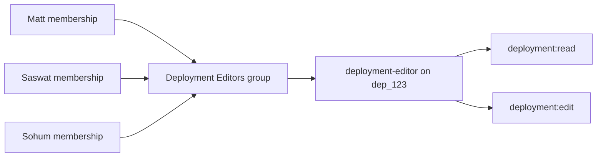
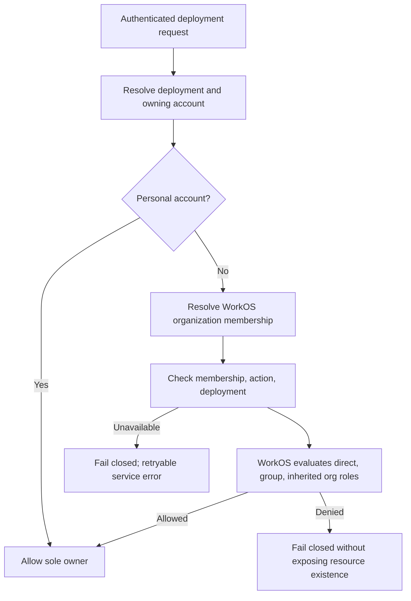
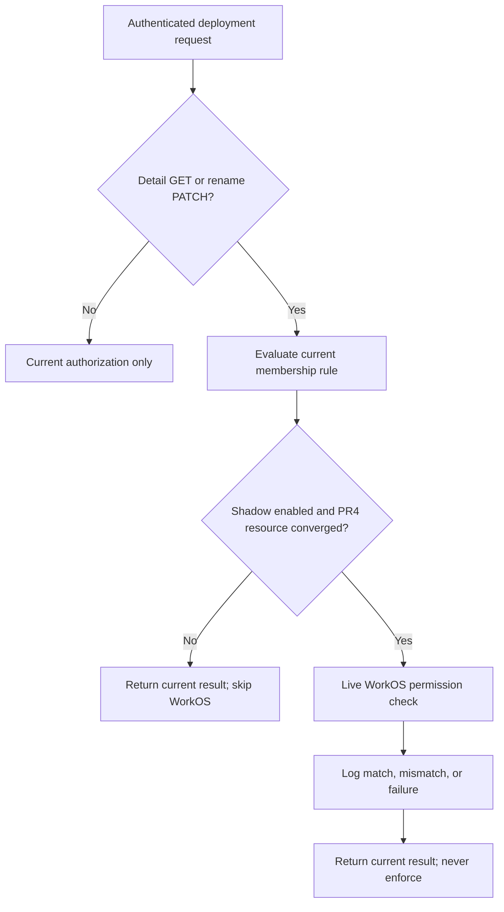

# Deployment FGAC API Rollout

**Status:** Approved direction
**Updated:** 2026-08-07

## Decision

Introduce WorkOS FGA for deployment control-plane access through small, reversible server PRs. The milestone is API-first: every behavior must be proven through Astro API requests in preview before frontend work begins. The deployment UI is a later designer handoff, not part of PRs 1–9.

The first policy has two resource permissions:

- `deployment:read` — read a deployment page and its non-secret control-plane data.
- `deployment:edit` — change or operate a deployment.

Chat and invocation authorization remain separate data-plane concerns. Existing messaging grants are unchanged.

## Final behavior

Each organization deployment is registered as a WorkOS `deployment` resource beneath its organization. WorkOS is authoritative for resource roles and decisions; Astro does not mirror per-deployment readers and editors in its database.

| Subject | View | Edit | Manage access in this milestone |
| --- | --- | --- | --- |
| Organization owner/admin | All organization deployments | All organization deployments | Yes |
| Deployment creator | The deployment they created | The deployment they created | Only if also an organization owner/admin |
| `deployment-editor` assignee | Assigned deployment | Assigned deployment | No |
| `deployment-reader` assignee | Assigned deployment | No | No |
| Unassigned organization member | No after view enforcement | No | No |
| Personal-account owner | Yes | Yes | Not applicable |

A WorkOS group contains organization memberships; it does not contain permissions directly. A role contains permissions, and a group receives that role on a resource:

The initial access-management API allows only organization owners/admins to change assignments. A later permission such as `deployment:manage_access` can allow deployment owners to share access without changing the FGA client primitives.

## Sources of truth

| Data | Authority |
| --- | --- |
| Deployment record, owning account, display name | Astro database |
| `deployed_by` for audit and reconciliation | Astro database |
| Organization membership and WorkOS membership mapping | Astro database synchronized from WorkOS |
| Deployment resource, role assignments, and group membership | WorkOS |
| Resource permission decision | Live WorkOS Authorization API check |

Astro stores no local per-deployment entitlement table. Resource mutations make a live check. A request-local cache may deduplicate identical checks inside one HTTP request; there is no cross-request decision cache initially.

Deployment lists must use WorkOS accessible-resource discovery or batching. They must not perform one network check per deployment.

## WorkOS environment configuration

Configure preview before PR4 makes live writes; repeat in production before production enforcement:

- Resource type `deployment`, parent organization.
- Permission `deployment:read`, scoped to deployment.
- Permission `deployment:edit`, scoped to deployment.
- Role `deployment-reader` containing `deployment:read`.
- Role `deployment-editor` containing `deployment:read` and `deployment:edit`.
- Organization owner/admin roles include both deployment permissions through child-resource inheritance.
- Organization member role includes neither permission for the final private-by-default behavior.

The slugs are external contracts. Repository constants and WorkOS environment configuration must change together.

## PR sequence

### PR1 — Authorization skeleton

Status: merged as PR #1362.

- Define `Action`, `ResourceRef`, `Subject`, and `Checker`.
- Preserve current membership behavior through `MembershipChecker`.
- No WorkOS calls and no behavior change.

### PR2 — WorkOS membership in the session

Status: merged as PR #1383.

- Add `organization_membership_id` to the WorkOS JWT template and Astro session.
- Resolve it from the claim, with synchronized database fallback where appropriate.
- Populate the authorization subject without adding FGA checks.
- Replace the coarse deployment action with the external permission contracts `deployment:read` and `deployment:edit`; `MembershipChecker` still ignores the action.
- Store this rollout plan with the identity prerequisite it coordinates.

### PR3 — Minimal WorkOS FGA client

Status: merged as PR #1891.

- Define the `deployment-reader` and `deployment-editor` role slugs around the permission contracts supplied by PR2.
- Expose resource registration/deletion, role assignment/removal, and permission checking.
- Delegate transport and vendor models to the official WorkOS Authorization SDK.
- Support membership and existing-group role assignments.
- Provide a strict fake and SDK mapping tests.
- Do not wire runtime calls or group lifecycle management.

### PR4 — Deployment resource lifecycle

Status: merged as PR #1895.

- Add `deployments.deployed_by` and capture the authenticated user on deploy.
- After the deployment transaction commits, register organization deployments in WorkOS and assign the creator `deployment-editor`.
- If a current member's creator membership is temporarily unavailable, use bounded fast retries followed by hourly assignment retries; resource lifecycle remains converged and account purge is not blocked. Stop assignment retries when no creator exists or the creator is no longer an organization member.
- Extend the minimal FGA seam with resource-name updates and reconcile deployment renames/redeploy name changes to WorkOS.
- Delete the WorkOS resource when the deployment is deleted; assignment cleanup cascades.
- If the WorkOS organization was already deleted, verify its absence and converge child-resource cleanup so account purge cannot remain blocked.
- Skip WorkOS for personal accounts.
- When WorkOS is disabled, skip lifecycle intent writes and reconciliation jobs so account cleanup cannot be blocked by work that has no processor.
- Do not fail or roll back a successful deployment after an FGA write failure. Record retryable reconciliation work and structured logs.
- Store only desired/applied reconciliation state locally, never deployment role assignments or permission decisions.
- Enqueue immediate reconciliation after commit and have the periodic sweep enqueue the same unique per-deployment jobs, keeping WorkOS mutations serialized.
- Keep first deployment creation membership-gated because the resource does not exist before creation.

### PR5 — FGA checker and shadow decisions

Status: draft as PR #1898.

- Implement `FGAChecker` using the session membership ID and live WorkOS checks.
- Short-circuit personal accounts through the centralized personal-owner rule.
- Deduplicate deployment/account resolution within one request so shadow comparison adds one database lookup, not two.
- Keep `MembershipChecker` enforcing while FGA runs in shadow mode.
- Log structured mismatches with action, route, resource, and subject identifiers.
- Run shadow comparison off the request goroutine with a short timeout and the shared WorkOS client so observation cannot add user-facing WorkOS latency.
- Limit the first sample to deployment detail (`deployment:read`) and rename (`deployment:edit`); all other routes wait for the PR6 action inventory.
- Enable shadow observation per environment with `FGA_SHADOW_ENABLED`; call WorkOS only for deployments whose PR4 registration is converged. Personal, historical, and pending resources remain entirely on legacy authorization.
- Treat an empty membership ID on an organization-scoped session as unavailable identity, not an authorization denial. It can result from a transient session-build resolution failure or production running before the JWT template update; `/auth/me` does not query the database to repair it, while token refresh, switch-org, or re-login does.
- Never alter the HTTP response in shadow mode. A mismatch is evidence for rollout work, not a denial.

### PR6 — Deployment action inventory and expanded shadow coverage

- Write the source-controlled deployment action matrix by reviewing every owner/admin/member API and UI behavior by hand.
- Classify each route as `deployment:read`, `deployment:edit`, another future permission, public/data-plane, or intentionally out of scope.
- Expand shadow coverage only after the route's resource resolution and information-disclosure behavior are understood.
- Add route-coverage tests so a new mutation cannot silently bypass the reviewed catalog.
- Do not backfill historical deployments in this milestone; Preview enforcement remains limited to resources created through PR4.

### PR7 — Server enforcement

- Add deployment-action middleware that resolves the deployment and checks the requested permission.
- Enforce the reviewed `deployment:edit` routes only for allowlisted organizations and FGA-ready deployments created through PR4.
- Add an authenticated capability endpoint for API testing and future clients.
- Fail closed on WorkOS errors; distinguish denial from authorization-service failure internally without exposing resource existence.
- Fail closed on an empty session membership ID with a retryable auth/session-unavailable response, not `403`, so an otherwise valid member can repair the session instead of receiving indefinite denials.
- Enable in preview only after shadow mismatches are understood, then production.
- Keep view behavior unchanged until accessible-resource listing and access assignment APIs exist.
- Authorize before loading deployment details, runtime state, logs, configuration, or observability data. Denied, cross-organization, and nonexistent resources must not become distinguishable existence oracles.

### PR8 — API-only access and group management

This replaces Matt's original frontend PR. No UI is built.

- Add a small WorkOS Groups service beside the FGA interface using the same root SDK client.
- Create/list/update/delete organization groups.
- Add/list/remove organization members using local account-member IDs; Astro resolves WorkOS membership IDs internally.
- List, assign, and remove `deployment-reader` and `deployment-editor` for membership or group subjects.
- Validate that the caller, subject, group, deployment, and WorkOS resource belong to the same organization.
- Restrict access management to organization owners/admins and allowlist the two built-in deployment roles.
- Add accessible-deployment discovery, then enforce `deployment:read` on detail and list APIs without N+1 checks.

Proposed API surface; exact paths follow existing server conventions during implementation:

| Operation | Endpoint shape |
| --- | --- |
| Create/list groups | `POST/GET /accounts/:accountId/access-groups` |
| Update/delete group | `PATCH/DELETE /accounts/:accountId/access-groups/:groupId` |
| Add/list members | `POST/GET /accounts/:accountId/access-groups/:groupId/members` |
| Remove member | `DELETE /accounts/:accountId/access-groups/:groupId/members/:accountMemberId` |
| List assignments | `GET /deployments/:deploymentId/access` |
| Assign role | `POST /deployments/:deploymentId/access` |
| Remove assignment | `DELETE /deployments/:deploymentId/access/:assignmentId` |
| Check capability | `POST /authz/check` |

### PR9 — Preview proof, hardening, and cleanup

- Add contract/integration tests for access APIs, group membership, assignments, discovery, and enforcement.
- Commit a curl/Postman runbook that exercises separate authenticated Sohum, Matt, and Saswat sessions.
- Verify direct, group-derived, inherited-admin, personal-account, cross-organization, revocation, denial, and WorkOS-unavailable cases.
- Remove superseded authorization middleware and JWT-based UI authorization workarounds only after enforcement is stable.
- Finalize operational, rollback, and production-configuration documentation.
- Do not build frontend components.

## Preview acceptance workflow

The milestone is complete when this flow succeeds against Astro APIs in preview:

1. Sohum creates an organization deployment and receives creator editor access.
2. An organization admin creates a group and adds Sohum, Matt, and Saswat by Astro account-member ID.
3. The admin assigns `deployment-editor` to the group on that deployment.
4. Each member can view and edit that deployment using their own authenticated session.
5. The same members cannot access an unassigned deployment unless an inherited organization role allows it.
6. Removing Matt from the group revokes his group-derived access on the next check while Sohum and Saswat remain allowed.
7. Assigning `deployment-reader` permits reads but returns `403` for mutations.
8. Organization owners/admins retain inherited access to every deployment.
9. Cross-organization assignment attempts are rejected before WorkOS is called.

The browser must never call WorkOS directly. Postman and curl call Astro endpoints so the test covers authentication, membership resolution, tenant validation, SDK integration, and enforcement.

## Rollout and rollback

- Preview Dashboard configuration precedes live writes.
- Shadow decisions precede enforcement.
- Edit enforcement precedes view enforcement.
- View enforcement waits for accessible-resource discovery and assignment APIs.
- Disabling deployment FGA enforcement restores the existing membership checker while data and WorkOS assignments remain intact.
- Production configuration and backfill complete before the production flag is enabled.

## Frontend handoff

Frontend work begins only after PR9 acceptance passes. The designer receives documented Astro APIs and capability responses for an Access panel, group membership management, role assignment, and view/edit control states. The frontend never becomes an authorization boundary; every protected server endpoint continues to enforce independently.
