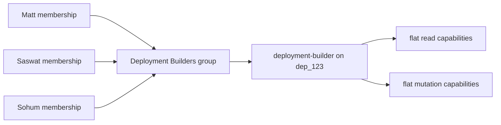
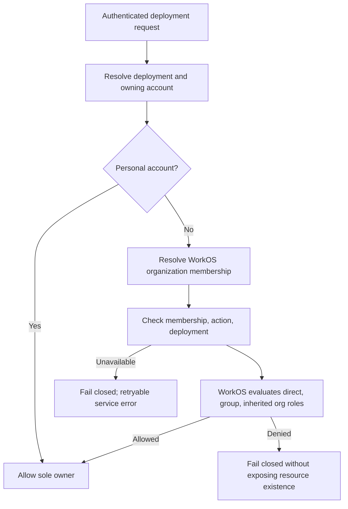
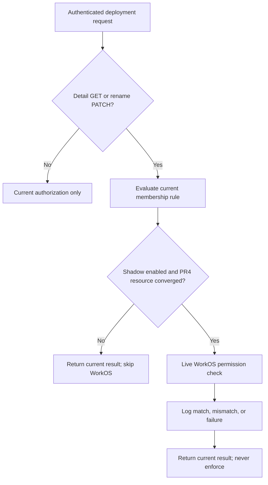
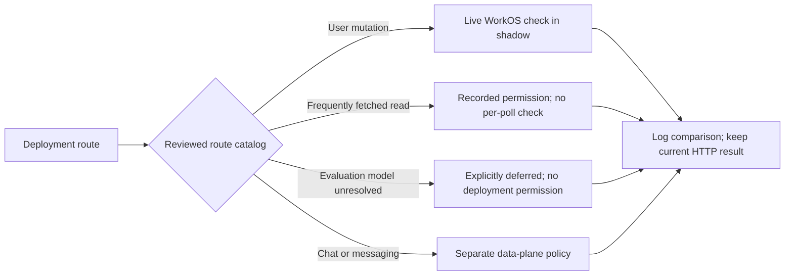
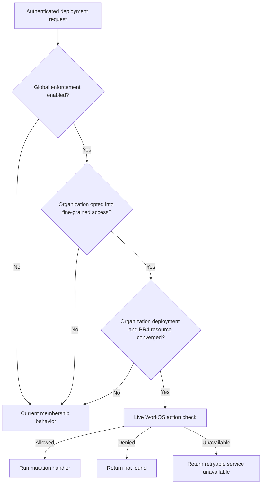

# Deployment FGAC API Rollout

**Status:** Approved direction
**Updated:** 2026-08-14

## Decision

Introduce WorkOS FGA for deployment control-plane access through small, reversible server PRs. The milestone is API-first: every behavior must be proven through Astro API requests in preview before frontend work begins. The deployment UI is a later designer handoff, not part of PRs 1–9.

The first policy uses a small set of practical, actor-neutral capabilities. Permissions represent jobs someone may perform on a deployment, not individual buttons or response fields. The same checks apply to people, groups, bots, agents, the UI, and the CLI.

| Permission | Meaning |
| --- | --- |
| `deployment:read` | Discover a deployment; read its detail, configuration metadata, logs, traces, monitoring, and files; and manage the caller's own alert subscription. Secret values remain redacted. |
| `deployment:edit` | Change deployment-owned content or metadata, including its name, avatar, and files. |
| `deployment:operate` | Run deployment lifecycle operations: redeploy, rollback, restart, stop, resume, cancel, and trigger ingestion. |
| `deployment:delete` | Delete the deployment. |
| `deployment:manage_access` | Invite people and grant or revoke deployment access. |

Permissions do not imply one another. Roles bundle them into product personas: Viewer is read-only, Builder can build and operate without resharing, and Admin controls the deployment and its access. A custom role can use any combination without changing Astro's route policy. Owner remains reserved for the single organization/account owner; it is not a deployment role.

This catalog intentionally avoids one permission per UI control. There is no useful product persona who may restart but not resume, or read monitoring but not logs, in the initial milestone. We add another permission only when a concrete security or product boundary requires independent grants.

Evaluation endpoints are deployment-addressed today, but that URL shape does not prove evaluations are deployment-owned authorization resources. PR6 marks dataset, prediction, review, and judgment routes as model-deferred: they remain on legacy membership authorization and receive no deployment permission until their ownership and sharing model is designed.

The deployment-detail response carries environment metadata and non-secret values. `LoadDecryptedBuildEnv` replaces every secret value with `••••••••` before the response is built; no deployment permission exposes plaintext secrets.

Redeploy and teardown use the body-addressed `POST /deploy` and `POST /undeploy` flows. Signed redeploy attempts and parsed undeploy attempts with a nonempty deployment ID are shadow-checked as `deployment:operate` and `deployment:delete`, including attempts rejected later by legacy authorization or business validation. Malformed requests without an ID are skipped. `deployment:manage_access` remains forward-looking until the access APIs land. `POST /agents/:account/:name/archive` only archives the blueprint and therefore remains an agent-level authorization decision.

Chat and invocation authorization remain separate data-plane concerns. Existing messaging grants are unchanged.

## Final behavior

Each organization deployment is registered as a WorkOS `deployment` resource beneath its organization. WorkOS is authoritative for resource roles and decisions; Astro does not mirror per-deployment assignments in its database.

| Subject | Baseline read | Deployment operations | Manage access in this milestone |
| --- | --- | --- | --- |
| Organization owner/admin | All organization deployments | All deployment permissions | Yes |
| Deployment creator / `deployment-admin` | The deployment they created | Read, edit, operate, and delete | Yes |
| `deployment-builder` assignee | Assigned deployment | Read, edit, operate, and delete | No |
| `deployment-viewer` assignee | Assigned deployment | None | No |
| Unassigned organization member | No after view enforcement | No | No |
| Personal-account owner | Yes | Yes | Not applicable |

A WorkOS group contains organization memberships; it does not contain permissions directly. A role contains permissions, and a group receives that role on a resource:

The initial access-management API requires `deployment:manage_access`. Organization owners/admins inherit it, and the deployment creator receives it through `deployment-admin`.

## Sources of truth

| Data | Authority |
| --- | --- |
| Deployment record, owning account, display name | Astro database |
| `deployed_by` for audit and reconciliation | Astro database |
| Organization membership and WorkOS membership mapping | Astro database synchronized from WorkOS |
| Deployment resource, role assignments, and group membership | WorkOS |
| Resource permission decision | Live WorkOS Authorization API check |

Astro stores no local per-deployment entitlement table. Resource mutations make a live check. A request-local cache may deduplicate identical checks inside one HTTP request; there is no cross-request decision cache initially.

Deployment lists must use WorkOS accessible-resource discovery or batching. They must not perform one network check per deployment.

## WorkOS environment configuration

Configure preview before PR4 makes live writes; repeat in production before production enforcement:

- Resource type `deployment`, parent organization.
- The five permissions in the deployment catalog above, scoped to `deployment`.
- Role `deployment-viewer` containing `deployment:read`.
- Role `deployment-builder` containing `deployment:read`, `deployment:edit`, `deployment:operate`, and `deployment:delete`.
- Role `deployment-admin` containing all five deployment permissions.
- Organization owner/admin roles include every deployment permission through child-resource inheritance.
- Organization member role includes no deployment permissions for private-by-default behavior.

`deployment-admin` replaces the earlier `deployment-owner` slug. WorkOS role slugs are immutable: create Admin before deploying the matching code, keep the unassigned Owner role through the PR8 rollout, then delete it after the complete stack verifies that a new deployment assigns Admin to its creator.

The slugs are external contracts. Repository constants and WorkOS environment configuration must change together.

## PR sequence

### PR1 — Authorization skeleton

Status: merged as PR #1362.

- Define `Action`, `ResourceRef`, `Subject`, and `Checker`.
- Preserve current membership behavior through `MembershipChecker`.
- No WorkOS calls and no behavior change.

### PR2 — WorkOS membership in the session

Status: merged as PR #1383.

- Add `organization_membership_id` to the WorkOS JWT template and Astro session.
- Resolve it from the claim, with synchronized database fallback where appropriate.
- Populate the authorization subject without adding FGA checks.
- Replace the coarse deployment action with the external permission contracts `deployment:read` and `deployment:edit`; `MembershipChecker` still ignores the action.
- Store this rollout plan with the identity prerequisite it coordinates.

### PR3 — Minimal WorkOS FGA client

Status: merged as PR #1891.

- Define the bootstrap `deployment-reader` and `deployment-editor` role slugs around the permission contracts supplied by PR2; PR7.4 replaces them with the final role contract.
- Expose resource registration/deletion, role assignment/removal, and permission checking.
- Delegate transport and vendor models to the official WorkOS Authorization SDK.
- Support membership and existing-group role assignments.
- Provide a strict fake and SDK mapping tests.
- Do not wire runtime calls or group lifecycle management.

### PR4 — Deployment resource lifecycle

Status: merged as PR #1895.

- Add `deployments.deployed_by` and capture the authenticated user on deploy.
- After the deployment transaction commits, register organization deployments in WorkOS and assign the creator the configured creator role (initially `deployment-editor`, replaced by `deployment-admin`).
- If a current member's creator membership is temporarily unavailable, use bounded fast retries followed by hourly assignment retries; resource lifecycle remains converged and account purge is not blocked. Stop assignment retries when no creator exists or the creator is no longer an organization member.
- Extend the minimal FGA seam with resource-name updates and reconcile deployment renames/redeploy name changes to WorkOS.
- Delete the WorkOS resource when the deployment is deleted; assignment cleanup cascades.
- If the WorkOS organization was already deleted, verify its absence and converge child-resource cleanup so account purge cannot remain blocked.
- Skip WorkOS for personal accounts.
- When WorkOS is disabled, skip lifecycle intent writes and reconciliation jobs so account cleanup cannot be blocked by work that has no processor.
- Do not fail or roll back a successful deployment after an FGA write failure. Record retryable reconciliation work and structured logs.
- Store only desired/applied reconciliation state locally, never deployment role assignments or permission decisions.
- Enqueue immediate reconciliation after commit and have the periodic sweep enqueue the same unique per-deployment jobs, keeping WorkOS mutations serialized.
- Keep first deployment creation membership-gated because the resource does not exist before creation.

### PR5 — FGA checker and shadow decisions

Status: merged as PR #1898.

- Implement `FGAChecker` using the session membership ID and live WorkOS checks.
- Short-circuit personal accounts through the centralized personal-owner rule.
- Deduplicate deployment/account resolution within one request so shadow comparison adds one database lookup, not two.
- Keep `MembershipChecker` enforcing while FGA runs in shadow mode.
- Log structured mismatches with action, route, resource, and subject identifiers.
- Run shadow comparison off the request goroutine with a short timeout and the shared WorkOS client so observation cannot add user-facing WorkOS latency.
- Limit the first sample to deployment detail and rename using the bootstrap `deployment:read` and `deployment:edit` actions; PR6 refines the read boundary before enforcement.
- Enable shadow observation per environment with `FGA_SHADOW_ENABLED`; call WorkOS only for deployments whose PR4 registration is converged. Personal, historical, and pending resources remain entirely on legacy authorization.
- Treat an empty membership ID on an organization-scoped session as unavailable identity, not an authorization denial. It can result from a transient session-build resolution failure or production running before the JWT template update; `/auth/me` does not query the database to repair it, while token refresh, switch-org, or re-login does.
- Never alter the HTTP response in shadow mode. A mismatch is evidence for rollout work, not a denial.

### PR6 — Deployment action inventory and expanded shadow coverage

- Define five flat, actor-neutral deployment capabilities: read, edit, operate, delete, and manage access. Avoid permissions for individual buttons until a concrete product boundary requires one.
- Register every deployment-ID server route with one control-plane permission, an explicit chat/messaging data-plane classification, or a model-deferred classification; there is no separate route-policy map to drift.
- Keep evaluation routes on legacy membership authorization until their resource ownership and sharing model is established; do not send a deployment permission to WorkOS for them.
- Shadow-check user-triggered mutations as edit, operate, or delete. Keep frequently fetched reads cataloged but deferred so polling cannot create one WorkOS request per refresh.
- Shadow-check signed body-addressed redeploy and parsed undeploy attempts as operate and delete once the request supplies a nonempty deployment ID, including attempts rejected later by the handler.
- Validate the live Gin router at startup so any deployment-ID route without a policy, or any policy without a live route, prevents the server from starting.
- Preserve the PR5 timeout, concurrency limit, panic recovery, eligibility gate, and legacy HTTP behavior. This PR still returns no FGA-driven `403` responses.
- Do not backfill historical deployments in this milestone; Preview enforcement remains limited to resources created through PR4.

### PR7.1 — Effective deployment capabilities

- Add `GET /api/v1/deployments/:id/capabilities` without changing authorization behavior on any existing endpoint.
- Return all five effective deployment permissions from one live WorkOS effective-permissions request. This becomes the server contract that future UI, CLI, bot, and API clients use to show or hide actions.
- Require current account membership before exposing capabilities, then confirm the JWT organization matches the deployment's WorkOS organization before the live request. Cross-organization memberships are concealed locally and never sent to WorkOS.
- Use the PR5 shadow flag and PR4 resource-convergence gate. When the live FGA path is inactive, return legacy member capabilities explicitly as `mode: legacy`.
- Require baseline `deployment:read` in FGA mode; otherwise conceal the deployment as not found.
- Record membership-versus-FGA comparisons for each returned capability without caching the authorization result between requests.

### PR7.2 — Organization FGA opt-in

- Persist a server-owned, organization-scoped `fine_grained_access` experiment. A browser-local flag is not an authorization boundary.
- Add audited owner/admin APIs and an organization Settings → Experiments toggle beneath Audit Log.
- Keep shadow checks active for every PR4-converged Preview deployment. The organization opt-in controls live capability mode and later enforcement, not lifecycle synchronization or shadow evidence.
- Adopt private-by-default deployment access: organization owners/admins inherit access, creators receive the deployment-admin role, and ordinary members receive nothing until assigned directly or through a group.
- Do not backfill from the toggle. Historical Preview deployments remain legacy until the post-PR9 backfill converges.

### PR7.3 — Staged mutation enforcement

- Add `FGA_ENFORCEMENT_ENABLED` as the environment kill switch. A live enforcement path also requires a configured WorkOS client and a PR4-converged organization deployment.
- Require the organization `fine_grained_access` experiment in addition to the environment switch. Turning the experiment off immediately restores legacy authorization while preserving WorkOS resources and shadow checks.
- Synchronize current organization members into `account_member_workos` before enabling the organization experiment; missing WorkOS membership identity fails closed. The environment switch may be enabled earlier while the organization remains opted out.
- Add deployment-action middleware that checks the PR6 route catalog's permission. Enforce edit, operate, and delete—including body-addressed redeploy and undeploy—plus read-gated alert subscriptions; personal, historical, and unconverged resources stay on legacy authorization.
- Keep model-deferred evaluation routes on legacy membership authorization. They carry no deployment permission and are not included in deployment capabilities or enforcement.
- Fail closed on WorkOS errors; distinguish denial from authorization-service failure internally without exposing resource existence.
- Fail closed on an empty session membership ID with a retryable auth/session-unavailable response, not `403`, so an otherwise valid member can repair the session instead of receiving indefinite denials.
- Keep deployment reads on legacy enforcement until accessible-resource listing and access assignment APIs exist.
- Return the same not-found response for a denied or nonexistent mutation. Authorization-service and missing-session-identity failures return a retryable unavailable response before the handler performs the mutation.
- Deploy with enforcement off in production and on in Preview. Disabling the flag restores legacy behavior without removing WorkOS resources or assignments.

### PR7.4 — Deployment role contract

- Replace the bootstrap reader/editor roles with the final Viewer, Builder, and Admin bundles.
- Assign `deployment-admin` to new deployment creators so they can manage access to that deployment.
- Keep permissions flat and unchanged; enforcement continues to check permissions rather than role names.
- Leave repair of previously synchronized deployments to the idempotent PR9 backfill.

### PR8.1 — Access SDK primitives

- Add focused contracts for resource-role assignments and accessible-resource discovery.
- Implement the contracts with the shared official WorkOS SDK client and strict test fakes.
- Rename the creator role to `deployment-admin`; WorkOS remains authoritative for role permission bundles.
- Add no routes or authorization behavior.

### PR8.2 — Read visibility and discovery

- Use WorkOS resource discovery to return only deployments for which the current membership has `deployment:read`.
- Resolve and cache each WorkOS organization's immutable authorization-root resource ID, then scope discovery with that `parent_resource_id`.
- Enforce the same boundary on every cataloged deployment control-plane read so hidden deployments cannot be opened by URL or recovered through status, files, logs, observability, configuration, network, or summary endpoints.
- Avoid one WorkOS check per deployment; discover accessible resource IDs once and filter Astro's database result.
- Coalesce concurrent discovery for the same membership and organization behind one bounded WorkOS lookup that is independent of the initiating HTTP request's cancellation.
- Run discovery before list-cache lookup and include the live authorization set in the cache identity so revocation cannot reuse another permission state's cached cards.
- Keep model-owned evaluation routes and chat/messaging data-plane routes on their explicitly separate authorization paths; `deployment:read` is not silently made their final policy here.
- Preserve current behavior for personal accounts, opted-out organizations, and the global kill switch.
- Preserve legacy visibility for historical deployments without a lifecycle row until backfill. Once a deployment enters the lifecycle ledger, pending synchronization fails closed instead of briefly exposing it through organization membership.
- Follow up by authorizing revision history through the currently active deployment's `deployment:read` capability. Return not found when no active deployment exists instead of introducing discovery for deleted WorkOS resources.

### PR8.3A — Deployment access domain

- Define the allowlisted Viewer, Builder, and Admin access-level catalog.
- Add the transport-independent service for listing built-in roles and recording versioned desired-role changes for organization members.
- Validate that the subject, deployment, and WorkOS resource belong to the same organization.
- Reconcile desired state asynchronously with retry history and a repair sweep; the newest version wins and WorkOS remains authoritative for effective access.
- Add no HTTP routes or enforcement changes.

### PR8.3B — Deployment access HTTP APIs

- Expose list, set, and remove operations through Astro's deployment API.
- Require `deployment:manage_access`, preserve private-by-default errors, and audit mutations.
- Return direct and group-derived assignment sources plus pending, retrying, and synced desired-role state; mutations return `202 Accepted`.
- Keep the browser on Astro APIs; request handlers never hold database locks across WorkOS calls.

### PR8.4 — Organization group APIs

- Add the focused WorkOS Groups contract and cursor-safe pagination beside its first API consumer.
- Create, list, update, and delete organization groups.
- Add, list, and remove organization members using local account-member IDs; Astro resolves WorkOS membership IDs internally.
- Apply the same tenant validation and FGA kill-switch behavior as deployment access APIs.

Proposed PR8.3/8.4 API surface; exact paths follow existing server conventions during implementation:

| Operation | Endpoint shape |
| --- | --- |
| Create/list groups | `POST/GET /accounts/:accountId/access-groups` |
| Update/delete group | `PATCH/DELETE /accounts/:accountId/access-groups/:groupId` |
| Add/list members | `POST/GET /accounts/:accountId/access-groups/:groupId/members` |
| Remove member | `DELETE /accounts/:accountId/access-groups/:groupId/members/:accountMemberId` |
| List assignments | `GET /deployments/:deploymentId/access` |
| Set built-in role | `PUT /deployments/:deploymentId/access` |
| Remove built-in role | `DELETE /deployments/:deploymentId/access/:subjectType/:subjectId` |
| Check capability | `POST /authz/check` |

### PR8.5 — Queen FGA inspector

- Add a read-only internal Queen view scoped to one organization.
- Show every organization deployment, every organization member, organization roles, and effective deployment roles.
- Distinguish direct, group-derived, and organization-inherited access so operators can explain why a member is allowed.
- Resolve data through Astro's admin backend; Queen does not call WorkOS directly and does not mutate assignments in this PR.

### PR9 — Preview proof, hardening, and cleanup

- Add contract/integration tests for access APIs, group membership, assignments, discovery, and enforcement.
- Commit a curl/Postman runbook that exercises separate authenticated Sohum, Matt, and Saswat sessions.
- Verify direct, group-derived, inherited-admin, personal-account, cross-organization, revocation, denial, and WorkOS-unavailable cases.
- Remove superseded authorization middleware and JWT-based UI authorization workarounds only after enforcement is stable.
- Add `docs/03-architecture/fine-grained-access-control.md` as the permanent system architecture: sources of truth, resource hierarchy, permissions/roles/groups, resource lifecycle, request and capability flows, tenant isolation, failure behavior, access APIs, rollout, and the extension pattern for blueprints and knowledge stores. Include the corresponding Mermaid diagrams.
- Update `docs/03-architecture/organizations.md` to link to the permanent FGA architecture and replace its transitional deployment-permission note once Preview proof passes.
- Finalize the operational runbook, rollback plan, and production configuration.
- Do not build frontend components.

## Preview acceptance workflow

The milestone is complete when this flow succeeds against Astro APIs in preview:

1. Sohum creates an organization deployment and receives deployment-admin access.
2. An organization admin creates a group and adds Sohum, Matt, and Saswat by Astro account-member ID.
3. The deployment admin assigns `deployment-builder` to the group on that deployment.
4. Each member can view and edit that deployment using their own authenticated session.
5. The same members cannot access an unassigned deployment unless an inherited organization role allows it.
6. Removing Matt from the group revokes his group-derived access on the next check while Sohum and Saswat remain allowed.
7. Assigning `deployment-viewer` permits deployment reads but conceals denied edit, operate, delete, and manage-access actions as `404`. Evaluation behavior remains unchanged until its authorization model is designed.
8. Organization owners/admins retain inherited access to every deployment.
9. Cross-organization assignment attempts are rejected before WorkOS is called.

The browser must never call WorkOS directly. Postman and curl call Astro endpoints so the test covers authentication, membership resolution, tenant validation, SDK integration, and enforcement.

## Rollout and rollback

- Preview Dashboard configuration precedes live writes.
- Shadow decisions precede enforcement.
- Edit enforcement precedes view enforcement.
- View enforcement waits for accessible-resource discovery and assignment APIs.
- Disabling deployment FGA enforcement restores the existing membership checker while data and WorkOS assignments remain intact.
- Production configuration and backfill complete before the production flag is enabled.

## Frontend handoff

Frontend work begins only after PR9 acceptance passes. The designer receives documented Astro APIs and capability responses for an Access panel, group membership management, role assignment, and action-specific control states. The frontend never becomes an authorization boundary; every protected server endpoint continues to enforce independently.
