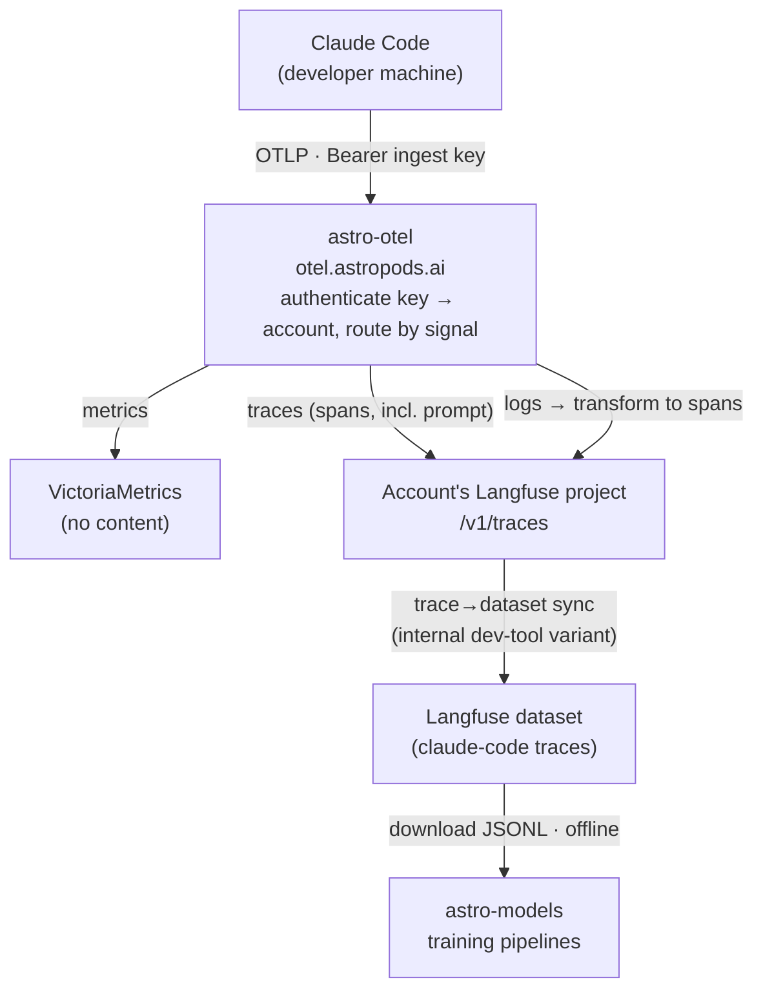
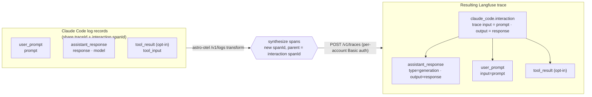

# Dev-Tool Prompt Collection

## Summary

Astro captures usage telemetry (metrics, traces) from local AI coding tools. This feature additionally captures the **verbatim prompt and response content** of Claude Code sessions into each account's Langfuse project, to build a corpus for **model training and fine-tuning** (consumed offline by the `astro-models` pipelines). It is collection-only: the content is not exposed as a distinct product surface.

The prompt/response pair rides Claude Code's OTLP **logs** signal, but Langfuse only ingests **traces**. So astro-otel gains a `/v1/logs` receiver that **transforms** the content-bearing log records into spans and forwards them to Langfuse's existing `/v1/traces` endpoint. The content lands as observations in the same trace the prompt already belongs to.

## Scope

**Collect:** user prompts and assistant responses — input/output pairs — from Claude Code. Tool inputs/outputs are an opt-in (off by default; see [Configuration UI](#configuration-ui)). Raw API bodies stay off (`OTEL_LOG_RAW_API_BODIES` unset).

**Not in scope:** a UI or query surface over the collected content; tools other than Claude Code (the design generalizes; only Claude Code is wired).

Legal terms cover this collection.

## Architecture

Tenancy and identity are unchanged from the existing pipeline: the account is resolved from the ingest key; Claude Code attaches per-developer identity (`user.email`, `session.id`, `organization.id`) to each record.

## Signal coverage

Claude Code emits prompt-related content on two signals, but only the logs signal carries the full input/output pair. This is why the corpus is sourced from logs rather than reused from the traces already flowing to Langfuse:

| Content | On the trace | On the logs |
|---|---|---|
| User prompt (input) | `user_prompt` attribute on the `interaction` span | `user_prompt` event (`prompt`) |
| Assistant response (output) | **never emitted on any span** | `assistant_response` event (`response`) |
| Tool inputs (opt-in) | tool-span attributes (e.g. `file_path`) | `tool_result` event (`tool_input`) |
| Tool outputs (opt-in) | `tool.output` span events (needs `OTEL_LOG_TOOL_CONTENT`) | — |

The response is **logs-only by design** — verified empirically: no env var relocates it onto a span. So input/output pairs are obtainable only from the logs signal, which is why the transform below exists. Prompt values are gated by `OTEL_LOG_USER_PROMPTS`, response values by `OTEL_LOG_ASSISTANT_RESPONSES` (falls back to `OTEL_LOG_USER_PROMPTS` when unset); content over `CLAUDE_CODE_OTEL_CONTENT_MAX_LENGTH` (~60 KB default) is truncated.

## Bridge: logs → spans

Langfuse's OTLP surface is `/v1/traces` (real ingest → observations) and a no-op `/v1/metrics`; there is **no `/v1/logs` endpoint**. The response we need therefore cannot be forwarded as-is — it must be reshaped into a span. Two facts make this stateless:

1. Every `user_prompt` / `assistant_response` / `tool_result` log record carries the interaction's **`traceId` and `spanId`** inline, so a synthesized span drops into the exact trace the prompt already lives in — no cross-record join, no buffering.
2. Langfuse's ingestion checks its **native `langfuse.*` attributes first**, so setting them directly maps content to observation input/output/type without mimicking any framework convention.

### Langfuse ingestion contract

The transform sets these attributes on each synthesized span (verified against `OtelIngestionProcessor` / `attributes.ts` / `ObservationTypeMapper`):

| Purpose | Attribute | Value |
|---|---|---|
| Observation type | `langfuse.observation.type` | `generation` (→ GENERATION), else `span` |
| Observation input | `langfuse.observation.input` | prompt text |
| Observation output | `langfuse.observation.output` | response text |
| Model | `langfuse.observation.model.name` | e.g. `claude-haiku-4-5` |
| Usage (optional) | `langfuse.observation.usage_details` | token counts |
| Trace input / output | `langfuse.trace.input` / `.output` | prompt / response (promotes the pair to trace level) |
| User / session | `langfuse.user.id` / `langfuse.session.id` | `user.email` / `session.id` |
| Tags | `langfuse.trace.tags` | `["claude-code"]` |

Because `assistant_response.spanId` equals the interaction span's `spanId`, an alternative shape reuses that same `traceId`+`spanId` so Langfuse **merges** the response into the existing interaction observation (one generation carrying both input and output). This depends on observation upsert being field-level merge — an [open item](#open-items) to confirm before choosing between the child-observation and merge shapes.

## Ingest: `POST /v1/logs` (astro-otel)

A new handler in `apps/astro-otel/internal/ingest`, alongside the traces handler:

1. Authenticate the ingest key → account; `touch` last-used off the hot path.
2. Unmarshal `ExportLogsServiceRequest`.
3. For each content-bearing record (`user_prompt`, `assistant_response`, `tool_result` when present), synthesize a span: reuse the record's `traceId`, set `parentSpanId` to the record's `spanId`, generate a fresh `spanId`, and stamp the [ingestion-contract](#langfuse-ingestion-contract) attributes plus `astro.account_id` / `astro.source=claude-code`.
4. Marshal the synthesized spans as an `ExportTraceServiceRequest` and forward to the account's Langfuse **`/v1/traces`** (Langfuse accepts JSON) with the per-account Basic credentials already resolved for the traces leg. No Langfuse project → ack and drop (parity with traces).
5. Ack on success; 5xx on forward failure so the exporter retries.

Records that carry no content (redacted, i.e. source flags off) produce no span.

## Enablement (source configuration)

Prompt/response content rides Claude Code's logs signal, which the base telemetry block (metrics + traces) does not enable. Collection is opt-in, driven by toggles in the key-creation UI that append to the generated managed-settings block:

- **Collect user prompts** → `OTEL_LOGS_EXPORTER = otlp`, `OTEL_LOG_USER_PROMPTS = 1` — verbatim prompt on `user_prompt` (and the `interaction` span) and, via fallback, response on `assistant_response`; without it these carry only lengths.
- **Store tool calls** → `OTEL_LOGS_EXPORTER = otlp`, `OTEL_LOG_TOOL_DETAILS = 1` — tool input args on `tool_result` events (sizes only when off). Full tool *output* additionally needs `OTEL_LOG_TOOL_CONTENT`; out of scope by default.

The logs-exporter line is emitted when either toggle is on; `OTEL_LOG_RAW_API_BODIES` is never set.

**Rollout.** The env lives in each enterprise's Anthropic admin console and cannot be pushed from Astro; the generated block applies to new key creations, and existing instrumented accounts have their admin re-paste it. Claude Code reads these settings at session start, so developers pick up the change on their next session.

### Configuration UI

The key-creation dialog (`ApiKeysSettings.tsx`) — where the block and the one-time secret are shown — gains two toggles above the block: **Collect user prompts** and **Store tool calls**, both off by default. Ticking a toggle live-regenerates the copyable block; `managedSettingsBlock()` takes the toggle state and conditionally appends the logs lines.

The toggles are a copy-helper that shapes the pasted text, not a live control: the effective setting is the forced env in the customer's Anthropic console, which Astro cannot read or change, so the selection is neither persisted nor enforced server-side. Each toggle states what it collects so the choice is explicit.

No server change accompanies the UI — the astro-otel `/v1/logs` handler transforms whatever content the source emits, so enabling tool calls needs only the added source flag.

## Storage: Langfuse

Content lands in the account's existing Langfuse project — the same one the trace signal targets — as observations under the interaction trace. No new store is provisioned. The prompt reaches Langfuse two ways (the real interaction span, plus `langfuse.trace.input` on the synthesized span); the response arrives only via the transform.

Retention on the dev-tools project is set for a training corpus (long/unbounded), independent of operational-observability retention.

## Training access

Training uses a **dedicated internal variant of the trace→dataset pipeline**, modeled on the eval pipeline ([eval-infrastructure.md](../05-implementation/eval-infrastructure.md)) rather than extending it. It reuses the same building blocks — the Langfuse dataset client methods (`CreateDataset`, `UpsertDatasetItem`, `GetDatasetItems`), per-trace item upsert with deterministic ids, and JSONL download.

The item mapping carries over unchanged: read traces with `fields=core,io`, write `input = trace.input` (prompt), `expectedOutput = trace.output` (response), `sourceTraceId = trace.id`. The [transform](#langfuse-ingestion-contract) already sets `langfuse.trace.input`/`.output`, so each dev-tool interaction trace becomes one prompt/response dataset item.

Where the variant differs from the eval pipeline:
- **Scope** — keyed per account (and per `astro.source`), synced from the account's `tags=claude-code` traces, not per deployment (`dep-{id}`).
- **Provisioning** — no deployment lifecycle to hook; the dataset is created on first sync for accounts with dev-tool content.

`astro-models` trains from the downloaded JSONL (one prompt/response pair per line).

## Testing

- **Transform:** given `ExportLogsServiceRequest` fixtures, assert synthesized spans reuse `traceId`, parent to the interaction `spanId`, and carry the ingestion-contract attributes; redacted records produce no span.
- **Handler:** auth failure; `astro.*` and tags stamped; identity mapped to `langfuse.user.id` / `langfuse.session.id`; forwarded to Langfuse `/v1/traces` with per-account auth; ack on success, 5xx on forward failure so the exporter retries; no-project account acks and drops.
- **Integration:** against a local Langfuse, confirm a `user_prompt` + `assistant_response` batch renders as an interaction trace with input/output populated (settles the merge-vs-child shape).

## Work breakdown

1. **Ingest & transform** — `/v1/logs` handler: log-record→span mapper, ingestion-contract attributes, Langfuse `/v1/traces` forward, tests (astro-otel).
2. **Source config & UI** — key-creation toggles (collect prompts, store tool calls) driving `managedSettingsBlock()`, plus the observability-spec block update (astro-client).
3. **Retention** — set the dev-tools Langfuse project's retention for corpus use.
4. **Training access** — build the internal dev-tool trace→dataset pipeline variant (account-scoped, `tags=claude-code`), reusing the eval dataset client + JSONL download; `astro-models` trains from the downloaded JSONL.
5. **Rollout** — customer comms to re-paste managed settings; verify content lands per account.

## Key decisions

- **Store in Langfuse via transform, not passthrough.** Langfuse ingests only traces, so the logs signal is reshaped into spans and forwarded to `/v1/traces`. Reuses the account's provisioned project and per-account routing — no separate store to build or operate.
- **Internal trace→dataset pipeline variant.** The corpus is built by a dedicated dev-tool sync modeled on the eval pipeline (account-scoped, `claude-code` traces), reusing its dataset client + JSONL download but not the deployment-keyed pipeline. Our trace-level input/output map onto dataset items directly — no new export path, no Langfuse-internal coupling.
- **Collect from the logs signal.** The assistant response is logs-only by design (no span carries it), so the logs receiver is mandatory, not a convenience.
- **Stateless transform.** Log records carry the interaction's trace context inline, so spans are synthesized per record without joining or buffering.
- **Prompts + responses, not tool bodies.** Input/output pairs are the training target; tool I/O and raw API bodies stay off at the source.
- **Offline dataset download.** Training is offline; the corpus is consumed as a downloaded JSONL dataset per run, so no live query path is built.
- **Content collection is opt-in.** The base block stays metadata-only; prompt and tool-call content default off — nothing is collected until an admin turns it on.

## Open items

- **Observation upsert semantics.** Whether Langfuse merges observation updates field-by-field (null-safe) decides between the single-merged-generation shape and the child-observation shape. Confirm against a local Langfuse.
- **Usage tokens.** Token counts live on the `api_request` record, not `assistant_response`; join them by `prompt.id` within the batch if usage on the generation is wanted, else omit.

## Future

- **Other tools.** Content is keyed by `astro.source`; adding Codex etc. is additive (the change is source derivation — `stampIdentity` currently sets `claude-code`).
- **Curation.** Beyond the full-corpus dataset, higher-quality training subsets (filtered by model, session length, score) can be curated as separate datasets from the same traces.
