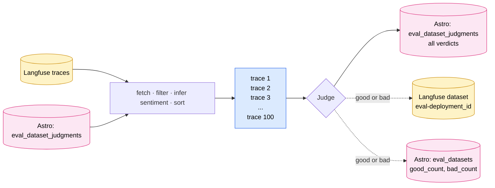

# Eval Dataset Spec v2 — Judged Datasets

Supersedes v1 at `docs/05-implementation/eval-infrastructure.md`.

## What was wrong with v1

The v1 eval infrastructure built each deployment's dataset by piping every production trace's `input`/`output` straight in, with `expectedOutput = trace.output`. A nightly River job kept it growing. On paper this gave us a "regression dataset" for free; in practice the dataset was unusable for evals because:

- **No quality signal.** The "expected output" was just whatever the agent happened to produce. Nothing, and no one, ever vetted that output as correct for its input. The dataset is a mirror of historical behavior, not a target.
- **Bad rows survive.** A wrong answer, a confused answer, or a half-broken response goes into the dataset on equal footing with a great one. Any eval we later ran against this baseline would flag a *different* output as a regression, even when the original was already wrong.
- **The baseline drifts with the agent.** Because every new trace becomes a new "expected output," the dataset moves under your feet as the agent changes. There is no fixed truth to regress against.
- **No curation step.** Hundreds of traces a day flow in unfiltered. The dataset grows monotonically; nobody ever decides what belongs.

## Summary

v2 rebuilds each deployment's Langfuse dataset from human-labeled judgments instead of auto-populating it from raw traces. The mechanics:

1. **Sentiment (inferred, not collected).** For each candidate trace, the queue reads the next user message in the same session (a Slack thread, a web conversation, etc.) and runs a small keyword heuristic on it ("thanks", "perfect" → positive; "no", "wrong", "bad" → negative). Any clear reaction (positive or negative) counts as a signal. Anything else (no reply yet, a follow-up question, an off-topic message) counts as "no signal." Signal lives only as a sort hint at queue-read time; nothing is written to Langfuse, nothing persisted.
2. **Judgment.** The per-deployment Eval tab becomes a judgment queue of the 100 most recent **unjudged** traces. Traces with any reaction signal (positive or negative) float to the top; traces with no signal fall to recency order at the bottom. A reviewer marks each `good`, `bad`, or `i don't know`. `good`/`bad` produce a Langfuse dataset item with `metadata.verdict = ±1` and `metadata.confidence = 100`. `i don't know` records the trace as judged so it leaves the queue, but writes no dataset item. Any verdict, including `i don't know`, is final; the trace will not reappear.

The dataset's quality rolls up into a single A–F grade visible on the Eval tab.

## Why this matters

The v2 dataset is a stepping stone, not the destination. The arc:

**Now (this spec).** A regression dataset is only useful if every row carries a real quality signal. Every agent is different, and only the deployment owner knows what "good" looks like for theirs. v2 rebuilds the dataset from human labels so every row is there because a person who knows the agent looked at it and said yes or no.

**Next.** Once the human-labeled baseline is broad enough, we use it as training / few-shot context for an LLM judge that auto-labels incoming traces. Same write path: `metadata.verdict = ±1`, but with `source = "llm_judge"` and `confidence < 100`. The judge is only as trustworthy as the labels it learned from, which is why the human-labeled step has to come first; skipping it calibrates the judge against noise.

**Eventually.** Once the dataset is both broad (auto-labeled by the LLM judge) and trustworthy (human-anchored), it becomes the regression harness: we run prompt changes, model swaps, and agent refactors against it and watch the pass rate. That is the eventual point of having a dataset at all.

This spec covers only the **now** step. The later steps reuse the same storage, write paths, and grade computation. Only the producer of `metadata.verdict` changes.

---

## Flow at a glance



---

## v1 teardown

The v1 periodic sync worker is removed entirely — both the `DatasetSyncSchedulerArgs` registration in `apps/astro-server/internal/riverqueue/periodic.go` and the workers in `apps/astro-server/internal/riverqueue/dataset_sync.go`. Once shipped, nothing is writing to the existing `dep-{deployment_id}` datasets.

From v2 forward the dataset-name convention is `eval-{deployment_id}`. New deployments get an `eval-*` dataset at deploy time via the existing `DeployWorker.provisionDataset` flow. Existing rows still pointing at `dep-*` self-heal: when the judgment handler writes the first item for that deployment, it calls a small `ensureEvalDataset` helper that creates the `eval-{id}` Langfuse dataset (idempotent) and updates the local row to the new name. Read paths don't heal — they trust whatever the row stores.

The old `dep-*` Langfuse datasets sit untouched after this lands. Cleanup can happen manually in the Langfuse UI whenever convenient.

---

## Inferring sentiment

The signal we want is "did the user react to this trace at all?" Used only to order the judgment queue (any reaction → top, no reaction → recency-only at the bottom). It does not label the trace; the human still does that.

All of this runs in astro-server. The frontend hits `GET /eval/queue` and gets ready-to-render rows with a `sentiment` field already populated.

### Where the signal comes from

Every messaging adapter (Slack, web, and any future adapter) sets `conversationID` per session, and the agent SDK propagates it to `langfuse.session.id` on every span (see `modules/adapters/packages/mastra/` and `modules/adapters/packages/langchain/`). For Slack this is `channel-thread_ts`; for the web adapter it's the conversation id from `POST /api/conversations`. Either way, all traces in one conversation share a `sessionId` in Langfuse.

For a candidate trace at index `i` in session `S`, the "next message" is the *input* of trace `i+1` in the same session, in chronological order: the next thing the user said in that conversation.

### How the page becomes session-grouped

`GetTraces` orders by `createdAt desc` across the deployment, so traces from different sessions are interleaved in the response, not contiguous by session. The queue handler reshapes the page in memory before scoring:

1. Fetch one wide page of recent traces (default 200, configurable) ordered by `createdAt desc`. Single Langfuse call.
2. Group the page by `sessionId` into a map of session → trace list.
3. Within each session, sort by `createdAt asc` so each list reads as a clean conversation timeline.
4. For each trace at position `i` in its session, run the sentiment heuristic on `traces[i+1].input` and tag the candidate row.

No extra Langfuse calls; the grouping is a local pass over the result of the original fetch.

### Keyword heuristic

Inputs are lower-cased, trimmed, and matched against two word-boundary keyword sets:

- **Positive:** `thanks, thank you, thx, perfect, great, awesome, helpful, interesting, nice, exactly, correct, right, yes`
- **Negative:** `no, wrong, bad, incorrect, unhelpful, useless, stop, nope`

If either set matches, the trace is tagged with sentiment (positive or negative — used only by the UI chip; the sort treats any matched trace as one bucket regardless of sign). If neither matches, or there is no next trace in the page, no signal.

This is crude on purpose. Known noise:

- **False positive:** "thanks for nothing" → matches `thanks` → flagged as reaction.
- **False negative:** "ugh, this output is terrible" → no listed keyword → no signal.
- **Clarifying questions:** "wait, what's the high?" → no signal; that's actually correct, it isn't feedback on the prior answer.

The noise is tolerable because the heuristic only sets sort order. A misclassified row still gets the same three-button decision from the reviewer; we just showed it slightly earlier or later than ideal.

### Next step: swap to an LLM call

When keyword noise starts hurting the reviewer's throughput, the natural follow-up is to swap the keyword heuristic for a single small LLM call per candidate.

---

## Judgment data model

One new table. Its primary job is to let the queue exclude traces that have already been judged; carrying the verdict alongside is cheap and keeps the "re-surface i-don't-knows" extension reachable without a future migration.

**`eval_dataset_judgments`** holds one row per (eval dataset, trace) that has received any verdict, including `i don't know`.

| Column | Type | Notes |
|---|---|---|
| `eval_dataset_id` | uuid | PK1, FK → eval_datasets |
| `trace_id` | text | PK2 |
| `verdict` | text | `good` \| `bad` \| `unknown`. Audit purposes only. |
| `created_at` | timestamptz | default `now()` |

Index: PK alone is enough. Every lookup is `WHERE eval_dataset_id = ? AND trace_id IN (...)` or `WHERE eval_dataset_id = ?`. A future "show me the unknowns" query is a cheap `WHERE eval_dataset_id = ? AND verdict = 'unknown'`, no extra index needed at the volumes we're targeting.

**`eval_datasets` column changes.** Drop sync-era state (`item_count`, `last_trace_at`, `last_sync_attempted_at`, `last_synced_at`); add `good_count`, `bad_count`. The API still returns `item_count`, derived from `good_count + bad_count`.

---

## Langfuse dataset items

For every `good` / `bad` judgment, the handler writes one item to the deployment's Langfuse dataset (`eval-{deployment_id}`) via `POST /api/public/dataset-items`. This is the only place the verdict and audit data are persisted; there is no local mirror. The write happens synchronously inside the judgment handler (no River job, no queue) so the grade refreshes immediately after the click.

This is **not** a local Postgres table. It is the JSON body shape sent to Langfuse:

| Field | Value |
|---|---|
| `id` | `sha256(datasetName, traceId)` |
| `datasetName` | `eval-{deployment_id}` |
| `input` | `trace.input` |
| `expectedOutput` | `trace.output` |
| `sourceTraceID` | `trace.id` |
| `metadata.verdict` | `1` (good) \| `-1` (bad) |
| `metadata.confidence` | `100` (human signed off) |
| `metadata.judged_by_user_id` | astro user id |

The download endpoint (`GET /dataset/download`) reads these back from Langfuse and streams them as JSONL.

---

## Server API

| Method | Path | Purpose |
|---|---|---|
| `GET` | `/api/v1/deployments/:id/eval/queue` | Top 100 unjudged traces, sentiment-first then recency. |
| `POST` | `/api/v1/deployments/:id/eval/judge` | Submit a verdict (`good` \| `bad` \| `unknown`). Writes the local row and (for good/bad) the Langfuse item + counter bump. Returns the updated summary. |
| `GET` | `/api/v1/deployments/:id/dataset` | Summary: name, counts, grade. |
| `GET` | `/api/v1/deployments/:id/dataset/items` | Paginated judged items, pulled from Langfuse. |
| `GET` | `/api/v1/deployments/:id/dataset/download` | Stream all judged items as a zipped JSONL. |
| `POST` | `/api/v1/deployments/:id/dataset/sync` | **Removed.** |

Splitting summary vs items keeps the header card render cheap; only the items table pays the Langfuse round-trip. Handlers live in `apps/astro-server/handlers/dataset.go`.

---

## Grade

A single A–F letter shown on the Eval tab header card. It signals how usable the dataset is as an eval baseline: an A means enough rows *and* a high enough good-fraction to trust as a regression target; an F means the dataset is too small, too noisy, or both. Reviewers can read it as a quick "have I judged enough?" indicator.

Logarithmic in volume, linear in good-fraction.

```
total = good_count + bad_count
if total == 0          → grade = "—"
p = good_count / total                    # quality
v = log10(total + 1) / log10(101)         # volume; saturates at 100 items
score = p * v                              # 0.0–1.0
grade = A if score ≥ 0.85
        B if score ≥ 0.70
        C if score ≥ 0.55
        D if score ≥ 0.40
        E if score ≥ 0.25
        F otherwise
```

The volume term means 10/10 good rates lower than 90/10 even though the first has higher `p`. Volume is part of credibility, not a separate metric.

---

## UI

Eval tab at `apps/astro-client/src/pages/agent-detail/AgentDataset.tsx`. Two-level layout:

**Top — header card** (always visible), fed by `GET /dataset`. Dataset name, total items (`good_count + bad_count`), grade letter. Download button stays; Sync button removed.

**Below — two tabs**, switchable side-by-side:

- **Queue tab**, fed by `GET /eval/queue`. Vertical list of up to 100 unjudged rows (judged ones are excluded server-side). Each row: timestamp, truncated input, sentiment chip (👍 / 👎 / dash). Clicking expands the row inline to show input/output JSON and three buttons: **Good**, **Bad**, **I don't know**. Buttons hit `POST /eval/judge`; on success the row disappears from the list and the next row auto-expands. The queue refetches in the background so newer traces (and unjudged backfill from deeper pages) slide in.
- **Dataset tab**, fed by `GET /dataset/items`. Paginated table of judged data (50 per page). Columns: timestamp, verdict chip (`+1` / `-1`), truncated input, truncated expected output, judged-by avatar. Row click expands to show full input/output JSON. Pager at the bottom (`page n of m`, prev/next).

---

## Out of scope

- **LLM-as-judge / auto-labeling.** v2 is human-only; `confidence = 100` is a literal because a human signed off. The next step (see [Why this matters](#why-this-matters)) reuses the same write paths with `source = "llm_judge"` and lower confidence, but is a separate spec.
- **Changing an existing verdict.** Once a trace is judged it leaves the queue permanently: no re-judgment, no multi-reviewer consensus, no resurfacing `i don't know` traces for a second pass. The `verdict` column keeps all three of these reachable later via a small admin endpoint without further schema work.
- **Explicit user-facing feedback widgets.** No thumbs UI, no rating buttons, no comment field. Sentiment in v2 is purely inferred from the next user message in the conversation.
- **Metering and cost tracking.** Judgments, LLM-judge calls in the next step, dataset growth, and Langfuse storage all generate cost that will eventually need to be accounted for per-account.
