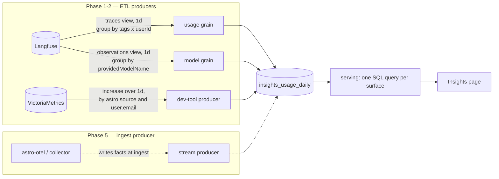
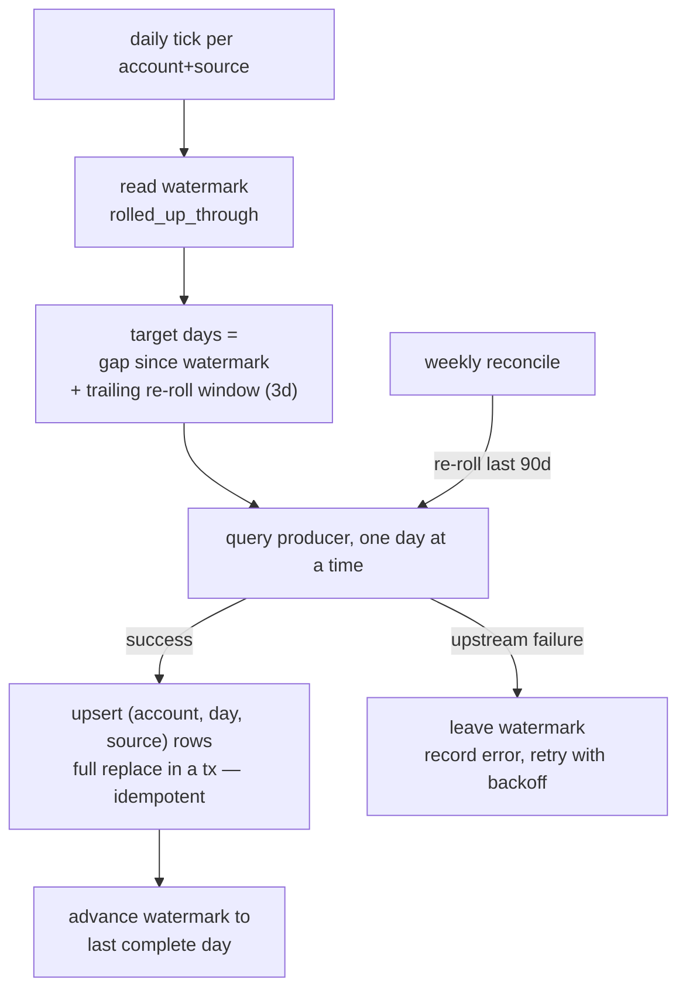
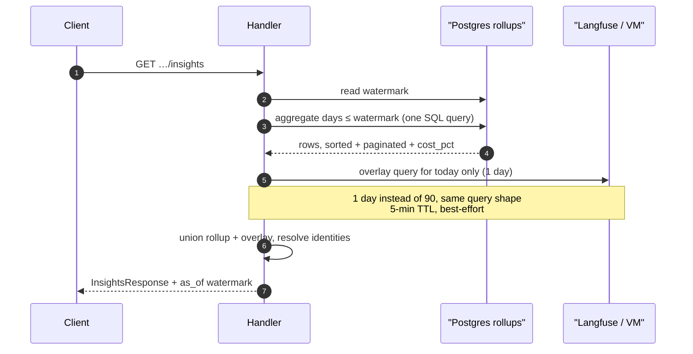
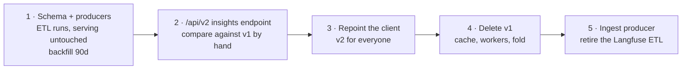

# Insights Rollup Store

**Status:** Draft — phase 1 in progress
**Date:** 2026-08-04
**Supersedes (on cutover):** the Redis page cache and 6-hourly refresh described in [insights.md](../03-architecture/insights.md)

## Summary

Insights today has no durable aggregate store. Every six hours a River worker re-aggregates **90 days of Langfuse data from scratch, per account**, and stores the *rendered page* as JSON in Redis. Nothing accumulates: the work done at 06:00 is thrown away and redone at 12:00.

This proposes a **daily-grain fact table in Postgres** as the system of record for usage aggregates. A day is aggregated once, incrementally, and never recomputed. Serving becomes one SQL query per surface. Freshness stops being a function of how expensive the recompute is.

Build it **in parallel as a versioned endpoint**, verify it against the current path by hand, then repoint the client and delete the old one.

> **Revised after reading the Langfuse query engine** at our deployed tag, `v3.221.1`. The draft's seven-column grain was nearly right: `(deployment × actor)` is obtainable in a single query, but `model` is not joinable to it and latency percentiles can't be stored at all. The store is a `usage` measure grain plus a separate `model` grain — see [What Langfuse can actually group by](#what-langfuse-can-actually-group-by).

## Problems being solved

Each of these is a direct consequence of "no aggregate store", not an implementation defect:

1. **Recompute cost is `O(accounts × 90 days)`, four times a day, forever.** Nothing is reused. `RefreshInterval = 6h` exists to throttle our load on Langfuse — the page's "results may take up to 6 hours" note is that throttle leaking into the product.
2. **Freshness is bounded by recompute cost.** Making the page fresher means multiplying upstream load. The two are coupled and shouldn't be.
3. **The cache stores a rendered page, not facts.** No other consumer — exports, alerts, an API, a weekly digest — can use it. Any change to page semantics invalidates every entry.
4. **No history.** Retention is whatever Langfuse and VictoriaMetrics keep. 90 days is the ceiling because query cost, not product need, set it. Deleting a Langfuse project destroys the account's usage history.
5. **Redis is load-bearing but not durable.** Cold cache means zeros plus a warning banner. A 7-day TTL papering over that is a symptom.
6. **Serving materializes the full account dataset in Go** on every request to fold, sort, and paginate it. Memory and latency scale with account size on a *page-load* path.
7. **Dev-tool spend needs 252 lines of fold code** solely because it arrives from a different pipeline than agent spend. Two sources, two shapes, hand-merged.
8. **p95 latency can't be re-aggregated.** It's computed per-window by Langfuse, so it can't be recombined across days or re-derived later.
9. **Tables are stuck at 90d** while charts are range-scoped, because range-scoped tables would mean four cached variants per account.

The fix for 1–9 is the same: **store facts at a fixed grain, once.**

## Design

### What Langfuse can actually group by

The draft's grain was close to right; the real constraint is narrower than the surrounding code suggests. Verified against `packages/shared/src/features/query/dataModel.ts`, `queryBuilder.ts`, and `types.ts` at the deployed tag **`v3.221.1`** — not from the current docs, which describe a v2 API we don't run.

| Want | Reality |
|---|---|
| cost per (actor × deployment) | **One query.** `traces` view grouped by `[tags, userId]` carrying `totalCost` / `totalTokens` / `count`. |
| cost per deployment, cost per actor | `GROUP BY` over that same grain — no extra query. |
| cost per model | `observations` view grouped by `providedModelName`. |
| model alongside actor or deployment | Available — `observations` exposes both `tags` and `userId` — but its cost doesn't reconcile with `traces`. |
| latency histogram | `histogram` aggregation exists, but compiles to ClickHouse adaptive `histogram(bins)(x)`: data-derived boundaries, not recombinable. |

Three properties make the single measure grain work. Each looks like a hazard and isn't:

- **Grouping by `tags` does not fan out.** `queryBuilder.ts` applies `arrayJoin` only to dimensions declared `explodeArray: true` — just `toolNames` and `calledToolNames`. `tags` is `type: "string[]"` with no such flag, so it groups by the whole array. Multiple distinct arrays can contain the same deployment tag, and their measures are **added**, which is correct for a sum. `batchedP95Latencies` takes `max` across those groups only because percentiles can't be combined that way; it is not evidence that sums are unsafe.
- **v1 imposes no high-cardinality limits.** `highCardinality: true` appears only on the v2 events views and behind `isV2 &&` guards, so grouping by `userId` requires no `row_limit`/`orderBy` pair and an ETL can read complete result sets.
- **Both views deduplicate** (`traces FINAL`, `observations FINAL`), so neither inflates from repeated ingest.

What genuinely doesn't work is **model**. The v1 `traces` view has no model dimension at all, and `observations`-view cost disagrees with `traces`-view cost — which is already why the per-user chart uses `traces`. Model therefore gets its own grain and is never summed with the rest.

One assumption the source cannot settle: **a trace carries at most one `deployment:` tag.** Summing tag-array groups by their deployment tag is exact only under that assumption. It is our own tagging convention so it should hold, but phase 1 asserts it rather than trusting it — see [Risks](#risks-and-open-questions).

### Two grains, one table

```
grain = 'usage'  →  (account_id, day, source, deployment_id, actor_kind, actor_key)
grain = 'model'  →  (account_id, day, source, model)
```

`usage` is the measure grain and serves every surface on the page. `model` exists only for the Models view, which stays on its current endpoint in phase 1.

| Surface | Grain | Aggregation |
|---|---|---|
| Stat cards | `usage` | `SUM` over day range |
| Agent spend chart | `usage` | `GROUP BY day, deployment_id` |
| People spend chart | `usage` | `GROUP BY day`, `COUNT(DISTINCT actor_key)` |
| Agents table | `usage` | `deployments LEFT JOIN` facts |
| People table | `usage` | `GROUP BY actor_kind, actor_key` |
| `used_by` / `agents_used` | `usage` | `DISTINCT (deployment_id, actor_key)` — already in the grain |
| Models table | `model` | `GROUP BY model` — **not served from rollups in phase 1** |
| Sources filter | either | `WHERE source …` |

Because the measure grain already carries both dimensions, every main surface is a `GROUP BY` over **one** grain — the `used_by` chips fall out of the same rows as the totals, with no separate attribution concept and no risk of a surface accidentally combining two grains.

**The `grain` column still earns its place.** `usage` and `model` describe the same spend two different ways, so summing across them double-counts. Nothing on the page reads both, which makes the mistake unlikely rather than impossible — so it stays enforced structurally: `grain` is a PK column, and every store query builder takes an explicit grain argument with no default value.

Sentinels mark the absences that carry meaning: `deployment_id = ''` is a trace with no deployment tag, and `actor_kind = 'system'` with an empty `actor_key` is a trace with no user — which is exactly the pinned system row the page shows today.

Two columns carry more than they appear to:

- **`actor_key` holds the bare stable id, with `actor_kind` as its namespace.** Members store the WorkOS user id; Slack actors store the bare Slack user id, *not* `slack:<team>:<uid>`. The team is deliberately left out: it comes from the Slack directory, which is read-time enrichment, and baking it in would freeze a value the directory can still learn. The read path composes the full `slack:<team>:<uid>` row key exactly as it does today.

  The payoff is that a member's WorkOS id is the *same* key whether it arrived from a Langfuse trace or from resolving a dev-tool `user.email` — so agent and dev-tool spend merge into one People row by plain aggregation, with no prefix juggling and no special case.
- **`source` is meaningful on both grains**, so `hide_sources` stays a `WHERE` clause everywhere rather than a special case.

**Dev-tool spend stops being a special case.** Claude Code writes `actor`-grain rows keyed `member:<user_id>` (or an unidentified row when the email doesn't resolve), plus one `deployment`-grain row with `deployment_id = ''` that becomes the synthetic agents-table row. Chart series, stat-card contributions, the People roll-up, and `cost_pct` then fall out of the same `GROUP BY` as agent spend. `insights_devtool_fold.go` is deleted, not ported, and `hide_sources` becomes a `WHERE` clause.

Dev tools are also the one producer whose grains are *cheap* — VictoriaMetrics answers per-source and per-developer in one range query each, so no fan-out.

One column stays structurally empty. **No dev-tool source reports a request count**, so `requests` is `0` on those rows permanently — not pending, not missing. That matches today's synthetic source rows, but with one grain feeding every surface the derived per-request columns must guard the denominator explicitly. A zero here is real data.

### Schema

Declarative SDL in `sql/astro-server/schema.sql`, applied by Atlas like every other table.

```sql
CREATE TABLE public.insights_usage_daily (
    account_id    varchar(64)  NOT NULL,
    day           date         NOT NULL,
    -- 'usage' | 'model'. Never sum across these: both describe the same
    -- spend, so combining them double-counts.
    grain         varchar(16)  NOT NULL,
    source        varchar(64)  NOT NULL,   -- 'agents' | 'claude-code' | …
    -- '' sentinels, not NULL: these are primary-key columns. Which are
    -- populated is determined by `grain`.
    deployment_id varchar(128) NOT NULL DEFAULT '',
    actor_kind    varchar(16)  NOT NULL DEFAULT '',  -- member|slack|system|unidentified
    -- Full stable identity key: 'member:<user_id>', 'slack:<team>:<uid>', …
    actor_key     varchar(256) NOT NULL DEFAULT '',
    model         varchar(128) NOT NULL DEFAULT '',

    requests      bigint       NOT NULL DEFAULT 0,
    input_tokens  bigint       NOT NULL DEFAULT 0,
    output_tokens bigint       NOT NULL DEFAULT 0,
    total_tokens  bigint       NOT NULL DEFAULT 0,
    cost_usd      numeric(18,6) NOT NULL DEFAULT 0,
    -- Forward-declared and left empty by the ETL producers. Langfuse does
    -- expose a `histogram` aggregation, but it compiles to ClickHouse's
    -- adaptive histogram(bins)(x), whose boundaries are derived from each
    -- query's own data — so stored bins cannot be merged across days. Only
    -- the phase-5 ingest producer can fill this with fixed boundaries.
    -- p95 is served off the existing whole-period query until then.
    latency_buckets bigint[]   NOT NULL DEFAULT '{}',
    last_seen_at  timestamptz,

    computed_at   timestamptz  NOT NULL DEFAULT now(),
    -- grain before day: the serving predicate is
    -- (account_id = ? AND grain = ? AND day BETWEEN ? AND ?), so equality
    -- columns lead and the range column comes last.
    CONSTRAINT insights_usage_daily_pkey
      PRIMARY KEY (account_id, grain, day, source, deployment_id, actor_kind, actor_key, model)
);

CREATE TABLE public.insights_rollup_state (
    account_id         varchar(64) NOT NULL,
    source             varchar(64) NOT NULL,
    rolled_up_through  date,                 -- watermark: complete through this day
    last_run_at        timestamptz,
    last_error         text        NOT NULL DEFAULT '',
    consecutive_errors int         NOT NULL DEFAULT 0,
    CONSTRAINT insights_rollup_state_pkey PRIMARY KEY (account_id, source)
);
```

Four decisions worth stating explicitly:

- **`grain` precedes `day` in the PK**, so the index prefix matches the serving predicate exactly — two equality columns then a range scan — and a grain-less query cannot accidentally look cheap.
- **`numeric(18,6)` for cost, not float.** Summing millions of float rows accumulates drift; money-shaped values get exact decimal arithmetic.
- **Sentinels, not NULL.** Postgres primary keys cannot contain NULL, and `NULLS NOT DISTINCT` semantics are a trap for a key this wide.
- **No partitioning in phase 1.** The draft called for monthly range partitions, but this schema is applied by `atlas schema apply` declaratively from a single SDL file. Rolling partitions have to be created by a job, and Atlas would then read every job-created partition as drift and plan to drop it. Since the same section's own numbers put a large account at single-digit MB/month, partitioning buys nothing yet and costs a fight with the migration tool. Retention starts as a bounded `DELETE`; converting to a partitioned table later needs a real migration either way, so nothing is foreclosed.

### Producers

The fact table is the seam. Producers are pluggable, which is what makes the eventual ingest-side rewrite a non-event.



Key property: the ETL fetches **one day at a time** instead of a 90-day window, so a completed day is fetched once, ever.

Per-account cost per daily tick is **two Langfuse queries plus two VictoriaMetrics queries** — flat, regardless of deployment count. Today the same account costs `N + 4` Langfuse queries over a 90-day window, four times a day, where `N` is its deployment count. For a 50-deployment account that is a three-orders-of-magnitude reduction in steady-state upstream work, and it stops scaling with either retention or deployment count.

Two consequences worth stating:

- **Backfill is `90 × 2` queries per account** — small enough to run inline per account, though it still wants its own River queue so a fleet-wide backfill can't starve the daily tick.
- **`maxDeployments = 100` stops mattering.** Accounts past 100 deployments have silently incomplete agent tables today, because the read path caps its fan-out. A single grouped query has no such cap, so the rollup fixes that for free — this is a real bug fix hiding inside the migration, and it will show up as v1-side divergence when comparing large accounts.

### Watermarks and late-arriving data

Traces arrive late: agents buffer, collectors retry, laptops go offline. A day is not final the moment it ends.



- **Trailing re-roll window** (default 3 days) absorbs late arrivals without re-reading history.
- **Full replace per `(account, day, source, grain)`** inside a transaction makes every run idempotent — reruns and overlapping ticks converge to the same state. No merge semantics to get wrong. The delete-and-insert must be scoped by `grain` as well, or a producer that emits one grain wipes the others for that day.
- **Weekly reconcile** re-rolls 90 days to catch drift and upstream backfills. Correctness does not depend on every incremental run succeeding.
- **A stalled watermark is a first-class, visible state**, not a silently stale cache entry.

### Freshness: complete days plus a hot tail



Today's partial day is the only thing ever queried live, and it is one day of data. The page goes from *"up to 6 hours stale"* to *minutes*, while doing far less upstream work than it does now. If the overlay fails, the page renders complete days and says so.

### Serving

One SQL query per surface, with the work pushed into Postgres:

- `cost_pct` from `SUM(cost_usd) OVER ()` — one pass, no separate total query.
- `ORDER BY … LIMIT … OFFSET …` — the full account dataset is never materialized in Go.
- **p95 is not served on the v2 path at all.** The column renders empty (`-`). Wiring the existing `batchedP95Latencies` call would restore it, but that was deliberately deferred: it is the only thing that would put Langfuse back in the v2 read path, and the agents table is the only surface that shows it. Percentiles are the one column the fact table cannot yet serve — see [trap 3](#the-three-real-traps).
- **Range-scoped tables become free** — change the `WHERE day BETWEEN`. This retires the current inconsistency where charts respect the range chip but tables silently show 90 days.
- **Arbitrary ranges become possible.** 6-month and year-over-year views need no new machinery, because history accumulates instead of expiring.

**Identity resolution stays at read time.** Facts store stable keys (`actor_kind` + `actor_key`); Slack display names, avatars, and member profiles resolve on every read exactly as they do today. That preserves the current design's best property — names are never stale — while making the facts themselves immutable.

### Failure modes become honest

| Condition | Today | With rollups |
|---|---|---|
| Langfuse down, cache warm | Serves ≤6h-old page until TTL | Serves everything through the watermark, durably |
| Langfuse down, cache cold | Zeros + "metrics unavailable" | Full history through watermark; overlay absent |
| Redis unavailable | Live 90d fan-out per request | Irrelevant — Redis holds only the hot-tail overlay |
| Sustained outage | Cache expires at 7d → page empties | Data never disappears; `as_of` stops advancing |

The UI shifts from a binary "metrics unavailable" banner to `as_of <date>` — accurate, and far more useful.

## Frontend parity contract

**No frontend feature may be lost.** The client is not rewritten and its props do not change — `InsightsResponse` stays wire-compatible, and the rollup path must reproduce it field for field. This section is the audited inventory, taken from the components rather than from memory. It doubles as the phase-2 verification checklist.

### Views and surfaces

| Feature | Served by | Status |
|---|---|---|
| Stat cards — Spend / Requests / Tokens | `SUM` over range | preserved |
| Change % vs prior window | `SUM` over prior range | **improved** — see below |
| Agent spend chart, stacked, top 5 by cost | `GROUP BY day, deployment_id` | preserved |
| Chart line/bar variant above 60 days | client-side, untouched | preserved |
| `series_labels`, duplicate-name disambiguation | joined from `deployments` | **changed** — by deployment id, not namespace |
| People spend chart — users/day + cost/day | `GROUP BY day` + `COUNT(DISTINCT actor_key)` | **changed** — see below |
| **Models view** — model, requests, spend, % total, tokens, token %, p50, p95 | current summary endpoint | **unchanged in phase 1** — see below |
| Sources filter, incl. `agents` pseudo-source | `WHERE source …` | preserved, simpler |
| Time range 7/14/30/90 | `WHERE day BETWEEN` | **improved** — tables now respect it too |
| Search (debounced, server-side) | `WHERE search_text ILIKE` | preserved |
| Sort + direction toggle, all sort keys | `ORDER BY` | preserved |
| Show more / show less pagination | `LIMIT/OFFSET` | preserved |
| Unfiltered counts in view-toggle pills | `COUNT(*) OVER ()` | preserved |
| `metrics_unavailable` banner | replaced by `as_of` | **improved** |

### Row-level fields

| Field | Derivation | Status |
|---|---|---|
| Agents: requests, cost, `cost_pct`, cost/req, tok/req | `deployment` grain aggregate | preserved |
| Agents: p95 | not served | **dropped for now** — renders `-`; see [trap 3](#the-three-real-traps) |
| People: requests, cost, `cost_pct`, tokens, `last_seen` | aggregate + `MAX(last_seen_at)` | preserved |
| `used_by` chips on agent rows | `DISTINCT actor` per deployment | preserved |
| `agents_used` chips on person rows | `DISTINCT deployment` per actor | preserved |
| `is_deleted` on agent chips | `LEFT JOIN deployments`, null = deleted | **improved** — history survives deletion |
| `not_instrumented` marker | `LEFT JOIN` from `deployments` | **at risk — see below** |
| System-spend row, pinned last, tooltip | `actor_kind = 'system'` | preserved |
| Identity kinds, avatars, hrefs, tooltips | resolved at read time, unchanged | preserved |
| Slack deep links + `slack:<team>:<uid>` keys | `actor_key` encodes team | preserved |
| `missing_slack_details_count` | read-time identity resolution | preserved |
| Dev-tool chips, brand icons, "External" tag | `source != 'agents'` | preserved |
| Admin-only per-developer breakdown | `WHERE actor_key = …` for non-admins | preserved, enforced in SQL |

### The three real traps

**1. Zero-activity deployments would vanish.** A fact table only has rows where something happened. Today the agents table is built by iterating the *deployments* list and flagging `not_instrumented` when `requests == 0` — so a deployed-but-silent agent still appears. A naive `GROUP BY` over facts drops it entirely, silently removing rows the user expects to see.

The agents table must therefore be **`deployments LEFT JOIN` facts**, not a plain aggregate over facts. Deployments are the row set; facts supply the metrics. This also aligns with the standing rule that "what did we deploy" is a DB question.

**2. Summing across grains double-counts.** The same dollar appears in both the `usage` and `model` grains, so a query missing its `grain` predicate returns roughly double the real spend — and it will look plausible, which is worse than an error. No surface reads both grains, so this is unlikely by construction, but it stays enforced anyway: `grain` leads the PK, and every store query builder takes a grain argument with no default value.

**3. Percentiles still can't be stored, despite `histogram` existing.** Langfuse does expose a `histogram` aggregation — but it compiles to ClickHouse's adaptive `histogram(bins)(x)`, which chooses bin boundaries from each query's own data. Two days' histograms therefore have different bins and cannot be merged, which is the same defect as storing a scalar p95, just harder to notice. The fixed boundaries the schema comment describes are only achievable from the ingest side.

Nor can buckets be counted by hand: Langfuse filters resolve only to dimensions and there is no HAVING, so there is no way to count traces falling in a latency band. And agent latency is not a metric at all — it is derived from span start/end timestamps, and the collector exports metrics to Langfuse rather than to VictoriaMetrics, so no histogram exists anywhere to forward.

**The unblock is a `spanmetrics` connector in the collector**: a standard OTel component that turns spans into duration histograms with explicitly configured boundaries. Once those land, p95 becomes a plain `SUM` over `latency_buckets` — correct at every aggregation, and Langfuse leaves the latency path entirely.

Until then `latency_buckets` stays empty and v2 keeps p95 zero-valued for wire compatibility. The Agents and Models tables show last-used activity instead; per-agent latency remains available on the Monitor tab.

### Two deliberate behavior changes

Both are fixes rather than regressions, and both show up as divergence when comparing v1 to v2. They need to be recognized as intended, not chased back to v1.

**Change % returns.** Today, whenever a dev-tool source folds in, `foldDevtoolStatCards` **discards the change percentage** — it's computed from agent spend only, so it can't honestly describe a folded total. With unified facts there is only one total, and the prior window is a `WHERE` clause over durable history. Change % becomes correct for every source combination and returns to the page.

**The People spend chart starts folding.** `foldDevtoolRange` covers the agent chart, stat cards, and series labels only, so the People chart reflects agent spend alone while the People table beneath it is folded — the two disagree today. Over unified facts a `GROUP BY day` picks up every enabled source automatically and they agree. Reproducing the current unfolded numbers would take a `WHERE source = 'agents'` that no other surface wants; folding is the correct outcome, so the diff here is expected to be non-zero for every account with dev-tool spend.

### How parity is enforced

- **The wire contract is frozen.** Phase 2 diffs v1 against v2 per account across every field in the tables above, not just totals. Divergence beyond tolerance blocks the repoint.
- **Existing component tests are the parity suite.** `TopSpendersTable.test.tsx` (652 lines) and the identity/range/toggle tests must pass unchanged; if a test needs editing, that is a feature change and needs to be called out, not absorbed.
- **The Models view stays on its current endpoint until its rollup-backed replacement is diffed too.** `useAccountObservabilitySummary` is consumed elsewhere and is not retired by this work.
- **`AccountCostOverTimeEntry.Models` keeps carrying deployment IDs.** Freezing the wire contract means the agent chart's misnamed field stays misnamed while a genuine `model` dimension arrives in the grain next to it. Renaming is a client change and out of scope — this needs a comment at the type so the collision doesn't read as a bug during implementation.

## Scale

Cardinality is bounded by *actual* (deployment, actor) pairs per day, not their cross product — a given person touches a handful of agents, not all of them. A large account at 50 deployments and 500 active users lands in the low thousands of rows/day, plus ~10 model rows; at `~120 bytes/row` that is well under a MB/month per large account, cheaper than the Redis blobs it replaces.

That is also the argument for skipping partitioning in phase 1. Retention is a 13-month `DELETE` on a table this size, and the [schema section](#schema) covers why declarative Atlas and rolling partitions don't mix.

Indexes: the PK covers the `(account_id, grain, day, …)` prefix every query filters on. Add a covering index per hot access path only when measured.

## Parallel build and cutover



1. **Build alongside.** Schema, the grain producers, state table, and a separately-queued resumable backfill. The serving path is not touched; zero user-visible risk.
2. **Compare by hand.** The rollup-backed read path ships as **`GET /api/v2/accounts/:account/insights`**, with v1 untouched and still serving. Verification is manual: call both endpoints for the same account and params, and diff the responses.

   No comparison job is built. Both paths are plain HTTP with an identical wire contract, so `curl` plus `jq` answers the question, and the [parity contract](#frontend-parity-contract) is the checklist to walk. A job would mostly be scaffolding around a diff that a person still has to interpret — the divergences that matter here are judgement calls about *which side is wrong*, not threshold breaches.

   **A version in the path, not a flag.** Both paths coexist during verification either way, so the only question is how a caller selects one. A URL does it without flag plumbing, without a config value that outlives the migration, and without two branches inside one handler. Comparing becomes two requests rather than an internal fork, and "which path served this?" is answerable from an access log.

   **Three divergences are expected and are not bugs** — check them off rather than chasing them:
   - Change % is present in v2 whenever a dev-tool source is folded in, where v1 drops it.
   - The People spend chart folds dev-tool spend in v2 and doesn't in v1.
   - On accounts past `maxDeployments = 100`, v2's agent table is *more* complete. **v1 is the wrong side.**
3. **Repoint the client** once the comparison looks right — a one-line change in the query hook. Rollback is repointing it back, with no state to unwind.
4. **Delete v1:** `insightscache`, both refresh workers, `insights_devtool_fold.go`, and the in-Go sort/filter/paginate. Net code reduction.
5. **Later:** an ingest-time producer replaces the Langfuse ETL, removing Langfuse from the aggregate path entirely. The serving layer does not change, because the fact table is the contract.

## Non-goals

- **Replacing Langfuse.** Trace-level views, drilldowns, and the trace UI keep querying Langfuse directly. This spec covers aggregates only.
- **Changing ingest in phase 1.** Producers read from the existing stores.
- **Billing.** Metering has its own Metronome path; this is not a billing source of truth.

## Resolved before phase 1

The draft's three blocking unknowns were resolved by reading the Langfuse query engine at our deployed tag rather than inferring from our own call sites — which matters, because one of our code comments turned out to be stale and led the first revision of this spec to the wrong conclusion.

- **Can `(userId × deployment tag)` carry metrics?** **Yes.** `tags` is `type: "string[]"` but is *not* declared `explodeArray`, and `queryBuilder.ts` only emits `arrayJoin` for dimensions that are. Grouping is by the whole tag array, so measures are never duplicated across a trace's tags; summing the groups whose array contains a given `deployment:` tag is exact. This is the finding the whole design rests on.
- **Is `model` available alongside the other dimensions?** **Technically yes, usefully no.** `observations` exposes both `tags` and `userId` — the comment in `accountDailyMetrics` claiming otherwise is stale — but `observations`-view cost doesn't reconcile with `traces`-view cost, which is already why the per-user chart uses `traces`. Model stays its own grain rather than joining the measure grain.
- **Latency bucket boundaries — still needed, no longer blocking.** A `histogram` aggregation exists but is ClickHouse's adaptive variant, so its bins are query-dependent and unmergeable. Boundaries must be fixed before the phase-5 ingest producer's first write; Prometheus-style exponential boundaries remain the default choice.

## Risks and open questions

- **Does a trace ever carry more than one `deployment:` tag?** The entire single-grain design assumes not. If a trace can, its cost lands in every matching deployment's row and the agents table over-reports. Phase 1 must assert this at ETL time — count tag arrays containing more than one `deployment:` prefix and log loudly — rather than assume the convention holds. Cheap to check, silently corrupting if wrong.
- **Do the rolled-up totals match today's page?** The `usage` grain is one `[tags, userId]` query, while v1 assembles the same numbers from `Q_main` plus an N-way per-deployment fan-out. They should agree; where they don't, and the account is past `maxDeployments = 100`, **v1 is the wrong one**. Divergence there is expected and is a fix, not a regression.
- **The v2 metrics API is an upgrade cliff.** v2 removes the `traces` view entirely and marks `userId` high-cardinality — barred from grouping. Both are load-bearing here. The [v2 changelog](https://langfuse.com/changelog/2025-12-17-v2-metrics-and-observations-api) says v1 endpoints "remain available and unchanged", while the [current metrics docs](https://langfuse.com/docs/metrics/features/metrics-api) describe v1 as deprecated with a migration guide. That contradiction needs resolving before a Langfuse upgrade, and it is the strongest argument for prioritising the phase-5 ingest producer: it removes Langfuse from the aggregate path before the cliff arrives.
- **Dev-tool model attribution.** `claude_code.token.usage` carries a model label but the cost metric may not, so dev-tool spend may be unattributable by model. Current behavior — Models view covers agents only — is the parity floor, not a target to exceed in phase 1.
- **The stale comment in `accountDailyMetrics` should be corrected** when that file is next touched, so the next reader doesn't re-derive the wrong constraint from it.
- **Cost provenance:** take Langfuse's computed cost, or recompute from tokens × our own price table? The latter makes cost reproducible and Langfuse-independent but forks from what Langfuse's own UI shows.
- **VictoriaMetrics retention likely under 90 days**, so dev-tool backfill will be partial. History accumulates from cutover forward; state this rather than implying full backfill.
- **Retention policy** beyond 13 months of daily grain needs a product answer.

## Migration

Schema-only, applied via the Atlas SDL like any other change. Nothing is user-visible until the client is repointed in phase 3, because until then nothing calls `/api/v2`. Rollback at any point before phase 4 is repointing the client at `/api/v1`; the rollup tables are additive and harmless if unused.
