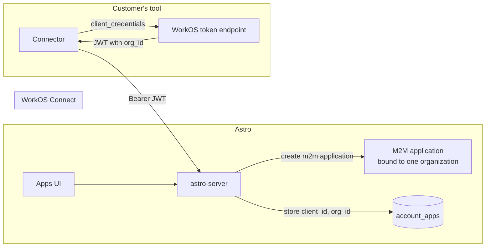
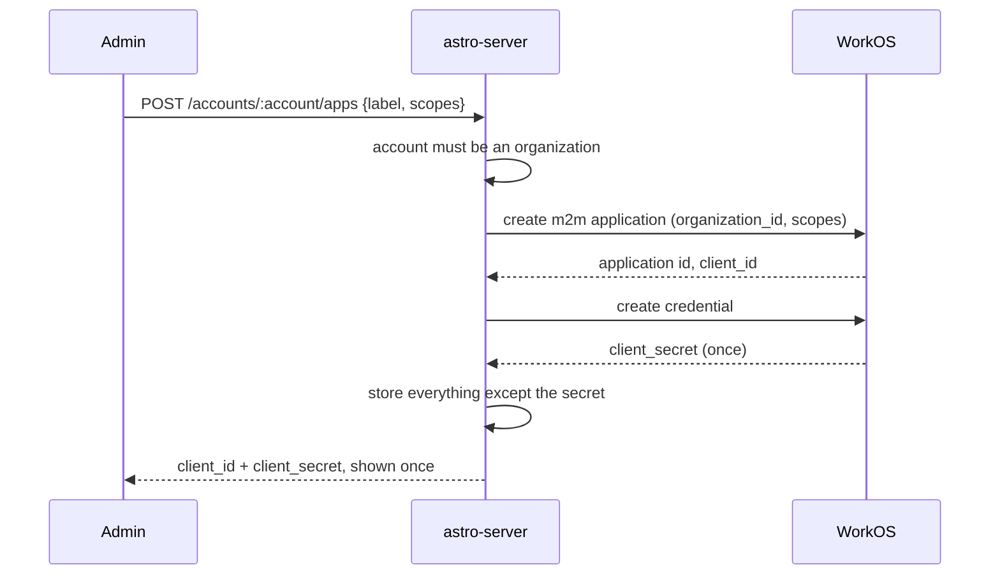

# Machine credentials

**Status**: Apps and their credentials implemented; token validation not yet
**Date**: 2026-08-25
**Updated**: 2026-08-26

Unblocks phase 2 of [Access audiences](access-audiences-spec.md). Related: [CLI authentication](cli-authentication.md) covers the human device flow this sits beside.

## Summary

Every credential Astro accepts today belongs to a person. `RequireAuth` takes a WorkOS user access token or a sealed session cookie, and the only non-human credential is the per-deployment deploy token, which is accepted on two routes and minted by the platform rather than by a customer. So a customer system that needs to write on a schedule has one option: carry a human's refresh token and mint user access tokens forever.

That is disqualifying rather than merely untidy. Every write is attributed to that person, the credential carries their full permissions on every account they belong to, nothing binds it to one account, and offboarding them breaks the sync silently.

WorkOS Connect already issues machine-to-machine applications using the OAuth 2.0 client credentials grant. Astro validates WorkOS JWTs against JWKS today, so accepting an M2M token is a claims-discrimination problem rather than a new authentication system. This spec adds an account-scoped machine credential on top of what WorkOS provides, and changes no existing write path.

## Goals

1. A credential that belongs to an Astro account, not to a person, and survives that person leaving.
2. Scopes, so an app that manages membership cannot also read billing.
3. One account per credential, enforced by the token rather than by the caller behaving.
4. No secret storage, no token endpoint, and no rotation logic written here.
5. Audit entries attributed to the app.

## Non-goals

1. **Replacing user authentication.** The device flow and the session cookie stay exactly as they are.
2. **A first-party credential.** WorkOS M2M applications can only be third-party, so this is a credential Astro hands to a customer's system, not one Astro's own services use.
3. **Per-deployment credentials.** The deploy token already covers the agent runtime.
4. **Personal accounts.** An M2M application requires a WorkOS organization, and a personal account has none.
5. **Custom grant types.** Only `client_credentials`. Authorization code stays for humans.

## What WorkOS provides

| Piece | Detail |
| --- | --- |
| Application | `POST /connect/applications` with `application_type: "m2m"` and a required `organization_id`. Optional `scopes`, an array of permission slugs |
| Credential | `client_id` plus `client_secret`. Up to five per application, each shown once at creation, and they do not expire |
| Token endpoint | `POST https://{authkit_domain}/oauth2/token` with `grant_type=client_credentials`, `client_id`, `client_secret`, and optional `scope` |
| Token | A JWT with `expires_in` of one hour in the documented example. Claims: `iss`, `aud` (the client), `sub` (the client), `org_id`, `sid`, `jti`, `exp`, `iat` |
| Validation | Stateless against JWKS, or synchronous through the Token Introspection API |
| Constraint | M2M applications are always third-party and always bound to one organization |

Two facts shape everything below. The organization is fixed on the application rather than requested at the token endpoint, so a credential cannot ask for a different tenant. And credentials never expire, so rotation is add-then-revoke rather than waiting for a clock.

The credential call the published reference omits is in the Go SDK, which settles the one gap this design hung on: `CreateApplicationClientSecret` returns the plaintext once, and `ListApplicationClientSecrets` returns each credential's ID, hint, and last-used time. `DeleteClientSecret` revokes one.

WorkOS therefore owns credential metadata, not just the secret. That removes a table: there is nothing about a credential worth storing locally, so Astro keeps one row per application and reads the credential list from WorkOS.

## Model

The secret never lands in Astro's database. Astro stores the `client_id`, the WorkOS application ID, the granted scopes, and a label. WorkOS holds the secret, mints the token, and Astro verifies it.

## Design

### Objects

An **app** is one row per WorkOS M2M application: the Astro account it belongs to, the WorkOS application and client IDs, a human label, the scopes granted, who created it, and when it was last used. Deleting the row deletes the WorkOS application, which is what actually revokes access.

One app maps to one WorkOS M2M application rather than to one credential, so the five-credential allowance is available for rotation within a single app.

### Creating one

The secret is returned in the creation response and never again, matching WorkOS's own contract and the existing OTel ingest key flow.

A failure after the WorkOS application exists but before the row commits would orphan an application. Create the application first and the row second, then reconcile orphans by listing applications for the organization and deleting any whose `client_id` has no row. An orphan grants nothing, because authorization requires the row.

### Validating a token

The existing validator fetches JWKS and checks the issuer. It is constructed with an empty audience on purpose, because WorkOS user access tokens carry no `aud` claim.

That exemption is the trap. An M2M token does carry `aud`, and its `sub` is a client ID rather than a user ID. Passed through the current path it would validate, and the middleware would build a session whose `UserID` is a client ID. Nothing downstream would know the difference.

So the two token kinds must be told apart before either is trusted:

| Check | User token | M2M token |
| --- | --- | --- |
| `sub` | A WorkOS user ID | The client ID, and must match a stored app |
| `aud` | Absent | Present, and must equal the client ID |
| `org_id` | Present when the session is org-scoped | Always present |
| Astro identity | A user | An app. No user is set on the context |

Discriminate on the presence of `aud` together with a `sub` that resolves to a stored `client_id`, and validate the audience for the M2M branch rather than skipping it. A token whose `sub` matches no app is rejected, so deleting the row denies the token before its hour is up.

The middleware sets an app on the request context and deliberately sets no user. Any handler that reads a user therefore fails closed rather than reading a client ID as a person.

### Resolving the account

`org_id` is a WorkOS organization ID. `account_organizations` maps it to an Astro account, unique in both directions, and `GetByWorkOSOrganizationID` already performs that lookup. So the mapping is one indexed query, not a claim Astro can trust directly.

Two checks then run on every request:

1. The organization in the token maps to an account.
2. That account is the one named in the path.

The second is what makes a credential for account X useless on a path for account Y. `RequireAccountPermission` already compares `session.OrganizationID` to the resolved account's WorkOS organization for org accounts, so populating `OrganizationID` from `org_id` reuses that comparison rather than adding a parallel one.

### Scopes

WorkOS scopes are permission slugs on the application, and they arrive in the token. Astro's own permission strings (`org:manage`) belong to human roles, so machine scopes stay a separate vocabulary:

| Scope | Allows |
| --- | --- |
| `audiences:read` | Read audiences and their membership |
| `audiences:manage` | Add and remove audience members |
| `members:read` | Read the account's members |
| `slack_identities:manage` | Record which Slack user is which person |

A route declares the scope it needs. An app holding `audiences:read` gets 403 on a write rather than a 404, because the resource exists and the credential is the thing that falls short.

Scopes are fixed at creation. Changing them means updating the WorkOS application, which changes what future tokens carry but not tokens already issued, so a scope reduction takes up to an hour to bite. Say so in the UI rather than pretending it is instant.

### Rotation

Five credentials per application makes rotation a two-step the customer can run without downtime: add a credential, move the tool onto it, revoke the old one. Because credentials never expire, nothing forces this, so the UI shows each credential's last-used time and the API exposes it. An unused credential is the one to revoke.

### Audit and attribution

Every write already writes an audit event. An app-authored event records the app as the actor instead of a user, so the trail reads "Lumos added Alice" rather than naming the admin who created the credential.

Membership rows carry `source` and `granted_by`. An app write sets `source` to `external:<label>` and `granted_by` to the app ID, which is what makes a later removal scoped to that writer.

### Revocation

Deleting an app deletes the WorkOS application, and rejecting a token whose `sub` matches no row means the deletion is effective immediately rather than after the token expires. The Token Introspection API is therefore not needed for revocation, which keeps the hot path free of a synchronous call to WorkOS.

## API surface

| Operation | Endpoint |
| --- | --- |
| List apps | `GET /api/v1/accounts/:account/apps` |
| Create one | `POST /api/v1/accounts/:account/apps` |
| Add a credential | `POST /api/v1/accounts/:account/apps/:id/credentials` |
| Revoke a credential | `DELETE /api/v1/accounts/:account/apps/:id/credentials/:credential_id` |
| Delete the app | `DELETE /api/v1/accounts/:account/apps/:id` |

These sit behind `org:manage`, like every other account setting. They are human-only: an app cannot create another app, because a credential that can mint credentials defeats scoping.

`GET /api/v1/me` gains a machine-credential shape. Today it resolves the calling user and returns every account they belong to, which a machine caller has no use for. For an app it returns the bound account slug and the granted scopes, which is exactly what a connector reads once at startup to build every other URL.

## Schema changes

| Table | Change |
| --- | --- |
| `account_apps` | New. `id` from `deployid`, `account_id`, `name`, `description`, `workos_application_id`, `client_id`, `scopes text[]`, `created_by`, `created_at`, `updated_at`. Unique on `(account_id, name)`, on `workos_application_id`, and on `client_id`, which is the column token validation looks up |
| `audience_members` | No change. `source` and `granted_by` already exist and already carry an external writer |

No secret material is stored in either table. The `client_id` is public by design, so a leak of these rows exposes no credential.

There is no credentials table. WorkOS tracks each secret's hint, creation, and last use, and returns them on demand, so storing any of it locally would only create a second copy to keep correct.

## Interaction with existing behavior

| Existing behavior | Effect |
| --- | --- |
| User access tokens | Unchanged. The M2M branch is additive and only engages when `aud` is present and `sub` resolves to a stored client |
| Empty-audience validator | Now wrong to share. The user branch keeps skipping `aud`; the M2M branch must check it |
| Session cookie | Unchanged, and never carries an app |
| Deploy token | Unchanged. Still the only credential on the two `/deployments/*` routes |
| `RequireAccountPermission` | Reused for org scoping. It reads a user first, so it needs a branch that accepts an app and checks a scope instead of a role permission |
| Personal accounts | No WorkOS organization, so apps are unavailable. The UI hides the section rather than failing at create time |
| FGA platform roles | Untouched. A machine scope grants no deployment role |

## Test cases

### A. Token handling

| ID | Scenario | Expected |
| --- | --- | --- |
| A1 | M2M token with a `sub` matching a stored `client_id` | Accepted as that app |
| A2 | M2M token whose `sub` matches no row | 401, so deleting an app revokes before expiry |
| A3 | M2M token whose `aud` does not match its `sub` | 401 |
| A4 | User access token, no `aud` | Accepted as a user, exactly as today |
| A5 | M2M token presented to a handler that reads a user | Fails closed, and never reads the client ID as a user |
| A6 | Expired M2M token | 401 |
| A7 | Token signed by a key outside the JWKS | 401 |
| A8 | Revoked credential, token still inside its hour | 401 |

### B. Account scoping

| ID | Scenario | Expected |
| --- | --- | --- |
| B1 | Credential for account X on a path for account X | Allowed |
| B2 | Credential for account X on a path for account Y | 403 |
| B3 | `org_id` that maps to no Astro account | 401 |
| B4 | `GET /me` with an app token | Returns the bound account slug and the granted scopes |
| B5 | App on a personal account | Cannot be created |

### C. Scopes

| ID | Scenario | Expected |
| --- | --- | --- |
| C1 | `audiences:read` on a member write | 403, not 404 |
| C2 | `audiences:manage` on a member write | Allowed |
| C3 | `audiences:manage` on a Slack identity write | 403 |
| C4 | Scope removed on the application, token already issued | Still carries the old scope until it expires |
| C5 | App attempts to create another app | 403 |

### D. Lifecycle

| ID | Scenario | Expected |
| --- | --- | --- |
| D1 | Create an app | Secret returned once, never readable again |
| D2 | WorkOS application created but the row fails to commit | Orphan grants nothing, and reconciliation deletes it |
| D3 | Add a second credential, move the tool, revoke the first | No failed request in between |
| D4 | Sixth credential on one application | Rejected, with the five-credential limit named |
| D5 | Delete the app | WorkOS application deleted, every token denied |
| D6 | Creator of the app is offboarded | App keeps working |
| D7 | Membership write by an app | Audit names the app, and `source` is `external:<label>` |

## Rollout

| Phase | Content | State |
| --- | --- | --- |
| 1 | The `account_apps` table, the WorkOS Connect client, create and delete, credential add and revoke, and the org settings screen. | Done |
| 2 | The middleware branch: discriminate an M2M token, resolve its account, and check its scope. Plus the `/me` machine shape. | Not started. Until this lands an app can be created but its token is not accepted anywhere |
| 3 | Apply scopes to the audience member endpoints, add cursor pagination and the flat `audience-members` collection, so a connector can complete a sync. | Not started |

Phase 3 is what actually unblocks [Access audiences](access-audiences-spec.md) phase 2, and it is small once the credential exists.

## Decisions

| Decision | Consequence |
| --- | --- |
| Use WorkOS M2M rather than issuing our own keys | No token endpoint, secret store, or rotation logic to write, and the existing JWKS validation is reused. Astro inherits WorkOS's one-hour TTL and third-party-only constraint |
| Store no secret material | These rows leaking exposes nothing. Rotation has to go through WorkOS |
| Discriminate on `aud` plus a `sub` that resolves to a stored client | The empty-audience exemption for user tokens stops being a hole an M2M token can walk through |
| Deny a token whose client has no row | Revocation is immediate without the introspection call on the hot path |
| An app is org-only | Personal accounts cannot hold one, because WorkOS binds an M2M application to an organization |
| An app cannot create another app | A credential cannot widen its own reach |
| Machine scopes are a separate vocabulary from human permissions | A scope never accidentally satisfies a role check |
| No credentials table; WorkOS is the record | Nothing about a secret can drift, at the cost of a WorkOS call to render the list |
| An app keeps at least one secret | Revoking the last one is refused, so rotation is add-then-revoke rather than a window with no way in |
