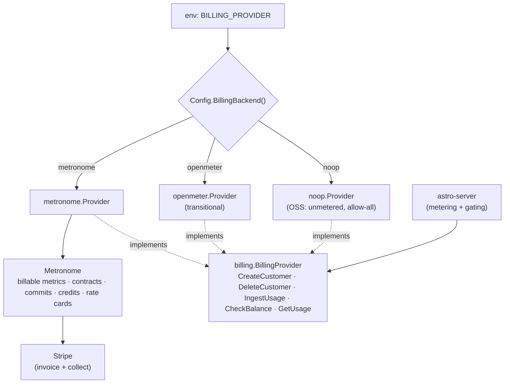
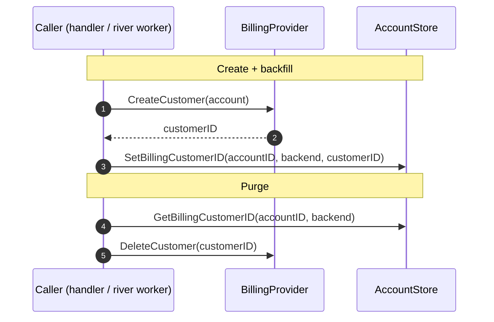
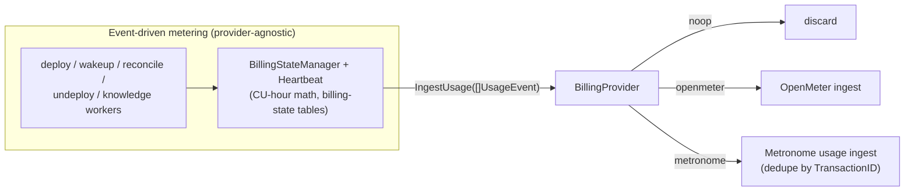
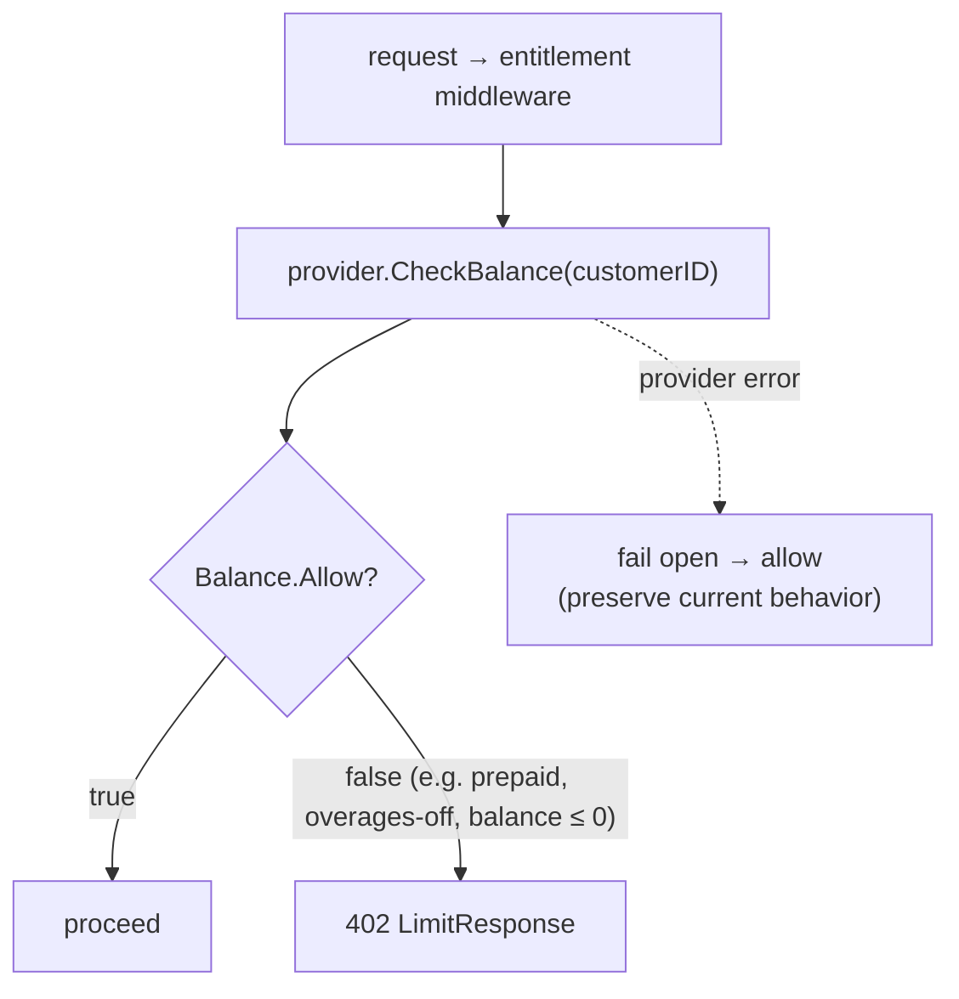
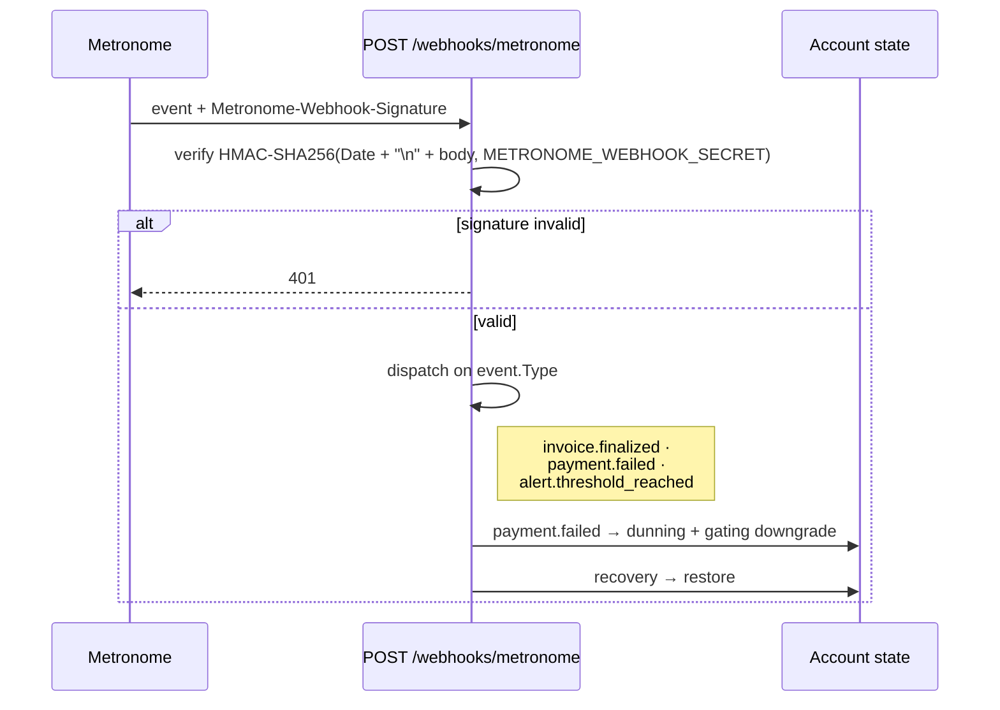
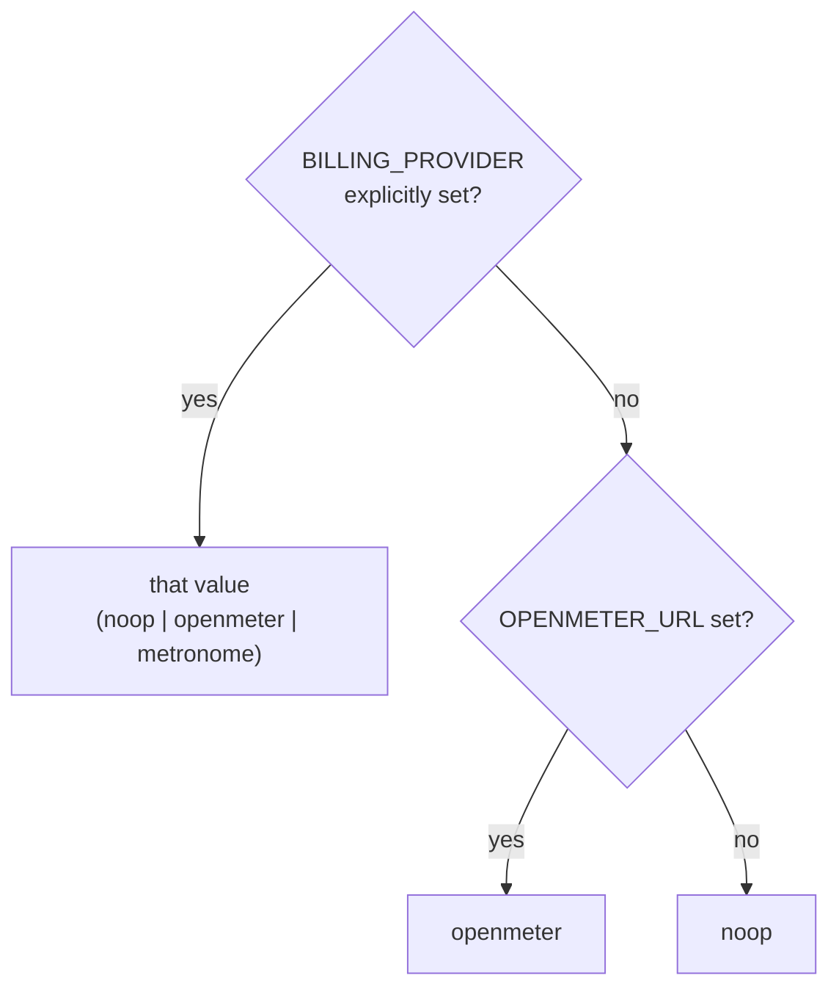

# Metronome Billing Integration Spec

Integrate Metronome (Stripe) as the rating, contracts, and invoicing backend for the **hosted** Astro service, behind a provider-neutral billing interface, and **fully decommission OpenMeter**. OpenMeter — today's metering and entitlement-gating backend — is retired, not retained: the **OSS / self-hosted** distribution gets an unmetered **no-op** provider (no gating, no collection), and hosted runs Metronome. Both implement one interface; `BILLING_PROVIDER` selects at startup. OpenMeter survives only as a transitional impl behind the interface during cutover, then is deleted.

> Implementation detail — exact Metronome SDK calls, package layout, and the phased refactor — lives in [`metronome-billing-implementation.md`](./metronome-billing-implementation.md). The **as-built** code-level data flow (function-by-function, with file references) is in [`../03-architecture/billing-data-flow.md`](../03-architecture/billing-data-flow.md).

This spec covers all four commercial packaging models Astro will sell: pay as you go, enterprise committed spend, prepaid credits (overages on/off), and subscriptions. Each is a Metronome *contract configuration* over the same usage stream and the same credit unit — not a separate integration.

## Problem

- Today `apps/astro-server` emits usage to OpenMeter and reads OpenMeter entitlements for real-time 402 gating (`internal/openmeter`, `internal/middleware/entitlement.go`). There is **no payment collection** — no invoices, no card on file, no contracts, no committed spend.
- The public pricing page (`modules/website`) sells a single unit, the **Astro credit** (`1 credit = $0.001`), with free monthly credits, a 3-month starting balance, pass-through AI token pricing, and enterprise committed credits. None of the contract/commit/invoice machinery behind that copy exists.
- OSS users self-host Astro without Stripe/Metronome, so they cannot depend on either; the hosted service needs Metronome's contracts and Stripe collection. Neither can be hard-wired. OpenMeter is being removed entirely — OSS falls back to an unmetered no-op provider rather than keeping a second live metering backend.

---

## Design overview

Three invariants:

1. **One interface, three impls.** A `BillingProvider` interface abstracts customer lifecycle, usage ingestion, balance/entitlement checks, credit grants, and usage readback. Metronome (hosted) and a no-op (OSS) implement it; OpenMeter is a transitional impl deleted after cutover. `BILLING_PROVIDER=noop|metronome|openmeter` selects at startup (default flips `openmeter`→`noop` once OpenMeter is retired).
2. **Metering is provider-agnostic.** The CU-hour computation and lifecycle state machines (`deployment_billing_state`, `knowledge_billing_state`, heartbeat reconcile) stay as-is. Only the *sink* — where events land — moves behind the interface. AI-token metering (currently missing at the billing layer) is added as a new billable metric on both backends.
3. **The credit is the unit end to end.** The Astro credit is a Metronome custom **pricing unit** (`ASTRO_CREDIT`, `1 credit = $0.001`). There is a **single product, `credits`**; every meter (compute, AI tokens, storage) is rated in credits and draws down the one credit balance. Commits and grants are denominated in credits; Metronome converts credits→USD ($0.001/credit) only at invoice finalization. The "one balance" story the pricing page sells is literally the customer's credit balance. The fixed conversion makes the credit a stable proxy for dollars.

---

## Billing provider interface

Extract from the concrete `openmeter.Client` usage in `middleware/entitlement.go`, `handlers/usage.go`, and `openmeter.BillingStateManager`. Interface lives in a new `internal/billing` package; `openmeter` and `metronome` are implementations.

| Method | Purpose | no-op (OSS) | Metronome (hosted) |
|--------|---------|-------------|--------------------|
| `CreateCustomer(account)` / `DeleteCustomer` | Map Astro account → billing customer | no-op | customer + linked Stripe customer |
| `IngestUsage([]UsageEvent)` | Metering sink for compute, knowledge, AI tokens, counters | discard | Metronome ingest (batch) |
| `CheckBalance(customer)` → allow/block + balance | Drives 402 gating | always allow | commit/credit balance + spend caps |
| `GetUsage(account, period)` | Usage endpoint + UI credit balance | empty | balances + current spend (credits) |

(OpenMeter is the transitional third impl — same interface, existing `IngestEvents`/`GetCustomerAccess`/`QueryMeter` — retained only until hosted cutover, then deleted.)

Packaging/contracts, credit grants, and commits are **not** interface methods — astro-server never provisions them. They are configured out-of-band (Metronome admin / Terraform).

Credit grants (free monthly credits, 3-month starting balance, promos) are **not** a `BillingProvider` method. Like commits and contracts, they are provisioned Metronome-side (admin console / Terraform), out of band from astro-server — the server never issues grants.

Provider-agnostic and unchanged: CU-hour math (`rawCU`, `knowledgeCU`), the billing-state tables, and the heartbeat cycle. They call `IngestUsage` instead of `client.IngestEvents`.

Metronome-only surface (no OpenMeter equivalent, provisioned admin-side / out of band): contracts, rate-card overrides, commit scheduling, credit grants, Stripe linkage, invoice webhooks. OSS builds never touch these.

---

## The Astro credit as the Metronome pricing unit

- The credit is a Metronome custom **pricing unit** `ASTRO_CREDIT`, `1 credit = $0.001`. A **single product, `credits`**, holds the balance; all meters consume from it. `CREDIT_USD` in `modules/website/src/data/pricing.ts` is the source of truth for the conversion — keep them in lockstep.
- **Meters are rated in credits**, mirroring the pricing page:
  - Compute — metered in **CU-hours** (`max(cpuCores, memGB/2) × replicas × hours`), the existing `rawCU`/`knowledgeCU` computation, priced per CU-hour in credits.
  - AI tokens — per-model input/output, pass-through per 1M tokens, per `GATEWAY_MODELS`. Bring-your-own-model = compute only.
  - Knowledge storage — credits per GB-day beyond `STORAGE_INCLUDED_GB` (5), with a per-store cap.
- Enterprise negotiated pricing = rate-card **overrides** (discounted rates) — no change to the unit.
- Metronome converts credits→USD ($0.001/credit) at invoice finalization; customers reconcile one credit balance, not separate infra/token lines.
- *Implementation note:* the build starts USD-denominated (Metronome native) and introduces the `ASTRO_CREDIT` pricing unit in a later phase — the single-balance model is identical either way. See the implementation doc.

---

## Domain model & customer mapping

| Astro | Metronome | Stripe |
|-------|-----------|--------|
| account (`account.ID`) | Customer (`ingest_alias`/key = account ID) | Customer (card on file, invoice delivery) |
| account owner email | Customer contact | Customer email |
| packaging choice | active Contract | — |
| free/prepaid/committed credits | Credits + Commits (in `ASTRO_CREDIT`) | invoice line at finalize |

- Reuse existing account→customer provisioning; add Metronome customer creation in the same flow. astro-server stores only `metronome_customer_id` on the account; the Stripe customer is created and owned Metronome-side (astro-server never calls the Stripe SDK). Persistence is backend-aware — `Get/SetBillingCustomerID(accountID, backend)` resolve the column for the active backend (`openmeter` ↔ `metronome`); the no-op backend has no column and silently no-ops.
- One active contract per account at a time; packaging changes = contract amendment or scheduled successor contract.

The same customer accessors serve account creation, the customer-backfill river job, and account purge:

---

## Metering: billable metrics

All backends aggregate the same emitted usage. Metronome billable metrics mirror the OpenMeter meters (`compute`, `knowledge_storage`, `knowledge_compute`, discrete counters) plus AI tokens:

| Metric | Aggregation | Drives | Rated product |
|--------|-------------|--------|---------------|
| compute (CU-hours) | sum | usage charge | credits |
| ai_tokens_in / ai_tokens_out (by model) | sum | usage charge | credits (pass-through) |
| knowledge_storage (GB-day) | sum over window | usage charge | credits beyond allotment |
| agents / agent_builds / agent_deployments / members / knowledge_stores / knowledge_endpoints | count / max | entitlement limits, seat counts | limits / per-seat fee |

Idempotency: reuse the CloudEvent `id` (UUID) as the Metronome transaction id so retries/backfill dedupe. The existing `openmeter_backfill` river job generalizes to a provider backfill.

The CU-hour math and lifecycle state machines are unchanged; only the sink moves behind `IngestUsage`:

---

## Commercial packaging models

Each is one contract shape. Same metrics, same credit unit; only commits/credits/charges/overage differ.

| Model | Metronome primitive | Payment timing | Overage | Gating |
|-------|--------------------|----------------|---------|--------|
| Pay as you go | rate card, no commit | monthly arrears | bills at list | none (PAYG) |
| Enterprise committed spend | postpaid (or prepaid) **commit** + rate overrides | scheduled + true-up/forward | on (list or negotiated) | optional spend cap |
| Prepaid credits | **prepaid commit** (credits) | up front | toggle on/off | hard stop when off |
| Subscription | **scheduled/recurring charges** (± recurring credits) | recurring | usage on top | seat/plan limits |

### 1. Pay as you go

- Contract with the standard credit rate card, no commitment; usage invoiced monthly in arrears to Stripe.
- **Free monthly credits** = a **recurring credit grant** (auto-refresh each period, non-rolling), drawn down before billable usage.
- **3-month starting compute** = a one-time **credit grant** at signup, expiring after 3 months (`COMPUTE_FREE_MONTHS`).
- Overages inherent: past free credits, usage bills at list. Card required before first paid usage.

### 2. Enterprise committed spend

- Contract with a **commit**: customer commits N credits (= $N × 0.001) over the term. Usage draws down at **negotiated rate-card overrides**.
- Postpaid commit → billed on schedule, true-up if under-consumed, true-forward on overage. Prepaid enterprise variant → invoiced up front.
- Overages on by default (enterprise keeps running); optional spend cap/alerts. Invoicing via Stripe or manual/ERP for large deals. Maps to the pricing page's "Custom limits and committed credits."

### 3. Prepaid credits (overages on/off)

- **Prepaid commit** denominated in credits, invoiced immediately via Stripe. Usage draws the balance at rate-card prices.
- **Overages ON** → at zero balance, usage continues and bills at list in arrears (postpaid tail).
- **Overages OFF** → hard stop at zero: `CheckAccess` returns block → 402 (existing middleware). No usage until top-up.
- Optional **auto-recharge**: a spend-threshold trigger tops up via Stripe when balance drops below a floor.

### 4. Subscriptions

- **Scheduled recurring charges** on the contract: flat platform fee and/or **per-seat** pricing (seat count from the `members` metric).
- Optional **bundled recurring credits**: the fee includes N credits refreshing each cycle (roll-over configurable); usage beyond bundle bills as overage on the same invoice.
- Combines freely with usage-based charges — subscription and consumption coexist on one contract/invoice.

---

## Real-time gating & entitlements

- `CheckAccess` stays the single gate feeding the 402 `LimitResponse` (`FEATURE_NOT_IN_PLAN`, `ENTITLEMENT_LIMIT_REACHED`).
- OpenMeter: entitlement grants/balance as today.
- Metronome: derive block/allow from remaining commit/credit balance + spend cap. Overages-off prepaid → block at zero; overages-on / PAYG / enterprise → allow (soft-warn near threshold).
- Keep `enforce` semantics: log-only vs. hard-block, per environment. Fail open on provider error (preserve current behavior).
- Low-balance/near-cap warnings surface via provider alerts → webhook → in-app banner (extends the existing usage/upgrade UI).

---

## Invoicing & payments (Metronome → Stripe, hosted only)

- Metronome configured with Stripe as the payment/collection provider; finalized invoices delivered and charged through Stripe.
- Webhook handler (new server endpoint) consumes Metronome events: `invoice.finalized`, `payment_failed`, balance-threshold alerts. Payment failure → dunning state on the account + gating downgrade; recovery → restore.
- Credits→USD conversion ($0.001/credit) applied at finalize; lines grouped by meter (compute, AI, storage, fees) with the credit balance summarized.
- OSS builds ship none of this; the no-op provider has no collection path.

---

## Rollout & migration

1. Extract `BillingProvider` interface; refactor callers off the concrete `openmeter.Client`. OpenMeter behavior unchanged, still default. No functional change — pure seam.
2. Add `noop` implementation; wire `BILLING_PROVIDER`. OSS boots unmetered (allow-all gating, discarded usage, no customers).
3. Add `metronome` implementation: customer + Stripe linkage, ingest, balance/CheckAccess, credit grants, usage readback. Ship dark behind `BILLING_PROVIDER`. Add the AI-token billable metric (compute stays CU-hours — no reconciliation needed).
4. Model the four packaging shapes as Metronome contract templates; wire signup (PAYG + free/starting credits) and admin-driven enterprise/prepaid/subscription provisioning.
5. Hosted cutover: dual-write usage to OpenMeter + Metronome during bake; backfill via the generalized backfill job; verify balances/invoices reconcile; switch `CheckAccess` and gating to Metronome. Then **delete the OpenMeter impl** and drop `OPENMETER_*`. OSS runs the no-op provider; OpenMeter is fully decommissioned (LiteLLM token redirect, `astro-queen` surface, and infra teardown are follow-up phases — see the implementation doc).

---

## Configuration

| Var | Purpose |
|-----|---------|
| `BILLING_PROVIDER` | `noop` (OSS) \| `metronome` (hosted) \| `openmeter` (transitional; default until cutover) |
| `METRONOME_API_KEY` / `METRONOME_WEBHOOK_SECRET` | API auth + webhook verification |
| `STRIPE_*` | Stripe linkage (via Metronome config) |
| existing `OPENMETER_URL`, enforce flag | transitional; removed after hosted cutover |

`BillingBackend()` resolves the effective backend — an explicit `BILLING_PROVIDER` always wins; otherwise it defaults based on `OPENMETER_URL` (default flips to `noop` once OpenMeter is retired):

---

## Open questions

- **Credit rollover.** Do unused recurring/subscription credits roll over, expire, or cap? Per model.
- **Provisioning surface.** Enterprise/prepaid/subscription contract setup — admin console (`astro-queen`) vs. self-serve for prepaid top-ups.
- **Rate-card source of truth.** `pricing.ts` (website) vs. Metronome rate card — one must derive from the other to prevent drift.
- **Downgrade/dunning policy.** Exact gating behavior on payment failure and on prepaid exhaustion (grace window?).
