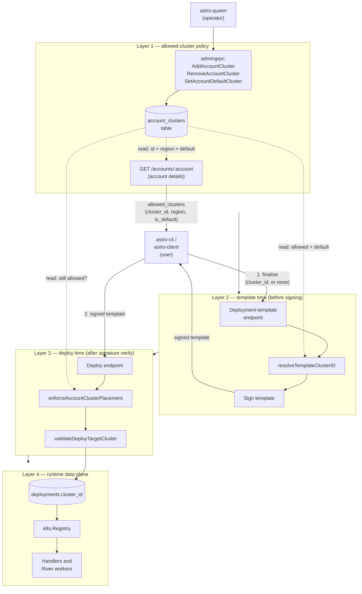
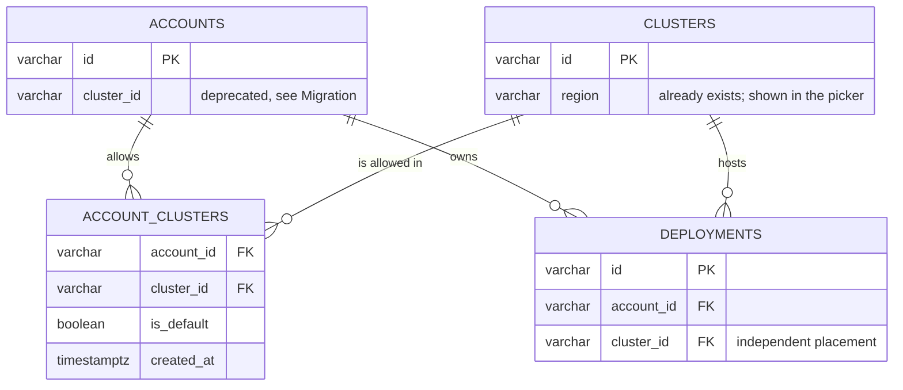
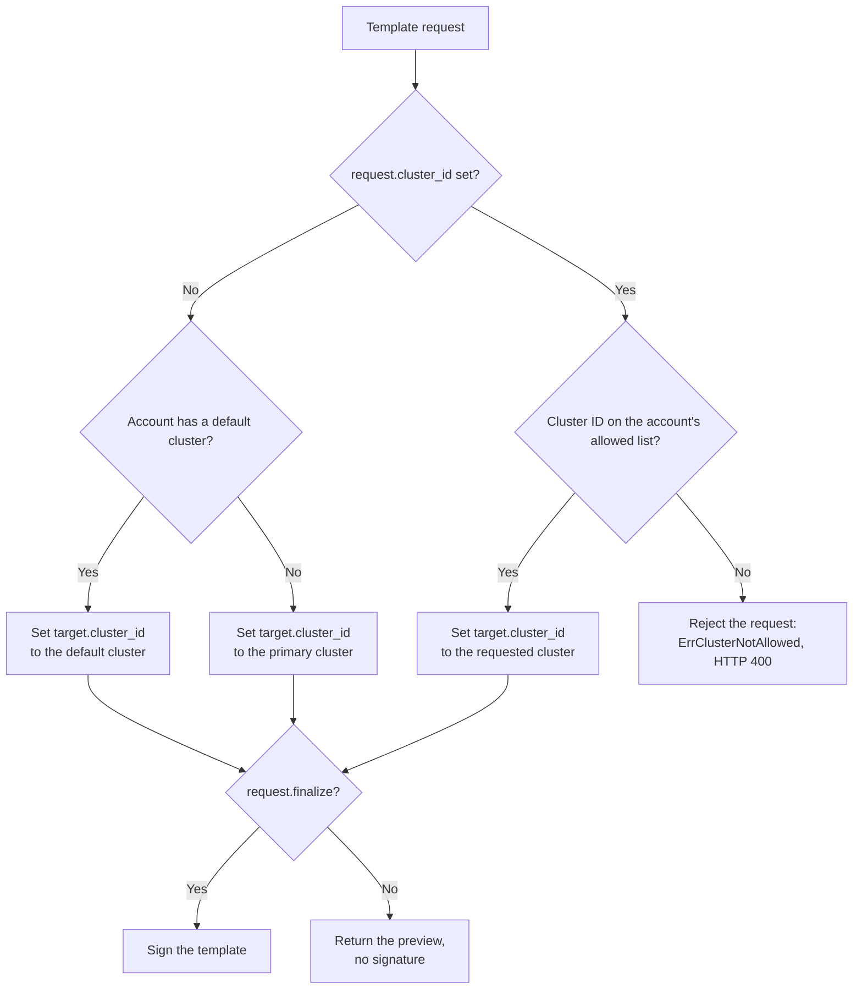
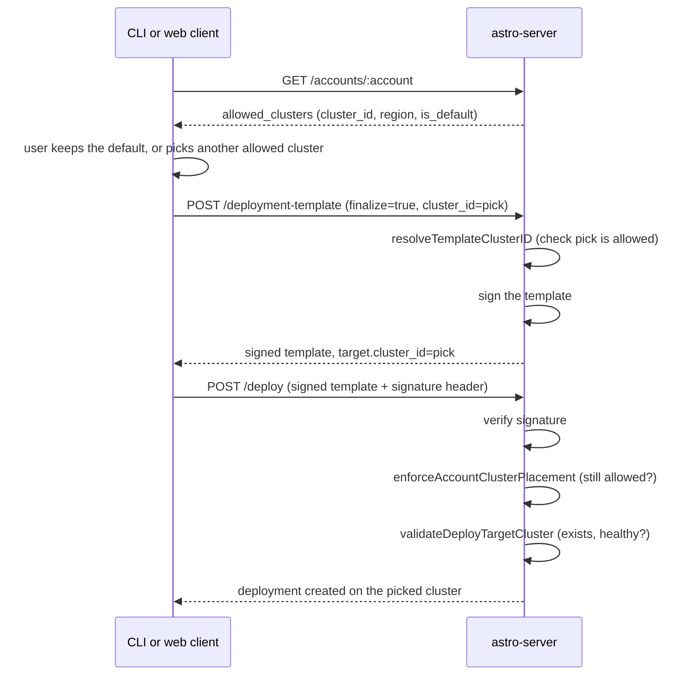

# Multi-Cluster Account Support — Astro-Server Contract

**Version**: 1.1
**Status**: Draft
**Date**: 2026-08-18

## Overview

Today, the system allows one additional cluster for each account. The column `accounts.cluster_id` holds one cluster ID, or no value. The function `applyAccountClusterPlacement` (`apps/astro-server/handlers/deploy.go:258-269`) sets the `Target.ClusterID` value for every deploy request and every template request. The function copies the value from `accounts.cluster_id`. The function does this before the validation step runs, and the function replaces any value the caller sent.

An operator cannot split one account's workloads across two regions. This is a problem for an account that needs this split for data residency, for extra capacity, or for a cluster move. Each account has one cluster placement only.

This document defines a new design. The new design replaces the single cluster ID with a list of allowed clusters. An account can have zero or more allowed clusters. One allowed cluster can carry the default flag.

When a deploy request has no `cluster_id` value, the system sends the deployment to the account's default cluster. When the account has no default cluster, the system sends the deployment to the primary cluster.

When a deploy request has a `cluster_id` value, the system checks this value against the account's allowed cluster list. The system accepts the request only when the cluster ID is on this list. This check closes a gap in the current system: the deploy request format already accepts a `Target.ClusterID` value, but the current system never checks this value against the account.

A user builds a deployment through the deployment-template flow. This document adds a cluster picker to this flow. The template response shows the account's allowed cluster list to the user, and marks the default cluster. The user can pick one cluster from this list. When the user picks no cluster, the system uses the account's default cluster. This is a change from the original multi-cluster design, where cluster choice stayed an admin-only action; see Non-Goals for the boundary that remains.

This design builds on two other documents: [`multi-region-cluster-support-spec.md`](multi-region-cluster-support-spec.md) and [`cluster-registration-config-spec.md`](cluster-registration-config-spec.md). This design does not change either document. Cluster registration, connection settings, and the `k8s.Registry` component stay the same. This design changes only the method an account uses to pick a cluster from the current cluster list.

## Architecture



The admin surface (Layer 1) changes the allowed cluster list, and also serves it back out for display: the account details endpoint reads `account_clusters` joined with `clusters.region`, so a caller can build a picker without touching the deploy path at all. The deploy surface (Layers 2-3) never serves display data — it only resolves and locks in a choice at template time, then re-checks that choice at deploy time. Layer 4 still reads the cluster ID from the deployment row, not from the account — this matches the current design, and this layer never changes across this document.

## Terminology

- **Allowed cluster** — a cluster where an account can place a deployment. An account can have zero or more allowed clusters.
- **Default cluster** — the allowed cluster that receives a deploy request with no `cluster_id` value. An account can have one default cluster, or no default cluster. When an account has no default cluster, a new deploy request goes to the primary cluster. This matches the current behavior for an account with no cluster ID value.
- **Placement** — the final `cluster_id` value for one deployment. This document does not change this concept. The value stays in the `deployments.cluster_id` column, independent of the account's allowed cluster list.
- **Orphaned deployment** — a deployment with a `cluster_id` value that is not on its account's allowed cluster list. This term replaces the current term "placement mismatch."
- **Template preview** — a call to the deployment-template endpoint with `finalize` set to false. The response carries editable fields and the account's allowed cluster list, but no signature.
- **Finalized template** — a call to the same endpoint with `finalize` set to true. The response carries a signature. The deploy endpoint accepts only a finalized template, resubmitted unchanged.

## Goals

1. An account can have more than one allowed cluster at the same time.
2. An account has zero or one default cluster among its allowed clusters.
3. The system checks a caller-submitted `Target.ClusterID` value against the account's allowed cluster list, not only against cluster existence. This check is a new authorization step, not only a data model change.
4. A user can pick a cluster from the account's allowed list while building a deployment template. When the user picks no cluster, the system uses the account's default cluster.
5. An account with zero or one cluster works the same way before and after this migration. A user of such an account sees no picker, and the deploy flow looks exactly as it looks today.
6. An operator cannot remove a cluster from an account's allowed list while a deployment under that account still targets that cluster. The operator must migrate those deployments first, as a separate, explicit action. This matches the current design, where the `SetAccountCluster` RPC and the `MigrateAccountDeployments` RPC are already separate actions, and it matches the existing rule on `clusters` deregistration: a cluster still in use cannot be removed out from under running work.

## Non-Goals

1. **Automatic placement.** The cluster for a deployment is still an explicit choice: the account's default cluster, or a cluster the user names from the allowed list. No scheduler picks a cluster by capacity or by latency.
2. **A limit on the number of clusters per account.** The only limit is the number of registered clusters. This document adds no configured limit.
3. **A change to cluster registration, connection settings, or the primary cluster model.** These stay out of scope. See the two documents this design builds on.
4. **A cluster picker outside the deployment-template flow** (for example, a standalone "list my clusters" page, or cluster choice during agent build or push). The picker in this document lives only in the template-and-deploy path.
5. **Any constraint on which clusters an account may be bound to** (a required region, a residency rule, a capability match). `AddAccountCluster` checks only that the cluster exists. Nothing stops an operator from binding a cluster in the wrong region, so which clusters an account may use stays an operator judgment for now. A constraint field and its enforcement point are a follow-up design.
6. **Bulk migration across accounts.** `MigrateAccountDeployments` stays per-account, one call per account, as it is today. This document does not add a fan-out RPC or UI action to move every deployment off a cluster across every account bound to it. An operator decommissioning a cluster calls `MigrateAccountDeployments` once per affected account.

## Current State (for contrast)

- The column `accounts.cluster_id` (type `varchar(64)`) holds one cluster ID, or no value. This column is a foreign key to `clusters(id)`. See `sql/astro-server/schema.sql:86-89`.
- The function `applyAccountClusterPlacement` sets the `Target.ClusterID` value from the `accounts.cluster_id` column, for every deploy request and every template request. The function replaces any value the caller sent. See `handlers/deploy.go:258-269`, called from `handlers/deploy.go:331` and `handlers/deploy.go:505`.
- `deployment.TemplateRequest` (`internal/deployment/deployment_spec.go:440-451`) has no cluster field today. A caller cannot ask for a specific cluster while building a template.
- `deployment.TemplateResponse` (`internal/deployment/deployment_spec.go:494-505`) has no field that lists an account's clusters. A caller has no way to learn what clusters exist for the account.
- The admin RPC `SetAccountCluster` sets the value in the `accounts.cluster_id` column. See `internal/admingrpc/accounts.go:20-74`. The admin RPC `MigrateAccountDeployments` moves each deployment off its current cluster onto the account's one cluster. See `internal/admingrpc/accounts.go:80-136`.
- The function `clusterplacement.PlacementMismatch` compares two values: the deployment's `cluster_id` value against the account's `cluster_id` value. See `internal/clusterplacement/placement.go:19-22`.
- The `PlacementCard` component in astro-queen shows one selection list and one "Migrate deployments" button. See `apps/astro-queen/web/src/pages/account-detail.tsx:600-674`.
- `modules/astro-cli` has no reference to a cluster ID anywhere. The CLI never reads or sets `target.cluster_id` in a deploy spec.
- `isEuAccount()` (`apps/astro-client/src/lib/account-cluster.ts:1-4`) checks `account.cluster_id === 'eu'` to show an EU badge on the org settings page. It was added as a temporary rollout confirmation aid, and it is the last reader of `accounts.cluster_id`.
- `clusterpull.Authorizer.ResolveHomedAccount` (`apps/astro-registry/internal/clusterpull/authorizer.go`) authorizes image pulls by checking that an account is homed on the requesting cluster, reading `accounts.cluster_id`. This assumes one cluster per account: an account on two clusters would be homed on one, and pods on the other could not pull.

Every component after the deployment row already picks a cluster from the deployment row, not from the account. This includes the `k8s.Registry` component, the ingress config, the observability config, the tenant-router config, and the River job data — each through `dep.EffectiveClusterID()`. This document does not change these components.

## Schema

### New table: `public.account_clusters`

```sql
CREATE TABLE public.account_clusters (
    account_id  varchar(64) NOT NULL REFERENCES public.accounts(id) ON DELETE CASCADE,
    cluster_id  varchar(64) NOT NULL REFERENCES public.clusters(id) ON DELETE RESTRICT,
    is_default  boolean NOT NULL DEFAULT false,
    created_at  timestamptz NOT NULL DEFAULT now(),
    PRIMARY KEY (account_id, cluster_id)
);

CREATE UNIQUE INDEX account_clusters_one_default
    ON public.account_clusters (account_id) WHERE is_default;
```



The rule `ON DELETE RESTRICT` on `cluster_id` matches the same rule on `deployments.cluster_id`. An operator cannot remove a cluster from the `clusters` table while an account still allows this cluster. This rule uses the same logic as the current rule: an operator cannot remove a cluster while a deployment still targets it.

### `accounts.cluster_id` — deprecated, dropped after a wait period

The column `accounts.cluster_id` stays in the table during the migration. Old code can still read this column during this time. See the Migration section below. The team removes this column after every caller moves to the `account_clusters` table. After this document takes effect, no code writes a new value to this column.

## Placement Logic

Two separate checks replace `applyAccountClusterPlacement`. The first check runs at template time, before the server signs the template. The second check runs at deploy time, after the server verifies the signature.

### Resolving a cluster at template time

`resolveTemplateClusterID` runs inside `respondDeploymentTemplate` (`handlers/deploy.go:331`), before the signature step. The function reads the caller's requested cluster ID from the new `TemplateRequest.ClusterID` field, and writes only the resolved target into the response — the full allowed list, with display metadata, is a separate concern; see Cluster Metadata on the Account Details Endpoint, below.

```go
// currentClusterID is the cluster an existing deployment already runs on, empty
// for a first deploy. Keeping it stops a redeploy from relocating live work.
func resolveTemplateClusterID(resp *TemplateResponse, requested string, allowed []account.ClusterBinding, currentClusterID string) error {
    if requested == "" {
        if currentClusterID != "" && isAllowed(currentClusterID, allowed) {
            resp.Template.Target.ClusterID = currentClusterID
            return nil
        }
        resp.Template.Target.ClusterID = defaultClusterID(allowed) // "" if no default set
        return nil
    }
    if !isAllowed(requested, allowed) {
        return ErrClusterNotAllowed // -> 403 at template time, before any signature is issued
    }
    resp.Template.Target.ClusterID = requested
    return nil
}
```



- When the request has no `cluster_id` value and the account has a default cluster, the system sets `target.cluster_id` to the default cluster. This matches the current behavior for an account with one cluster binding.
- When the request has no `cluster_id` value, the account has no default cluster, and the account has no required-region constraint, the system sets `target.cluster_id` to an empty value. This sends the deployment to the primary cluster. This matches the current behavior for an account with no cluster binding.
- When the request has no `cluster_id` value, the account has no default cluster, and the account **does** have a required-region constraint, the system rejects the request. The primary cluster has no row in `clusters`, so it carries no `region` to check — falling back to it could silently place the deployment outside the account's required region. This is a hard error, not a silent fallback, and it is checked at template time, before anything is signed.
- When the request has a `cluster_id` value, this value must be on the account's allowed cluster list. This is a new rule. The rejection happens at template time, before the server signs anything, so a rejected choice never reaches the deploy endpoint.
- The template response carries no cluster list. A caller building a picker gets that from the account details endpoint (below), not from this endpoint — this endpoint only resolves and locks in one choice per call.
- `enforceAccountClusterPlacement` (below) needs no equivalent check: by the time a template is signed, `target.cluster_id` is either a specific cluster already known to satisfy the constraint, or empty only for an account with no constraint. An empty value can never reach the deploy endpoint for a constrained account.

### Re-checking placement at deploy time

`enforceAccountClusterPlacement` replaces the deploy-time call to `applyAccountClusterPlacement` (`handlers/deploy.go:505`). This call runs after `specsign.Verify` (`handlers/deploy.go:755`), so the submitted `target.cluster_id` value is already known to be untouched since the server issued it. This function checks the value, and does not change it:

```go
func enforceAccountClusterPlacement(ds *deployment.AstroDeploymentSpec, allowed []account.ClusterBinding) error {
    if !isAllowed(ds.Target.ClusterID, allowed) {
        return ErrClusterNotAllowed // the account's allow-list changed after the template was signed
    }
    return nil
}
```

This closes the window between "the server signs a template" and "the caller submits it for deploy." An operator can remove a cluster from an account's allowed list in that window; this check catches it, instead of silently deploying to a cluster the account no longer allows. `validateDeployTargetCluster` (`handlers/deploy.go:273-322`) runs after this step, unchanged: it checks that the resolved cluster exists and is healthy.

### Orphaned deployments

The function `PlacementMismatch` changes to a list-membership check. A deployment is orphaned when its `EffectiveClusterID()` value is not on the account's current allowed cluster list. This also covers the case where the account has an empty allowed list and the deployment is not on the primary cluster. Admin tools use this orphaned status to flag a deployment for a move. This new concept covers the old concept: a single-cluster account is a special case of an allowed list with one item.

## Cluster Metadata on the Account Details Endpoint

A picker needs to show more than a bare cluster ID — at minimum, the region, so a user can tell clusters apart. This metadata is a property of the account, independent of any single deploy: it belongs on `GET /accounts/:account` (`handlers.GetAccount`, `handlers/accounts.go:317-368`), not on the deployment-template endpoint. The template endpoint's job is narrower — resolve and lock in one choice per call — not serve a display list.

`AccountResponse` gains one field:

```go
type AccountResponse struct {
    // ... existing fields ...
    AllowedClusters []AccountClusterInfo `json:"allowed_clusters,omitempty"`
}

type AccountClusterInfo struct {
    ClusterID string `json:"cluster_id"`
    Region    string `json:"region"`
    IsDefault bool   `json:"is_default"`
}
```

`GetAccount` populates this by joining `account_clusters` with `clusters` for the account named in the URL. The field is omitted (nil, not an empty array) for an account with zero allowed clusters, so an older client and a zero-cluster account both see no change in the response shape they already handle.

`GET /accounts/:account` is a public, unauthenticated read today (`main.go:1090`, "Account endpoints (public read)") — `allowed_clusters` inherits that with no new gate. This is intentional, not an oversight: a cluster's `region` is comparable in sensitivity to the display name, bio, and location already public on this endpoint, and the account's build/deploy activity is already visible to anyone through the public agent listing. This is distinct from the admin-only `ListAccountClusters` gRPC (see Admin API): the same underlying data, served on two surfaces for two audiences — astro-queen calls the RPC over mTLS; anyone can call the REST endpoint, the same as every other field on it.

## Deployment Template Flow

A user picks a cluster by reading `allowed_clusters` from the account details endpoint, then locks that pick into a template with one call to the deployment-template endpoint, then one call to the deploy endpoint. The signature step is why the pick happens before finalize: the server signs `response.template` exactly as it stands, so `target.cluster_id` must already hold the user's final choice at that point.



`TemplateRequest` gains one field; `TemplateResponse` gains none:

```go
type TemplateRequest struct {
    // ... existing fields ...
    ClusterID string `json:"cluster_id,omitempty"` // caller's pick; empty picks the account's default
}
```

This field is additive. A caller on an older client version sends no `cluster_id`, so the deploy flow for that caller is unchanged.

## Admin API

Three new RPCs replace the `SetAccountCluster` RPC. A single-value setter does not fit a list of allowed clusters.

- **`AddAccountCluster(account_id, cluster_id, set_default)`** — adds one row to the `account_clusters` table. The RPC checks that the cluster exists, the same check the current `SetAccountCluster` RPC runs. When the caller sets `set_default` to true, the RPC clears the old default flag and sets the default flag on this new row.
- **`RemoveAccountCluster(account_id, cluster_id)`** — removes one row from the `account_clusters` table. The RPC first checks for a deployment under this account with `EffectiveClusterID() == cluster_id`. When one exists, the RPC returns `ErrInUse` and removes nothing — the same rejection pattern `DeregisterCluster` already uses when a deployment still references a cluster row. The operator must call `MigrateAccountDeployments` to move those deployments off `cluster_id` first, then call `RemoveAccountCluster` again. When the row held the default flag and removal succeeds, the account has no default cluster afterward; a new deploy request with no `cluster_id` value then goes to the primary cluster. The RPC does not set the default flag on another allowed cluster.
- **`SetAccountDefaultCluster(account_id, cluster_id)`** — moves the default flag to a cluster that is already on the account's allowed list. The RPC returns an error when the cluster ID is not on this list. The caller must call `AddAccountCluster` first.
- **`ListAccountClusters(account_id)`** — a new RPC. It returns the full allowed cluster list for one account, and marks the default cluster. The astro-queen UI uses this RPC. `resolveTemplateClusterID` and `enforceAccountClusterPlacement` read the same underlying data through the account store, not through this RPC — this RPC is for the admin surface only. `GET /accounts/:account`'s `allowed_clusters` field (see Cluster Metadata on the Account Details Endpoint) serves the equivalent list to a non-admin caller.

The `MigrateAccountDeployments` RPC gains a new required field: `target_cluster_id`. In the current design, this target is always the account's one cluster. The RPC checks that `target_cluster_id` is on the account's allowed list. Then the RPC works as it works today: the RPC queues a move job for each deployment where `EffectiveClusterID()` does not match the target.

Proposed protobuf messages, in place of `SetAccountClusterRequest` and `SetAccountClusterResponse` (`packages/astro-proto/proto/admin/v1/admin.proto`):

```protobuf
message AccountCluster {
  string cluster_id = 1;
  bool is_default = 2;
}
message AccountClusterList {
  repeated AccountCluster clusters = 1;
}
message AddAccountClusterRequest {
  string account_id = 1;
  string cluster_id = 2;
  bool set_default = 3;
}
message RemoveAccountClusterRequest {
  string account_id = 1;
  string cluster_id = 2;
}
message SetAccountDefaultClusterRequest {
  string account_id = 1;
  string cluster_id = 2;
}
message MigrateAccountDeploymentsRequest {
  string account_id = 1;
  string target_cluster_id = 2; // required; must be an allowed cluster
}
```

The field `AdminDeployment.account_cluster_id` (`admin.proto:96`) changes from one string value to a repeated field, `account_cluster_ids`. This field holds the account's full allowed cluster list. The function `populateAdminDeploymentPlacement` (`internal/admingrpc/placement.go`) sets an orphaned flag on the deployment, not a mismatched flag.

## astro-queen UI

The `PlacementCard` component changes from one selection list to a row list.

- Each allowed cluster shows as one row. Each row has a default marker (a radio button or a star icon) and a remove button.
- An "Add cluster" control shows a drop-down list of clusters not yet on the allowed list. This control adds a new row.
- The "Migrate deployments" button now needs a target cluster. The operator picks the allowed cluster for the orphaned deployments. The current design does not need this pick, because the current design has only one possible target.
- The primary cluster stays available at all times, with no row in the `account_clusters` table. This matches the primary cluster's current status: the primary cluster has no row in the `clusters` table either. An empty allowed list, with no default cluster, still sends a new deployment to the primary cluster.

## CLI and Web Client

`modules/astro-cli` and `apps/astro-client` stay unaware of clusters until an account has more than one allowed cluster. When `allowed_clusters` from the account details endpoint holds fewer than two entries, neither surface shows a picker, and the deploy flow looks exactly as it looks today.

- **astro-cli.** The interactive deploy flow fetches `GET /accounts/:account`, reads `allowed_clusters`, and — only when the list holds two or more entries — prompts the user to pick one, with the default cluster pre-selected. A non-interactive deploy (for example, in a CI pipeline) can set the pick directly with a new `--cluster` flag; an unset flag leaves `cluster_id` empty in the template request, which resolves to the account's default cluster.
- **astro-client.** The deploy configuration form adds a cluster select field, populated from `allowed_clusters`, pre-set to the default cluster. The field is hidden when the account has fewer than two allowed clusters. This reuses `useAccount` (`src/api/queries/accounts.ts:37-40`), the existing query hook backing `GET /accounts/:account` — no new query hook, key, or endpoint. `usePostDeploymentTemplate` (`src/api/queries/blueprints.ts:86`) gains only the `cluster_id` field on its request type, to carry the form's current selection when it calls the mutation, the same way it already carries every other field.
- Both surfaces send the user's final pick to the template endpoint with `finalize=true`, then resubmit the signed template to the deploy endpoint unchanged, per the Deployment Template Flow above.

## Migration

1. **Schema.** The team adds the `account_clusters` table and drops the `accounts.cluster_id` column. No data migration is needed: every `cluster_id` value is already NULL, so there is no binding to carry over. The new table starts empty, which matches the current rule: no cluster binding means the primary cluster.
2. **Placement logic.** The team replaces `applyAccountClusterPlacement` with `resolveTemplateClusterID` at the template call site and `enforceAccountClusterPlacement` at the deploy call site. Both read from the `account_clusters` table, not from the `accounts.cluster_id` column. Every account starts with an empty allowed list, so the system behavior stays exactly the same.
3. **Template API.** The team adds `TemplateRequest.ClusterID`. This field is additive, so this step ships independently of client changes.
4. **Account details API.** The team adds `AccountResponse.AllowedClusters` to `GET /accounts/:account`, populated by joining `account_clusters` with `clusters`. Also additive, and independent of the Template API step above.
5. **Admin RPCs.** The team adds the `AddAccountCluster`, `RemoveAccountCluster`, `SetAccountDefaultCluster`, and `ListAccountClusters` RPCs, and updates `MigrateAccountDeployments` to accept the `target_cluster_id` field. The team removes the `SetAccountCluster` RPC after astro-queen stops calling it.
6. **astro-queen UI.** The team ships the new multi-row `PlacementCard` component.
7. **CLI and web client.** The team adds the cluster prompt and the `--cluster` flag to astro-cli, and the cluster select field to astro-client, both reading `allowed_clusters` from the account details endpoint (step 4). Both stay hidden for an account with fewer than two allowed clusters, so this step carries no risk for the accounts that exist today.
8. **Homing and cleanup.** The team repoints `ResolveHomedAccount` at `account_clusters`, so pull authorization and placement agree, and deletes the EU badge — the last reader of `accounts.cluster_id`.

Each step keeps the current behavior for every account with zero or one cluster binding. This design needs no single cut-over day, and no forced migration for a current single-cluster account or a current zero-cluster account.

### Side effects

- A new table appears in the production Postgres database.
- `TemplateRequest` and `AccountResponse` each gain one new field. Both are additive — an older CLI or client version keeps working unchanged.
- The `AdminDeployment` proto field changes from one value to a repeated value. This is a breaking change for a caller that reads the `account_cluster_id` field directly. The research for this document found one caller: astro-queen. This is the same caller found for the current `SetAccountCluster` RPC.
- The `MigrateAccountDeploymentsRequest` message gains a required field. This is a breaking change for a current caller, with the same single-caller scope: astro-queen.

## What This Kills

- The `accounts.cluster_id` single value, and the `SetAccountCluster` whole-value setter RPC.
- The old two-value "placement mismatch" model. The new list-membership "orphaned" model replaces it.
- The old assumption in `MigrateAccountDeployments`: that each account has exactly one correct target cluster.
- The assumption that astro-cli and astro-client stay permanently unaware of clusters. They now show a picker, but only when an account's allowed list holds more than one cluster.

## What This Preserves

- Every runtime data-plane path: the `k8s.Registry` component, the `clustercfg.Resolve` function, the ingress config, the observability config, and the River job data. Each of these already uses the `deployments.cluster_id` value as its key. This document does not change any of these paths.
- The foreign key and the `ON DELETE RESTRICT` rule on the `deployments.cluster_id` column.
- The separation between a placement policy change and a deployment move. The `AddAccountCluster`, `RemoveAccountCluster`, and `SetAccountDefaultCluster` RPCs never change an existing deployment; `RemoveAccountCluster` instead refuses to run while one is attached. Only the `MigrateAccountDeployments` RPC moves a deployment.
- The `ON DELETE RESTRICT` / `ErrInUse` pattern already used for cluster deregistration. `RemoveAccountCluster` reuses the same shape of check: an operator cannot detach a cluster that is still doing work.
- The primary cluster's environment-variable-only model. The primary cluster still has no row in any table.
- The signed-template integrity check. The signature still covers the whole template, including `target.cluster_id`; a tampered cluster pick still breaks the signature the same way a tampered image or a tampered variable does today.
- The current deploy flow, unchanged in every visible way, for an account with zero or one allowed cluster.
- The separation between a display concern and a deploy-time decision. The deployment-template and deploy endpoints resolve and lock in one choice; the account details endpoint is the one place that lists and describes every choice.
