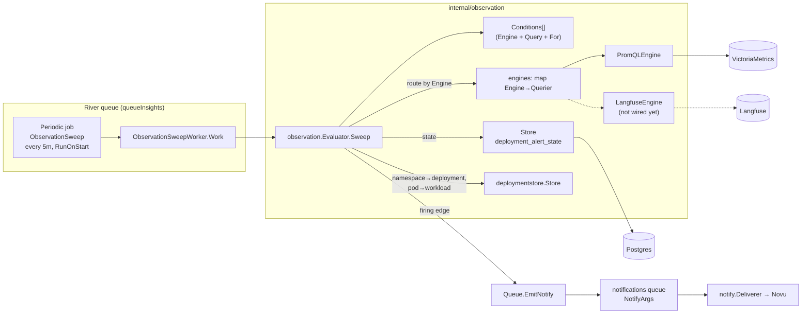
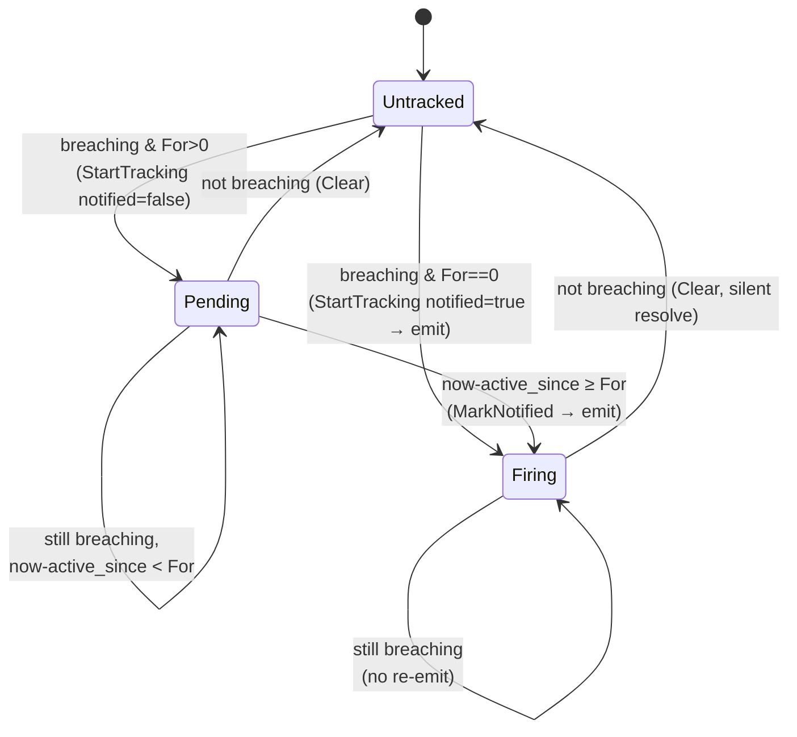
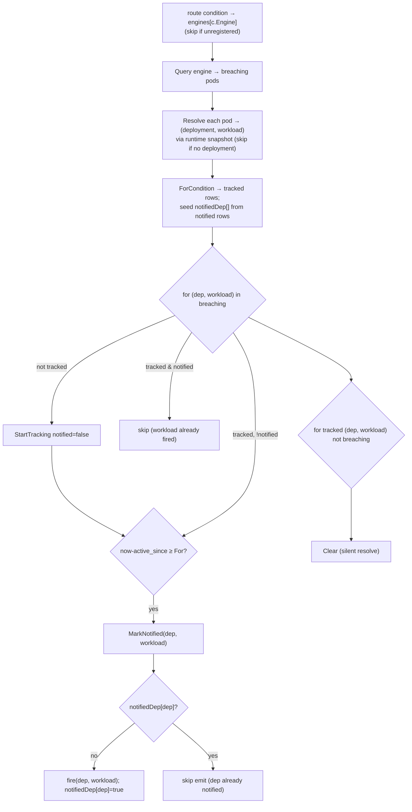
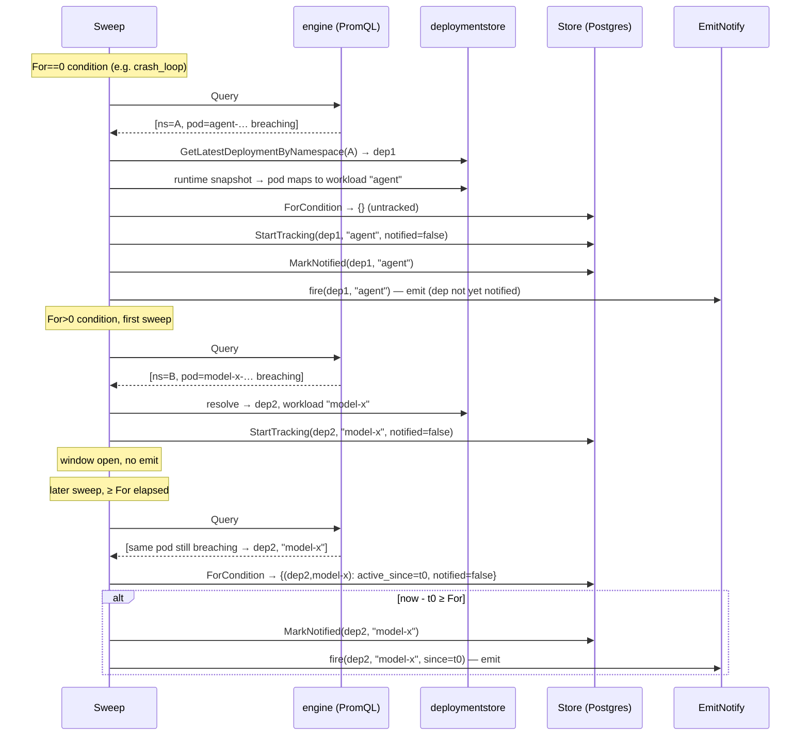

# Observation Alert Evaluator Spec

> This spec covers the **alerting evaluator** — the continuous producer that detects sustained resource/health problems on running agents and emits notifications. It is the observation half of the notifications system (`notifications-spec.md`); read this for the algorithm, that for the delivery path.

## Summary

Deployed agents can degrade silently after a successful deploy — OOM pressure, crash loops, CPU throttling. These are continuous conditions, not discrete state changes, so there is no writer choke point to emit from. The observation evaluator is a periodic in-process job that runs threshold queries against metrics, holds firing state in Postgres, and emits **one notification per firing episode** — never on a transient spike, never a duplicate.

It deliberately does **not** embed `prometheus/prometheus/rules`: that pulls ~320 modules (the full Azure/AWS/GCP/DO service-discovery tree) into a server with zero Prometheus deps today. The `for` window + edge-only firing + dedup + resolve is ~150 lines over the existing `promquery` client and one Postgres table.

## Goals

- Detect sustained resource/health breaches on running deployments.
- Fire at most once per breach episode; survive process restarts; recover after resolve.
- Reuse the notifications delivery path (recipients, preferences, Novu trigger) — this package owns *detection + dedup only*.

## Non-goals

- No anomaly/ML/SLO engine. Static per-condition thresholds + sustained windows only; adaptive baselines are later.
- No resolve notification in v1 (silent resolve — state cleared, nothing mailed).
- No per-deployment threshold overrides yet.

## Architecture



The evaluator is constructed fresh inside each `Work` call from injected clients; the `queue` reference is wired post-construction (`wiredWorkers`), so the worker is a no-op until wiring completes or when `PromClient` is absent. Emit is decoupled: the sweep only *enqueues* a `NotifyArgs` job — recipient resolution, preferences, and the Novu trigger happen later on the `notifications` queue, exactly as for discrete events.

### Query engines

Signals come from different backends: resource/health metrics live in VictoriaMetrics (PromQL), while error rate and latency live in Langfuse. The evaluator is not tied to any one backend — it holds an `engines map[Engine]Querier` and routes each condition to the querier named by its `Engine`. A condition whose engine is not registered is skipped, so shipping a Langfuse-sourced condition before the Langfuse engine is wired is inert rather than an error.

```
Querier interface { Query(ctx, query string) ([]Series, error) }   // engine-neutral
Series  struct    { Labels map[string]string; Value float64 }      // must carry `namespace`
```

`PromQLEngine` adapts `*promquery.Client` (VictoriaMetrics) to `Querier`, converting `promquery.Sample`→`Series`. A future `LangfuseEngine` implements the same interface; adding it is a one-line registration in the worker plus `Engine`-tagged conditions — no evaluator change.

### Interfaces (test seams)

The evaluator depends on narrow interfaces, each satisfied by a concrete client, so the sweep logic is unit-testable with in-memory fakes:

| Interface | Concrete | Role |
|-----------|----------|------|
| `Querier` (per `Engine`) | `*PromQLEngine` (→ `*promquery.Client`); future `*LangfuseEngine` | run a condition's query → breaching `Series` |
| `deployments` | `*deploymentstore.Store` | namespace → deployment; runtime snapshot for pod → workload |
| `stateStore` | `*Store` | firing-state persistence |

## Conditions

A `Condition` is one alertable rule:

```
Condition{ Name, Title string; Severity Severity; Engine Engine; Query string; For time.Duration }
```

- **`Name`** is the stable identifier for firing state and the per-episode dedupe key (kept per-condition, see below).
- **`Title`** is the human label the notification template renders — it rides in the payload as `reason`.
- **`Severity`** (`Warning` | `Critical`) selects which of the two Novu workflows fires — see [Two workflows by severity](#two-workflows-by-severity).
- **`Engine`** names the query backend (`promql`, `langfuse`). The evaluator routes the condition to that engine's `Querier`; an unregistered engine means the condition is skipped.
- **`Query`** is that engine's expression. Every returned series must carry `namespace` and `pod` labels; those are the currently-breaching pods. PromQL queries aggregate `by (namespace, pod)`; the evaluator resolves each pod to its deployment + workload in code (a pod only alerts if its namespace maps to a deployment).
- **`For`** is the sustained window a workload must stay breaching before firing. `For == 0` means fire on first detection — used when the query itself already spans a window (e.g. `increase(...[15m])`).

Shipped rule set (`conditions.go`) — all on the `promql` engine:

| Name | Sev | PromQL (target series) | For | Meaning |
|------|-----|------------------------|-----|---------|
| `crash_loop` | critical | `max by (namespace, pod) (kube_pod_container_status_waiting_reason{reason="CrashLoopBackOff"}) > 0` | 5m | container stuck in CrashLoopBackOff (kubelet gave up fast-restarting) |
| `oom_killed` | critical | `max by (namespace, pod) (kube_pod_container_status_last_terminated_reason{reason="OOMKilled"}) > 0` | 0 | last termination was an OOM kill (raise the memory budget) |
| `unschedulable` | critical | `max by (namespace, pod) (kube_pod_status_unschedulable) > 0` | 10m | pods stuck Pending (insufficient capacity / quota) |
| `restart_storm` | warning | `max by (namespace, pod) (increase(kube_pod_container_status_restarts_total[5m])) > 5` | 0 | acute restart burst (flapping before backoff trips) |
| `memory_over_budget` | warning | `max by (namespace, pod) (container_memory_working_set_bytes / on(namespace,pod,container) group_left kube_pod_container_resource_limits{resource="memory"}) > 0.9` | 10m | working set sustained above 90% of limit |
| `compute_over_budget` | warning | `max by (namespace, pod) (rate(container_cpu_cfs_throttled_periods_total[10m]) / rate(container_cpu_cfs_periods_total[10m])) > 0.5` | 10m | CPU CFS-throttled a majority of periods |
| `cpu_over_provisioned` | warning | `max by (namespace, pod) (rate(container_cpu_usage_seconds_total[1h]) / on(namespace,pod,container) group_left kube_pod_container_resource_requests{resource="cpu"}) < 0.1` | 6h | CPU usage far below its request (wasted reservation) |
| `memory_over_provisioned` | warning | `max by (namespace, pod) (container_memory_working_set_bytes / on(namespace,pod,container) group_left kube_pod_container_resource_requests{resource="memory"}) < 0.4` | 6h | memory usage far below its request (wasted reservation) |

`error_spike` / `latency_high` are `langfuse`-engine conditions (warning severity), intentionally unshipped — the Langfuse engine isn't wired yet, so adding them as `EngineLangfuse` conditions is inert until the engine registers, with no evaluator change. PromQL exprs target kube-state-metrics + cAdvisor and are best-effort; metric/label names may need tuning against the deployed exporters.

### Two workflows by severity

Conditions do **not** map 1:1 to Novu workflows. All of them collapse to **two** workflows keyed on `Severity`:

| Severity | Workflow id | Meaning |
|----------|-------------|---------|
| `Critical` | `observation.critical` ("Agent failing") | agent not functioning — crash loop, OOM, unschedulable |
| `Warning` | `observation.warning` ("Agent degraded") | degraded but running — restarts, memory/compute pressure, error spikes |

`fire()` builds the event as `notify.Observation(c.Severity.notifyType(), account, agent, deploymentID, reason)` — the workflow is the severity, and the `reason` (the condition `Title`, suffixed with the affected workload, e.g. "Out of memory — model-x") rides in the payload so a single template renders any condition ("{{payload.agent}}: {{payload.reason}}"). Two workflows means **two preference toggles** for the user, not one per condition, and adding a condition needs no new workflow.

Firing state and the dedupe key stay keyed on the granular condition `Name` (`crash_loop`, `oom_killed`, …), **not** the shared workflow — otherwise two critical-severity conditions on one deployment would collide in `deployment_alert_state` and suppress each other.

## Firing-state machine

State lives in `deployment_alert_state`, one row per `(deployment_id, workload, condition)`:

```
deployment_id text          -- deployment the breach belongs to
workload      text          -- workload component (e.g. "agent", "model-x")
condition     text          -- condition Name
active_since  timestamptz    -- first sample seen breaching; drives `For`
notified      boolean        -- firing edge handled for this workload?
updated_at    timestamptz
PRIMARY KEY (deployment_id, workload, condition)
```

State keys on **(deployment id, workload)**, not namespace. Metrics carry `namespace` + `pod`, so the evaluator resolves the namespace to a deployment (`GetLatestDeploymentByNamespace`) and each pod to its workload (via the deployment's runtime snapshot — the pod's `app.kubernetes.io/component`, e.g. `model-x`) *before* touching state; a pod that maps to no deployment is skipped. Per-workload keying lets the UI attribute an alert to the failing workload; keying by deployment id (not namespace) means a **redeploy is a distinct episode** with clean firing state.

The row's *existence* means "this workload is currently breaching and tracked"; `notified` marks whether this workload's firing edge has been handled. A breach episode is a row's lifetime, from `StartTracking` to `Clear`.

**One notification per (deployment, condition) episode.** Although state is per-workload, notifications are not multiplied: the evaluator emits only when a workload fires *and no other workload of the same deployment has already notified this condition*. So if the agent and model workloads both crash-loop, the user gets one mail (its `reason` naming the first workload), while the tab still shows each workload's own state.



Key invariants:

- **Edge-only firing.** An alert emits exactly once, on the `notified: false → true` transition. While a row stays breaching it never re-fires.
- **`active_since` is preserved.** `StartTracking` is `INSERT ... ON CONFLICT DO NOTHING`, so a re-observed breach never resets its window.
- **Silent resolve.** When a workload stops breaching, its row is deleted; v1 mails nothing on resolve.
- **Per-episode dedupe key.** The emitted event's `DedupeKey = <name>:<deploymentID>:<workload>:<active_since.Unix()>`. Because `active_since` is part of the key, a *new* breach after a resolve is a distinct Novu transaction (a real new alert), while retries/re-runs of the same episode collapse to the same key. This is the ultimate double-send guard even if River retries the sweep.

## Sweep algorithm

`Sweep` iterates conditions, routing each to the `Querier` for its `Engine` (skipping conditions whose engine isn't registered); a per-condition error is logged and the sweep continues (one flaky query can't fail the job). Each condition's `evaluate` runs the query, resolves each breaching pod to a `(deployment, workload)`, then does a set diff between *breaching now* and *tracked* — firing per workload but emitting at most once per deployment:



`fire()` receives the resolved deployment + workload; an emit error is logged, never fatal. It builds the event with `notify.Observation(c.Severity.notifyType(), accountID, agentName, deploymentID, reason)` where `reason` is the condition `Title` suffixed with the workload (severity → workflow, `reason` → payload), stamps the per-episode `DedupeKey`, and calls `EmitNotify`.

Sequence for the two firing paths:



## Delivery integration

Observation events use audience `members`; per-user Novu preferences and per-channel opt-outs apply like any other notification. The evaluator hands off at `EmitNotify` and is done — it never talks to Novu or resolves recipients itself. See `notifications-spec.md` §Observation alerts / §Recipient resolution for the rest of the path.

## Surfacing state (read API + UI)

`GET /api/v1/deployments/:id/alerts?workload=<component>` returns the full condition catalog with each condition's current state for **that workload**: `ok` (no row), `pending` (row present, `notified=false` — breaching inside the `for` window, not yet alerted), or `firing` (`notified=true`). `observation.Store.ForDeploymentWorkload(deploymentID, workload)` reads the rows for one workload keyed by condition name. Because the evaluator keys state by `GetLatestDeploymentByNamespace(ns).ID`, the handler reads under that same latest-deployment id (falling back to the viewed deployment). The catalog always renders in full, so an all-clear workload shows every alert as `ok` rather than an empty list. The astro-client pod detail panel renders this as an **Alerts** tab beside **Events** (`PodDetailPanel.tsx`), passing the panel's workload component and polling every 10s.

## Scheduling

Registered as a River periodic job on `queueInsights`: `PeriodicInterval(5m)`, `RunOnStart: true`, `UniqueOpts{ByPeriod: 5m}` so overlapping schedulers can't double-enqueue. The whole registration is gated on `PromClient` being configured — no metrics backend, no sweep.

## Failure & idempotency

- **Restart-safe.** All firing state is in Postgres; a restarted server resumes mid-window and mid-episode with no lost or duplicated alerts.
- **Query failure.** Logged per condition; that condition is skipped this sweep and retried next. Existing state is untouched (a breach isn't falsely resolved because one query errored — resolve only happens on a *successful* query returning no breach).
- **Emit failure.** Logged, non-fatal. Note the row is already `MarkNotified` before `fire`, so a failed emit is not retried within the episode; the alert is at-most-once per episode by design (a dropped alert is preferred to a duplicate). Revisit if delivery reliability needs at-least-once.

## Open questions

- Default thresholds (90% mem, 50% throttle, >3 restarts/15m) are first-guesses — validate against real workloads.
- At-most-once emit trades a rare dropped alert for zero duplicates. If that flips, move `MarkNotified` to *after* a confirmed enqueue.
- Resolve notifications (in-app only) and per-deployment threshold overrides are deferred (notifications-spec PR 5).

## References

- Code: `apps/astro-server/internal/observation/{evaluator,conditions,store}.go`
- Worker: `apps/astro-server/internal/riverqueue/observation.go`; schedule: `periodic.go`
- Schema: `sql/astro-server/schema.sql` (`deployment_alert_state`)
- Delivery: `docs/01-spec/notifications-spec.md`
