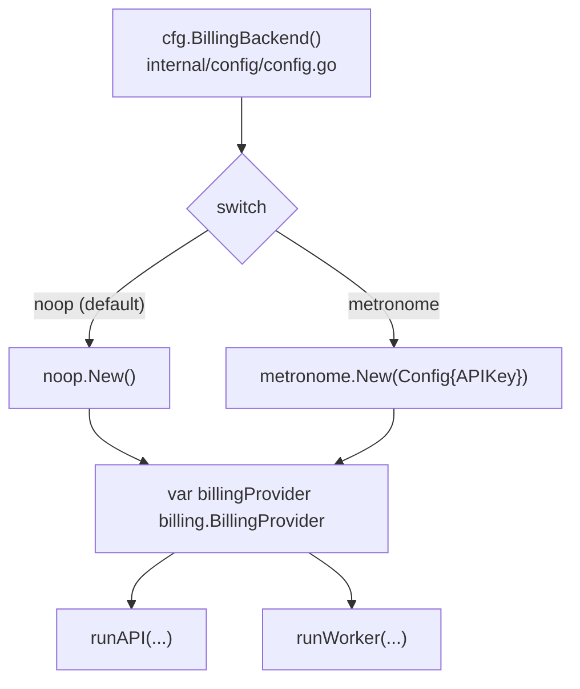
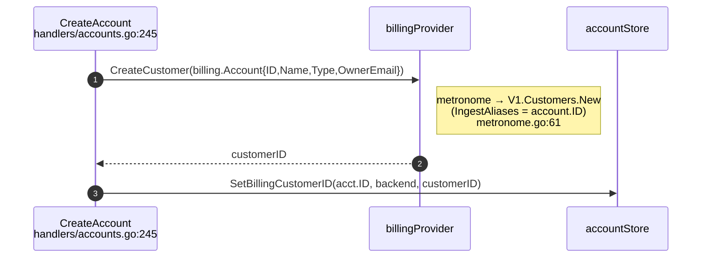
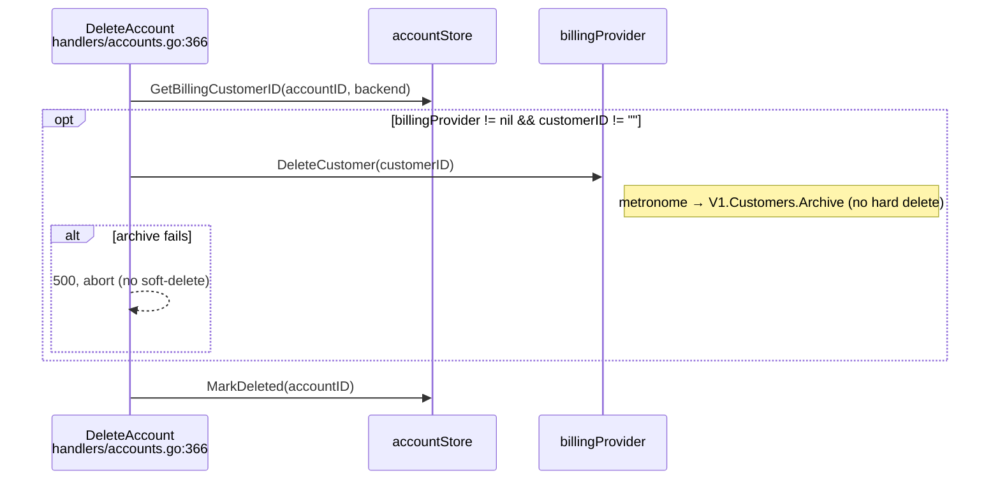
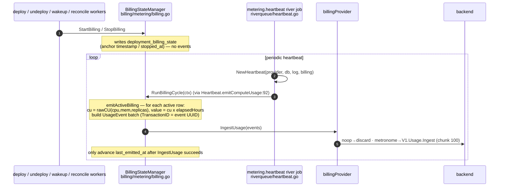
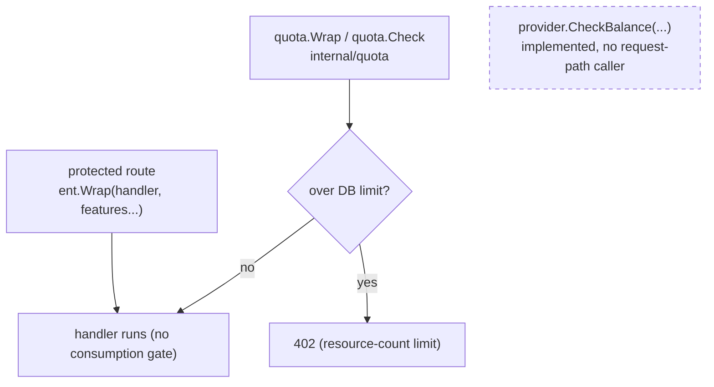
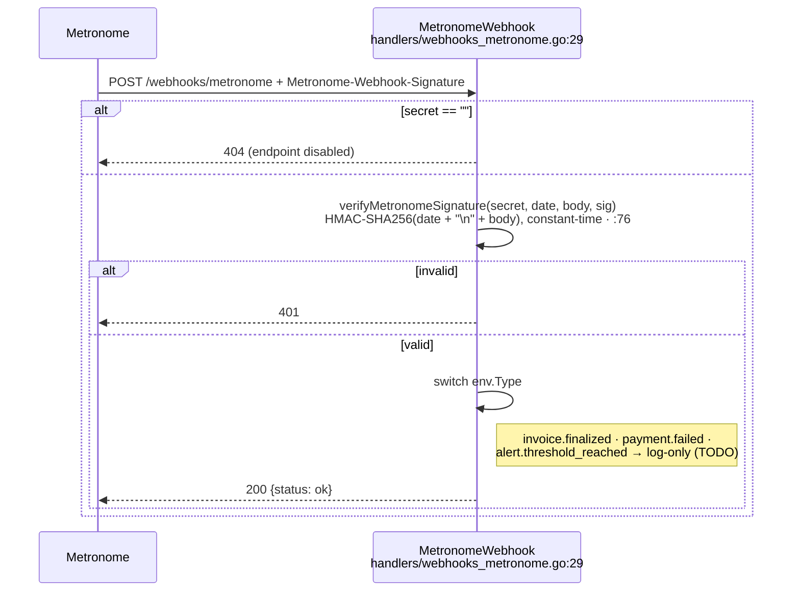
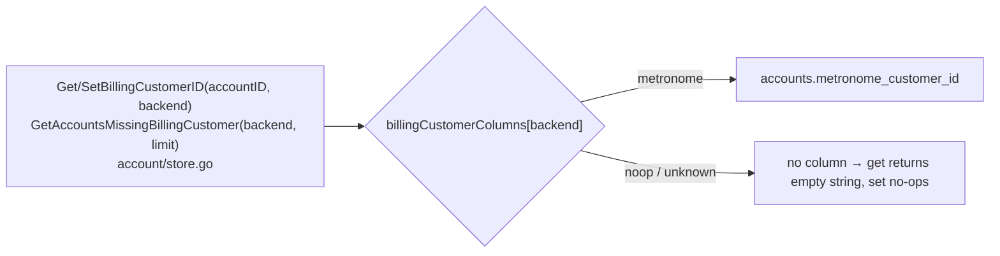
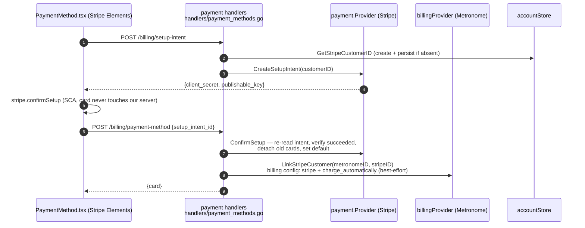

# Billing — Code-Level Data Flow (as built)

How billing data actually moves through `apps/astro-server` today. This is the
**as-built** view (function-by-function, with file references), complementing the
design intent in [`../01-spec/metronome-billing-spec.md`](../01-spec/metronome-billing-spec.md).
Where the code diverges from the spec's target design, this doc says so.

All paths depend on the `billing.BillingProvider` interface
(`internal/billing/provider.go`); the concrete backend is chosen once at startup.

## Startup wiring

`main.go` builds one `billing.BillingProvider` from `BILLING_PROVIDER` and threads
it into both the API server and the worker.

Note: `metronome.New` returns `nil` when `METRONOME_API_KEY` is absent, so
downstream `if billingProvider != nil` guards degrade to "billing disabled"
rather than panicking. `BillingBackend()` defaults to `noop` when
`BILLING_PROVIDER` is unset.

## The interface

`internal/billing/provider.go` — a single `BillingProvider` interface (all backends): `CreateCustomer`, `DeleteCustomer`, `IngestUsage`, `CheckBalance`, `GetUsage`.

There is no hosted-only provisioning surface. Packaging/contracts, credit grants, and commits are **not** server operations — they are provisioned out-of-band (Metronome admin / Terraform). `noop` returns zero values (and is the default backend); `metronome` implements the real calls.

---

## Flow 1 — Customer creation (inline, on account create)

Non-blocking: a billing failure is logged, never fatal to account creation.

## Flow 2 — Account delete (billing archive)

The billing customer is **archived before** the soft-delete, so charging stops
immediately and a **failed archive aborts the delete** — the account is never
left deleted-but-still-billable. Only after a successful archive does
`MarkDeleted` run. The purge worker does no billing work — it only tears down
deployments/other external resources and hard-deletes the row.

---

## Flow 3 — Usage metering (compute CU-hours)

The largest path, and fully provider-agnostic. Deployment lifecycle transitions
write **anchor rows** to `deployment_billing_state`; a periodic river heartbeat
computes CU-hour **deltas** and pushes them through `IngestUsage`. No events are
emitted at start/stop — only the heartbeat emits.

Key properties:
- **Idempotency**: `UsageEvent.TransactionID` is the event UUID; Metronome dedupes within its 34-day window, so retries/backfill are safe.
- **Failure handling**: if `IngestUsage` errors, the anchor timestamps are *not* advanced, so the next cycle re-emits the same delta (`billing.go:143-146`).
- **Package location**: this machinery lives in `internal/billing/metering`, written against the `billing.BillingProvider` interface — it drives any backend.

---

## Flow 4 — Balance gating (currently a no-op)

Metered-consumption gating (compute, knowledge_storage) has no balance source
wired, so the `middleware.Entitlements` gate is a **no-op**: `Wrap` passes through
and `Check` never blocks. DB-backed resource quotas (`internal/quota`) still
enforce counts and still return 402s. `CheckBalance` is implemented on every
provider but has no request-path caller; the seam is retained so it can be wired
later.

## Flow 5 — Metronome webhook (inbound)

Standalone endpoint, independent of the provider interface. Verifies an HMAC
signature, then dispatches on event type. Handlers are stubbed (log-only) today.

---

## Backend-aware persistence

Customer IDs are stored per-backend in `accounts`. The generic accessors resolve
the column from a whitelist, so a single call site serves any backend.

The Stripe customer id is stored separately on `accounts.stripe_customer_id`
(dedicated `Get/SetStripeCustomerID`), because Stripe is a **payment** provider,
not a metering backend — it isn't part of the `billingCustomerColumns` whitelist.

---

## Flow 6 — Payment method (Stripe card vault)

Stripe is used **only to collect and save a card**; astro-server never charges.
The card is confirmed synchronously (no webhook): the server re-reads the
SetupIntent from Stripe rather than trusting the client, then links the Stripe
customer to the Metronome customer so Metronome charges the saved card when it
finalizes invoices.

Notes:
- **Card-only, no webhook.** `confirmSetup` returns synchronously for cards, so
  the confirm endpoint is authoritative — no `STRIPE_WEBHOOK_SECRET`.
- **Linkage is optional.** Detected via an interface assertion
  (`LinkStripeCustomer`) so the core `BillingProvider` seam stays metering-only;
  a link failure doesn't fail the save (the card is already vaulted).
- **Enablement.** The provider is nil unless `STRIPE_SECRET_KEY` is set; handlers
  then report `available:false` and the UI hides the section.

---

## What is / isn't behind the interface today

| Concern | On the `BillingProvider` seam? | Live call path |
|---------|-------------------------------|----------------|
| Customer create / delete | ✅ | `handlers/accounts.go`, purge worker |
| Usage metering (compute CU-hours) | ✅ | `BillingStateManager.RunBillingCycle` → `IngestUsage` |
| Customer-id persistence | ✅ (backend-aware) | `account/store.go` |
| Consumption gating (compute / knowledge_storage 402) | ➖ no-op | `middleware.Entitlements` passes through; `CheckBalance` unwired |
| Resource-count limits (agents, deployments, …) | ✅ DB-backed | `internal/quota` (`quota.Wrap`/`Check`) |
| Usage readback | ➖ quota counts only | `/usage` returns DB counts; `/usage/infrastructure` returns empty; `metronome.GetUsage` returns empty |
| Packaging / contracts / credit grants | ➖ not a server concern | provisioned out-of-band (Metronome admin / Terraform) |
| Payment method (card collection) | ➖ separate `payment.Provider` (Stripe) | `handlers/payment_methods.go`; linked to Metronome via `LinkStripeCustomer` |
| AI-token metering | ❌ not yet emitted at the billing layer | — |

Re-enabling consumption gating and usage readback (on `CheckBalance`/provider usage APIs) is the remaining hosted-cutover work.
