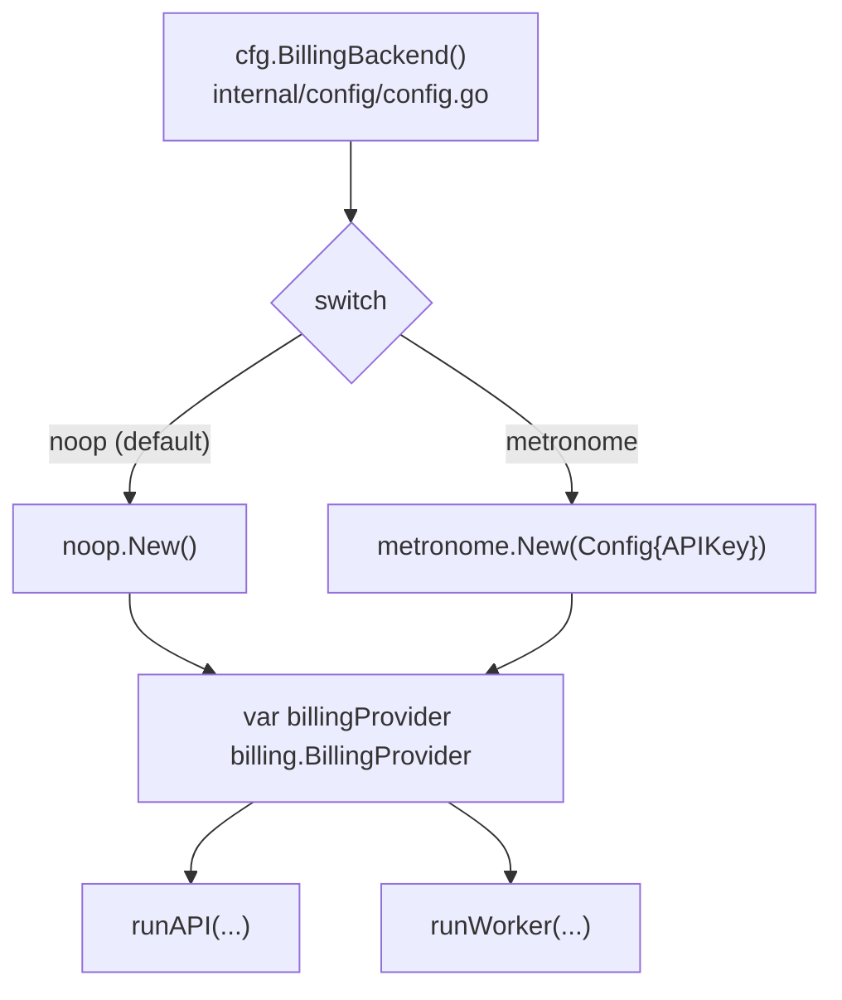
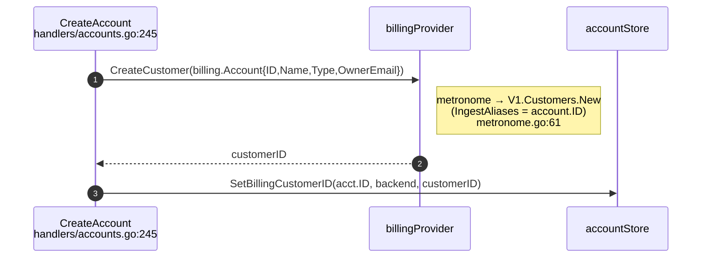
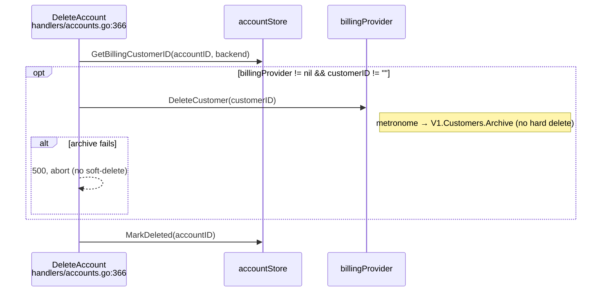
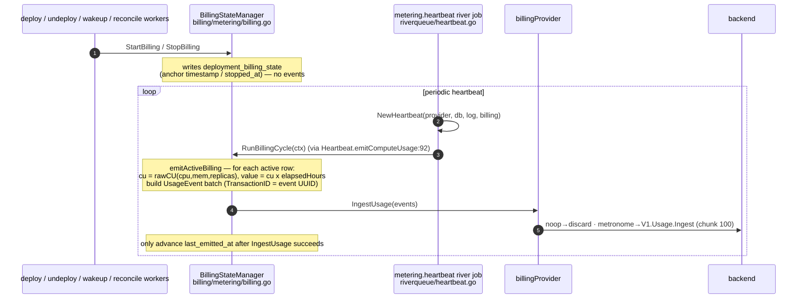
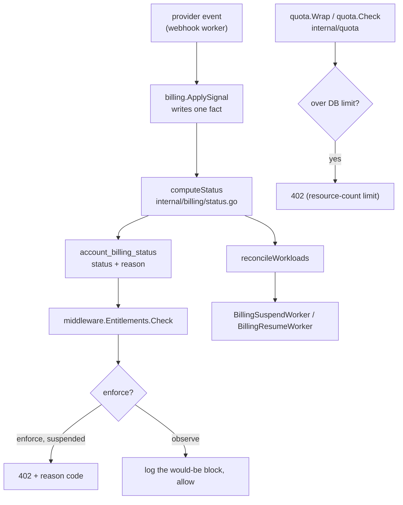
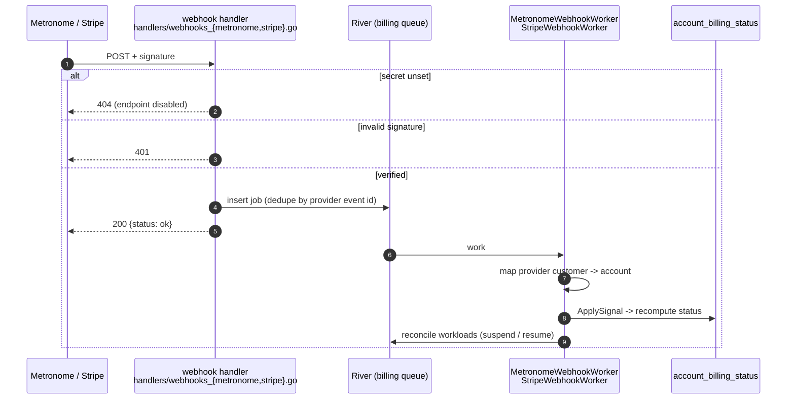
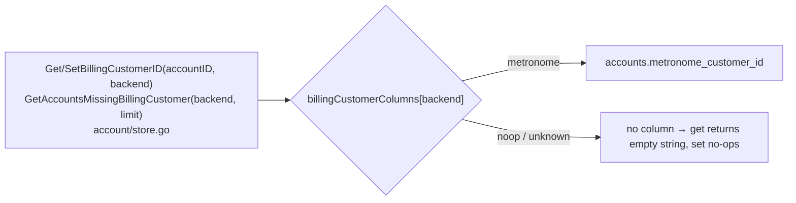
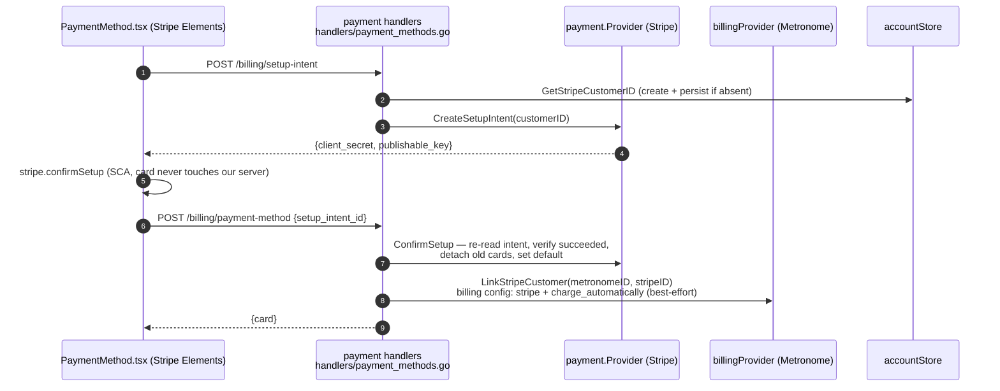
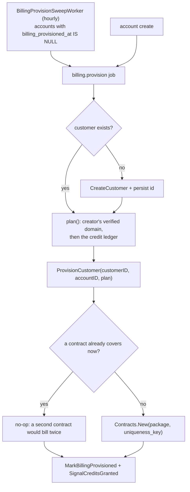

# Billing: Code-Level Data Flow (as built)

How billing data actually moves through `apps/astro-server` today. This is the
**as-built** view (function-by-function, with file references), complementing the
design intent in [`../01-spec/metronome-billing-spec.md`](../01-spec/metronome-billing-spec.md).
Where the code diverges from the spec's target design, this doc says so.

Two companions: [`billing-overview.md`](billing-overview.md) is the five-minute
version, and [`billing-architecture.md`](billing-architecture.md) is the whole
system in prose, including the client, the CLI, and the operator tooling.

All paths depend on the `billing.BillingProvider` interface
(`internal/billing/provider.go`); the concrete backend is chosen once at startup.

## Startup wiring

`main.go` builds one `billing.BillingProvider` from `BILLING_PROVIDER` and threads
it into both the API server and the worker.

Note: `metronome.New` returns `nil` when `METRONOME_API_KEY` is absent, so
downstream `if billingProvider != nil` guards degrade to "billing disabled"
rather than panicking. `BillingBackend()` defaults to `noop` when
`BILLING_PROVIDER` is unset.

## The interface

`internal/billing/provider.go` defines one `BillingProvider` interface every
backend implements: `CreateCustomer`, `DeleteCustomer`, `IngestUsage`,
`SetIngestAliases`, `GetIngestAliases`, `UsageData`, `Invoices`, `InvoicePDF`,
`Balances`. `noop` returns zero values and is the default backend; `metronome`
implements the real calls.

Hosted-only capabilities sit on separate interfaces, found by assertion, so the
core seam stays metering-only and `noop` implements none of them:

| Interface | What it adds |
|---|---|
| `Provisioner` | `ProvisionCustomer(customerID, accountID, plan)` puts the customer on a package |
| `PlanReporter` | the plan the live contract puts the customer on |
| `ContractInspector` | the same coverage check provisioning makes, for the admin view |
| `SpendReporter` | the customer's money position: credit left, period spend |
| `SpendThresholdReader` / `SpendThresholdWriter` | the customer's own spend warning and limit |

---

## Flow 1: Customer creation (inline, on account create)

Non-blocking: a billing failure is logged, never fatal to account creation.

## Flow 2: Account delete (billing archive)

The billing customer is **archived before** the soft-delete, so charging stops
immediately and a **failed archive aborts the delete** — the account is never
left deleted-but-still-billable. Only after a successful archive does
`MarkDeleted` run. The purge worker does no billing work — it only tears down
deployments/other external resources and hard-deletes the row.

---

## Flow 3: Usage metering (compute CU-hours)

The largest path, and fully provider-agnostic. Deployment lifecycle transitions
write **anchor rows** to `deployment_billing_state`; a periodic river heartbeat
computes CU-hour **deltas** and pushes them through `IngestUsage`. No events are
emitted at start/stop — only the heartbeat emits.

Key properties:
- **Idempotency**: `UsageEvent.TransactionID` is the event UUID; Metronome dedupes within its 34-day window, so retries/backfill are safe.
- **Failure handling**: if `IngestUsage` errors, the anchor timestamps are *not* advanced, so the next cycle re-emits the same delta (`billing.go:143-146`).
- **Package location**: this machinery lives in `internal/billing/metering`, written against the `billing.BillingProvider` interface — it drives any backend.

---

## Flow 4: Billing gating (live)

Gating reads a cached status row, not a balance call on the request path.
`account_billing_status` holds the facts provider events report
(`credits_exhausted`, `alert_active`, `has_payment_method`, `dunning_since`,
`force_suspended`). `billing.computeStatus` folds them into one status and
`middleware.Entitlements` reads it.

`BILLING_GATE_ENFORCE` picks enforce or observe. Observe logs the block it would
have made and allows the request. Both modes fail open on a read error: a status
lookup that fails must not block a paying customer.

A status change does two things. It gates the API, and it enqueues workload
suspend or resume so running agents match the account's standing.

Both gating latches are deliberate. Exhausted credit and a crossed spend limit
stay set until something clears them, so resuming an account is an explicit event
rather than a side effect of the next read. `DunningSweepWorker` re-evaluates the
payment grace window hourly, which is the one transition no provider event
announces.

## Flow 5: Provider webhooks (inbound)

Both providers land the same way. The handler verifies the signature, enqueues a
River job, and returns. Nothing is applied on the request path, so redelivery,
a slow database, and a retry are the queue's problem rather than the webhook's.
A missing secret disables the endpoint with a 404.

- `POST /webhooks/metronome`, HMAC-SHA256 over `date + "\n" + body`, keyed by
  `METRONOME_WEBHOOK_SECRET`.
- `POST /webhooks/stripe`, verified with the stripe-go SDK against
  `Stripe-Signature`, keyed by `STRIPE_WEBHOOK_SECRET`.

The two providers own different halves, and neither reports the other's:

- Metronome sends alerts only: a spend threshold and a contract credit balance,
  each with a resolved edge. It has no payment-failure or recovery event.
- Stripe sends payment collection only: failed, action required, uncollectible,
  voided, paid. `invoice.paid` is the single recovery trigger, because
  `invoice.payment_succeeded` overlaps it.

Four behaviours are easy to misread from the code alone:

- **The spend warning and the spend limit are one alert type** at different
  numbers, so the alert name is what separates a heads-up from a suspension. The
  warning notifies and never gates.
- **An id-less event skips dedupe** rather than hashing to a shared key, which
  would collapse two unrelated events into one job. `ApplySignal` is idempotent,
  so double-processing is the safe side of that trade.
- **An unknown customer is a permanent no-op.** The job acks instead of retrying
  for weeks against an account that does not exist here.
- **`payment_method.detached` is provisional.** Replacing a card detaches the old
  one while the new one is already attached, and the pair can arrive in either
  order, so the worker re-reads Stripe and lets the remaining cards decide.

Workloads reconcile on every handled event, not only on a transition, so a
dropped suspend or resume enqueue is re-attempted by the next event.

---

## Backend-aware persistence

Customer IDs are stored per-backend in `accounts`. The generic accessors resolve
the column from a whitelist, so a single call site serves any backend.

The Stripe customer id is stored separately on `accounts.stripe_customer_id`
(dedicated `Get/SetStripeCustomerID`), because Stripe is a **payment** provider,
not a metering backend — it isn't part of the `billingCustomerColumns` whitelist.

---

## Flow 6: Payment method (Stripe card vault)

Stripe is used **only to collect and save a card**; astro-server never charges.
The card is confirmed synchronously (no webhook): the server re-reads the
SetupIntent from Stripe rather than trusting the client, then links the Stripe
customer to the Metronome customer so Metronome charges the saved card when it
finalizes invoices.

Notes:
- **Card save is synchronous.** `confirmSetup` returns synchronously for cards,
  so the confirm endpoint is authoritative without a webhook. Payment-*collection*
  lifecycle (failure, 3DS, uncollectible, void) is separate and arrives on
  `POST /webhooks/stripe`, verified by `STRIPE_WEBHOOK_SECRET`.
- **Linkage is optional.** Detected via an interface assertion
  (`LinkStripeCustomer`) so the core `BillingProvider` seam stays metering-only;
  a link failure doesn't fail the save (the card is already vaulted).
- **Enablement.** The provider is nil unless `STRIPE_SECRET_KEY` is set; handlers
  then report `available:false` and the UI hides the section.

---

## Flow 7: Provisioning (plan and signup credit)

Putting a customer on a package is a server operation, run as a River job rather
than inline at signup, so a provider outage delays a plan instead of failing an
account creation.

`BillingProvisionWorker` resolves one of three plans, then calls
`ProvisionCustomer`:

| Plan | Chosen when | Package |
|---|---|---|
| `unlimited` | the creator's verified address matches `BILLING_UNLIMITED_EMAIL_DOMAINS` | `METRONOME_PACKAGE_ID_UNLIMITED` |
| `credit` | the creator's one signup credit is still unclaimed | `METRONOME_PACKAGE_ID` |
| `no_credit` | that person already spent their claim on another account | `METRONOME_PACKAGE_ID_NO_CREDIT` |

Three consequences worth knowing:

- **The signup credit belongs to a person, not an account.** The claim is keyed on
  the creator's user id in `billing_credit_grants`, has no foreign key to
  `accounts`, and is never deleted, so deleting an account and signing up again
  cannot earn a second grant.
- **A missing package is a configuration error, not a fallback.** Falling back
  would silently bill an internal account or silently restore a spent grant. The
  account stays unprovisioned and the sweep retries once the configuration lands.
- **Provisioning cannot change an existing plan.** `ProvisionCustomer` returns
  early whenever any contract covers now, so re-running the job is a no-op. A plan
  change is a Metronome renewal transition against the covering contract.

Clearing `billing_provisioned_at` therefore re-runs only the job's tail: it marks
the account, applies `SignalCreditsGranted`, and reconciles workloads. That is the
lever for releasing a stuck gating latch without touching the contract.

---

## What is / isn't behind the interface today

| Concern | On the `BillingProvider` seam? | Live call path |
|---------|-------------------------------|----------------|
| Customer create / delete | ✅ | `handlers/accounts.go`, purge worker |
| Usage metering (compute CU-hours) | ✅ | `BillingStateManager.RunBillingCycle` → `IngestUsage` |
| Customer-id persistence | ✅ (backend-aware) | `account/store.go` |
| Billing gating (suspended account → 402) | ✅ status row, not the seam | `middleware.Entitlements` over `account_billing_status`, `BILLING_GATE_ENFORCE` |
| Resource-count limits (agents, deployments, …) | ✅ DB-backed | `internal/quota` (`quota.Wrap`/`Check`) |
| Usage readback | ✅ | `/billing/usage` → `metronome.UsageData`; `/usage` still returns DB resource counts |
| Packaging / contracts / signup credit | ✅ `Provisioner` | `BillingProvisionWorker` (Flow 7); packages themselves are created per Metronome environment |
| Payment method (card collection) | ➖ separate `payment.Provider` (Stripe) | `handlers/payment_methods.go`; linked to Metronome via `LinkStripeCustomer` |
| AI-token metering | ➖ not emitted here | the AI gateway ingests `ai_gateway_llm_usage` itself; astro-server only registers the account's Bifrost customer as an ingest alias so it attributes |

`Balances` is implemented on every provider and has no request-path caller;
gating reads the status row instead. The remaining hosted-cutover work is
configuration, not code: create the packages in the production Metronome
environment and flip `BILLING_PROVIDER`.
