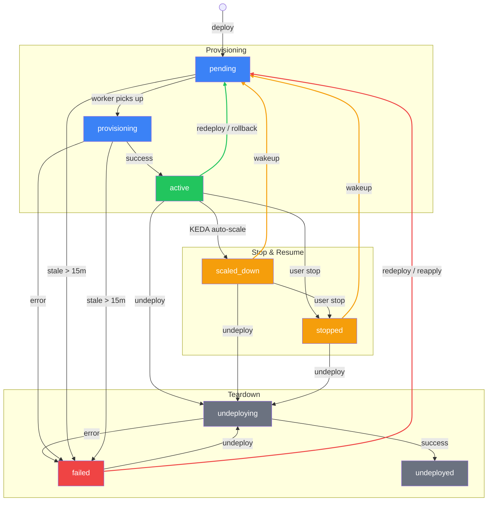

# Deployment State Machine

Deployments move through a fixed set of statuses. Each transition is triggered by a specific subsystem (HTTP handler, River worker, or admin gRPC).

> **Note (needs owner review):** The status set below is not exactly the enum in `internal/deploymentstore/status.go`. `scaled_down` is **not** a status constant - KEDA idle-scaling is tracked in the `scaled_namespaces` table, not the deployment status. The real enum also includes `deploying` and `suspended` (billing scale-to-zero, driven by `riverqueue/billing_suspend.go`), which this diagram omits. The worker/deadline references have been corrected against source.

## States

| Status         | Description                                                                  |
| -------------- | ---------------------------------------------------------------------------- |
| `pending`      | Queued for provisioning (new deploy, redeploy, rollback, reapply, or wakeup) |
| `provisioning` | Deploy worker is applying K8s resources                                      |
| `active`       | Running normally                                                             |
| `failed`       | Last operation failed, or stuck job timed out                                |
| `scaled_down`  | KEDA auto-scaled all replicas to zero (idle)                                 |
| `stopped`      | User explicitly stopped; workloads scaled to zero, resources preserved       |
| `undeploying`  | Teardown in progress                                                         |
| `undeployed`   | Fully torn down (terminal)                                                   |

## State Diagram

## Transitions

### Happy path

| #   | From           | To             | Trigger               | Subsystem             |
| --- | -------------- | -------------- | --------------------- | --------------------- |
| 1   | (new)          | `pending`      | First deploy          | `DeployAgent` handler |
| 2   | `pending`      | `provisioning` | Worker picks up job   | `DeployWorker`        |
| 3   | `provisioning` | `active`       | K8s resources applied | `DeployWorker`        |

### Stop and resume

| #   | From                     | To            | Trigger                    | Subsystem                         |
| --- | ------------------------ | ------------- | -------------------------- | --------------------------------- |
| 4   | `active`                 | `scaled_down` | KEDA detects idle workload | `ReconcileWorker`                 |
| 5   | `active`, `scaled_down`  | `stopped`     | User-initiated stop        | `StopDeployment` handler / gRPC   |
| 6   | `scaled_down`, `stopped` | `pending`     | User-initiated wakeup      | `WakeUpDeployment` handler / gRPC |

`scaled_down` and `stopped` both display as "Stopped" in the UI. The distinction:
- **`scaled_down`** -- automatic (KEDA). Tracked in `scaled_namespaces` table.
- **`stopped`** -- explicit user action. Not tracked in `scaled_namespaces`.

Both are woken up the same way: status resets to `pending`, then the normal deploy path runs.

### Redeploy and rollback

| #   | From                       | To        | Trigger                    | Subsystem                           |
| --- | -------------------------- | --------- | -------------------------- | ----------------------------------- |
| 7   | `active`, `failed`         | `pending` | Push new build             | `DeployAgent` handler               |
| 8   | `active`, `failed`         | `pending` | Rollback to prior revision | `RollbackDeployment` handler / gRPC |
| 9   | any (except `undeploying`) | `pending` | Force reapply              | `ReapplyDeployment` gRPC            |

### Teardown

| #   | From          | To            | Trigger                           | Subsystem                                         |
| --- | ------------- | ------------- | --------------------------------- | ------------------------------------------------- |
| 10  | any           | `undeploying` | User undeploy or account deletion | `UndeployAgent` handler / `DeleteDeployment` gRPC |
| 11  | `undeploying` | `undeployed`  | K8s namespace torn down           | `UndeployWorker`                                  |
| 12  | `undeploying` | `failed`      | Teardown error                    | `UndeployWorker`                                  |

### Failure and recovery

| #   | From               | To       | Trigger                                     | Subsystem                         |
| --- | ------------------ | -------- | ------------------------------------------- | --------------------------------- |
| 13  | `provisioning`     | `failed` | Apply error or partial failure              | `DeployWorker`                    |
| 14  | `provisioning`     | `failed` | Stuck >15 minutes                           | `DeploymentWatchdogWorker` (`FailStaleDeployments`) |
| 15  | `pending`          | `failed` | Stuck >15 minutes                           | `DeploymentWatchdogWorker` (`FailStaleDeployments`) |
| 16  | (orphan namespace) | `failed` | Reconcile discovers untracked K8s namespace | `RecoverOrphanedDeployment`       |

## Implementation locations

- Status constants: `apps/astro-server/internal/deploymentstore/status.go`
- Store mutations: `apps/astro-server/internal/deploymentstore/store.go` (`UpdateStatus`, `MarkScaledDown`, `SaveDeploymentPending`)
- River workers: `apps/astro-server/internal/riverqueue/` (`deploy.go`, `undeploy.go`, `wakeup.go`, `deploy_watchdog.go`)
- HTTP handlers: `apps/astro-server/handlers/deploy.go` (`DeployAgent`, `UndeployAgent`, `StopDeployment`, `WakeUpDeployment`, `RollbackDeployment`)
- Admin gRPC: `apps/astro-server/internal/admingrpc/server.go` (`StopDeployment`, `WakeUpDeployment`, `RollbackDeployment`, `ReapplyDeployment`, `DeleteDeployment`)
