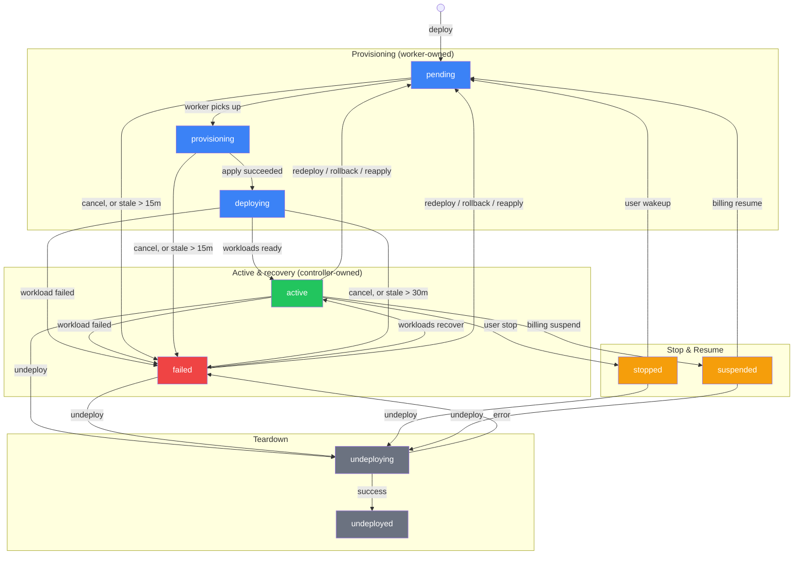

# Deployment State Machine

**Status:** Authoritative — describes the shipped system
**Last verified:** 2026-08-26

Deployments move through a fixed set of statuses. Two subsystems drive
transitions: `DeployWorker` (a River job) owns everything up to `deploying`,
and `deploycontroller` (a K8s informer-driven controller) owns
`deploying`/`active`/`failed` from there, based on live observed workload
health. Everything else (stop, resume, redeploy, teardown) is an explicit
HTTP or admin-gRPC action.

## States

| Status | Description |
|---|---|
| `pending` | Queued; not yet picked up by a worker |
| `provisioning` | `DeployWorker` is applying K8s manifests |
| `deploying` | Manifests applied; not yet observed healthy. `deploycontroller` owns the transition out of this state, not the worker |
| `active` | `deploycontroller` observed all declared workloads ready |
| `failed` | Apply error, partial apply failure, an observed workload failure, a stale-job timeout, or a user cancel. **Not terminal** — see [Failure and recovery](#failure-and-recovery) |
| `stopped` | User-initiated scale-to-zero; workloads scaled to zero, resources preserved |
| `suspended` | Billing-initiated scale-to-zero. Kept distinct from `stopped` so a billing resume never wakes up a deployment the user explicitly stopped, and vice versa |
| `undeploying` | Teardown in progress |
| `undeployed` | Fully torn down (terminal) |

No `scaled_down` status, no KEDA integration, and no idle-autoscaling
mechanism of any kind exist in this codebase. `stopped` and `suspended` are
both explicit, application-triggered scale-downs via the same primitive
(`k8s.StopNamespaceWorkloads`), never an observed-idle autoscaler. If you're
looking for autoscaling, it doesn't exist yet.

## State Diagram

## The two owners

**`DeployWorker`** (`internal/riverqueue/deploy.go`) picks up a `pending`
job, sets `provisioning`, calls the K8s applier, and on success hands off to
`deploying`. It never sets `active` — that boundary is enforced by a comment
on the `StatusDeploying` constant itself (`internal/deploymentstore/status.go`).
On an apply error or partial resource failure, the worker does still set
`failed` directly; that's the one failure case it owns rather than handing
to the controller. After handing off, it kicks an immediate controller
reconcile (`EnqueueNamespace`) so a no-op redeploy doesn't wait for the
controller's periodic resync.

**`deploycontroller`** (`internal/deploycontroller/controller.go`) is a K8s
informer controller, not a poller or a webhook receiver — it watches
Deployments/StatefulSets/Jobs/CronJobs/Pods/Services scoped to
`app.kubernetes.io/managed-by=astro-server`, with a 2-minute full resync as
a backstop for missed events. Its `driveLifecycle` function is a
compare-and-set against exactly the states it's allowed to touch
(`deploying`, `active`, `failed`) so it can never fight the worker (which
owns `provisioning`) or a concurrent stop/undeploy. It aggregates observed
workload health into one of two outcomes: all declared workloads ready
drives to `active` and starts compute billing; any workload failed drives
to `failed`. It also persists per-workload health and a runtime snapshot
that the deployment detail page and `/status` read directly, instead of
querying K8s live on every request.

## Failure and recovery

**`failed` is not terminal.** The verdict comes from live observation, so a
deployment whose pods later recover (a crash loop settles, a fixed image
gets pulled) is driven `failed → active` by the same `driveLifecycle`
compare-and-set, with no new deploy and no user action. This is the
architectural fact the state diagram most needs to convey correctly, since
`failed` behaves nothing like `undeployed` (the actual terminal state).

**Crash-loop hysteresis** (`internal/deploycontroller/pods.go`,
`classifyUnstablePods`) exists specifically because naive ready-probe
tracking made `active ↔ failed` oscillate: a `CrashLoopBackOff` container
that passes its readiness probe briefly between crashes used to flip
`deployments.status` roughly every two minutes, writing a `deployment_events`
row and restarting compute billing on every flip. A ready pod now still
counts as failed if its restart count is past a limit (`crashLoopRestartLimit`,
currently 3) and its current run is younger than a stable window (currently
5 minutes, the kubelet's own backoff ceiling). Without this, a real recovery
and a crash loop's occasional lucky probe pass looked identical to the
controller.

**`CancelDeployment`** (`handlers/deploy.go`) lets a user abort a hung
`pending`/`provisioning`/`deploying` deployment by driving it to `failed`
directly. This is explicitly non-terminal too, for the same reason as any
other `failed`: if the controller later observes the workloads healthy
anyway, it drives back to `active` and bills again.

**The deployment watchdog** (`DeploymentWatchdogWorker.FailStaleDeployments`,
run every 5 minutes) fails a deployment stuck past a deadline: 15 minutes
for `pending`/`provisioning`, 30 minutes for `deploying`.

## Orphan and drift handling — narrower than it might look

Two mechanisms sound like general orphan detection but aren't:

- **`cleanupOrphanedResources`** (`internal/k8s/orphan_cleanup.go`) runs
  only during an apply, for one already-known deployment. It deletes any
  K8s resource under that deployment's label selector that isn't in the
  freshly-computed expected set (e.g. a component removed from the spec).
  It never touches `deployments.status` and has no relationship to a
  deployment whose resources disappeared out-of-band between applies.
- **`placementOrphaned`** (`internal/admingrpc/placement.go`) means a
  deployment's cluster routing no longer matches any cluster the account is
  bound to. It's checked only inside `ReapplyDeployment`, to redirect a
  reapply into a cross-cluster migration job instead of a plain redeploy —
  unrelated to K8s-resource drift, and it never sets `failed` either.

There is no mechanism that scans for a deployment whose K8s resources
vanished out-of-band, or a namespace with no matching deployment row, and
marks it `failed`. The closest thing to that is `deploycontroller`'s
continuous informer sync on deployments it's already watching — live-health
tracking, not an orphan scan.

## Transitions

### Happy path

| # | From | To | Trigger | Owner |
|---|---|---|---|---|
| 1 | (new) | `pending` | New deploy | `DeployAgent` handler |
| 2 | `pending` | `provisioning` | River job picked up | `DeployWorker` |
| 3 | `provisioning` | `deploying` | K8s apply succeeded (manifests accepted, not yet healthy) | `DeployWorker` |
| 4 | `deploying` | `active` | Controller observes all declared workloads ready | `deploycontroller.driveLifecycle` |

### Failure and recovery

| # | From | To | Trigger | Owner |
|---|---|---|---|---|
| 5 | `provisioning` | `failed` | Apply error or partial resource failure | `DeployWorker` |
| 6 | `deploying`, `active` | `failed` | Controller observes a workload failed | `deploycontroller.driveLifecycle` |
| 7 | `failed` | `active` | Controller later observes workloads healthy (recovery, no redeploy) | `deploycontroller.driveLifecycle` |
| 8 | `pending`, `provisioning`, `deploying` | `failed` | User cancel | `CancelDeployment` handler |
| 9 | `pending`, `provisioning` | `failed` | Stuck > 15 minutes | `DeploymentWatchdogWorker.FailStaleDeployments` |
| 10 | `deploying` | `failed` | Stuck > 30 minutes | `DeploymentWatchdogWorker.FailStaleDeployments` |

### Stop and resume

| # | From | To | Trigger | Owner |
|---|---|---|---|---|
| 11 | `active` | `stopped` | User-initiated stop | `StopDeployment` handler / admin gRPC |
| 12 | `stopped` | `pending` | User-initiated wakeup | `WakeUpDeployment` handler / admin gRPC → `WakeUpWorker` |
| 13 | `active` | `suspended` | Billing suspension | `BillingSuspendWorker` |
| 14 | `suspended` | `pending` | Billing resolved | `BillingResumeWorker` (re-enqueues the same wakeup path as `stopped`) |

### Redeploy, rollback, reapply

| # | From | To | Trigger | Owner |
|---|---|---|---|---|
| 15 | `active`, `failed` | `pending` | Push new build | `DeployAgent` handler |
| 16 | `active`, `failed` | `pending` | Rollback to prior revision | `RollbackDeployment` handler / admin gRPC |
| 17 | any except `undeploying`, `undeployed` | `pending` | Admin force reapply | `ReapplyDeployment` gRPC — redirects to a cross-cluster migration job instead if the deployment's cluster is no longer in the account's allowed set (`placementOrphaned`) |

### Teardown

| # | From | To | Trigger | Owner |
|---|---|---|---|---|
| 18 | any except `undeploying`, `undeployed` | `undeploying` | User undeploy | `UndeployAgent` handler |
| 19 | any except `undeploying`, `undeployed` | `undeploying` | Admin delete | `DeleteDeployment` gRPC |
| 20 | `undeploying` | `undeployed` | K8s teardown succeeded | `UndeployWorker` |
| 21 | `undeploying` | `failed` | Teardown error (a "cluster client unavailable" error is swallowed and still proceeds to `undeployed`) | `UndeployWorker` |

## Implementation locations

- Status constants: `apps/astro-server/internal/deploymentstore/status.go`
- Store mutations: `apps/astro-server/internal/deploymentstore/store.go` (`UpdateStatus`, `UpdateStatusIfCurrent`, `UpdateStatusWithTx`, `SaveDeploymentPending`, `UpdateDeploymentPending`)
- Controller: `apps/astro-server/internal/deploycontroller/` (`controller.go` for `driveLifecycle` and the informer setup, `pods.go` for crash-loop hysteresis, `remediation.go` for wedged-StatefulSet-pod eviction, which keeps a rollout unstuck without changing `status`)
- River workers: `apps/astro-server/internal/riverqueue/` (`deploy.go`, `undeploy.go`, `wakeup.go`, `deploy_watchdog.go`, `billing_suspend.go`)
- HTTP handlers: `apps/astro-server/handlers/deploy.go` (`DeployAgent`, `UndeployAgent`, `StopDeployment`, `WakeUpDeployment`, `RollbackDeployment`, `CancelDeployment`)
- Admin gRPC: `apps/astro-server/internal/admingrpc/server.go` (`StopDeployment`, `WakeUpDeployment`, `RollbackDeployment`, `ReapplyDeployment`, `DeleteDeployment`), `internal/admingrpc/placement.go` (`placementOrphaned`)
