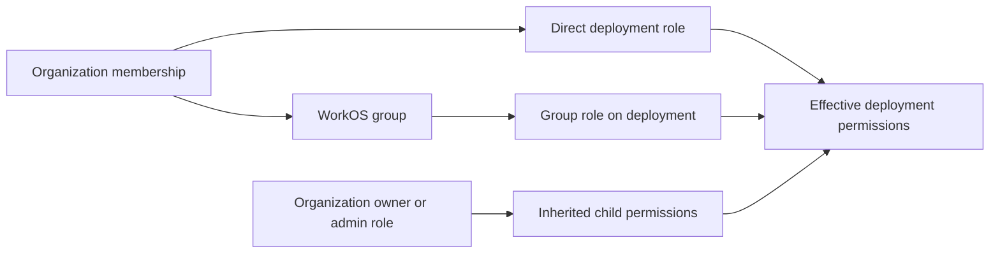
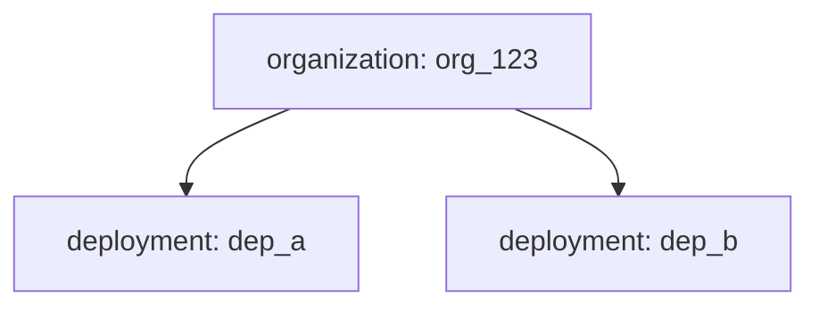
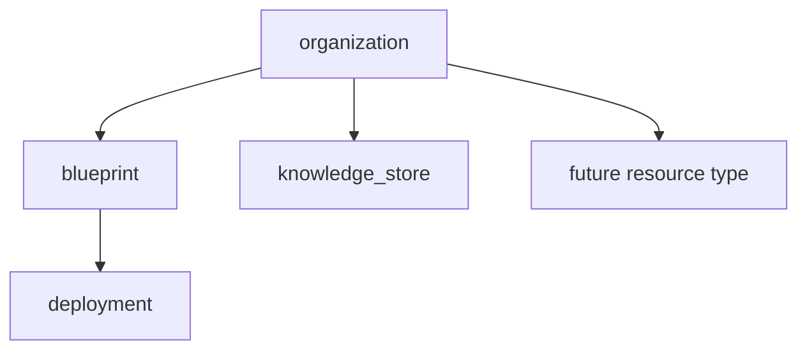
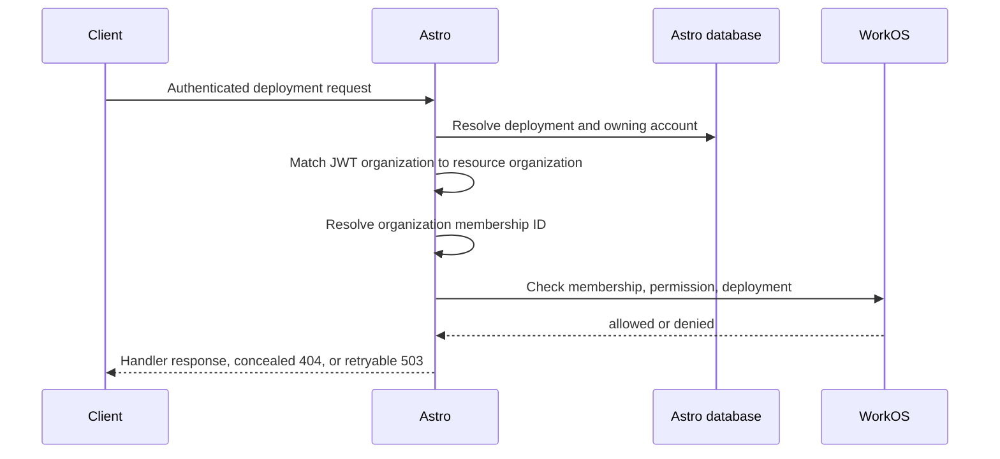
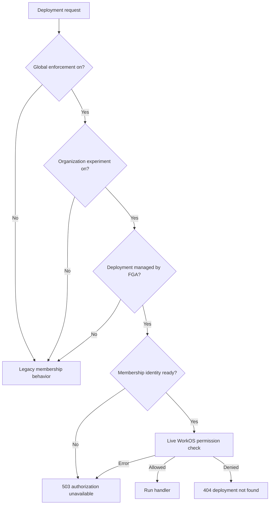
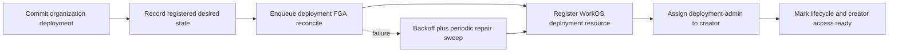
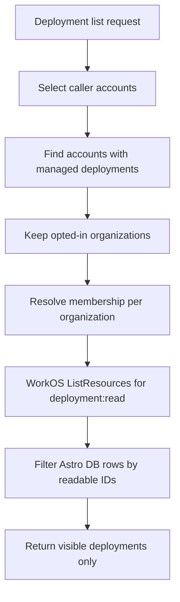
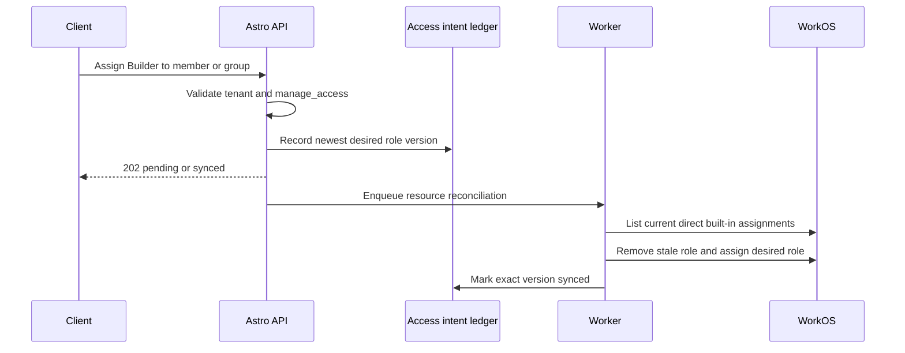

# Fine-Grained Access Control

**Status:** Authoritative — describes the shipped system
**Last verified:** 2026-08-26

Astro uses WorkOS Fine-Grained Authorization (FGA) for organization deployment access. WorkOS owns effective resource assignments and permission decisions. Astro owns product policy, tenant validation, resource lifecycle, durable write intent, and every API exposed to clients.

This document is the source of truth for the deployed architecture. The staged implementation history remains in [Deployment FGAC API Rollout](../01-spec/deployment-fgac-rollout.md).

## Scope

The first protected resource is an organization deployment. The model covers browser users, API clients, the CLI, bots, and agents with the same actor-neutral permissions. It does not authorize chat or invocation data-plane traffic, evaluation resources, personal accounts, or blueprint and knowledge-store access yet.

The browser never calls WorkOS directly. Astro APIs validate the caller, organization, resource, requested role, and assignment target before WorkOS is read or mutated.

## Model

Permissions are stable actions. Roles are product bundles of permissions. Groups are collections of organization memberships that can receive roles on resources.

| Permission | Deployment boundary |
| --- | --- |
| `deployment:read` | Discover and read deployment control-plane data, including detail, configuration metadata, logs, traces, monitoring, and files. Secret values stay redacted. |
| `deployment:edit` | Change deployment-owned content or metadata. |
| `deployment:operate` | Redeploy, roll back, restart, stop, resume, cancel, and trigger ingestion. |
| `deployment:delete` | Delete the deployment. |
| `deployment:manage_access` | Grant and revoke deployment access. |

Permissions do not imply one another. The initial WorkOS roles bundle them as follows:

| Role | Permissions |
| --- | --- |
| `deployment-viewer` | `read` |
| `deployment-builder` | `read`, `edit`, `operate`, `delete` |
| `deployment-admin` | `read`, `edit`, `operate`, `delete`, `manage_access` |

Organization owner and admin roles inherit all deployment permissions from the organization resource. The generic organization member role has no deployment permissions. New deployment creators receive `deployment-admin` directly on the deployment.

One membership may have direct and group-derived access simultaneously. WorkOS evaluates their union. Astro's built-in access API manages at most one direct Viewer, Builder, or Admin role per subject and resource; it does not remove custom roles or group-derived access.

## Resource hierarchy

The current WorkOS model places deployments directly beneath their organization:

Blueprints and knowledge stores follow the same contracts when they become authorization resources. The intended product hierarchy is:

Changing existing deployments from organization-parented to blueprint-parented resources requires an explicit WorkOS schema and resource migration. It must not be introduced as a refactor or by dual-parenting resources silently.

## Sources of truth

| Data | Authority |
| --- | --- |
| Accounts, deployments, names, creator, and ownership | Astro database |
| Organization membership and WorkOS membership mapping | Astro database, synchronized from WorkOS |
| Organization-scoped roles and permissions | WorkOS; included in the organization JWT |
| Authorization resources, resource roles, groups, and group membership | WorkOS Authorization |
| Effective resource permission decision | Live WorkOS Authorization check |
| Product resource lifecycle | Direct WorkOS SDK calls after local create, update, and delete; bounded backfill repairs missed creates |
| Desired and applied access mutation | Astro `resource_access_fga_sync` ledger |

The access-mutation ledger is retry state, not an entitlement mirror. It records what Astro asked WorkOS to converge and the last applied version. It cannot authorize a request.

## Identity and organization scope

An organization session carries the user ID, WorkOS organization ID, and `organization_membership_id`. Organization-scoped JWT permissions remain useful for account administration and resource creation. Resource-scoped deployment permissions are evaluated live so assignment and group changes do not wait for token refresh.

Astro rejects a resource check before WorkOS when the session organization does not match the resource organization. A missing membership ID is an unavailable authorization identity, not a denial. Refreshing the token, switching organizations, or signing in again repairs the session after the membership mirror is ready.

## Rollout gates

FGA behavior is active only when all required layers are ready:

1. `FGA_ENFORCEMENT_ENABLED=true` enables the environment-wide enforcement path.
2. The organization enables the `fine_grained_access` experiment.
3. The deployment has entered the FGA lifecycle and meets the route's readiness rule.
4. The request carries a valid organization membership identity.

`FGA_SHADOW_ENABLED=true` independently compares legacy membership behavior with WorkOS without changing the HTTP result. When enforcement makes a live decision, the shadow middleware does not issue a duplicate check. Opted-out resources can continue producing shadow evidence.

Personal-account deployments stay on the single-owner membership rule and never create WorkOS authorization resources.

## Route policy and enforcement

Every `/deployments/:id` route is registered together with one authorization classification. Server startup validates bidirectional agreement between live Gin routes and the route catalog.

- Control-plane routes map to one of the five deployment permissions.
- Model-deferred evaluation routes keep their separate legacy policy until their resource ownership is designed.
- Chat and messaging routes remain data-plane authorization concerns.
- Body-addressed redeploy and undeploy handlers attach `operate` or `delete` after parsing a deployment ID.

Denied and nonexistent protected deployments return the same not-found response. WorkOS failures and missing session identity return a retryable unavailable response. UI state is never the security boundary; protected server handlers enforce independently.

## Deployment resource lifecycle

Deployment lifecycle changes and WorkOS writes are deliberately decoupled. A successful deployment operation is not rolled back because WorkOS is temporarily unavailable.

- Creation registers an organization deployment and assigns its current creator membership Admin.
- Rename updates the WorkOS resource name only when the display name changes.
- Delete removes the WorkOS resource; WorkOS cascades its assignments.
- Missing creators do not block resource registration or account purge.
- A creator membership that may still be mirroring is retried without marking creator access ready.
- When WorkOS is disabled, Astro skips lifecycle intent writes and jobs.

Clients can use `access_ready` to represent the short period between deployment creation and creator-role convergence. A pending deployment remains fail-closed rather than briefly inheriting broad organization-member visibility.

## Read visibility and discovery

List endpoints cannot make one WorkOS check per deployment. Astro discovers all deployment resources on which one organization membership has `deployment:read`, then filters the database query with that set.

Discovery has a two-second request budget, a concurrency limit of four organizations, and a three-second in-memory cache keyed by account, membership, organization, and experiment generation. Singleflight collapses concurrent polling requests without tying followers to the first request's cancellation. The cache contains resource discovery results, never mutation authorization decisions.

A non-deadline failure fails closed only for the affected organization. A request-wide deadline returns a retryable error. Personal, opted-out, and historical deployments that have not entered the lifecycle ledger retain legacy behavior until a separately approved migration changes them.

## Capabilities

`GET /api/v1/deployments/:id/capabilities` returns the caller's five effective deployment actions. In FGA mode Astro requires baseline `deployment:read`, then performs one WorkOS effective-permissions request. Outside the active rollout it returns explicit legacy capabilities.

UI, CLI, bots, and API clients use this Astro response to present available actions. They must still handle a server denial because permissions may change after rendering.

## Access management

The deployment access API is protected by `deployment:manage_access`:

| Operation | Endpoint |
| --- | --- |
| List roles, effective assignments, and pending intent | `GET /api/v1/deployments/:id/access` |
| Set Viewer, Builder, or Admin | `PUT /api/v1/deployments/:id/access` |
| Revoke a direct built-in role | `DELETE /api/v1/deployments/:id/access/:subject_type/:subject_id` |

Mutation requests validate the deployment organization and the target membership or group, record a versioned desired role, emit an audit event only when state changed, enqueue reconciliation, and return `202 Accepted`.

The worker batches membership intents by resource so it lists assignments once, reconciles the newest version, and retries partial failures. Group assignments use the group-specific WorkOS assignment API. Revocation removes only direct built-in roles; custom and derived roles remain untouched.

## Groups

Organization group APIs are account-scoped:

| Operation | Endpoint |
| --- | --- |
| List/create | `GET/POST /api/v1/accounts/:account/access-groups` |
| Update/delete | `PATCH/DELETE /api/v1/accounts/:account/access-groups/:group_id` |
| List/add members | `GET/POST /api/v1/accounts/:account/access-groups/:group_id/members` |
| Remove member | `DELETE /api/v1/accounts/:account/access-groups/:group_id/members/:user_id` |

Astro accepts local user IDs and resolves WorkOS membership IDs internally. Group membership changes go directly through the official WorkOS SDK with tenant validation, cursor-safe pagination, bounded timeouts, idempotent add/remove behavior, and audit events. WorkOS automatically includes group-derived roles in checks and resource discovery.

## Tenant isolation

Every path preserves these invariants:

- Resolve the resource's Astro account before authorization.
- Match the session WorkOS organization to the resource organization before a live check.
- Resolve assignment targets inside the same Astro account.
- Confirm groups belong to the resource's WorkOS organization.
- Reject cross-organization mutations before calling WorkOS.
- Conceal denied resources as not found.
- Never fall back to broad membership visibility after an active FGA failure.

## Failure behavior

| Condition | Behavior |
| --- | --- |
| FGA global switch off | Legacy membership behavior; WorkOS resources remain intact. |
| Organization experiment off | Legacy behavior for that organization; access/group APIs unavailable; shadow may continue. |
| Personal deployment | Single-owner legacy behavior; no WorkOS resource. |
| Resource not yet managed | Legacy behavior until a separately approved migration. |
| Managed resource not yet converged | Fail closed; creator UI may show access provisioning. |
| Permission denied | Concealed `404`. |
| Missing membership identity | Retryable `503`; refresh, switch organization, or sign in again. |
| WorkOS check failure | Retryable `503`; never allow from cached or local intent state. |
| One organization's discovery failure | Omit that organization's managed deployments; preserve healthy organizations. |
| Access mutation failure | Keep durable intent pending/retrying; periodic sweep repairs it. |

## Operations and rollback

Before enabling an environment, configure WorkOS with the deployment resource type, all five permission slugs, Viewer/Builder/Admin resource roles, and inherited deployment permissions on organization owner/admin. Organization member must have no deployment permissions for private-by-default behavior.

Recommended rollout:

1. Deploy code with both flags off and verify lifecycle workers are healthy.
2. Enable `FGA_SHADOW_ENABLED` and inspect mismatch, identity, timeout, and rate-limit logs.
3. Enable `FGA_ENFORCEMENT_ENABLED` in Preview while organization experiments remain off.
4. Enable one organization experiment and verify creator, direct, group-derived, inherited-admin, revocation, denial, and failure cases.
5. Expand Preview organization opt-in only after the contract suite and internal Queen inspector agree with WorkOS.
6. Configure production WorkOS before any production experiment is enabled.

Rollback is data-preserving:

- Disable the organization experiment to restore legacy behavior for one organization.
- Disable `FGA_ENFORCEMENT_ENABLED` to restore legacy behavior environment-wide.
- Keep WorkOS resources, assignments, lifecycle ledgers, and access intent ledgers so rollback does not destroy authorization state.
- Leave shadow mode on when useful to compare recovered legacy behavior with WorkOS.

Historical resource backfill is outside this milestone. Production enforcement must not expand to historical deployments until a separately reviewed, observable, idempotent migration has completed.

## Extending to another resource

Adding blueprints, knowledge stores, or a future primitive follows one repeatable path:

1. Define the WorkOS resource type, parent relationship, flat actor-neutral permissions, and initial role bundles.
2. Add repository `ResourceType`, `Action`, and role contracts whose string values match WorkOS exactly.
3. Add an Astro account and organization resolver for the resource.
4. Record resource lifecycle intent in the owning database transaction and reconcile WorkOS asynchronously.
5. Catalog every control-plane route, explicitly separating data-plane and model-owned surfaces.
6. Add live checks, effective capabilities, and batched readable-resource discovery.
7. Reuse the access-intent service and group subjects rather than creating a second assignment model.
8. Add cross-tenant, failure, direct, group-derived, inherited, and revocation contract coverage.
9. Enable through the global switch and organization experiment before any migration.

Resource-specific permissions remain flat. Cross-resource personas such as a future Builder role are bundles of `blueprint:*`, `deployment:*`, and `knowledge_store:*` permissions; clients and bots do not receive a separate permission vocabulary.
