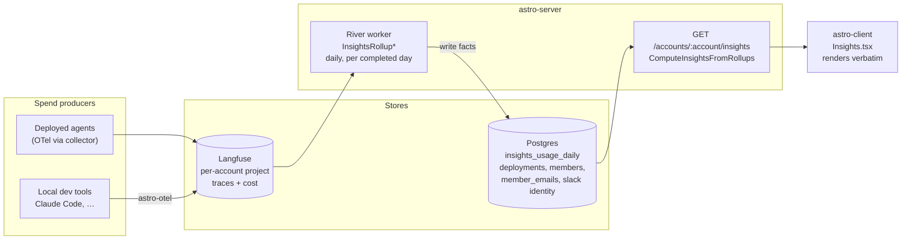
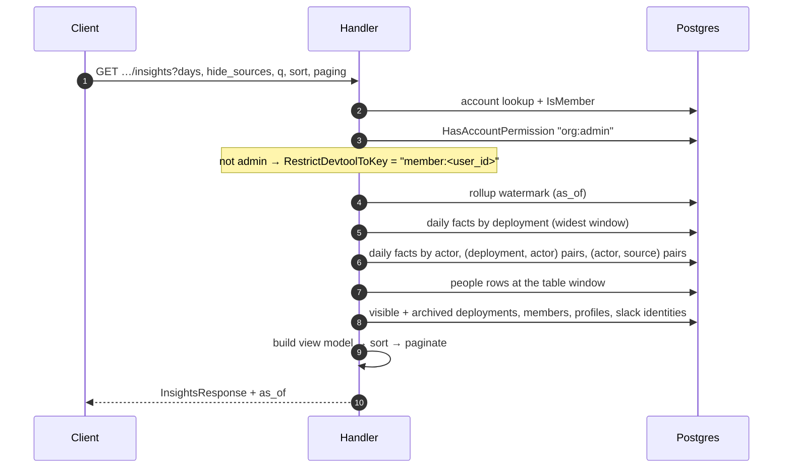
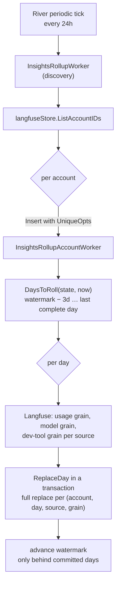
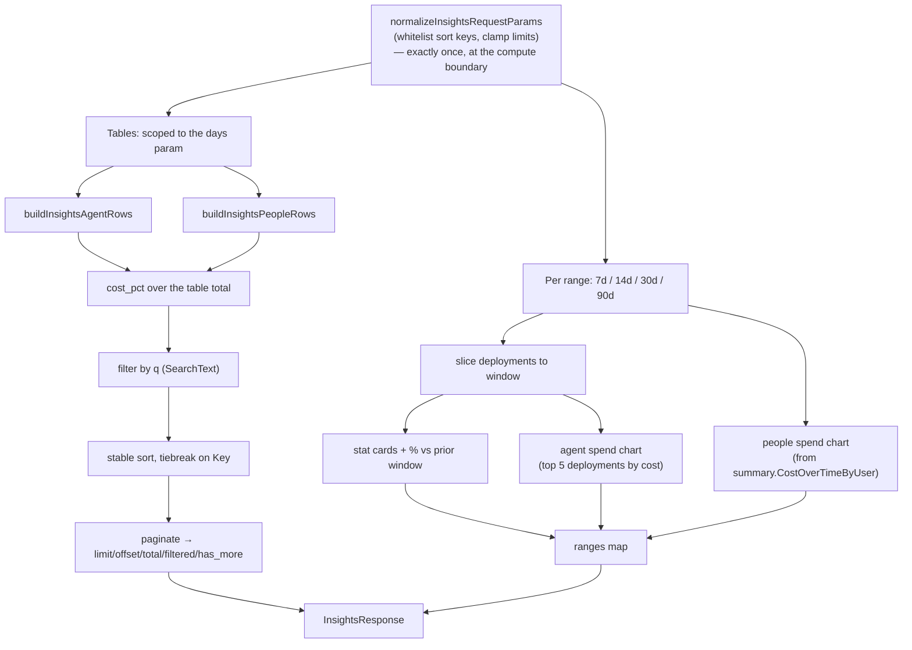
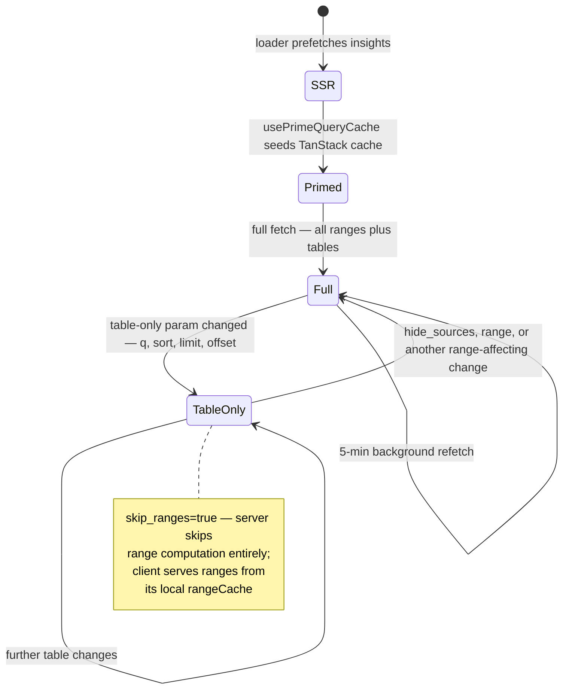

# Insights

**Status:** Authoritative — describes the shipped system
**Last verified:** 2026-08-17

The account **Insights** page answers one question: *where is this account's AI spend going, by agent and by person?* It unifies two spend sources, deployed Astro agents and local AI coding tools, into a single server-owned view model.

This document is the source of truth for how Insights fits together. The design behind the fact table is specified in [insights-rollup-spec.md](../01-spec/insights-rollup-spec.md), and the ingest side that feeds it in [claude-code-observability-spec.md](../01-spec/claude-code-observability-spec.md) and [devtool-prompt-collection-spec.md](../01-spec/devtool-prompt-collection-spec.md).

---

## Core principle

**The server owns the page; the client renders it.**

One endpoint returns display-ready ranges and table rows: labels, hrefs, avatars, identity kinds, percentages, pagination, search text. The client re-derives nothing. Before consolidation the frontend stitched together several observability APIs and re-computed row identity and totals locally; that produced inconsistent percentages, N+1 identity lookups, and sort/pagination bugs whenever a new data source appeared.

Two consequences follow, and both are load-bearing:

1. **Everything is one lineage.** Every spend source becomes rows in one fact table, so sorting, search, `cost_pct`, and pagination stay correct by construction over the full data set rather than a paginated page. A source is not compensated for per surface, which is what used to make the cards and the table beneath them disagree.
2. **The read path never queries upstream.** Langfuse aggregation is expensive, so a daily roll-up pays for it once per completed day and the page reads Postgres.

---

## System shape



Agent and dev-tool spend both arrive as Langfuse traces, separated only by trace tag, so one query shape serves both. VictoriaMetrics holds the dev-tool metrics stream but no longer feeds this page: Langfuse carries the same usage with the cost Langfuse itself priced, and reading one upstream keeps the totals reconcilable.

---

## Read path

`GET /api/v1/accounts/:account/insights` (`apps/astro-server/main.go`, handler in `handlers/insights_rollup.go`).



**One fetch at the widest window feeds every range.** The response carries all four ranges, and the view model slices the per-deployment daily series itself, so a range switch costs the client nothing and the server no extra query.

**Identities resolve on every read.** Facts store stable keys (`actor_kind` + `actor_key`); Slack display names, avatars, and member profiles change independently of spend, so baking them into the facts would serve stale names. `ResolveUsersSummaryIdentities` and friends decorate at read time.

**Windows end on the watermark, not on today.** The facts hold complete days only, so a window ending today carries an empty trailing day: a chart bar that can never fill, and stat cards that compare N-1 days of spend against N prior days. The response reports `as_of`, the last day it covers, and the page names that day.

**Failure is a 500, not a zeroed page.** There is no partial-upstream state left to degrade around: either Postgres answers or the request fails, and the client renders its error state. A cold account (nothing rolled up yet) returns zeros with no `as_of`, and the page says usage is totalled once a day.

---

## Roll-up pipeline

`internal/insightsrollup` owns the store and the schedule; `handlers/insights_rollup_producer.go` owns the upstream reads; `internal/riverqueue/insights_rollup.go` owns the workers.

| Constant | Value | Rationale |
|---|---|---|
| `RollupInterval` | 24h | The unit of work is a completed day. Unlike a cache refresh this is not an upstream throttle, because a day is fetched once and then never again. |
| `TrailingReRollDays` | 3 | Traces arrive late: agents buffer, collectors retry, laptops go offline. A day is not final the moment it ends. |
| `MaxBackfillDays` | 90 | Bounds how far back a cold account is rolled up, matching the window the page shows. History accumulates forward from there. |
| `queueInsights` workers | 3 | Bounds concurrent Langfuse pressure. |



Four decisions worth preserving:

- **Writes are a full replace per `(account, day, source, grain)`.** Reruns and overlapping ticks converge without merge semantics, which is what makes the trailing re-roll free.
- **Facts are folded by dimension tuple before insert.** Langfuse groups by the whole tag array, so one deployment legitimately arrives as several groups (`[deployment:x]` and `[deployment:x, env:prod]`). Summing them is correct, inserting both violates the primary key, and `ON CONFLICT` cannot help because Postgres refuses to let one statement touch the same row twice.
- **The watermark advances only after every day behind it commits.** A failure holds it in place and is recorded, so a stall is visible as an `as_of` that stops moving rather than as a silently stale page.
- **No tag filter is applied**, so archived and deleted deployments are stored and the read path decides visibility. This is what lets usage history outlive the agent that produced it.

Steady-state upstream cost per account is two Langfuse queries plus one per dev-tool source, per day, flat in deployment count.

### Grains

Two grains share one table, discriminated by a `grain` column:

```
grain = 'usage'  →  (account_id, day, source, deployment_id, actor_kind, actor_key)
grain = 'model'  →  (account_id, day, source, model)
```

`usage` is the measure grain and serves every surface on the page. Because it carries both the deployment and the actor, the `used_by` and `agents_used` chips fall out of the same rows as the totals, with no separate attribution concept.

`model` exists for the Models view, which still reads the summary endpoint (see below). Both grains describe the same spend, so summing across them double-counts. That is enforced structurally rather than by convention: `grain` leads the primary key, every store query builder takes a grain argument whose zero value is invalid, and CHECK constraints reject rows that populate the wrong dimensions for their grain.

`actor_key` holds the bare stable id with `actor_kind` as its namespace: members store the WorkOS user id, Slack actors the bare Slack user id. The Slack team is excluded because it comes from the directory, which is read-time enrichment. The payoff is that a member's id is the same key whether it arrived from an agent trace or from resolving a dev-tool `user.email`, so agent and dev-tool spend merge by plain aggregation.

---

## View-model assembly

`buildInsightsViewWithParams` is the whole page in one function. Order is the contract.



**Params normalize once, at the compute boundary.** Sort keys are whitelisted per table (`insightsAgentSortKeys`, `insightsPeopleSortKeys`), limits clamp to `[1, 5000]` with a default of 25, direction collapses to `asc`/`desc`. Builders and paginators downstream trust their inputs and must not re-normalize.

**Sorting is stable with `Key` as tiebreak**, so equal-valued rows never shuffle between pages. In the People table the `system` row is pinned last regardless of sort.

**Sort, filter and pagination still run in Go.** The pushdown aggregates are written (`internal/insightsrollup/queries.go`: `cost_pct` via window function, `ORDER BY/LIMIT/OFFSET`, the system row pinned in SQL, non-admin per-developer visibility as a `WHERE` clause) and can replace them. Until then, one assembly serves every surface, which is what makes the cards and the tables agree.

### Ranges and tables

Both respect the range chip. The client sends `days`, and the server scopes the tables to that window while the charts and cards read the same window from the response's `ranges` map. `days` is whitelisted against the ranges the page offers, so an arbitrary value cannot widen the window; omitting it gives account-wide tables.

`widestInsightsRange()` computes the widest window by `days`, not slice position, so the single fetch cannot drift when a range is added or reordered.

---

## Dev-tool sources

Everything keys on the source tag that `astro-otel` stamps on forwarded traces. Claude Code is the first entry in a registry, not a special case:

```go
var devtoolAdapters = []devtoolAdapter{
	{Key: "claude-code", Label: "Claude Code", Icon: "anthropic"},
}
```

Adding a tool is one entry. The rest falls out, because dev-tool spend is rolled up into the same fact table as agent spend:

| Surface | Where it comes from |
|---|---|
| Stat cards, chart series, series labels | the source's synthetic deployment entry |
| Synthetic agents-table row (`kind: system`, brand icon, no link) | same entry, keyed by source |
| People rows and totals | the usage grain's actor dimension |
| Dev-tool chips on a person's row | the (actor, source) pairs |
| Sources filter | `rollupPresentDevtoolSources`, unfiltered by `hide_sources` |

Dev-tool facts carry no deployment id, so the read path gives each source one synthetic entry keyed by the source. Agent usage that never reported which agent produced it gets the same treatment under a single `Unattributed usage` row: dropping it would understate account spend, and a row makes the gap visible.

`requests` is zero on dev-tool rows because no such measure is reported. That zero is real data, which is why every per-request denominator is guarded.

### People roll-up and identity

Dev-tool traces carry `user.email`. The roll-up resolves it through `member_emails`, a local indexed mirror, and stores `member:<user_id>` as the actor key. Whatever the per-developer breakdown does not account for lands on a system row, so the source's total is never quietly shrunk by a failed attribution.

**Per-developer visibility is gated server-side.** Account admins (`org:admin`, or the sole member of a personal account) see every developer's spend; other members see only their own row, via `RestrictDevtoolToKey`. Aggregate spend (chart, stat cards, and the synthetic source row in the agents table) stays visible to every member. This is forward-compatible with a later reporting-hierarchy gate that widens "your own" to "you plus your reports".

### The Sources filter

`hide_sources` is a comma-separated list of source keys plus the `agents` pseudo-source; absent means all on. It is applied once, as a `WHERE` clause on every fact query, so a hidden source is absent from every surface at the same time. `devtool_sources` always lists every *present* source regardless of selection, or a hidden source could never be switched back on.

---

## Identity model

Every row carries an `InsightsIdentityRef` with a discriminated `kind`. The client switches on `kind` for chrome and never re-classifies.

| Kind | Source | Rendering |
|---|---|---|
| `agent` | deployment | avatar, links to `/{account}/agents/{id}/monitor` |
| `member` | account member, or Astro-classified trace user | profile avatar, links to `/{username}` |
| `slack` | Slack-classified trace user | Slack profile, `slack://` deep link, `identity_key` = `slack:{team}:{user}` |
| `system` | traces with no user, unattributed usage, and dev-tool source rows | non-clickable, tooltip explains why |
| `unidentified` | unclassified user id, or unmatched developer email | raw label |

Row keys are `{kind}:{identity_key or id}`, which is what makes the dev-tool merge possible: the member key resolved from an email matches the same member's key from a trace.

`missing_slack_details_count` reports Slack rows whose profile enrichment has not landed, driving the "re-sync Slack" affordance on the page.

---

## Client

`apps/astro-client/src/pages/Insights.tsx` + `useAccountInsights` (`src/api/queries/observability.ts`).

The client is a renderer. It resolves branding (chart colors, brand logos via `getIntegrationIconUrl`) and nothing else: no metric math, no identity resolution, no re-sorting.



**Two-phase fetching.** Recomputing all four ranges to answer "sort the table by requests" is wasted work. Once ranges are cached client-side, a table-only param change refetches with `skip_ranges=true` and the client keeps rendering charts from `rangeCache`.

`insightsTableParamsSignature` decides what counts as table-only, and **deliberately excludes `hide_sources`**: toggling a source changes the chart and stat cards, so it must trigger a full-ranges refetch. Adding `hide_sources` to that signature would silently stale the chart; the function carries a comment saying so.

**The SSR loader reads `days` from the URL.** The page requests the selected range's window, so a loader that omitted `days` would prime a key the page never asks for, and every first paint would refetch.

### The Models view is not served by this endpoint

The page has **three** views behind `ViewToggle`: Agents, People, and **Models**. Agents and People render rows from `InsightsResponse`. Models does not: `ModelsTopSpenders` self-fetches `useAccountObservabilitySummary` and renders its `cost_by_model` array (model, requests, cost, `cost_pct`, tokens, `token_pct`, p50, p95).

Two consequences:

- The Models view queries Langfuse per request, so it is the one surface on the page that can be slow or fail on its own.
- The `model` grain is already rolled up, so moving Models onto the fact table needs a read path, not new data. The summary endpoint is a public API primitive consumed elsewhere and is not retired by that move.

Model is a dimension the Insights view model has no concept of: `InsightsAgentRow` has no model field, and `AccountCostOverTimeEntry.Models` reuses the "model" field name to carry *deployment IDs* in the agent chart, which is a naming trap when reading this code.

Other client-side conventions:

- **Filter state lives in the URL** (`range`, `view`, `hide_sources`, `q`), persisted via `usePersistentSearchParams`, so views are shareable and survive navigation. Stale `?range=all` deep-links from before the all-time range was retired fall back to `30d` rather than erroring.
- **`shouldRevalidate` suppresses loader re-runs** for same-path param changes; `view` and `q` are display choices. The one exception is the programmatic revalidate used for org switching.
- **Search is debounced 300ms**; sort, paging, and source toggles refetch immediately with `keepPreviousData` to avoid flicker.
- **5-minute `staleTime` and background `refetchInterval`**, window-focus refetch off (refresh-on-return is jarring). The page carries a standing note naming the day the data is complete through.

---

## Failure modes

| Condition | Behavior |
|---|---|
| Langfuse down | The page is unaffected. `as_of` stops advancing once the outage outlasts the trailing re-roll window |
| Roll-up stalled for an account | Page serves everything through the watermark and names that day; the failure is recorded on the state row |
| Nothing rolled up yet | Zeros, no `as_of`, and a note that usage is totalled once a day |
| Postgres unavailable | 500; the client renders its error state rather than a zeroed page |
| Developer email unmatched | Spend appears on an email-labelled row, and the source total stays whole |
| Model unpriced in Langfuse | Tokens are recorded and cost is zero. The roll-up logs it, because a real zero is otherwise indistinguishable from no usage |

---

## Known limitations

- **Today's spend is not on the page**, by design. Insights is a daily report: the page ends at `as_of` and names that day. Serving the partial day would mean a live upstream query on every request, which is the property this design exists to remove, so there is no plan to add one.
- **p95 is not served.** The column renders empty. Langfuse's `histogram` aggregation is ClickHouse's adaptive variant, so per-query bin boundaries cannot be merged across days, and agent latency exists only as span timestamps. The unblock is a `spanmetrics` connector at ingest emitting fixed boundaries, after which p95 is a `SUM` over `latency_buckets`.
- **The Models view queries Langfuse per request**, and is the only surface that does.
- **Agent spend chart is capped at the top 5 deployments** by cost; the rest are absent from the chart, though present in the tables.
- **Per-developer visibility is admin-only.** Widening to a reporting hierarchy via WorkOS FGA is tracked separately.
- **Dev-tool history starts at cutover** for accounts whose upstream retention is shorter than the 90-day backfill window.

---

## File map

| Concern | Path |
|---|---|
| Endpoint, rollup reads | `apps/astro-server/handlers/insights_rollup.go` |
| View-model assembly, sort, pagination | `apps/astro-server/handlers/insights.go` |
| Response types | `apps/astro-server/handlers/responses.go` |
| Dev-tool adapter registry | `apps/astro-server/handlers/devtool_sources.go` |
| Dev-tool Langfuse reads | `apps/astro-server/handlers/devtool_langfuse.go` |
| Roll-up producer (upstream reads) | `apps/astro-server/handlers/insights_rollup_producer.go` |
| Fact store, queries, schedule | `apps/astro-server/internal/insightsrollup/` |
| Roll-up workers | `apps/astro-server/internal/riverqueue/insights_rollup.go` |
| Langfuse `Compute*` fan-outs (other observability endpoints) | `apps/astro-server/handlers/observability_langfuse.go` |
| Route registration | `apps/astro-server/main.go` |
| Page | `apps/astro-client/src/pages/Insights.tsx` |
| Query hook | `apps/astro-client/src/api/queries/observability.ts` |
