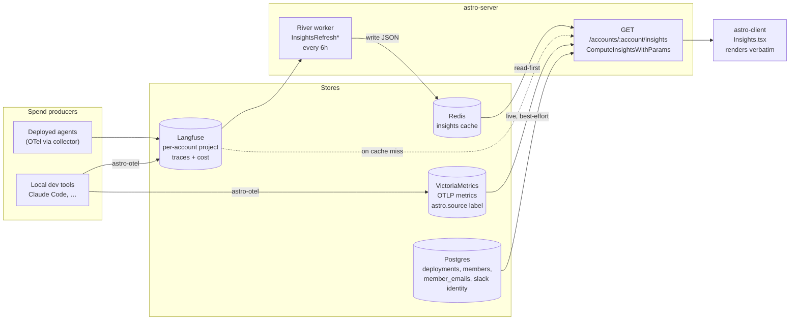
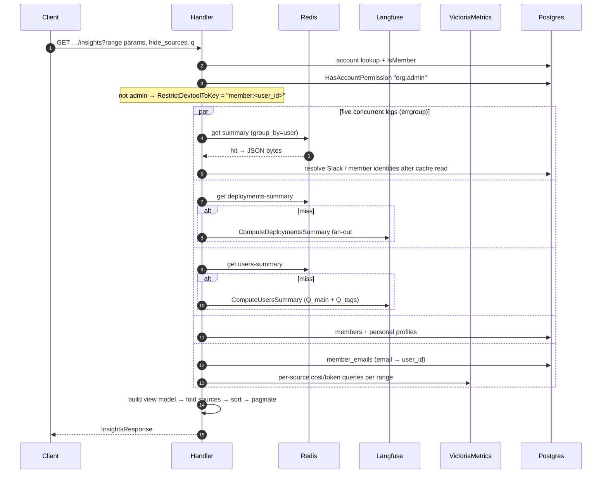
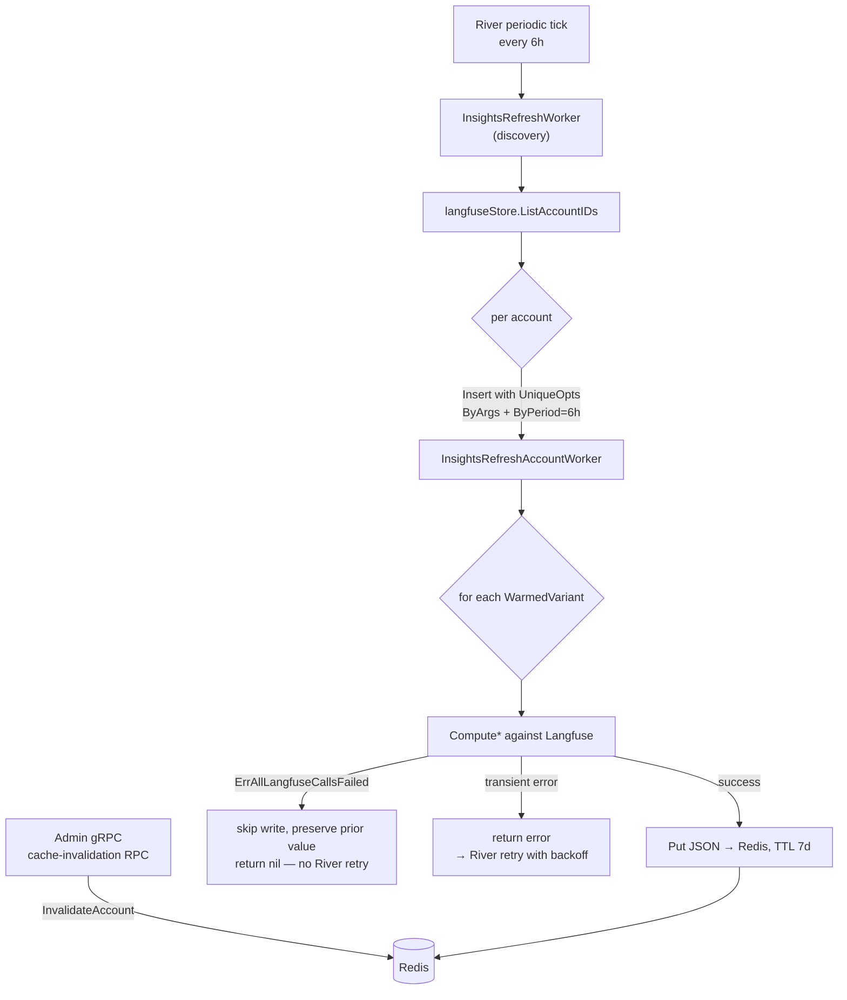
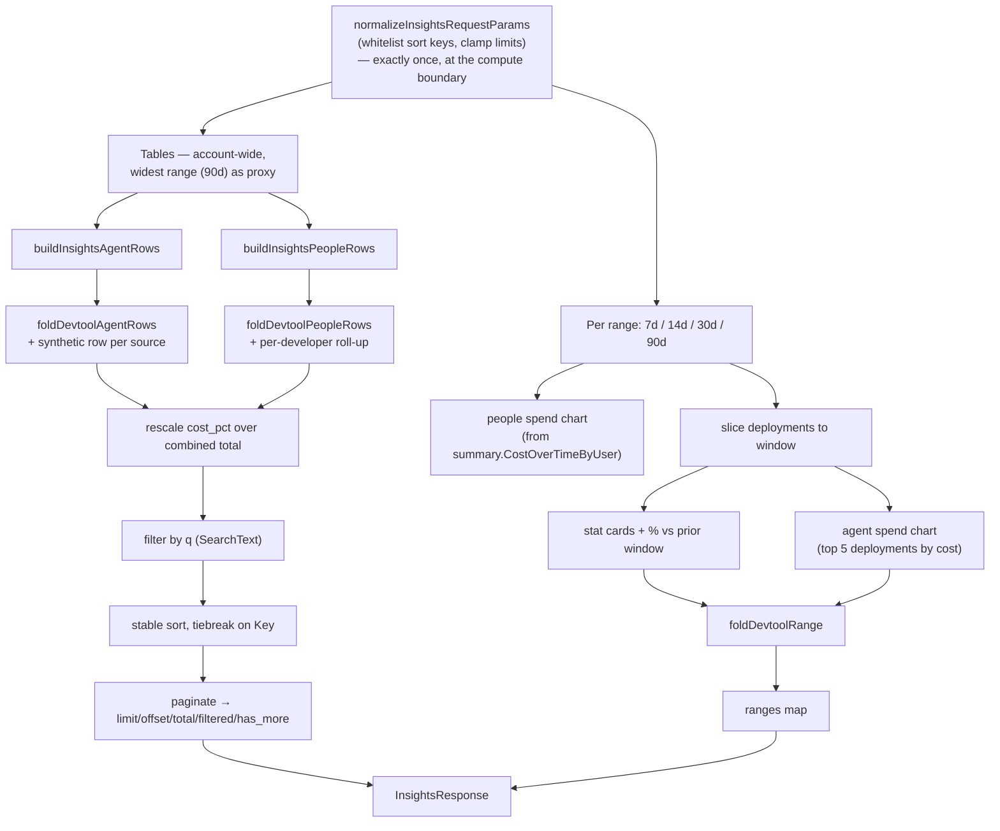
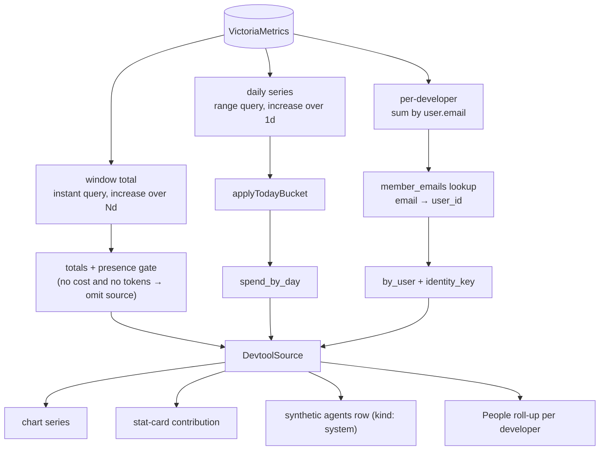
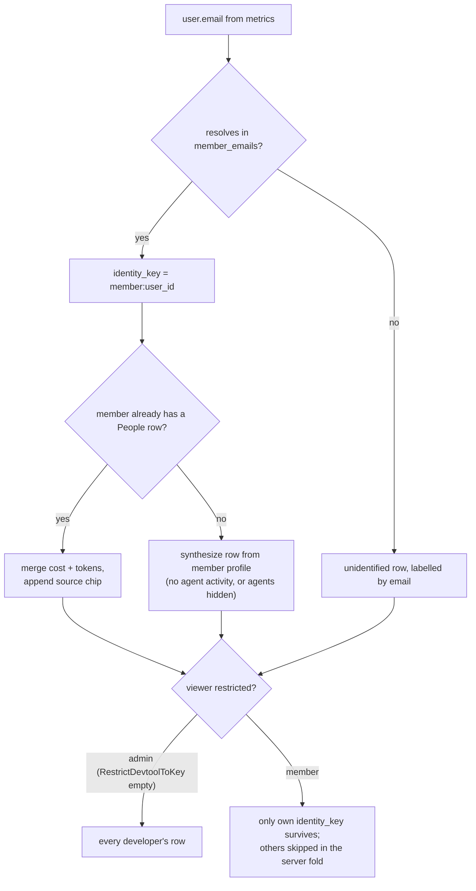
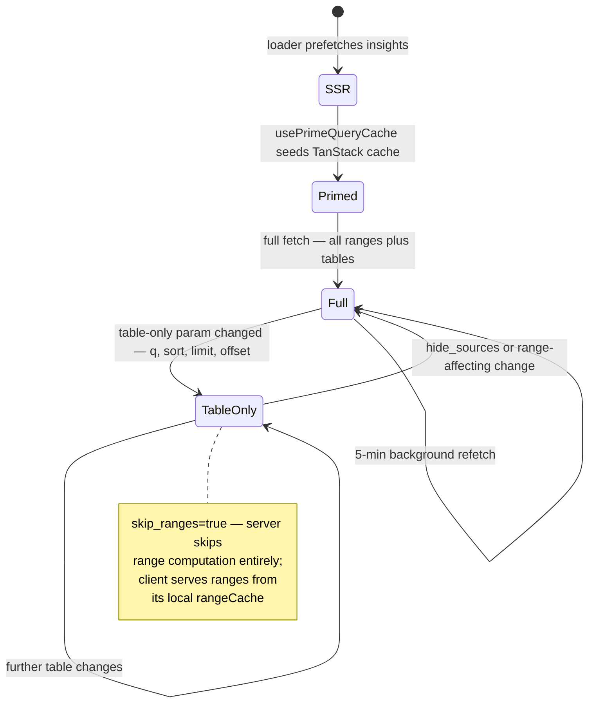

# Insights

**Status:** Authoritative — describes the shipped system
**Last verified:** 2026-08-04

The account **Insights** page answers one question: *where is this account's AI spend going, by agent and by person?* It unifies two spend sources — deployed Astro agents (traces in Langfuse) and local AI coding tools (metrics in VictoriaMetrics) — into a single server-owned view model.

This document is the source of truth for how Insights fits together. It supersedes the original Activity-tab spec, which has been removed. The ingest side that feeds it is specified in [claude-code-observability-spec.md](../01-spec/claude-code-observability-spec.md) and [devtool-prompt-collection-spec.md](../01-spec/devtool-prompt-collection-spec.md).

---

## Core principle

**The server owns the page; the client renders it.**

One endpoint returns display-ready ranges and table rows — labels, hrefs, avatars, identity kinds, percentages, pagination, search text. The client re-derives nothing. Before consolidation the frontend stitched together several observability APIs and re-computed row identity and totals locally; that produced inconsistent percentages, N+1 identity lookups, and sort/pagination bugs whenever a new data source appeared.

Two consequences follow, and both are load-bearing:

1. **Everything folds in before sort/paginate/percentage.** A new spend source becomes rows and series *inside* the existing pipeline, so sorting, search, `cost_pct`, and pagination stay correct by construction over the full data set rather than a paginated page.
2. **The page never queries upstream synchronously if it can avoid it.** Langfuse aggregation is expensive, so the read path is cache-first and a background worker owns the cost.

---

## System shape



Note the asymmetry, which is deliberate: **agent spend is cached, dev-tool spend is live.** Langfuse aggregation over a 90-day window is slow and costly, so it is pre-warmed. VictoriaMetrics range queries are cheap, so they run per request and stay fresh.

---

## Read path

`GET /api/v1/accounts/:account/insights` (`apps/astro-server/main.go`, handler in `handlers/insights.go`).



**Why identities resolve after the cache read.** Cached entries hold raw JSON bytes, and Slack display names / avatars change independently of metrics. Baking them into the cache would serve stale names for up to six hours. So metric buckets are cached; identity decoration is applied on every read (`ResolveAccountSummaryIdentities` and friends).

**Why the cache stores bytes, not structs.** The Go response shape can gain fields without invalidating existing entries — old entries return the fields they have, new fields appear as the cron catches up.

**Degradation is per-leg.** Each cached leg falls through to a live Langfuse compute on a miss; if that compute returns `ErrAllLangfuseCallsFailed` the leg degrades to zeros with `metrics_unavailable: true` rather than failing the page. The dev-tool leg is best-effort by construction: a nil metrics client, a query error, or no usage yields no data and Insights renders exactly as it did before dev tools existed. It can never 5xx the page.

---

## Cache and refresh pipeline

`internal/insightscache` owns keys and lifetime; `internal/riverqueue/insights_refresh.go` owns the writer.

| Constant | Value | Rationale |
|---|---|---|
| `RefreshInterval` | 6h | Every account's three endpoints fan out to Langfuse per refresh — this constant directly throttles our upstream load. |
| `CacheTTL` | 7d | Deliberately outlives many refresh windows, so a multi-hour Langfuse outage doesn't blank the page. |
| `queueInsights` workers | 3 | Bounds concurrent Langfuse pressure. |

Three `WarmedVariants` are pre-computed per account: `summary` (`group_by=user`), `deployments-summary`, `users-summary`. `WarmedVariants` is the single source of truth shared by the writer and `InvalidateAccount`, and an `init()` panics at boot if any declared variant lacks a fetch function — a missing wire-up fails fast instead of silently skipping an endpoint at runtime.



Two decisions worth preserving:

- **Discovery goes through `langfuseStore.ListAccountIDs`, not the deployments table.** Accounts that *previously* had deployments still hold a cached snapshot; enumerating by Langfuse provisioning keeps those snapshots refreshed or cleared instead of frozen.
- **A sustained upstream outage is not a retry condition.** `ErrAllLangfuseCallsFailed` returns success so River won't retry-storm against a system that will keep failing. The next 6-hourly discovery tick is the correct retry granularity. Transient errors (DB blips, cache write failures) *do* bubble up for backoff.

Operators can bypass the 6-hour cycle via the admin gRPC cache-invalidation RPC.

---

## View-model assembly

`buildInsightsViewWithParams` is the whole page in one function. Order is the contract.



**Params normalize once, at the compute boundary.** Sort keys are whitelisted per table (`insightsAgentSortKeys`, `insightsPeopleSortKeys`), limits clamp to `[1, 5000]` with a default of 25, direction collapses to `asc`/`desc`. Builders and paginators downstream trust their inputs and must not re-normalize.

**Both tables share one `cost_pct` denominator:** base total plus every enabled source's full total. The agents and People views are therefore comparable — a percentage means the same thing in both.

**Sorting is stable with `Key` as tiebreak**, so equal-valued rows never shuffle between pages. In the People table the `system` row is pinned last regardless of sort.

### Ranges vs. tables

This is the one intentional inconsistency on the page, and the most common source of confusion:

- **Charts and stat cards are range-scoped** — they respect the selected 7d/14d/30d/90d window.
- **Tables are account-wide.** They use the widest computed range (90d) as an account-wide proxy and do *not* re-slice when the user changes the range chip.

`widestInsightsRange()` computes the widest by `days`, not slice position, so the tables and `computeDevtoolForInsights` cannot drift apart when a range is added or reordered.

---

## Dev-tool sources

Everything keys on the `astro.source` label from the OTLP ingest path. Claude Code is the first entry in a registry, not a special case:

```go
var devtoolAdapters = []devtoolAdapter{
	{Key: "claude-code", Label: "Claude Code", Icon: "anthropic",
		CostMetric: "claude_code.cost.usage", TokenMetric: "claude_code.token.usage"},
}
```

Adding a tool is one entry. The rest — chart series, stat-card contribution, synthetic agents-table row, People roll-up, Sources-filter entry, branding — falls out.



Three query-shape decisions that exist because of how Prometheus-style range queries behave:

- **Totals come from the instant query, not the sum of the daily series.** The per-day range query drops the current partial day for wide windows and would undercount recent usage. The instant query decides both totals and whether a source is present at all.
- **`applyTodayBucket` adds today back** to the daily series, keyed on the same UTC day the agent chart uses, keeping the larger of the two values so a trailing-day bucket already counted isn't clobbered. Today's cost is range-independent, so it's queried once per source rather than once per range.
- **Selectors use quoted identifiers** (`{__name__="…", "astro.source"="…"}`) because VM's default OTLP ingestion preserves dots. If prod ever enables `usePrometheusNaming`, names and labels become underscored — `devtoolMatcher` is the single place to change.

### People roll-up and identity

Developer telemetry carries `user.email`. That maps to an account member through `member_emails` — a **local indexed mirror**, one lookup per request, no per-request WorkOS calls.



**Per-developer visibility is gated server-side.** Account admins (`org:admin`, or the sole member of a personal account) see every developer's spend; other members see only their own row folded in. The gate lives in the fold, so raw per-developer data never reaches a non-admin client. Aggregate spend — chart, stat cards, and the synthetic source row in the agents table — stays visible to every member. This is forward-compatible with a later reporting-hierarchy gate that widens "your own" to "you plus your reports".

### The Sources filter

`hide_sources` is a comma-separated list of source keys plus the `agents` pseudo-source; absent means all on. The server folds in only what's enabled, and `devtool_sources` always lists every *present* source regardless of selection so the filter can render its options.

Hiding `agents` zeroes the base contribution rather than removing the fold — stat-card totals, chart series, and both tables recompute against a source-only basis, and every resolved member gets a synthesized row so dev-tool-only spend still appears.

**When any source is folded in, the period-over-period `Change` is dropped.** It is computed from agent spend only and no longer describes the folded total; pairing a real total with a misleading delta is worse than showing no delta.

---

## Identity model

Every row carries an `InsightsIdentityRef` with a discriminated `kind`. The client switches on `kind` for chrome and never re-classifies.

| Kind | Source | Rendering |
|---|---|---|
| `agent` | deployment | avatar, links to `/{account}/agents/{id}/monitor` |
| `member` | account member, or Astro-classified trace user | profile avatar, links to `/{username}` |
| `slack` | Slack-classified trace user | Slack profile, `slack://` deep link, `identity_key` = `slack:{team}:{user}` |
| `system` | traces with no user, and dev-tool source rows | non-clickable, tooltip explains why |
| `unidentified` | unclassified user id, or unmatched developer email | raw label |

Row keys are `{kind}:{identity_key or id}`, which is what makes the dev-tool merge possible: the server-computed `member:{user_id}` key from metrics matches the same member's People-row key from traces.

`missing_slack_details_count` reports Slack rows whose profile enrichment hasn't landed, driving the "re-sync Slack" affordance on the page.

---

## Client

`apps/astro-client/src/pages/Insights.tsx` + `useAccountInsights` (`src/api/queries/observability.ts`).

The client is a renderer. It resolves branding (chart colors, brand logos via `getIntegrationIconUrl`) and nothing else — no metric math, no identity resolution, no re-sorting.



**Two-phase fetching.** Recomputing all four ranges to answer "sort the table by requests" is wasted work. Once ranges are cached client-side, a table-only param change refetches with `skip_ranges=true` and the client keeps rendering charts from `rangeCache`.

`insightsTableParamsSignature` decides what counts as table-only, and **deliberately excludes `hide_sources`** — toggling a source changes the chart and stat cards, so it must trigger a full-ranges refetch. Adding `hide_sources` to that signature would silently stale the chart; the function carries a comment saying so.

### The Models view is not served by this endpoint

The page has **three** views behind `ViewToggle`: Agents, People, and **Models**. Agents and People render rows from `InsightsResponse`. Models does not — `ModelsTopSpenders` self-fetches `useAccountObservabilitySummary` and renders its `cost_by_model` array (model, requests, cost, `cost_pct`, tokens, `token_pct`, p50, p95).

Two consequences:

- The Models view is **range-scoped** (it passes `days`), while the Agents and People tables are account-wide at 90d. Switching views silently changes the window being displayed.
- The consolidation is incomplete. `/insights` owns two of three views; the third still goes to the lower-level summary endpoint, which is also consumed elsewhere (e.g. dashboard stats) and therefore can't simply be retired.

Model is a dimension the Insights view model has no concept of — `InsightsAgentRow` has no model field, and `AccountCostOverTimeEntry.Models` reuses the "model" field name to carry *deployment IDs* in the agent chart, which is a naming trap when reading this code.

Other client-side conventions:

- **Filter state lives in the URL** (`range`, `view`, `hide_sources`, `q`), persisted via `usePersistentSearchParams`, so views are shareable and survive navigation. Stale `?range=all` deep-links from before the all-time range was retired fall back to `30d` rather than erroring.
- **`shouldRevalidate` suppresses loader re-runs** for same-path param changes — the consolidated response already contains every range, and `view`/`q` are display choices. The one exception is the programmatic revalidate used for org switching.
- **Search is debounced 300ms**; sort, paging, and source toggles refetch immediately with `keepPreviousData` to avoid flicker.
- **5-minute `staleTime` and background `refetchInterval`**, window-focus refetch off (refresh-on-return is jarring). The page carries a standing note that results may take up to six hours to appear — the honest consequence of the refresh interval.

---

## Failure modes

| Condition | Behavior |
|---|---|
| Langfuse fully down, cache warm | Cached values render; `metrics_unavailable` banner suppressed if cache hit |
| Langfuse fully down, cache cold | Zeroed legs, `metrics_unavailable: true`, warning panel |
| Langfuse partial failure | Partial legs render normally (per-`Compute*` semantics; `ComputeUsersSummary` treats `Q_main` failure alone as fatal because a `Q_tags`-only success would surface zero-metric users) |
| Redis absent | Every read falls through to live Langfuse; correct but slow |
| No metrics backend / VM error | Dev-tool block absent, Insights unchanged |
| Cached JSON undecodable | Logged, recomputed live |
| Developer email unmatched | Appears as its own email-labelled row |

---

## Known limitations

- **Tables are account-wide (90d)** while charts and stat cards are range-scoped. Making tables range-scoped means either range-scoped Langfuse aggregation per request or four cached table variants per account.
- **The Models view bypasses this endpoint** and is range-scoped, so it disagrees with the sibling Agents/People tables about which window is on screen.
- **`people_spend_chart` is not folded** with dev-tool sources — `foldDevtoolRange` covers the agent chart, stat cards, and series labels only. The People chart reflects agent spend alone.
- **No request-count metric exists for dev tools**, so request-derived columns (`requests`, `cost_per_request`, `tok_per_request`, `p95_latency_ms`) are zero on synthetic source rows.
- **Agent spend chart is capped at the top 5 deployments** by cost; the rest are absent from the chart, though present in the tables.
- **Per-developer visibility is admin-only.** Widening to a reporting hierarchy via WorkOS FGA is tracked separately.
- **VM metric naming in prod is unverified** (dots-preserved vs `usePrometheusNaming`); graceful-empty is the safety net.

---

## File map

| Concern | Path |
|---|---|
| Endpoint, view-model assembly, pagination | `apps/astro-server/handlers/insights.go` |
| Response types | `apps/astro-server/handlers/responses.go` |
| Dev-tool queries + adapter registry | `apps/astro-server/handlers/observability_devtool_insights.go` |
| Dev-tool fold | `apps/astro-server/handlers/insights_devtool_fold.go` |
| Langfuse `Compute*` fan-outs | `apps/astro-server/handlers/observability_langfuse.go` |
| Cache keys, TTLs, warmed variants | `apps/astro-server/internal/insightscache/cache.go` |
| Refresh workers | `apps/astro-server/internal/riverqueue/insights_refresh.go` |
| Route registration | `apps/astro-server/main.go` |
| Page | `apps/astro-client/src/pages/Insights.tsx` |
| Query hook | `apps/astro-client/src/api/queries/observability.ts` |
