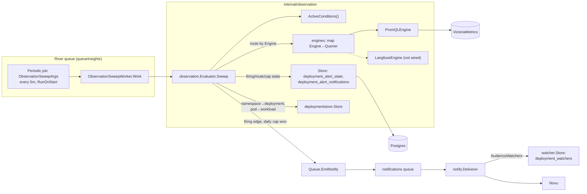
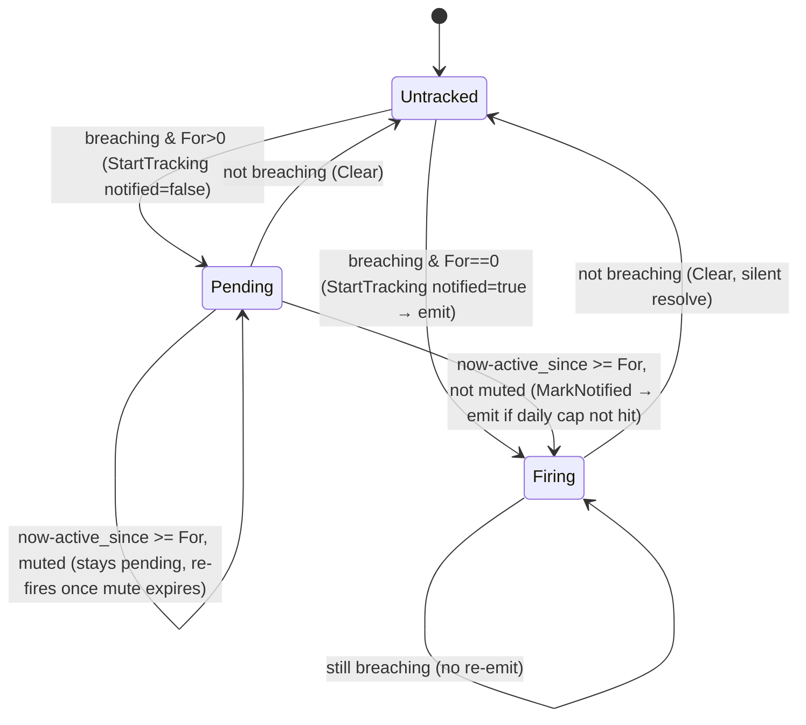

# Observation alerts

**Status:** Authoritative — describes the shipped system
**Last verified:** 2026-08-26

## Summary

The observation evaluator is a periodic in-process job that detects sustained
resource and health problems on running deployments and turns them into
notifications. It runs threshold queries against metrics, holds firing state
in Postgres, and emits **one notification per firing episode** — never on a
transient spike, never a duplicate.

This doc is the canonical description of the evaluator, its conditions, and
its firing-state machinery: `apps/astro-server/internal/observation/**`. For
how a fired alert actually reaches a person (Novu, workflows, channel
preferences), see [`01-spec/notifications-spec.md`](../01-spec/notifications-spec.md)
and [`09-reference/novu-workflow-payloads.md`](../09-reference/novu-workflow-payloads.md).
This doc covers only the boundary between the two: what event the evaluator
emits and who it addresses it to.

The original design is [`01-spec/observation-alert-evaluator-spec.md`](../01-spec/observation-alert-evaluator-spec.md).
The core algorithm it describes (sustained-window firing, edge-only emit,
per-episode dedup, silent resolve) matches the shipped system. Several other
things it describes have moved on since it was written: a third severity
(`info`) was added, a daily send cap and admin mute were added, the
notification audience changed from account members to deployment watchers,
and astro-queen grew a cross-deployment Alerts admin page. This doc reflects
current behavior; the spec is marked superseded for the parts that shipped.

## Not part of this system

Three packages live next to `internal/observation` in the tree but back
unrelated features, not alerting:

- `internal/obssummary` caches Langfuse-derived summary data (sparklines,
  usage totals) for the agents list page.
- `internal/metricsstore` reads lifetime message counts per agent.
- `internal/heartstore` backs the agent "like" (heart) feature.

`internal/loki` is also unrelated: it's the query client behind the
deployment **Logs** tab and log streaming (`handlers/logs.go`), not the
Alerts tab. The evaluator never queries Loki.

`internal/promquery` is not alert-specific either. It's a general
Prometheus-compatible HTTP client (targets VictoriaMetrics) also used by the
workload metrics API, per-deployment network metrics, and the message-count
sync job. The observation evaluator is one of several consumers, wired
through its own `PromQLEngine` adapter (`internal/observation/promql.go`).

## Architecture



The worker is constructed fresh inside each `Work` call from clients wired
into `ObservationSweepWorker` at startup; the `queue` field for emitting is
set post-construction. `Work` is a no-op if either `prom` or `queue` is nil.

### Query engines

`Condition.Engine` names the backend a condition's query runs against. The
evaluator holds `engines map[Engine]Querier` and skips any condition whose
engine isn't registered — a condition can exist in the catalog before its
engine is wired, and it's simply inert until then. Today only one engine is
registered:

```
EnginePromQL   — VictoriaMetrics, via *promquery.Client wrapped by PromQLEngine
EngineLangfuse — declared, never registered; no condition in the catalog targets it
```

`PromQLEngine.Query` runs an instant PromQL query and converts each
`promquery.Sample` to an engine-neutral `Series{Labels, Value}`. Every series
a condition's query returns must carry `namespace` and `pod` labels; PromQL
conditions aggregate `by (namespace, pod)` to guarantee this.

## Conditions

`Condition{Name, Title, Description, Guidance, Severity, Engine, Query, For, DetailsFor, Disabled}`,
defined in `internal/observation/conditions.go`. `Description` is the static,
always-true summary shown in the alert catalog (customer Alerts tab, admin
catalog). `Guidance` is the one-sentence fix, kept separate from
`Description` because the catalog also renders `Description` for a
condition that *isn't* firing, where a fix reads as a false alarm — `Guidance`
only appears in an emitted notification's `details`, never in the catalog.
`DetailsFor(value)` optionally renders the breaching series' scalar into an
extra clause appended to `details` (e.g. "It restarted 7 times in the last 5
minutes."); it's nil for conditions whose breach can't usefully be quantified.

`ActiveConditions()` is the subset with `Disabled: false` — this is what the
evaluator runs and what both the customer Alerts tab and astro-queen's Alerts
page list. `Conditions` (the full catalog) is still consulted to resolve a
condition name to a title/severity for leftover state or mute rows from a
condition that's since been disabled.

Shipped catalog, all on `EnginePromQL`:

| Name | Severity | For | Disabled | Meaning |
|---|---|---|---|---|
| `crash_loop` | critical | 5m | no | Container stuck in `CrashLoopBackOff`. |
| `oom_killed` | critical | 0 (fires on detect) | no | Container's last termination was an OOM kill. |
| `unschedulable` | critical | 10m | no | Pod stuck `Pending` (capacity/quota/scheduling). |
| `restart_storm` | warning | 0 (query already windows) | no | >5 restarts in a 5m window. |
| `memory_over_budget` | warning | 10m | no | Working set sustained >90% of the memory limit. |
| `compute_over_budget` | warning | 10m | no | CPU CFS-throttled a majority of periods over 10m. |
| `cpu_over_provisioned` | info | 6h | **yes** | P95 peak CPU <40% of the reserved request. |
| `memory_over_provisioned` | info | 6h | **yes** | Working set <50% of the reserved request. |

The two over-provisioned rules are disabled (as of PR #2022, `81b44f74e`). A
fixed utilization floor reads an idle agent as waste and fired on healthy
deployments with nothing to fix. Re-enabling needs a threshold that accounts
for how busy the agent actually is; the queries, copy, and `DetailsFor`
formatters stay in the catalog for that future revision.

`error_spike` and `latency_high` (Langfuse-sourced: error rate, p95 latency)
and `storage_near_full` (messaging sidecar disk usage) remain unshipped: none
of the three exist as entries in `conditions.go` today, and no Langfuse
querier is registered. They're design intent recorded in
`notifications-spec.md`'s alert catalog, not code you'll find in this
package.

## Firing-state machine

State lives in `deployment_alert_state`, one row per `(deployment_id, workload, condition)`:

```
deployment_id text          -- deployment the breach belongs to
workload      text          -- workload component (e.g. "agent", "model-x")
condition     text          -- condition Name
active_since  timestamptz   -- first sample seen breaching; drives `For`
notified      boolean       -- firing edge handled for this workload?
updated_at    timestamptz
PRIMARY KEY (deployment_id, workload, condition)
```

A pod resolves to a workload via the deployment's runtime snapshot (the pod's
`app.kubernetes.io/component`, falling back to a workload-name prefix match).
State keys on **(deployment id, workload)**, not namespace, so a redeploy —
which gets a new deployment id — starts a clean episode.



**Edge-only firing.** An alert emits exactly once, on the
`notified: false → true` transition. `active_since` is preserved by an
`INSERT ... ON CONFLICT DO NOTHING`, so a re-observed breach never resets its
window.

**Per-workload state, per-episode dedupe.** State tracks every workload
independently, but the evaluator emits at most one notification per
`(deployment, condition)` episode: it fires only when a workload trips and no
other workload of that deployment has already notified this condition. Two
workloads crash-looping together still produce one mail.

**Silent resolve.** When a workload stops breaching, its row is deleted. No
resolve notification is sent (unchanged from the original design; still an
open item, not built).

**Per-episode dedupe key.** `DedupeKey = <name>:<deploymentID>:<workload>:<active_since.Unix()>`.
Because `active_since` is part of the key, a new breach after a resolve is a
distinct Novu transaction; retries of the same episode collapse to the same
key.

## Daily cap

The per-episode dedup still lets a *flapping* deployment (resolve, re-breach,
resolve, re-breach) emit repeatedly in a day — each resolve starts a new
episode. `deployment_alert_notifications` adds a second, independent choke
point: at most one send per `(deployment, condition)` per rolling 24-hour
window.

```
deployment_id    text
condition        text
last_notified_at timestamptz  -- when this (deployment, condition) last sent, NULL = never
muted_until      timestamptz  -- admin mute expiry, NULL/past = not muted
PRIMARY KEY (deployment_id, condition)
```

`ClaimDailyNotify(deploymentID, condition, at, cutoff)` does a race-safe
upsert that only succeeds if `last_notified_at` is null or older than the
cutoff (`now - 24h`). Firing state (`MarkNotified`) is set regardless of
whether the claim succeeds — a capped alert still stops re-evaluating that
episode, it just doesn't mail. The cap is per condition, not per severity or
account, so `crash_loop` and `oom_killed` on the same deployment can both
alert the same day.

This table is never deleted on resolve (unlike `deployment_alert_state`), so
the daily-cap ledger spans episodes on purpose.

## Admin mute

The same table carries `muted_until`, set by astro-queen's Alerts page
(`admingrpc.MuteAlert`/`UnmuteAlert`, `internal/admingrpc/alerts.go`). A mute
silences the *notification* only — detection keeps running and the
`deployment_alert_state` row keeps tracking the breach. Concretely: when a
condition's `For` window elapses on a muted `(deployment, condition)`, the
evaluator checks `IsMuted` before `MarkNotified` and, if muted, leaves the row
`notified=false` and moves on. That means a muted condition stays visibly
`pending` (not `firing`) in both Alerts UIs until the mute expires, at which
point the next sweep marks it notified and fires normally, subject to the
daily cap. Muting is per `(deployment, condition)`, matching the dedup scope:
it silences every workload of that condition on that deployment together.

## Severity and workflow

Every condition has a `Severity` (`info`, `warning`, `critical`), and
severities collapse to three Novu workflows, not one per condition:

| Severity | Workflow id | Meaning |
|---|---|---|
| `Critical` | `observation.critical` | Agent not functioning: crash loop, OOM, unschedulable. |
| `Warning` | `observation.warning` | Degraded but running: restarts, memory/compute pressure. |
| `Info` | `observation.info` | Healthy agent wasting resources (over-provisioned). |

`observation.info` currently has no producer: its only two conditions
(`cpu_over_provisioned`, `memory_over_provisioned`) are disabled. It's a
defined workflow and preference toggle with nothing feeding it today.

`fire()` builds the notification via
`notify.Observation(severity.notifyType(), accountID, accountName, agentName, deploymentID, reason, details)`.
`reason` is the condition `Title` plus the workload in parentheses (e.g.
"Out of memory (model-x)"); `details` is `Description` plus the
`DetailsFor(value)` clause (if any) plus `Guidance`. Firing state and the
daily-cap ledger stay keyed on the granular condition `Name`, not the shared
workflow, so two same-severity conditions on one deployment can't collide.

## Recipients: deployment watchers

Observation events use `notify.AudienceWatchers`, resolved against
`internal/watcher` — **not** the account's full member list. This is newer
than the original design (PR #1879, `41d6eb7d4`) and is a real deviation from
what `notifications-spec.md` currently documents (`Audience members`); treat
this doc as authoritative for the audience until that spec is corrected.

`deployment_watchers` (deployment_id, user_id, account_id, reason, muted) is
populated two ways:

- **Implicit.** `watcher.AuditObserver` subscribes to the audit log
  (`auditlog.Store.Observe`) and enrolls any user actor whose action starts
  with `deployment.` — acting on a deployment (deploy, restart, stop, delete,
  …) auto-subscribes you to its alerts. This makes enrollment automatic for
  anyone who touches the deployment, with no separate opt-in step.
- **Explicit.** `POST/DELETE /deployments/:id/watchers/me` let a member watch
  or unwatch a deployment directly, and `GET /deployments/:id/watchers` lists
  everyone subscribed (`handlers/watchers.go`). Unwatching sets `muted=true`
  rather than deleting the row, so a later deploy doesn't silently
  resubscribe someone who opted out. **No client UI calls these routes yet**
  — the API exists, the astro-client frontend doesn't surface it.

At delivery, `notify.Deliverer.resolveWatchers` calls
`watcher.Store.ActiveUserIDs` (every non-muted watcher) and falls back to
`resolveManagers` (org managers, then the account owner) when there's no
watcher lookup configured, no deployment scope on the event, nobody watching
yet, or the lookup errors — an alert with no watchers still reaches someone
rather than going silent.

## Two read paths

The same `observation.Store` backs two different UIs:

| Surface | Scope | Endpoint | Notes |
|---|---|---|---|
| Deployment Alerts tab (astro-client) | One deployment, one workload | `GET /api/v1/deployments/:id/alerts?workload=<component>` (`handlers/observation_alerts.go`) | Renders the full `ActiveConditions()` catalog with each condition's state (`ok`/`pending`/`firing`) for the viewed workload. Polls every 10s (`useDeploymentAlerts`). State is read under the *latest* deployment id for the namespace (what the evaluator writes), falling back to the viewed deployment. Tab sits beside Events, Logs, Metrics in `PodDetailPanel.tsx`. |
| Alerts page (astro-queen admin) | All deployments, all accounts | `AdminService.ListAlerts`/`ClearAlert`/`MuteAlert`/`UnmuteAlert` (`internal/admingrpc/alerts.go`) | Cross-deployment view: every currently-tracked breach plus mutes with no active breach (so an admin can still find and lift them), enriched with agent/account identity and last-notified time. `ClearAlert` deletes the tracked row as a manual reset — if still breaching, the next sweep re-detects and re-tracks it. See [`astro-queen.md`](astro-queen.md)'s feature table (Alerts row). |

## Scheduling

Registered as a River periodic job on `queueInsights`:
`river.PeriodicInterval(5m)`, `RunOnStart: true`,
`UniqueOpts{ByPeriod: 5m}` (so overlapping schedulers can't double-enqueue).
Both the periodic-job registration and the `ObservationSweepWorker` itself
are gated on `cfg.PromClient != nil` — no VictoriaMetrics endpoint configured
means no sweep at all, not a sweep that queries nothing.

## Failure and idempotency

- **Restart-safe.** All firing, daily-cap, and mute state is in Postgres; a
  restarted server resumes mid-window and mid-episode with no lost or
  duplicated alerts.
- **Query failure.** Logged per condition (`observation: condition eval
  failed`); that condition is skipped this sweep and retried next sweep.
  Existing state is untouched — a breach isn't falsely resolved because one
  query errored.
- **Emit failure.** Logged, non-fatal. `MarkNotified` happens before `fire`,
  so a failed emit isn't retried within the episode: an alert is at-most-once
  by design (a dropped alert is preferred over a duplicate).

## What's still not built

- **Per-deployment threshold overrides.** Every condition's threshold is a
  package-level constant; there's no per-deployment configuration.
- **Resolve notifications.** Still silent in v1; the original design's "in-app
  only" resolve notice is deferred, not built.
- **Langfuse-sourced conditions** (`error_spike`, `latency_high`) and a
  messaging-sidecar condition (`storage_near_full`). No engine, no catalog
  entries. `EngineLangfuse` exists as a constant with nothing registered
  against it.

## References

- Evaluator, conditions, state store: `apps/astro-server/internal/observation/{evaluator,conditions,store,promql}.go`
- Worker and schedule: `apps/astro-server/internal/riverqueue/observation.go`, `periodic.go`, `workers.go`
- Watcher (recipient audience): `apps/astro-server/internal/watcher/{store,observer}.go`, `apps/astro-server/handlers/watchers.go`
- Customer read API: `apps/astro-server/handlers/observation_alerts.go`
- Admin read/write API: `apps/astro-server/internal/admingrpc/alerts.go`
- Emit boundary: `apps/astro-server/internal/notify/payload.go` (`Observation`), `deliver.go` (`resolveWatchers`)
- Schema: `sql/astro-server/schema.sql` (`deployment_alert_state`, `deployment_alert_notifications`, `deployment_watchers`)
- Delivery mechanics (Novu, preferences, payload contract): [`01-spec/notifications-spec.md`](../01-spec/notifications-spec.md), [`09-reference/novu-workflow-payloads.md`](../09-reference/novu-workflow-payloads.md)
- Original design: [`01-spec/observation-alert-evaluator-spec.md`](../01-spec/observation-alert-evaluator-spec.md)
