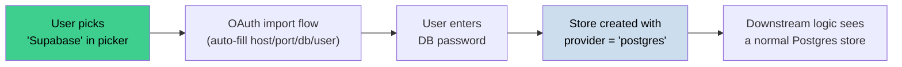
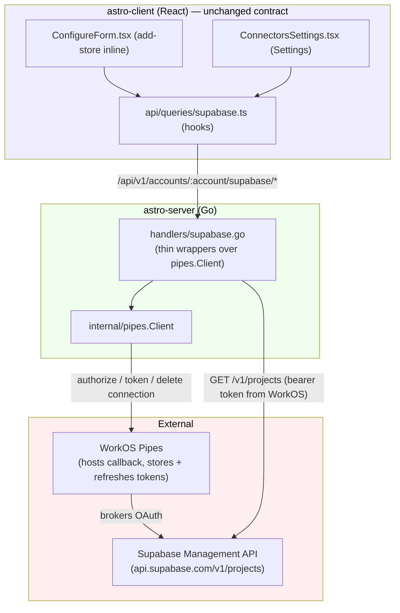
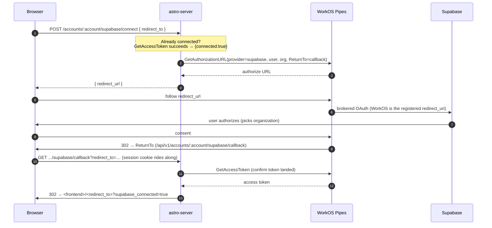
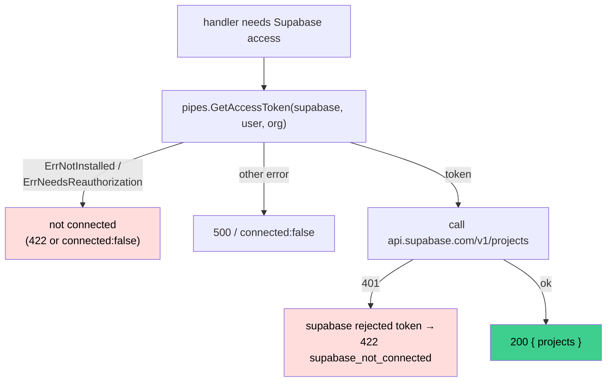

# Supabase Knowledge Store — Architecture

This document explains how the Supabase knowledge-store integration works end to
end: the "Supabase is really Postgres" design decision, the WorkOS Pipes OAuth
brokering, the server endpoints, and the client UI.

## 1. The Core Idea

A "Supabase knowledge store" is **not** a new store type. Under the hood it is an
ordinary **external PostgreSQL** store pointed at a Supabase project:

```
host:     db.<project-id>.supabase.co
port:     5432
database: postgres
username: postgres
password: <supplied by user>
```

`supabase` exists only as a **client-side picker entry**. Selecting it triggers
an OAuth import flow that auto-fills the connection fields; when the store is
actually created it is submitted with `provider: "postgres"`. The database
`provider` column is never `"supabase"`, so every downstream code path
(deploy, bind, health-check) is untouched.



**Trade-off:** after creation a Supabase store is indistinguishable from any
other Postgres store — there is no per-store "Supabase" badge. The OAuth
connection is per-**account/user**, not per-store.

## 2. OAuth is brokered by WorkOS Pipes

The integration does **not** hand-roll OAuth or store tokens. Supabase is
registered in WorkOS Pipes as a **custom OAuth provider** (slug `supabase`) —
the same mechanism GitHub and Slack already use. WorkOS owns the hard parts:

| Concern | Owner |
|---|---|
| OAuth callback hosting | **WorkOS** |
| Token storage (access + refresh) | **WorkOS** |
| Token refresh | **WorkOS** |
| Client credentials (id/secret) | **WorkOS** custom-provider config |
| Serving a fresh access token on demand | **WorkOS** (`GetAccessToken`) |
| Calling `api.supabase.com/v1/projects` | astro-server (with WorkOS-served token) |

The server side is a thin wrapper over `internal/pipes.Client`
(`handlers/supabase.go`), mirroring the `GitHubAccount*` handlers.



### File responsibilities

| Layer | File | Responsibility |
|-------|------|----------------|
| Client UI | `pages/knowledge/NewKnowledgeStore/ConfigureForm.tsx` | Inline connect card + project picker in add-store |
| Client UI | `pages/settings/ConnectorsSettings.tsx` | `SupabaseSection` — connect/disconnect from settings |
| Client data | `api/queries/supabase.ts` | `useSupabaseStatus/Connect/Projects/Disconnect` hooks |
| Client data | `api/queries/keys.ts`, `lib/api.ts` | `supabaseKeys` factory + `ApiClient` methods + `SupabaseProject` |
| Client meta | `components/knowledge/knowledge-utils.ts`, `ProviderIcon.tsx` | Provider maps + Supabase logo |
| Server | `handlers/supabase.go` | 6 handlers wrapping `pipes.Client` (connect, status, projects, project health, disconnect, callback) |
| Server | `internal/pipes/client.go` | WorkOS Pipes API (`GetAuthorizationURL`, `GetAccessToken`, `DeleteConnection`) |
| Server | `main.go` | Route registration with the shared `pipesClient` |

There is **no** Supabase token store, KMS code, PKCE code, or Supabase env var —
all removed in favor of WorkOS Pipes.

## 3. The OAuth Flow



### Key properties

- **No account in a public callback.** The callback is
  `/api/v1/accounts/:account/supabase/callback` — authenticated and
  account-scoped, behind `ResolveAccount` + `RequireAccountMember`, exactly like
  the GitHub callback. The browser's session cookie rides the redirect, so there
  is no unauthenticated redirect endpoint and no CSRF state to manage (WorkOS
  handles the OAuth `state`).
- **PKCE / client secret** live in the WorkOS custom-provider definition, not in
  our code or config.
- **Open-redirect protection.** `isSafeRedirectPath` rejects anything that isn't
  a same-origin relative path before the browser is bounced to `redirect_to`.

## 4. Token Lifecycle — WorkOS owns it

There is no token freshness logic in astro-server. Every endpoint that needs the
Supabase API asks WorkOS for a token and reacts to the result:



- **"Connected" = WorkOS can serve a token** (mirrors GitHub/Slack). An expired
  *access* token still reads as connected because WorkOS refreshes it on demand —
  there is no access-token-expiry check on our side.
- A token WorkOS can't serve → "not connected"; a token Supabase rejects with
  401 → `supabase_not_connected` (prompt reconnect).

## 5. HTTP Endpoints

All routes are account-scoped and authenticated (`ResolveAccount` +
`RequireAccountMember`). The callback is part of the same group — no separate
public route.

| Method | Path | Handler | Pipes call |
|--------|------|---------|-----------|
| POST | `/api/v1/accounts/:account/supabase/connect` | `SupabaseConnect` | `GetAccessToken` (short-circuit) then `GetAuthorizationURL` |
| GET | `/api/v1/accounts/:account/supabase/status` | `SupabaseStatus` | `GetAccessToken` |
| GET | `/api/v1/accounts/:account/supabase/projects` | `SupabaseListProjects` | `GetAccessToken` + `GET /v1/projects` |
| GET | `/api/v1/accounts/:account/supabase/projects/:ref/health` | `SupabaseProjectHealth` | `GetAccessToken` + project health fetch |
| DELETE | `/api/v1/accounts/:account/supabase` | `SupabaseDisconnect` | `DeleteConnection` |
| GET | `/api/v1/accounts/:account/supabase/callback` | `SupabaseCallback` | `GetAccessToken` (confirm) |

**Config:** none beyond `WORKOS_API_KEY` (already used for auth). Supabase client
credentials live in the WorkOS custom-provider definition. `SupabaseHandlerConfig`
only carries `WebhookBaseURL` (for the `ReturnTo` callback) and `FrontendURL`.

## 6. Client UI

The client is **unchanged** by the WorkOS migration — the API contract
(connect/status/projects/disconnect + `SupabaseProject`) is identical.

- **Add-store flow (`ConfigureForm.tsx`)** — the projects query doubles as the
  connection check: a `422 supabase_not_connected` means "run OAuth". Before
  OAuth: a focused connect card. After: provider header + project picker;
  selecting a project auto-fills host/port/db/user and reveals the database
  password field. On submit, `provider` is rewritten to `"postgres"`.
- **Settings → Connectors (`SupabaseSection`)** — connect/disconnect alongside
  GitHub and Slack; optimistic disconnect with rollback behind a confirmation
  dialog. Uses `useSupabaseStatus`, which is now accurate at all times because
  WorkOS manages token freshness.
- `?provider=supabase` on the add-store URL pre-selects the provider so the OAuth
  round-trip returns straight to the Supabase form; `supabase_connected` /
  `supabase_error` params are stripped after read.

## 7. Test Coverage

`handlers/supabase_test.go` reuses the shared WorkOS/HTTP test harness
(`rewriteTransport`, `injectTestSession`, `injectTestAccount`) to cover: status
(connected / not-connected), list-projects (success / token-revoked-by-API →
422), disconnect, callback (success / not-authenticated), connect
(already-connected), and the pure helpers (`isSafeRedirectPath`, `appendParam`).
