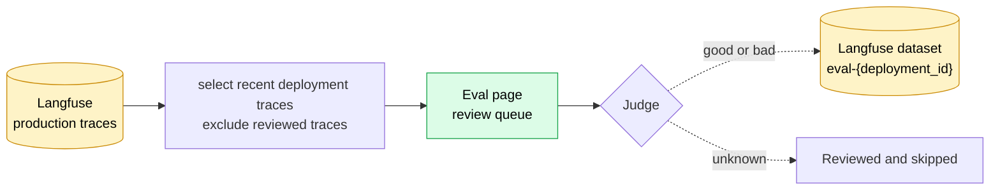
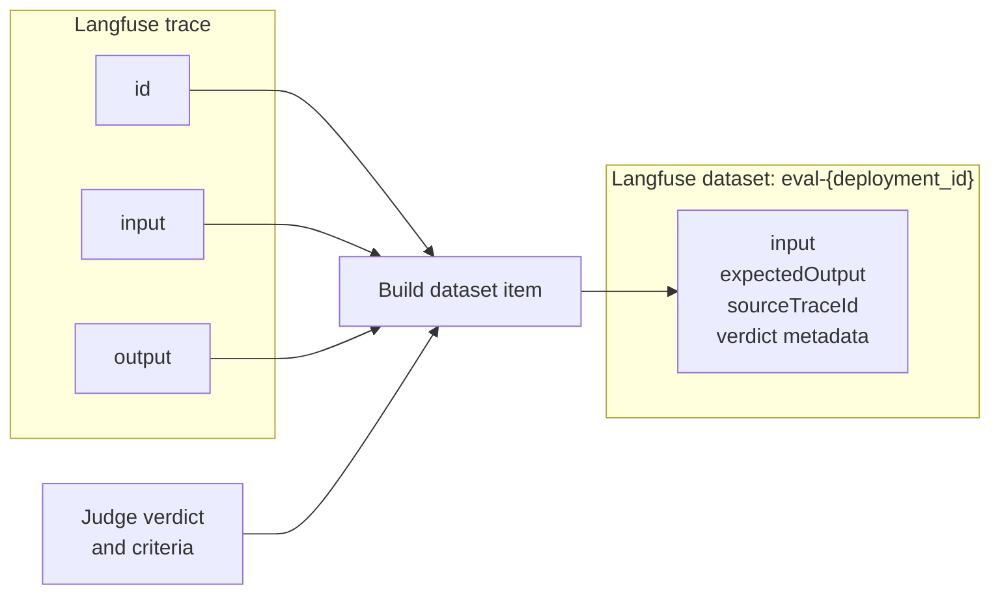

# Traces to Eval Dataset Pipeline

## Summary

The Eval page turns production traces already stored in Langfuse into a curated dataset for one deployment. It reads the trace fields needed for review, presents unreviewed traces to a Judge, and adds traces marked `good` or `bad` to the deployment's Langfuse dataset. Traces marked `unknown` are reviewed but not added.

There is no periodic trace-to-dataset sync. A judgment is the event that admits a trace to the dataset.

Before this flow begins, the agent and Astro OTel collector create and enrich the production trace. The collector adds the deployment tag and normalizes the top-level input and output so they are available as trace fields in Langfuse. This document begins at that boundary.

## End-to-end flow



## Trace fields used by the Eval pipeline

The pipeline does not copy an entire trace into the review queue or dataset. It uses a small set of trace-level fields:

| Trace field | How it is used |
|---|---|
| `id` | Links the review decision and dataset item to the original trace. |
| `input` | Shows the request to the Judge and becomes the dataset item input. |
| `output` | Shows the agent response to the Judge and becomes the expected output. |
| `timestamp` | Orders recent traces in the review queue. |
| `sessionId` | Groups messages from the same conversation so surrounding turns provide context about how the user reacted to the agent's response. |
| `tags` | Selects and verifies traces with `deployment:{deployment_id}`. |

## Build the review queue

The Eval page requests recent traces for the current deployment. `astro-server` reads them from Langfuse using the `deployment:{deployment_id}` tag and orders them newest first.

Before returning the queue, the server:

1. Excludes traces that have already been reviewed.
2. Excludes traces without an input.
3. Uses messages from the same Langfuse session to infer whether the user reacted to the agent's response.
4. Prioritizes traces with a reaction signal, then orders each group by recency.

The reaction signal only affects queue ordering. It never determines the verdict or adds a trace to the dataset.

## Add a trace to the dataset

The Judge reviews the trace input and output, then selects one of three verdicts:

| Verdict | Result |
|---|---|
| `good` | Add the trace as a successful dataset example. |
| `bad` | Add the trace as a labeled failure example. |
| `unknown` | Do not create a dataset item. |

For `good` or `bad`, `astro-server` fetches the trace by ID, verifies that it has the current deployment tag, and upserts one item into the Langfuse dataset named `eval-{deployment_id}`.



## Langfuse dataset structure

Judgment metadata supports both binary human judgments and graded LLM judgments. A human Judge writes endpoint values: verdict `-1` or `1`, confidence `100`, and selected criteria `-1` or `1`. An LLM Judge can use intermediate verdict and criterion values from `-1` to `1`, with confidence from `0` to `100`.

The `eval-{deployment_id}` dataset contains only traces accepted with a `good` or `bad` verdict.

Each accepted trace produces one dataset item:

| Dataset item field | Value | Explanation |
|---|---|---|
| `id` | Deterministic hash | Derived from the dataset name and trace ID. |
| `datasetName` | `eval-{deployment_id}` | Identifies the dataset for one deployment. |
| `input` | Production trace input | The request evaluated by the Judge. |
| `expectedOutput` | Production trace output | The agent response evaluated by the Judge. |
| `sourceTraceId` | Langfuse trace ID | Links the item back to its production trace. |
| `metadata.verdict` | `-1` to `1` | Expresses whether the output is a good or bad example. |
| `metadata.confidence` | `0` to `100` | Expresses certainty in the verdict. |
| `metadata.judged_by_user_id` | Reviewer ID | Identifies the human reviewer when applicable. |
| `metadata.judged_at` | Timestamp | Records when the judgment was made. |
| `metadata.judgment_criteria` | Array of criterion scores | Scores the output across selected quality dimensions. |

`expectedOutput` preserves the original trace output; `metadata.verdict` indicates whether it is a good or bad example.

For example, a complete dataset item can look like this:

```json
{
  "id": "8d6296a92d68f68f48ddbc4e19f061f2c7b9158f8f9c5c4518d683ca4d5efbc8",
  "datasetName": "eval-dep_abc123",
  "input": {
    "question": "What is Astro?"
  },
  "expectedOutput": {
    "answer": "Astro is a platform for deploying and running AI agents."
  },
  "sourceTraceId": "trace_01JZ4M8Y7Q6A3C2P1N0K",
  "metadata": {
    "verdict": 1,
    "confidence": 100,
    "judged_by_user_id": "user_123",
    "judged_at": "2026-07-22T14:10:00Z",
    "judgment_criteria": [
      {
        "dimension_key": "accuracy",
        "value": 1
      },
      {
        "dimension_key": "completeness",
        "value": 1
      }
    ]
  }
}
```

Because the item ID is a deterministic hash of the dataset name and trace ID, changing a verdict or its criteria updates the existing Langfuse item instead of creating a duplicate. Changing a verdict to `unknown` or undoing the judgment removes the item from the dataset.

## Related documents

- [Langfuse Integration Spec](../01-spec/langfuse-integration-spec.md) explains how traces are exported into account-scoped Langfuse projects.
- [Eval Dataset Spec v2](../01-spec/eval-dataset-v2-spec.md) explains why dataset admission changed from automatic trace sync to human judgment.
- [Judgment Criteria and Reasons](../01-spec/eval-dataset-v2-judgment-reasons-spec.md) defines the quality dimensions attached to accepted dataset items.
- [Eval Dataset v2 — Judge Signal](../01-spec/eval-dataset-v2-judge-signal-spec.md) describes a proposed replacement for the current keyword reaction signal; it is not part of the pipeline implemented here.
- [Eval Infrastructure](../05-implementation/eval-infrastructure.md) documents the superseded v1 periodic-sync design and should be treated as historical context.
