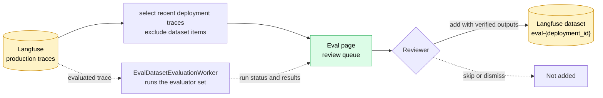
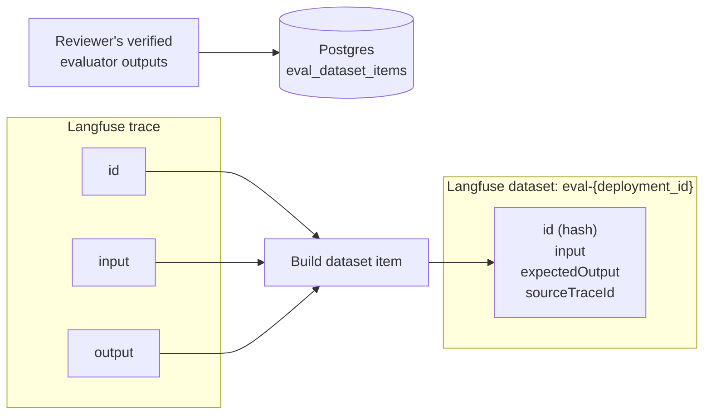

# Traces to Eval Dataset Pipeline

**Status:** Authoritative — describes the shipped system
**Last verified:** 2026-08-31

## Summary

The Eval page turns production traces already stored in Langfuse into a curated dataset for one deployment. It reads the trace fields needed for review, runs an optional set of preset evaluators against unreviewed traces, and lets a reviewer add a trace to the deployment's Langfuse dataset with the evaluator outputs they verify.

There is no periodic trace-to-dataset sync. A reviewer's add is the event that admits a trace to the dataset.

Before this flow begins, the agent and Astro OTel collector create and enrich the production trace. The collector adds the deployment tag and normalizes the top-level input and output so they are available as trace fields in Langfuse. This document begins at that boundary.

## End-to-end flow

## Trace fields used by the pipeline

The pipeline does not copy an entire trace into the review queue or dataset. It uses a small set of trace-level fields:

| Trace field | How it is used |
|---|---|
| `id` | Links the queue entry, evaluation run, and dataset item to the original trace. |
| `input` | Shows the request in the review queue and becomes the dataset item input. |
| `output` | Shows the agent response in the review queue and becomes the dataset item expected output. |
| `timestamp` | Orders the review queue newest first and bounds the 30-day scan window. |
| `sessionId`, `userId` | Used by evaluators that need conversation context, such as `user_sentiment` (previous turns, next user message). |
| `tags` | Selects traces with `deployment:{deployment_id}` and verifies a trace belongs to the deployment before it is read or added. |

## Build the review queue

The review queue is a cursor-paginated list of the deployment's traces, newest first. Before returning a page, the server:

1. Excludes traces already in the dataset and that have been dismissed from the queue.
2. Excludes traces without an input.
3. Applies the optional evaluated / not-evaluated filter, backed by each trace's latest evaluation run status (`eval_dataset_evaluation_runs`).

Unfiltered and not-evaluated pages scan recent Langfuse traces directly and apply these checks per page. An evaluated page queries Postgres first for traces with a completed run, then fetches only that bounded trace set from Langfuse, since a completed-run scan over Langfuse itself isn't possible.

Each queue item carries its latest evaluation run's ID and status (`queued`, `in_progress`, `completed`, `failed`) if one exists, but not the evaluator values themselves. Selecting a trace loads that run's per-evaluator results alongside the trace input and output.

## Run the evaluator set

Starting an evaluation queues a run for up to 50 of the most recent eligible traces (skipping traces with a queued, in-progress, or completed run). Each run enqueues one `eval_dataset.evaluation` River job (`EvalDatasetEvaluationWorker`, queue `evaluation`).

One job evaluates the entire active evaluation set for one trace: it fetches the trace and whatever context the set's evaluators declare (previous turns, next user message, thumbs feedback, tool-call steps), then calls the model once per evaluator and stores each typed result. A billing-suspended account's job fails immediately rather than spending on invocation. The page tracks progress from deployment-wide counts of queued, in-progress, completed, and failed runs.

Running the evaluator set is optional context for a reviewer, not a precondition for adding a trace to the dataset — a reviewer can add a trace with no run at all, or with only some evaluators' values filled in.

**The default evaluation set** (`preset/default-evaluation`) is six safety and guardrail-oriented presets, defined in `internal/evalpreset/preset.go`:

| Preset | Output | What it evaluates |
|---|---|---|
| `exposed_pii` | boolean | Personal data in the output, such as names, emails, phone numbers, or addresses. |
| `leaked_credentials` | boolean | Credentials in the output, such as API keys, tokens, or passwords. |
| `disclosed_system_instructions` | boolean | Output that reveals the agent's instructions, guardrails, or tool definitions. |
| `unnecessary_tool_call` | boolean | Tool calls that don't contribute to the final output. |
| `claim_grounding` | `grounded` / `unsupported` / `contradicted` / `no_claims` | How well factual claims in the output are supported by the agent's tool calls and observations. |
| `user_sentiment` | `positive` / `neutral` / `negative` / `unclear` | The user's tone across the conversation. |

There's no per-agent custom evaluation set yet; every agent gets this same hardcoded default, served read-only.

## Add a trace to the dataset

A reviewer's add is what admits a trace. The server fetches the trace by ID, verifies its deployment tag, validates the submitted evaluator outputs against the active set's types, and writes the item to the local `eval_dataset_items`/`eval_dataset_item_evaluator_outputs` tables before writing to Langfuse. The local write acts as the duplicate gate: a retry or double submission fails there rather than upserting the Langfuse item twice. If the Langfuse write then fails, the server rolls back the local row.

A reviewer can later replace an item's outputs, or remove the trace from the dataset, which returns it to the review queue. Both leave the evaluation run and its results in place, so the automated values stay available for comparison even after a reviewer edits or removes an item.

## Langfuse dataset structure

The `eval-{deployment_id}` dataset item's ID is deterministic: `sha256(datasetName, traceID)`. The same (dataset, trace) pair always hashes to the same ID, so re-adding a trace updates the existing item instead of creating a duplicate, and a delete can target an item by trace ID alone.

An add writes exactly these fields to the Langfuse item, and no others:

| Dataset item field | Value |
|---|---|
| `id` | Deterministic hash of `datasetName` and `sourceTraceId`. |
| `datasetName` | `eval-{deployment_id}`. |
| `input` | Production trace input. |
| `expectedOutput` | Production trace output. |
| `sourceTraceId` | Langfuse trace ID. |

No `metadata` key is written. The verified evaluator outputs, the reviewer's user ID, and the source evaluation run ID all live only in Postgres (`eval_dataset_items`/`eval_dataset_item_evaluator_outputs`). The dataset view reads them back from there, along with a per-evaluator distribution of the verified values.

## Related documents

- [Langfuse Integration Spec](../01-spec/langfuse-integration-spec.md) explains how traces are exported into account-scoped Langfuse projects.
- [Eval Dataset Evaluation Spec](../01-spec/eval-dataset-evaluation-spec.md) is the design record for the evaluator flow described above; see its banner for as-built status.
