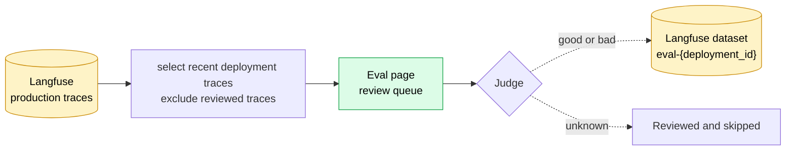
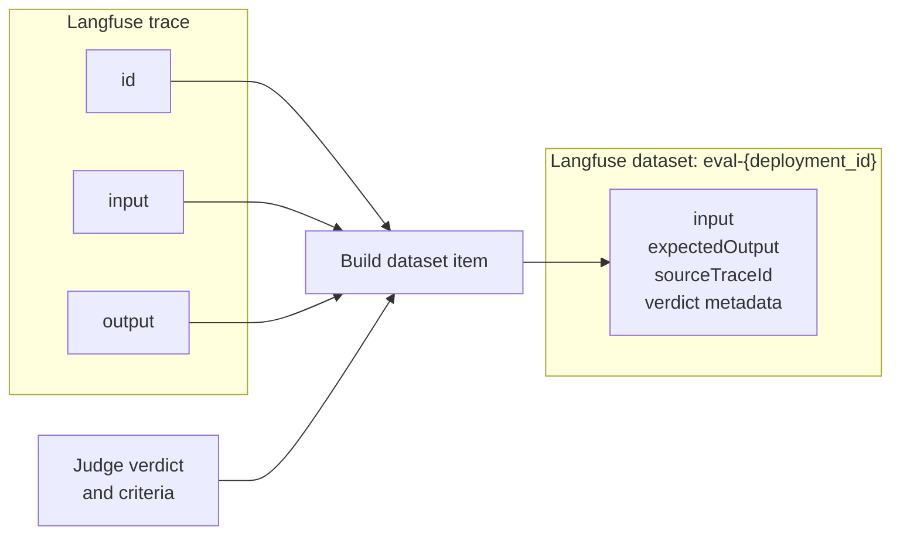

# Traces to Eval Dataset Pipeline

**Status:** Authoritative — describes the shipped system
**Last verified:** 2026-08-27

## Summary

**Two systems write to the same Langfuse dataset today, and only one of them is what the client actually uses.** The judgment flow (this document's main subject) is older but is still the only complete path from the Eval page to a dataset item — every write the UI makes today goes through it. The evaluator flow (`internal/evalpreset`, see [The evaluator flow](#the-evaluator-flow) below) is where current engineering effort is going and already supplies read-only per-trace results inside the review queue, but its own "add to dataset" endpoint has no caller yet. This isn't two independent, coexisting designs — it's a migration in progress, and as of this writing the migration hasn't reached the write path.

The Eval page turns production traces already stored in Langfuse into a curated dataset for one deployment. It reads the trace fields needed for review, presents unreviewed traces to a Judge, and adds traces marked `good` or `bad` to the deployment's Langfuse dataset. Traces marked `unknown` are reviewed but not added.

There is no periodic trace-to-dataset sync. A judgment is the event that admits a trace to the dataset.

Before this flow begins, the agent and Astro OTel collector create and enrich the production trace. The collector adds the deployment tag and normalizes the top-level input and output so they are available as trace fields in Langfuse. This document begins at that boundary.

## End-to-end flow



## Trace fields used by the Eval pipeline

The pipeline does not copy an entire trace into the review queue or dataset. It uses a small set of trace-level fields:

| Trace field | How it is used |
|---|---|
| `id` | Links the review decision and dataset item to the original trace. |
| `input` | Shows the request to the Judge and becomes the dataset item input. |
| `output` | Shows the agent response to the Judge and becomes the expected output. |
| `timestamp` | Orders the review queue (`timestamp.desc`, hardcoded); the only ordering signal the live queue applies. |
| `sessionId` | Used only by the built-but-inert judge-prediction worker (see [The evaluator flow](#the-evaluator-flow)) to group messages from the same conversation and infer a reaction signal. The live review queue below never reads it. |
| `tags` | Selects and verifies traces with `deployment:{deployment_id}`. |

## Build the review queue

The Eval page requests recent traces for the current deployment. `astro-server` reads them from Langfuse using the `deployment:{deployment_id}` tag and orders them newest first (`timestamp.desc`).

Before returning the queue, the server:

1. Excludes traces that have already been reviewed.
2. Excludes traces dismissed from the queue.
3. Excludes traces without an input.

There's no reaction-signal or sentiment-based prioritization in this path. A
separate design ([Eval Dataset v2 — Judge Signal](../01-spec/eval-dataset-v2-judge-signal-spec.md))
infers a reaction signal from session messages to reorder the queue, but
that logic lives entirely in the `EvalJudgePredictionWorker`, which has no
HTTP endpoint and no caller (see [The evaluator flow](#the-evaluator-flow)).
Nothing in the live `GetDatasetReviewQueue` path touches it.

## Add a trace to the dataset

The Judge reviews the trace input and output, then selects one of three verdicts:

| Verdict | Result |
|---|---|
| `good` | Add the trace as a successful dataset example. |
| `bad` | Add the trace as a labeled failure example. |
| `unknown` | Do not create a dataset item. |

For `good` or `bad`, `astro-server` fetches the trace by ID, verifies that it has the current deployment tag, and upserts one item into the Langfuse dataset named `eval-{deployment_id}`.



## Langfuse dataset structure

The `eval-{deployment_id}` dataset contains only traces accepted with a `good` or `bad` verdict. `good`/`bad` itself is tracked in local Postgres only (`eval_datasets.good_count`/`bad_count`, bumped by `PostDatasetJudgment`) — **it is not written to the Langfuse item at all.** `upsertJudgmentDatasetItem` writes exactly these metadata keys, and no others:

| Dataset item field | Value | Explanation |
|---|---|---|
| `id` | Deterministic hash | `sha256(datasetName, traceID)` — shared with the evaluator flow's writer, so a trace can only ever occupy one item regardless of which flow wrote it. |
| `datasetName` | `eval-{deployment_id}` | Identifies the dataset for one deployment. |
| `input` | Production trace input | The request evaluated by the Judge. |
| `expectedOutput` | Production trace output | The agent response evaluated by the Judge. |
| `sourceTraceId` | Langfuse trace ID | Links the item back to its production trace. |
| `metadata.judged_by_user_id` | Reviewer ID | Identifies the human reviewer. |
| `metadata.judged_at` | Timestamp | Records when the judgment was made. |
| `metadata.judgment_criteria` | Array of criterion scores | Scores the output across selected quality dimensions. |

There is no `metadata.verdict` and no `metadata.confidence` key. An earlier design called for both (see [Eval Dataset Spec v2](../01-spec/eval-dataset-v2-spec.md)); the shipped writer never added them, and the UI no longer needs them either — the client dropped verdict chips and a computed grade in favor of a per-dimension good:bad ratio sidebar (`DatasetGradeSidebar.tsx`), so `good`/`bad` only needs to exist in Postgres, not in the exported dataset item.

For example, a complete dataset item looks like this:

```json
{
  "id": "8d6296a92d68f68f48ddbc4e19f061f2c7b9158f8f9c5c4518d683ca4d5efbc8",
  "datasetName": "eval-dep_abc123",
  "input": {
    "question": "What is Astro?"
  },
  "expectedOutput": {
    "answer": "Astro is a platform for deploying and running AI agents."
  },
  "sourceTraceId": "trace_01JZ4M8Y7Q6A3C2P1N0K",
  "metadata": {
    "judged_by_user_id": "user_123",
    "judged_at": "2026-07-22T14:10:00Z",
    "judgment_criteria": [
      {
        "dimension_key": "accuracy",
        "value": 1
      },
      {
        "dimension_key": "completeness",
        "value": 1
      }
    ]
  }
}
```

Because the item ID is a deterministic hash of the dataset name and trace ID, changing a verdict or its criteria updates the existing Langfuse item instead of creating a duplicate. Changing a verdict to `unknown` or undoing the judgment removes the item from the dataset.

## The evaluator flow

A second, newer system runs alongside the judgment flow: typed, per-evaluator outputs from preset definitions (`internal/evalpreset`), stored in `eval_dataset_evaluation_runs`/`eval_dataset_evaluator_results`/`eval_dataset_items`/`eval_dataset_item_evaluator_outputs`. It is not a replacement for the judgment flow yet — it's additive, and the two are bridged at exactly one point.

**The default evaluation set** (`preset/default-evaluation`) is six safety/guardrail-oriented presets, not a general-purpose quality rubric: `exposed_pii`, `leaked_credentials`, `disclosed_system_instructions`, `unnecessary_tool_call`, `claim_grounding` (an enum: grounded/unsupported/contradicted/no_claims), and `user_sentiment` (an enum: positive/neutral/negative/unclear). There's no per-agent custom evaluation set — every agent gets this same hardcoded default.

**Where it connects to the judgment flow:** `GetDatasetReviewQueue` serves both. It excludes traces already judged (reading `eval_dataset_judgments`, the judgment flow's table) and attaches each remaining trace's latest evaluator run status (reading `eval_dataset_evaluation_runs`, the evaluator flow's table), and supports an `evaluation=evaluated|not_evaluated` filter backed entirely by the evaluator flow. A reviewer sees evaluator output as read-only context alongside the trace, then still judges `good`/`bad`/`unknown` the same way as before.

**What isn't wired up yet:** `POST /deployments/:id/dataset/items` — the evaluator flow's own "add to dataset" endpoint — exists, validates a value for every evaluator in the set, and writes to `eval_dataset_items`/`eval_dataset_item_evaluator_outputs`. But it writes no Langfuse metadata at all (not even the fields the judgment flow writes), and nothing in the client calls it. The judgment flow remains the only way a trace actually reaches the Langfuse dataset today.

Routes, for reference (all under `/api/v1/deployments/:id/dataset/`, never a dataset-scoped `/datasets/:id/` path):

| Method | Path | Flow |
|---|---|---|
| `GET` | `` (dataset summary: counts, criteria) | judgment |
| `GET` / `POST` | `items` | flow-agnostic read / evaluator write (unused by client) |
| `GET` | `review-queue` | both — see above |
| `GET` | `review-queue/:trace_id/evaluation` | evaluator |
| `GET` | `evaluations/status` | evaluator |
| `POST` | `evaluations` | evaluator (enqueues the `eval_dataset.evaluation` River job) |
| `POST` / `PATCH` / `PUT` / `DELETE` | `judgments`, `judgments/:trace_id`, `judgments/:trace_id/criteria` | judgment |

A third, earlier design — automated LLM judge predictions to pre-rank the review queue (`account_llm_judge_keys`, `eval_dataset_judgment_predictions`, the `EvalJudgePredictionWorker`) — has full schema, store, and worker code, and the worker is registered at startup, but no HTTP endpoint or production code path ever constructs the job. It's built and inert, not a live third flow.

## Related documents

- [Langfuse Integration Spec](../01-spec/langfuse-integration-spec.md) explains how traces are exported into account-scoped Langfuse projects.
- [Eval Dataset Spec v2](../01-spec/eval-dataset-v2-spec.md) explains why dataset admission changed from automatic trace sync to human judgment. Its grade-formula and Langfuse-metadata sections are dead; see this doc's own corrections above.
- [Judgment Criteria and Reasons](../01-spec/eval-dataset-v2-judgment-reasons-spec.md) defines the quality dimensions attached to accepted dataset items.
- [Eval Dataset v2 — Judge Signal](../01-spec/eval-dataset-v2-judge-signal-spec.md) describes the automated-prediction design that shipped as inert infrastructure — see [The evaluator flow](#the-evaluator-flow) above.
- [Eval Dataset Evaluation Spec](../01-spec/eval-dataset-evaluation-spec.md) is the design for the evaluator flow described above. Its write-path and dataset-scoped-API sections describe an end state that hasn't shipped; its preset/evaluator model is what's actually running today.
- [Eval Infrastructure](../05-implementation/eval-infrastructure.md) documents the superseded v1 periodic-sync design and should be treated as historical context.
