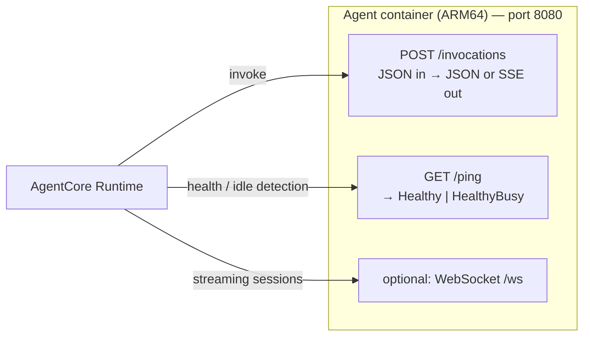
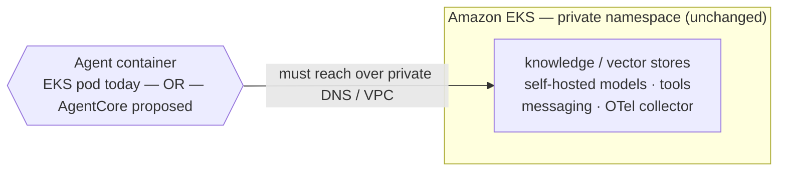

# Running Astro Agents on AWS Bedrock AgentCore

Integration notes, questions, and AWS's answers — shared with the AWS Bedrock AgentCore team.

Astro is a platform for deploying and running AI agents. Users package an agent as a container, and we run it alongside managed models, knowledge / vector stores, tool integrations, messaging, identity, and observability. Today agents run as containers on Amazon EKS. We are evaluating **AgentCore Runtime as an alternative place to run the agent's container**, keeping the rest of the platform as-is. This note describes how we'd integrate it and the questions we'd like AWS's input on. Where we state how AgentCore behaves, it's our current understanding — please correct anything wrong.

---

## How Astro runs an agent today

Each deployment is a **private EKS namespace** containing:

- the **agent container** — always-on, and
- the services it depends on — knowledge / vector stores, self-hosted models, tool integrations, a messaging component (Slack / web chat), and an OpenTelemetry collector.

The agent reaches its dependencies over **private in-cluster DNS**. Inbound web traffic arrives through an ingress with OIDC enforced at the load balancer. Durable state lives on an attached volume. Everything is co-located and privately addressed.

---

## AgentCore Runtime, as we understand it

A serverless, per-session runtime: we ship a container that serves `POST /invocations` and `GET /ping` on port 8080; AWS handles inbound auth (SigV4 / JWT-OIDC), per-session isolation, and scaling; callers reach the agent through the `InvokeAgentRuntime` API rather than a URL. Memory, Identity, Gateway (tools), and Observability are available as managed primitives. (We're targeting Runtime with a bring-your-own container, not the higher-level Harness.)



The properties that shape our integration:

- **Invoke-only** — no stable inbound URL; reach is `InvokeAgentRuntime(arn, …)`.
- **No co-located sidecars** — the runtime hosts our container; there is no second container alongside it.
- **No durable filesystem** — per-session scratch only; durable state goes to Memory or an external store.
- **Scales to zero** — consumption-based; idle sessions reaped via `/ping`.

---

## Integration model: relocate only the agent container

The key decision: **EKS and AgentCore co-exist within a single deployment**. We keep the namespace and every surrounding service exactly as today; only the **agent's own container** moves to AgentCore. Wherever the agent runs, it connects back to its dependencies in EKS.



This confines the runtime choice to the single component that executes agent code; the surrounding platform (knowledge, models, tools, messaging, telemetry, ingress, auth policy) is unchanged. Per capability:

| Capability | Today (EKS) | On AgentCore | Note |
|---|---|---|---|
| Compute | always-on pod | serverless runtime | the swap |
| Reach | private service DNS + ingress | `InvokeAgentRuntime` (ARN) | URL → invoke |
| Messaging | co-located sidecar | no sidecar | must become a standalone service |
| Inbound auth | OIDC at the load balancer + our grants | Identity (SigV4 / JWT-OIDC) | policy stays ours, mechanism per-runtime |
| Durable state | attached volume | Memory or external | the volume is EKS-only |
| Models | self-hosted **or** model gateway | Bedrock **or** gateway | self-hosted is EKS-only |
| Knowledge / vector | self-hosted **or** managed | managed only | self-hosted needs private reach |
| Tools | sidecar services | Gateway (MCP) / external MCP | sidecar is EKS-only |
| Observability | OTel collector → our backend | OTel → CloudWatch or external | portable if the collector is reachable |
| Ingestion (batch/cron) | K8s Jobs / CronJobs | EventBridge / Lambda | EKS-only as built |

Two consequences follow:

- **Messaging must move out of the agent.** Today our messaging component is co-located with the agent. If only the agent relocates, messaging becomes a standalone service the agent connects to — or that invokes the agent.
- **The agent must reach a private VPC from outside it.** This is the crux, and the subject of the questions below. External dependencies (connected knowledge stores, the model gateway) already work because they're addressed by a public or PrivateLink URL; the self-hosted in-namespace dependencies are the problem.

---

## The agent-runtime interface

Concretely, the agent-execution step becomes a small pluggable interface. The current Kubernetes path is one implementation; AgentCore is another. The interface covers only the agent box — everything else stays where it is.

```go
// AgentRuntime runs the single agent-execution component. Everything else in the
// namespace is applied as it is today, regardless of which implementation runs.
type AgentRuntime interface {
	ApplyAgent(ctx context.Context, in AgentSpec) (AgentHandle, error)
	TeardownAgent(ctx context.Context, deploymentID string) error
	AgentStatus(ctx context.Context, deploymentID string) (AgentStatus, error)
	Capabilities() Capabilities
}
```

The supporting types: `AgentSpec` is the agent container's own needs plus the resolved addresses it must reach; `AgentHandle` is the set of ways to reach the box (one entry per surface the agent serves — http, gRPC, web… — each with its protocol and an in-cluster plus optional external address on EKS, a single runtime ARN on AgentCore); `AgentStatus` is the box's live state with a runtime-agnostic `Health` plus EKS-only replica/phase detail.

```go
// input: the agent container's own needs + the resolved addresses it must reach.
type AgentSpec struct {
	DeploymentID string            // stable id; namespace suffix on EKS
	Image        string            // resolved OCI image ref
	Port         int32             // container port the agent serves
	Env          map[string]string // fully resolved: dependency URLs, creds, auth token, OTEL endpoint
	Volume       string            // durable-state mount path; "" = none. EKS: volume, AgentCore: ignored
}

// output: how the platform reaches the agent box.
type AgentHandle struct {
	// EKS: one entry per surface the agent serves (http, grpc, web, …)
	Endpoints map[string]AgentEndpoint
	// AgentCore: a single runtime ARN reaches the container; no per-surface URLs
	Invoke string
}

type AgentEndpoint struct {
	Protocol string // "http" | "grpc"
	Internal string // in-cluster address, e.g. "<svc>.<ns>.svc:8080"
	External string // ingress URL if exposed, else ""
}

// live state of the agent box.
type AgentStatus struct {
	Health   string // "ready" | "progressing" | "degraded" | "unavailable" | "serverless"
	Ready    int32  // ready replicas — EKS only (0 on AgentCore)
	Replicas int32  // total replicas — EKS only (0 on AgentCore)
	Phase    string // pod phase      — EKS only ("" on AgentCore)
}
```

`Capabilities()` advertises what the box supports, so the control plane checks the spec against the target up front and rejects one that hard-requires something it can't honor — before deploying, rather than failing mid-deploy.

```go
// Capabilities is what an AgentRuntime can give the agent box.
type Capabilities struct {
	PersistentDisk bool // durable volume                 — EKS: true, AgentCore: false
	Replicas       bool // operator-pinned replica count  — EKS: true, AgentCore: false
	WebIngress     bool // agent-served web UI at a URL    — EKS: true, AgentCore: false (invoke-only)
}
```

The EKS implementation returns all `true` (it accepts every spec it does today); the AgentCore implementation returns all `false` — a spec that needs a durable volume, pins replicas, or serves its own web UI is rejected up front with a clear reason.

---

## Answers from the AgentCore team

AWS's responses to the questions above (AgentCore team, Jul 2026). Each item pairs our question with their answer. The crux — reaching a private VPC from the runtime — is confirmed supported via **VPC network mode**, which puts the runtime's ENIs directly in our subnets.

1. **VPC attachment.** *Reach private resources by private IP/DNS, or public-only?* **Yes.** A VPC network mode creates ENIs directly in your subnets, giving the agent a network presence to reach private resources (in-EKS services, RDS) by private IP/DNS without traversing the public internet. Security groups on the ENIs govern reachability; the target's SG must allow inbound from the AgentCore ENI's SG. (See the AWS networking blog, Pattern 2 onward for VPC egress.)
2. **Private DNS resolution.** *Resolve private Route 53 / in-cluster names, or public/PrivateLink only?* **Yes, with the VPC attachment.** Because the ENIs live in your subnets, they inherit the VPC's DNS config, including private Route 53 hosted zones. In-cluster Kubernetes service DNS (`*.svc.cluster.local`) is *not* directly resolvable — it must be mirrored into a private hosted zone or fronted by a load balancer with a resolvable name.
3. **PrivateLink path.** *Supported pattern to reach a VPC endpoint, and per-session connection limits?* **Yes.** In VPC mode the runtime can reach any VPC endpoint in that VPC, including PrivateLink-fronted services (Agent → ENI → endpoint → target), with no config beyond standard endpoint setup and SG rules. No documented per-session connection-count limits, but note the hard runtime limits: synchronous request timeout **15 min**, streaming **60 min**, async job **8 h**, session storage **1 GB**.
4. **Persistent outbound connections.** *Hold a long-lived outbound connection for a session, or is networking torn down between invocations?* **Yes, within a session's compute lifecycle.** Each session gets a dedicated microVM that persists across multiple `/invocations` calls (idle timeout default 15 min, max lifetime up to 8 h); networking (ENIs, routes) stays up while it runs, so a gRPC stream, WebSocket, or persistent TCP connection can be held for the life of that microVM. The agent can answer `HealthyBusy` to health pings to avoid idle termination. The "agent dials in" model works within a session; for connections beyond the 8 h ceiling, chain sessions or invert to "platform invokes the agent."
5. **Private inbound invoke.** *Call `InvokeAgentRuntime` over a private path, or public endpoint only?* **Yes.** Create an interface VPC endpoint for `com.amazonaws.<region>.bedrock-agentcore` (data plane) and call `InvokeAgentRuntime` entirely over PrivateLink. Pair it with a resource-based policy (condition keys `aws:SourceVpc`, `aws:SourceVpce`, `aws:SourceIp`) to block public invocation. Both SigV4 and OAuth are supported. Endpoints available: data plane (`bedrock-agentcore`), control plane (`bedrock-agentcore-control`), gateway (`bedrock-agentcore.gateway`).
6. **Egress controls.** *Restrict egress to specific destinations (DNS included) and deny the rest?* **Layered.** Security groups on the ENIs (restrict outbound by IP/port/SG), route tables (an isolated VPC with no NAT/IGW = zero public egress), and VPC endpoint policies (scope reachable services). For DNS-based allow/deny, add Route 53 Resolver DNS Firewall. The fully isolated VPC (Pattern 4) is the highest documented network isolation.
7. **Stable egress identity.** *A stable source identity the VPC side can authorize?* **Yes — via security-group authorization.** Private dependencies can authorize inbound on the AgentCore ENI's SG ID (e.g. "allow from `sg-agentcore-runtime` on 3306"), the recommended pattern. If a stable egress *IP* is required (e.g. a third party with IP allowlists), place a NAT Gateway in the egress path — at added cost and stepping away from full isolation.
8. **Per-invocation latency.** *Added round-trip egressing into a VPC, and connection reuse across the session?* ENIs sit directly in your subnets, so traffic to private dependencies is ordinary VPC-internal networking — no tunnel or proxy hop, equivalent to any in-VPC service-to-service call. Connection reuse: within a session the microVM persists, so agent code can hold connection pools (DB pools, HTTP keep-alive, gRPC channels) across invocations; pools do *not* survive across sessions. Connection pooling in the container is recommended for agents making many private calls.
9. **Hosting agent-served web UIs.** *Expose an agent's HTTP server as a browser-reachable site, or is `InvokeAgentRuntime` the only inbound path?* **Not directly; use a BFF.** The inbound contract is `InvokeAgentRuntime` (plus AG-UI over SSE/WebSocket on port 8080 with SigV4/OAuth) — oriented toward programmatic, authenticated callers, not a browser hitting a stable URL. For a customer-facing web app (stable HTTPS URL, cookies/redirects, static assets, WebSocket), the recommended pattern is a Backend-for-Frontend: CloudFront + S3 for the static frontend; an API Gateway/ALB + Lambda/ECS BFF that handles browser auth (e.g. Cognito) and calls `InvokeAgentRuntime` via PrivateLink, streaming responses back over WebSocket/SSE.

---

## References

- [AgentCore HTTP protocol contract](https://docs.aws.amazon.com/bedrock-agentcore/latest/devguide/runtime-http-protocol-contract.html)
- [What is AgentCore](https://docs.aws.amazon.com/bedrock-agentcore/latest/devguide/what-is-bedrock-agentcore.html)
- [Inbound & Outbound Auth](https://docs.aws.amazon.com/bedrock-agentcore/latest/devguide/runtime-oauth.html)
- [Observability](https://docs.aws.amazon.com/bedrock-agentcore/latest/devguide/observability-configure.html)

Cited by the AgentCore team in the answers above (titles as given by AWS):

- Network connectivity patterns for agents deployed on Amazon Bedrock AgentCore Runtime (AWS networking blog)
- Configure AgentCore Runtime and tools for VPC
- AgentCore Runtime limits
- Use isolated sessions for agents (session lifecycle)
- Use interface VPC endpoints (AWS PrivateLink) with AgentCore
- Deploy AG-UI servers in AgentCore Runtime
- re:Post — AgentCore inbound JWT authorizer & private OpenID discovery URL
