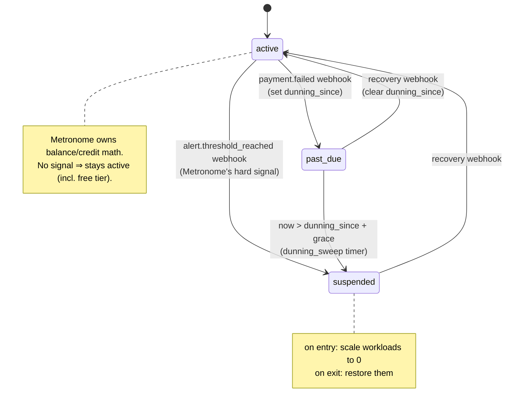
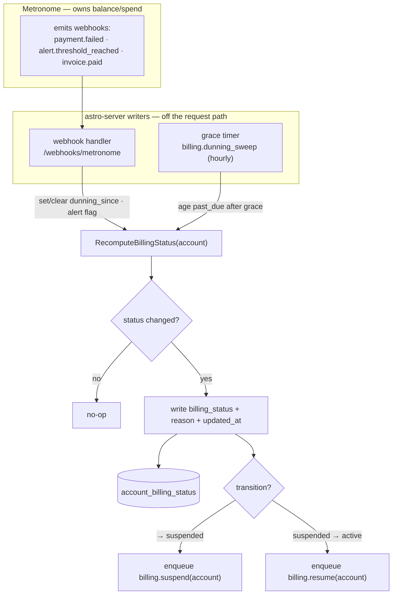
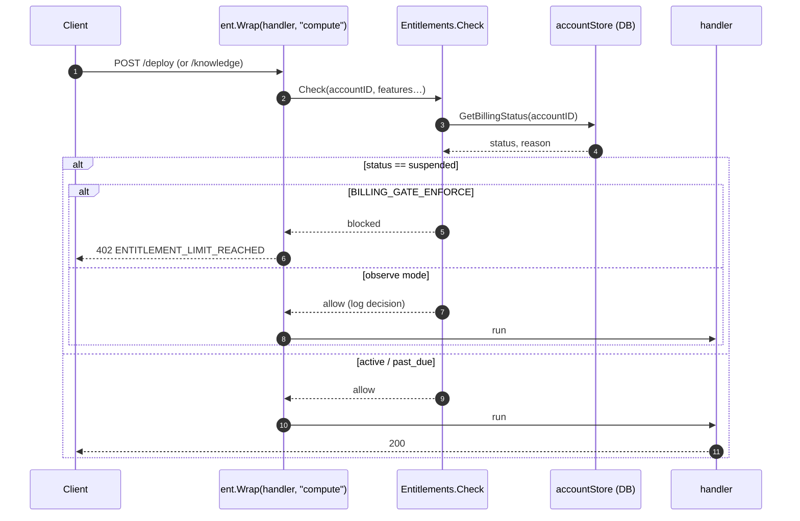
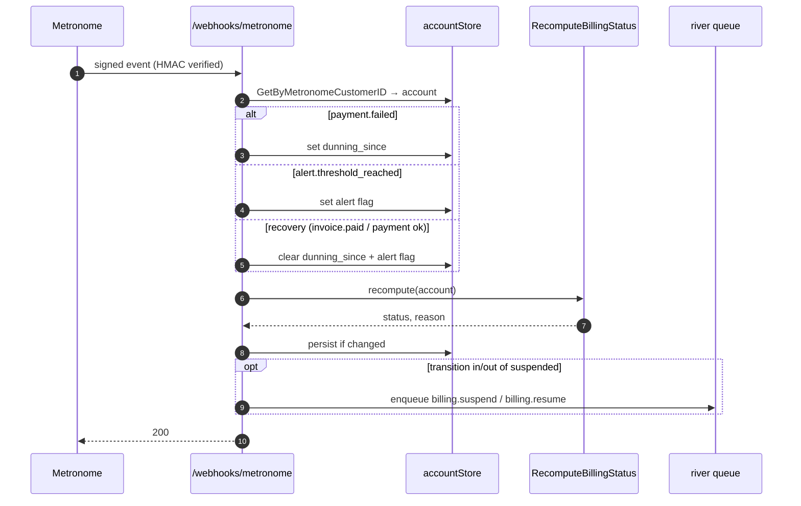
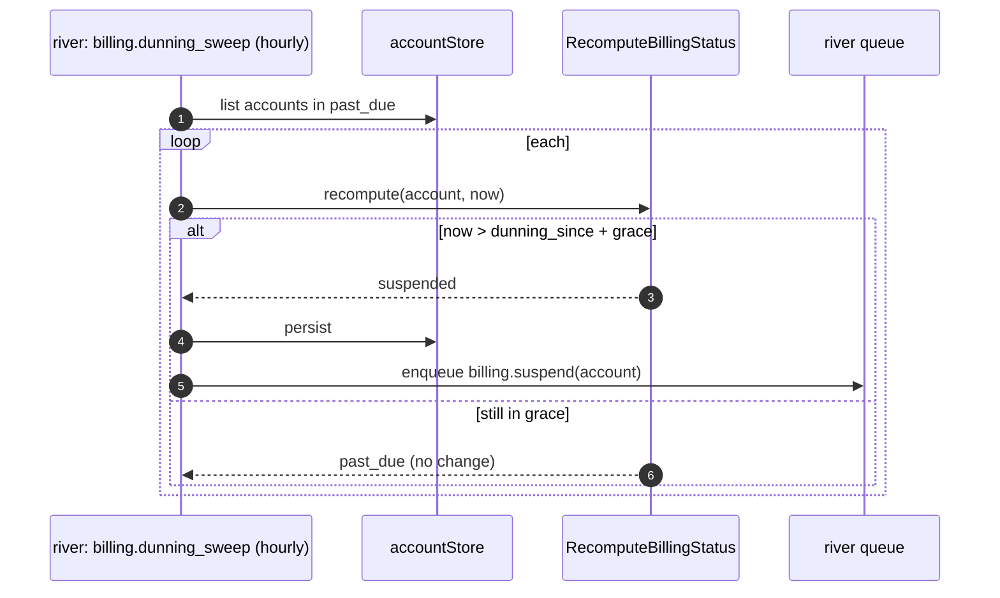
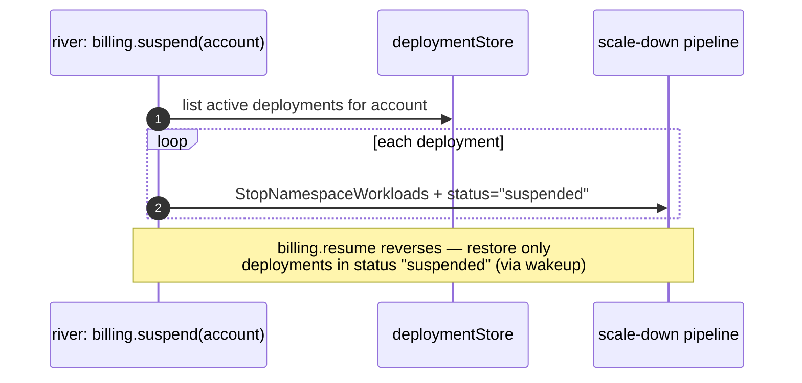

# Billing Gating Implementation Plan

## Context

Metered consumption gating is a no-op today (`middleware.Entitlements` passes through). `internal/quota` still enforces DB resource *counts* (402). We want to block metered consumption when an account can no longer pay — **but astro-server does not read or interpret billing balances/credits/spend; Metronome owns all of that.** astro-server only reacts to the signals Metronome emits (payment failures, threshold/spend alerts) and to a local dunning timer.

## Principle

**Cache a billing status on the account; write it from Metronome webhook signals (+ a grace timer); read it per request.** The request path never calls Metronome, and astro-server never computes a balance — it applies the transitions Metronome's events imply. Gating applies only when `BILLING_PROVIDER=metronome`; noop/OSS never gates.

Free tier needs no special handling: Metronome grants free/starting credits out of band, so it simply doesn't send a payment-failure/threshold signal until the account is actually out — until then the account stays `active`.

## Status model

`account_billing_status.status`: `active | past_due | suspended` (one row per account; absence ⇒ `active`). Driven by Metronome signals + a timer — never by a balance we read:

- **payment failure** (webhook) → `past_due` (enters dunning grace)
- **grace expired** (timer) → `suspended`
- **balance/spend alert** (webhook, the threshold Metronome is configured to fire on) → `suspended`
- **recovery** (payment succeeded / invoice paid webhook) → `active`

## Schema — new `account_billing_status` table

Billing state churns independently of account identity, so it lives in its own table, not on `accounts`:

```sql
CREATE TABLE account_billing_status (
    account_id    text        NOT NULL REFERENCES accounts(id) ON DELETE CASCADE,
    status        text        NOT NULL DEFAULT 'active', -- active | past_due | suspended
    reason        text,                                  -- dunning | payment_failed | balance_alert
    dunning_since timestamptz,                           -- set on payment failure, cleared on recovery
    alert_active  boolean     NOT NULL DEFAULT false,    -- last Metronome hard alert, uncleared
    updated_at    timestamptz NOT NULL DEFAULT now(),
    PRIMARY KEY (account_id)
);
```

Absence of a row ⇒ `active` (rows are created lazily on the first non-active transition). No balance column — astro-server neither stores nor reads a balance. `ON DELETE CASCADE` drops the row with the account.

## Signals & writers

All transitions go through a pure `RecomputeBillingStatus(inputs) → (status, reason)`; every writer calls it, so they converge.

1. **Metronome webhooks** (`handlers/webhooks_metronome.go`, log-only stubs today). Map the payload's Metronome customer → account (`GetByMetronomeCustomerID`), then:
   - `payment.failed` / `invoice.payment_failed` → set `dunning_since`, status `past_due`.
   - `alert.threshold_reached` → `suspended` (Metronome is configured to fire this alert on balance depletion / spend cap — we treat it as the hard signal, we do not compute the threshold).
   - recovery (`invoice.paid` / payment succeeded) → clear `dunning_since`, recompute → `active`.
2. **Periodic grace-timer job** (`billing.dunning_sweep`, hourly). Pure timer, **no Metronome calls**: for accounts in `past_due` where `now > dunning_since + grace`, transition to `suspended`.

On entering/leaving `suspended`, the writer enqueues the workload suspend/resume job.

## Reader / enforcement

- `middleware.Entitlements` gains a billing-status store ref + `enforce bool`. `Check(accountID)` reads `account_billing_status.status` (no row ⇒ `active`): blocks on `suspended`; `past_due` warns but allows. `Wrap` returns the existing `402 ENTITLEMENT_LIMIT_REACHED`.
- Extend `ent.Wrap` to the **deploy** path (compute), in addition to knowledge-create.
- Observe mode (`!enforce`): compute + log the decision, return no 402.

## Suspend / resume running workloads

New river job `billing.suspend` / `billing.resume` keyed by account:
- Suspend: scale active deployments to zero (`k8s.StopNamespaceWorkloads`) and set a distinct **`suspended`** deployment status — not the user-initiated `stopped` — so the two are never confused.
- Resume: restore only deployments in `suspended` status (via the existing wakeup path: status→pending→wakeup re-applies), so a resume never revives what the user stopped. No side table — the state lives on the deployment row.
Triggered by status transitions into/out of `suspended`.

## Config

- `BILLING_GATE_ENFORCE` bool (default false) — observe vs enforce.
- `BILLING_DUNNING_GRACE_DAYS` (default 7).

Metronome alert definitions (which balance/spend condition fires `alert.threshold_reached`) are configured Metronome-side, out of band — not in astro-server.

## Phases

1. **Status plumbing (observe).** Schema, store methods, `RecomputeBillingStatus`, webhook writers, grace-timer job. Log decisions; no enforcement, no suspend.
2. **Enforce new actions.** Wire `Entitlements` (reader) + `ent.Wrap` on deploy; flag-gated 402.
3. **Suspend/resume workloads.** Scale-down/restore jobs on transitions.
4. **Flip `BILLING_GATE_ENFORCE=true`** after validation.

## Files

- `sql/astro-server/schema.sql` (`account_billing_status` table)
- `internal/account/store.go` (`GetByMetronomeCustomerID`)
- `internal/billing/status.go` (new — `RecomputeBillingStatus` state machine + orchestrator) and a `billingstatus` store (upsert status/reason, set/clear dunning + alert, get status, list in-dunning) over `account_billing_status`
- `internal/riverqueue/` (dunning_sweep timer job + suspend/resume jobs; register in periodic.go/workers.go)
- `internal/middleware/entitlement.go` (accountStore + enforce)
- `handlers/webhooks_metronome.go` (webhook → status writes)
- `internal/config/config.go`, `main.go` (flags, wiring, `ent.Wrap` on deploy)

## Verification

- Unit: state machine truth table (dunning state × timer × alert → status).
- Observe mode: decisions logged, zero 402s, no scale-downs.
- Enforce: suspended account gets 402 on deploy/knowledge; active unaffected; an account with no billing signal never blocked.
- Suspend/resume: only billing-tagged workloads restored on recovery.

---

# Detailed steps & flows

## Status state machine

`RecomputeBillingStatus(account)` is the single authority. Inputs are all local/derived from Metronome events — **no balance read**: `dunning_since`, the last alert signal, `now`. Pure → same inputs yield same status, so every writer converges.



Decision order inside `RecomputeBillingStatus` (first match wins):

1. hard alert active (`alert.threshold_reached`, uncleared) → **suspended** (`balance_alert`)
2. `dunning_since != null && now > dunning_since + grace` → **suspended** (`payment_failed`)
3. `dunning_since != null` → **past_due** (`dunning`)
4. else → **active**

## Signals → one recompute → DB (+ transition side-effects)



## Request-path enforcement (reader — cheap, no external call)



The read is a single indexed `accounts` lookup already loaded by `ResolveAccount` in most paths — effectively free. Metronome is never called here.

## Webhook writer



## Grace-timer sweep (writer, no Metronome calls)



## Suspend / resume workloads



## Implementation steps (ordered)

### Phase 1 — Status plumbing (observe)

1. **Schema** (`sql/astro-server/schema.sql`): add the `account_billing_status` table (DDL above).
2. **Store** — a small `billingstatus` store over `account_billing_status`: `Get(accountID) (status, reason)` (no row ⇒ `active`), `Upsert(accountID, status, reason)`, `SetDunningSince`/`ClearDunning`, `SetAlert`/`ClearAlert`, `ListInDunning(limit)`. Add `GetByMetronomeCustomerID` to `internal/account/store.go` for webhook mapping.
3. **State machine** (`internal/billing/status.go`, new): pure `RecomputeBillingStatus(inputs) (status, reason)` + a `Recompute(ctx, accountID)` orchestrator that reads the flags, persists, and reports whether a transition occurred. Add `BILLING_DUNNING_GRACE_DAYS` to config.
4. **Webhooks** (`handlers/webhooks_metronome.go`): replace the `payment.failed` / `alert.threshold_reached` / recovery stubs with account lookup + flag writes + `Recompute`.
5. **Grace-timer job** (`internal/riverqueue/billing_dunning.go`, new): `billing.dunning_sweep` args + worker; register in `periodic.go` (hourly) and `workers.go`. Ages `past_due` → `suspended`; logs a summary. (No suspend enqueue yet in Phase 1.)
6. **Exit**: unit-test the truth table; run in observe mode — statuses populate from real webhooks + timer, decisions logged, zero enforcement.

### Phase 2 — Enforce new actions

7. **Reader** (`internal/middleware/entitlement.go`): give `Entitlements` an `accountStore` + `enforce bool`; `Check` reads `billing_status` (block on `suspended`); `Wrap` returns 402 when enforcing, logs otherwise.
8. **Wiring** (`main.go`, `config.go`): add `BILLING_GATE_ENFORCE`; construct `NewEntitlements(accountStore, enforce)`; add `ent.Wrap(handler, "compute")` around the **deploy** route (knowledge already wrapped).
9. **Exit**: with enforce on in a test env, a `suspended` account gets 402 on deploy/knowledge; `active` unaffected.

### Phase 3 — Suspend / resume workloads

10. **Jobs** (`internal/riverqueue/billing_suspend.go`, new): `billing.suspend` scales active deployments to zero and sets status `suspended`; `billing.resume` moves `suspended` deployments back via the wakeup path. Distinct `suspended` status added to `deploymentstore` (vs user `stopped`) — no side table.
11. **Trigger**: have the webhook + dunning-sweep writers enqueue suspend/resume on transitions into/out of `suspended`.
12. **Exit**: suspending scales the account's active deployments to 0; resume restores only billing-tagged ones.

### Phase 4 — Flip enforcement

13. Set `BILLING_GATE_ENFORCE=true` in hosted after observe-mode validation; monitor 402 rate and false positives.
