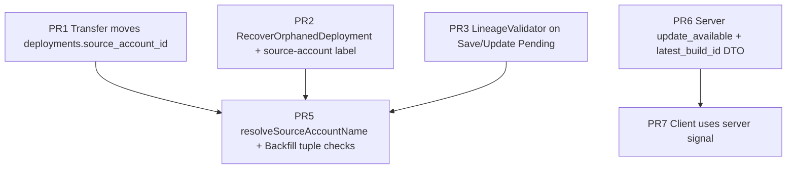

# Deployment Lineage Hardening — Master Plan (current)

Updated strategy after **closing PR4**: we are **not** shipping the composite FK on `deployments(source_account_id, agent_name, build_id) → agent_versions`, and we are **not** running an equivalent DDL/data migration manually. Write-time correctness relies on **PR3 (`LineageValidator`)** and the existing Transfer/orphan/recovery paths; read-time tightening remains **PR5**. Server-side upgrade signal stays **PR6 → PR7**.

---

## Dependency graph

**PR4 removed** — no prerequisite edge from PR4 to PR5. PR5 no longer waits on a schema FK.

**PR6 / PR7** remain an independent sub-chain from PR5 for sequencing purposes only (upgrade UX); they can still ship in parallel with PR5 where teams allow.

---

## Phase 1 — Write-path hardening

### PR1 — Transfer moves `deployments.source_account_id`

Keeps deployments aligned with the agent’s owning account after `Transfer` so upgrade/prefill semantics don’t point at the old publisher.

- Implementation stays explicit **`UPDATE deployments SET source_account_id = …`** inside the Transfer transaction (no reliance on a lineage FK `ON UPDATE CASCADE`).
- Tests: transfer integration coverage asserting deployments repoint with the agent move.

### PR2 — Recover orphaned deployments label `source_account_id`

Namespace label **`astro.dev/source-account-id`**, reconciler reads it, **`RecoverOrphanedDeployment`** writes **`source_account_id`** correctly instead of relying solely on later backfill.

### PR3 — `LineageValidator` on deployment writes (**canonical persistence gate**)

Without PR4, this is the **primary** guarantee that `SaveDeploymentPending` / `UpdateDeploymentPending` cannot persist a bogus `(source_account_id, agent_name, build_id)` tuple when `source_account_id` is set.

- Production wires `agentindex.Index` into `deploymentstore.Store`.
- Unit tests use a no-op validator; integration/e2e seeds `agent_versions`.

---

## Phase 2 — Read-path hardening (**no PR4**)

### ~~PR4~~ — **Closed**

- **Dropped:** versioned SQL migration + declarative `schema.sql` lineage FK, post-schema trigger/migrations dir, and operational cost of tracking another automated (or manual) migration path.
- **Implication:** future code that bypasses `Store` validators or uses raw SQL could still write invalid lineage; accept that risk or add one-off audits/scripts if needed later.

### PR5 — `resolveSourceAccountName` and `BackfillSourceAccountIDs` verify the tuple

After resolving a publisher (column or spec-JSON name → id), **confirm** `agent_versions` contains `(resolved_id, d.AgentName, d.BuildID)`; if not, treat as **no lineage** (empty / NULL behavior per contract). Same check in backfill before applying an `UPDATE`.

- Changelog: callers may see publisher name disappear when the name was reclaimed but the tuple no longer exists—**intended** hardening.

---

## Phase 3 — Server-side upgrade signal

### PR6 — DTO + SQL for `update_available` / `latest_build_id`

Server computes the signal with visibility rules aligned to `canDeploySourceAgent`; avoids N+1 client blueprint fan-out.

### PR7 — Client consumes server fields

Remove brittle `source_account || account` blueprint matching; use **`deployment.update_available`** / **`deployment.latest_build_id`** from the API.

---

## Notes

- **Operational load:**Closing PR4 avoids maintaining pre-schema migrations, post-schema trigger apply order, and FK/revision-table CI wiring for this invariant.
- **PR1–3** remain the engineering foundation for **trusted writes**; **PR5** closes the reader/reclaimed-name hole; **PR6–7** complete the upgrade story without the DB FK.
