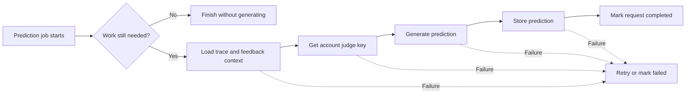

# Eval judge prediction worker

## Summary

Eval dataset predictions can run as independently retryable background work without blocking API requests.

## Design

Each trace is handled by one River job on a dedicated queue. The worker records durable lifecycle state, resolves current trace and feedback context from Langfuse, invokes the account-scoped judge, and stores successful output. Completed predictions remain authoritative across retries, while permanent or exhausted failures become visible through the request state.

## Migration

No manual action is required.
