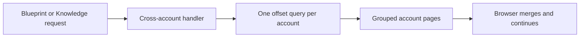
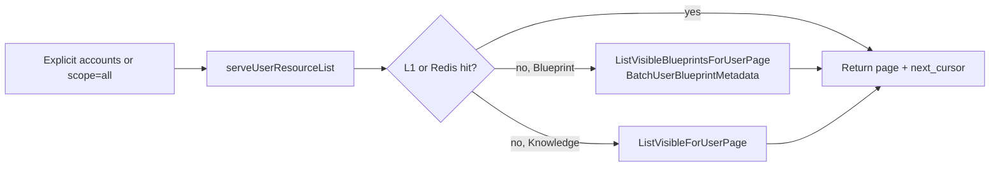

## Summary

- **Before:** Blueprint and Knowledge returned separate offset pages for each account. Blueprint cards also performed external identity and avatar work.
- **After:** each endpoint returns one ordered page across the selected memberships using **keyset pagination**. Blueprint and Knowledge search both run before pagination, across the full selected scope.
- **Why it is fast:** Blueprint uses one list query and one metadata batch. Knowledge uses one list query. Both paths use the shared local/Redis cache and avoid Kubernetes, Langfuse, WorkOS, and object storage.
- **Shared design:** Deployments, Blueprints, and Knowledge share request, membership, cache, and telemetry plumbing. Their SQL remains explicit and resource-specific.
- **How to review:** this follows #1844's handler → membership → cache → keyset query → invalidation pattern. Review it in that same order, then inspect each resource's explicit SQL and cursor.
- **Cleanup:** the grouped per-account responses, retry protocol, and offset methods are removed.

## Design

### Before: what #1728 left unfinished

#1728 used `account_members` for authorization, which was correct. But Blueprint and Knowledge still ran one independently paginated query per account.

Selecting ten accounts could run ten Blueprint queries or ten Knowledge queries. Blueprint loading also repeated its metadata, WorkOS, and avatar work for every account page. SSR would have waited for the same fan-out before returning HTML.



### After: one page for the selected scope

Both endpoints accept up to 50 explicit `account` values or `scope=all`. `parseUserResourceScope` resolves that scope through the current user's memberships. Each SQL query joins `account_members` again when reading rows.

Blueprints use name and account ID for their broad cursor order. `idx_agents_active_name_cursor` supports that order. `sort=newest` remains single-account only because latest publish time is not stored on `agents`; broad requests reject it instead of doing an unindexed scan.

Knowledge stores use creation time and ID. Their cursor continues after the final row across the entire selected scope. Optional `q` matches store names before the page limit and is part of the cache identity, following the same server-side search pattern as Deployments in #1844.



### Review map

| Stage | Functions | Files | What to look for |
| --- | --- | --- | --- |
| Shared request lifecycle | `serveUserResourceList`, `parseUserResourceScope`, `userResourceCacheKey`, `withRejectedAccounts` | `apps/astro-server/handlers/user_resources.go`, `apps/astro-server/internal/listcache/cache.go` | 50-account cap, membership resolution, canonical cache identity, and request-specific rejected accounts |
| Blueprint endpoint | `ListUserBlueprints`, `userBlueprintCacheIdentity` | `apps/astro-server/handlers/user_blueprints.go` | Filters become part of the cache key and broad `sort=newest` is rejected |
| Blueprint query | `Index.ListVisibleBlueprintsForUserPage`, `Index.BatchUserBlueprintMetadata` | `apps/astro-server/internal/agentindex/user_blueprint_list.go`, `sql/astro-server/schema.sql` | Membership join, name cursor, page-sized metadata batch, and matching index |
| Knowledge endpoint | `ListUserKnowledgeStores`, `userKnowledgeCacheIdentity` | `apps/astro-server/handlers/user_knowledge.go` | Scope, normalized `q`, and cursor are parsed once and included in cache identity |
| Knowledge query | `Store.ListVisibleForUserPage` | `apps/astro-server/internal/knowledgestore/user_list.go`, `sql/astro-server/schema.sql` | Membership join, name search before the limit, creation-time cursor, and account/global indexes |
| Knowledge mutations | `SetStatus`, `SetError`, `SetPublicHost`, `Delete` | `apps/astro-server/internal/knowledgestore/store.go` | Each mutation returns its account ID and invalidates that account when a row changes |
| Cache generations | `listcache.Generations`, `blueprintcache.Invalidate`, `knowledgecache.Invalidate` | `apps/astro-server/internal/listcache/generations.go`, `apps/astro-server/internal/blueprintcache/cache.go`, `apps/astro-server/internal/knowledgecache/cache.go` | One Redis MGET, bounded local fallback, and mutation invalidation |

### Blueprint metadata and cache behavior

For name-sorted Blueprints, the database selects the global page before loading latest versions and commit metadata. Those lateral lookups therefore run at most once per returned card. On a local PostgreSQL 16 benchmark with one million agents, this reduced a ten-account first page from 42.1 ms to 5.8 ms.

`BatchUserBlueprintMetadata` then loads hearts, message totals, deployment counts, and publisher data for that page in one query. Avatar URLs are generated from database metadata with `avatar_updated_at` cache busting; the list does not call WorkOS or read avatar files.

Search text and tags are lowercased before cache-key construction, so equivalent casing reuses the same cached page. List queries select only card fields; Knowledge list reads do not load encrypted key material.

If metadata fails, the primary Blueprint rows still return. The degraded page stays in the five-second local cache and is not shared through Redis.

Heart, message, and deployment counters may be up to 30 seconds behind on list cards. Invalidating every list combination for each counter write would create more cache churn than the small delay is worth. Heart mutations still return their exact new count immediately.

All three resources now use the same bounded generation registry. SQL is intentionally not shared because each resource has a different authorization join, order, and cursor.

Mutation invalidation writes the new generation locally before Redis. A Redis failure does not turn an already-committed database mutation into an API error; other replicas can remain stale only until the 30-second page TTL expires.

Unknown account names remain in the response's `rejected_accounts`, but they are not part of the L1/Redis cache key. The cached page is identified only by the authorized scope; `withRejectedAccounts` adds the current request's rejected names after the cache lookup. Random foreign names therefore cannot create distinct shared-cache entries.

Explicit requests accept at most 50 `account` values. `scope=all` has no hard membership cap because its accounts come from the server-side membership lookup, not caller-supplied names; requests above 50 memberships emit a warning so operational outliers remain visible.

## Migration

No end-user action is required. API clients must pass explicit `account` values or `scope=all`, consume the flat page, and follow `page.next_cursor`. Optional Knowledge `q` is additive and searches names across the selected scope.

This PR changes indexes only; it does not add tables or columns:

- `idx_agents_active_name_cursor` supports the broad Blueprint name order.
- The Knowledge account cursor replaces the older account-only index.
- The Knowledge global cursor supports `scope=all` without sorting the whole table.

These indexes make reads faster but add disk and write-maintenance cost. Production does not execute `schema.sql` line by line: the manually triggered SQL Migrate workflow asks Atlas to compare production with that desired state. `IF NOT EXISTS` in `schema.sql` would therefore not protect Atlas's generated operation. Run these exact statements first:

```sql
CREATE INDEX CONCURRENTLY idx_agents_active_name_cursor
    ON public.agents(name, account_id)
    WHERE archived_at IS NULL;

CREATE INDEX CONCURRENTLY idx_knowledge_stores_account_cursor
    ON public.knowledge_stores(account_id, created_at DESC, id DESC);

CREATE INDEX CONCURRENTLY idx_knowledge_stores_global_cursor
    ON public.knowledge_stores(created_at DESC, id DESC)
    INCLUDE (account_id);

DROP INDEX CONCURRENTLY IF EXISTS public.idx_knowledge_stores_account;
```

Then run the production schema plan for this exact commit. It must report no work for these four index operations before Atlas apply is approved; matching names and definitions are what make the apply a no-op.
