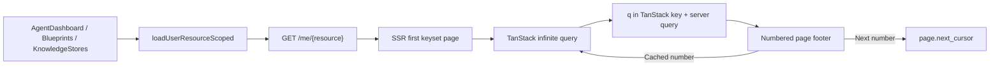

## Summary

- **Before:** the reverted pages showed one active account. The earlier cross-account UI loaded every page of every account in the browser before rendering the complete list.
- **After:** Agents, Blueprints, and Knowledge render one combined server page with the existing numbered footer. Search covers the full selected scope, and advancing beyond loaded pages requests one cursor page.
- **Why it is fast:** SSR and TanStack Query share the same cache key, so hydration reuses the first page. Previous page numbers reuse cached data, account count no longer multiplies list requests, and deployment metrics use independent cached batches.
- **Restored UI:** the multi-account filter returns on Agents, Blueprints, and Knowledge. Insights keeps a single-account selector. Blueprint and Knowledge creation use an explicit target-account picker.
- **Scope stays local:** changing the account filter updates the URL; it does not change the WorkOS session or active-account cookie.

## Design

### Before: why the earlier UI was slow

#1728 authorized cross-account reads through `account_members`, but it returned one offset page per account. #1726 used `loadCompleteAccountPages` to keep fetching until all selected accounts were complete.

More accounts and deeper catalogs meant more requests before the full page was ready. Moving that loop into an SSR loader would still delay the initial HTML.

### After: SSR first page, numbered cursor pages after it

An empty list-page `account` filter means all memberships. Selected accounts use repeated `?account=name` values. Selecting every membership collapses back to the empty all-accounts value, so it reuses the SSR query key instead of creating an equivalent second scope. `resolveUserResourceScope` validates and sorts that URL state without changing the active account.

Each route loader calls `loadUserResourceScoped` for one combined page. `usePrimeQueryCache` stores that response under the same key used by the page's infinite query. The first cards are in the HTML and hydration does not refetch them.

SSR forwards the route request's cancellation to its Astro API calls, so leaving the page releases the abandoned fetch. This PR does not impose a new global timeout on unrelated SSR requests.

All three search boxes use the same 300 ms debounce. The normalized `q` value becomes part of the TanStack key and server request, so filtering happens before pagination across every selected account. A changed term starts again at page 1; clearing it reuses the SSR-primed unfiltered key.

`ListPagination` keeps the numbered footer already used by Blueprints. Keyset responses intentionally omit an expensive total count, so the footer shows loaded page numbers plus the next available number. Previous numbers open cached pages immediately; the next number follows `page.next_cursor` once.

### Review map

| Stage | Functions | Files | What to look for |
| --- | --- | --- | --- |
| URL scope | `resolveUserResourceScope`, `useAccountFilterParam` | `apps/astro-client/src/lib/user-resource-scope.ts`, `apps/astro-client/src/hooks/use-account-filter-param.ts` | Repeated account parameters, canonical order, and no active-account switch |
| SSR handoff | `loadUserResourceScoped`, `usePrimeQueryCache`, `firstInfinitePage` | `apps/astro-client/src/lib/api.server.ts`, `apps/astro-client/src/hooks/use-prime-query-cache.ts` | One first-page request and the exact same TanStack key after hydration |
| Cursor queries | `useUserDeployments`, `useUserBlueprints`, `useUserKnowledgeStores` | `apps/astro-client/src/api/queries/deployments.ts`, `apps/astro-client/src/api/queries/blueprints.ts`, `apps/astro-client/src/api/queries/knowledge.ts` | Normalized `q` in the key/request, page reset on search, and one cursor for each new page |
| Search state | `useUserResourceSearch`, `useBlueprintSearch` | `apps/astro-client/src/hooks/use-user-resource-search.ts`, `apps/astro-client/src/pages/blueprints/use-blueprint-search.ts` | Shared debounce and a stable empty parameter object for SSR cache reuse |
| List UI | `AccountFilter`, `ListPagination`, `useCursorPagination` | `apps/astro-client/src/components/AccountFilter.tsx`, `apps/astro-client/src/components/ListPagination.tsx`, `apps/astro-client/src/hooks/use-cursor-pagination.ts` | Page-local account selection, cached previous pages, and progressive page numbers |
| Deployment metrics | `useVisibleDeploymentSummaries`, `useVisibleDeploymentSummaryMaps` | `apps/astro-client/src/api/queries/observability.ts`, `apps/astro-client/src/components/dashboard/useDeploymentSummaryMaps.ts` | Stable ≤100-ID batch keys, partial-failure isolation, and one merged summary map |
| Knowledge ownership | `KnowledgeStores`, `knowledgeDetailPath` | `apps/astro-client/src/pages/knowledge/KnowledgeStores.tsx`, `apps/astro-client/src/lib/routes.ts` | Missing account data disables navigation and deletion instead of falling back |
| Insights and creation | `getPageAccount`, `AccountScopeFilter`, `CreateInAccountPicker` | `apps/astro-client/src/lib/api.server.ts`, `apps/astro-client/src/pages/Insights.tsx`, `apps/astro-client/src/components/CreateInAccountPicker.tsx` | Insights stays single-account; creation always has an explicit write target |

### Resource behavior

Blueprint, Agent, and Knowledge search all run on the server across the selected accounts and are part of their query keys. Agent name/request sorting remains page-local: global request sorting needs a separate metrics-backed cursor contract, so this PR labels that control as “Sort current page” instead of implying a global order.

PR1 owns the membership-checked cached-summary endpoint. This PR only handles its client queries: `useVisibleDeploymentSummaries` deduplicates and sorts visible IDs, gives each ≤100-ID batch its own TanStack key, and merges successful results. Revisiting a page reuses its summaries; one failed batch no longer removes metrics returned by healthy batches.

Knowledge rows must include their owning account. If that field is missing, the row remains visible as unavailable but cannot navigate or delete against the wrong account.

Insights remains a single-account view. Its `account` URL value selects the query without changing the global session. Blueprint and Knowledge creation use `CreateInAccountPicker` to choose the write target directly.

## Migration

No schema or end-user migration is required. Merge the stack in order:

1. `agent/cross-account-query-foundation`
2. `agent/cross-account-blueprints-knowledge`
3. `agent/cross-account-filter-ui`

On the three list pages, no `account` parameter means all memberships. Insights accepts one `account` and otherwise uses the active account.
