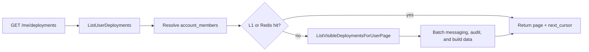

## Summary

- **Before:** cross-account deployments were fetched as separate account pages. The browser kept loading until every account was complete.
- **After:** the server returns one ordered page across the selected accounts using **keyset pagination**. Search runs inside that query, so it covers every matching deployment rather than only the page on screen. The filter reads memberships from `account_members`; it does not switch WorkOS sessions.
- **Why it is fast:** one indexed page query replaces the per-account fan-out and selects only card fields. Enrichment uses a fixed number of database batches, repeated pages use local or Redis cache, and visible-card metrics use one authorization query plus one Redis batch read.
- **Scope:** this PR builds the deployment backend. PR3 restores the SSR/TanStack account-filter UI.

## Design

### Before: why #1728 was incomplete

#1728 used the correct authorization boundary: users could read resources through `account_members` without changing their active WorkOS account. But it returned one offset page per account.

Selecting ten accounts could therefore run ten page queries at a time. The client then repeated those requests until every account was complete. Moving that loop into SSR would move the delay to the server, not remove it.


The old fan-out handler, offset protocol, and per-account list cache are removed. There is now one deployment-list path.

### After: one bounded global page

`/me/deployments` accepts explicit account names or `scope=all`. It resolves those names through the user's memberships, and the SQL query joins `account_members` again when it reads deployments. Optional `q` matches agent and display names before the page limit; the normalized term is also part of the cache key.

Rows are ordered by deployment time and ID. The opaque cursor stores the last row's values, so the next request continues from that point. It does not reread earlier rows or apply an offset to every account. The query projects only fields used by deployment cards, leaving spec and encryption payloads out of the list path.

Two deployment cursor indexes support the common plans: a narrow scan for selected accounts and a global scan for `scope=all`. Separate version and audit indexes support the fixed enrichment queries.



### Review map

| Stage | Functions | Files | What to look for |
| --- | --- | --- | --- |
| Request and scope | `ListUserDeployments`, `parseUserDeploymentRequest`, `selectCrossAccountMemberships` | `apps/astro-server/handlers/user_deployments.go`, `apps/astro-server/handlers/cross_account_resources.go` | Explicit scope, normalized `q`, rejected unknown accounts, and membership checks |
| Page cache | `userDeploymentCacheKey`, `listcache.Cache.GetOrLoad`, `deploycache.Generations` | `apps/astro-server/handlers/user_deployments.go`, `apps/astro-server/internal/listcache/cache.go`, `apps/astro-server/internal/deploycache/cache.go` | User/scope/cursor/generation in the key; degraded pages stay out of Redis |
| Page query | `Store.ListVisibleDeploymentsForUserPage` | `apps/astro-server/internal/deploymentstore/user_list.go`, `sql/astro-server/schema.sql` | Membership join, name search before the limit, keyset predicate, stable order, and matching indexes |
| Enrichment | `enrichUserDeploymentRows`, `GetMessagingURLsContext`, `LatestPerResources`, `BatchLatestBuildInfo` | `apps/astro-server/handlers/user_deployments.go`, `apps/astro-server/internal/deploymentstore/normalized.go`, `apps/astro-server/internal/auditlog/store.go`, `apps/astro-server/internal/agentindex/index.go` | Fixed batch count, request cancellation, and no Kubernetes or external-service reads |
| Card metrics | `ListUserDeploymentSummaries`, `ListVisibleDeploymentIDsForUser`, `obssummary.GetMany` | `apps/astro-server/handlers/user_deployment_summaries.go`, `apps/astro-server/internal/deploymentstore/user_list.go`, `apps/astro-server/internal/obssummary/cache.go` | At most 100 IDs, one membership query, one Redis MGET, and no Langfuse call |
| Invalidation | `deploycache.Invalidate`, `deploycache.InvalidateForLineage` | `apps/astro-server/internal/deploycache/cache.go`, `apps/astro-server/handlers/deploy.go`, `apps/astro-server/handlers/transfer.go`, `apps/astro-server/internal/riverqueue/deploy.go` | Mutations advance the affected account generations |

### Enrichment and caching

The list reads record data from PostgreSQL. It does not call Kubernetes, Langfuse, WorkOS, or avatar storage. Live runtime state remains on follow-up endpoints.

The process-local cache is bounded. Redis shares hot pages across server replicas, and request coalescing prevents duplicate cold loads. Mutations advance per-account generations, which changes the next cache key without scanning Redis.

Each caller can stop waiting when its request is cancelled without failing other callers sharing that cache miss. The shared load keeps running for healthy waiters but has a hard 15-second deadline. Membership and enrichment SQL use that context, so a slow database call cannot outlive the bounded load.

Generation keys cover the accounts that own the selected deployments. For a deployment sourced from another publisher account, `latest_build_id` may lag that publisher's update by at most the 30-second Redis TTL; discovering publisher IDs before the cache lookup would remove the fast cache-hit path.

If optional enrichment fails, the primary rows still return. That degraded page stays in the five-second local cache and is not written to the 30-second Redis cache.

`GET /me/deployment-summaries` accepts up to 100 compact deployment IDs. One SQL query removes deployments the current user cannot read, then the same `obssummary.GetMany` helper used by the account-scoped endpoint reads cached metrics with one Redis MGET. Missing or malformed entries do not trigger Langfuse and do not remove healthy summaries.

## Migration

### Breaking endpoint contract

This PR intentionally breaks the authenticated `GET /api/v1/me/deployments` request and response contract:

| Before | After |
| --- | --- |
| No `account` meant all memberships | Callers must pass `account` values or `scope=all`; an empty scope returns `400` |
| `limit` and `offset` paged each account separately | `limit` and one opaque `cursor` page the globally ordered result; `offset` returns `400` |
| `CrossAccountDeploymentsResponse` grouped results by account | `UserDeploymentsResponse` returns flat `deployments`, `page`, `scope`, and optional `rejected_accounts` |

Optional `q` is additive. It searches agent and display names across the full selected scope while preserving the cursor contract.

The legacy contract is intentionally removed with no compatibility shim or versioned path. Its frontend consumer was reverted, repository and organization-wide searches found no current client, and PR3 is the first current client of the replacement contract.

`GET /api/v1/me/deployment-summaries` is additive. It accepts at most 100 repeated `deployment` IDs and returns cached summaries only for deployments visible to the authenticated user.

The database migration changes indexes only; it does not add tables, columns, or stored-data migrations:

- The two deployment cursor indexes let PostgreSQL return selected-account and all-account pages in the required order.
- The version and audit indexes make the page's latest-build and latest-audit lookups direct index reads.

Indexes improve reads but use disk and add some work to inserts and updates. Build them manually in production before deploying this schema. Run each `CONCURRENTLY` statement outside a transaction:

```sql
CREATE INDEX CONCURRENTLY idx_deployments_visible_account_cursor
    ON public.deployments(account_id, deployed_at DESC, id DESC)
    WHERE status <> 'undeployed';

CREATE INDEX CONCURRENTLY idx_deployments_visible_global_cursor
    ON public.deployments(deployed_at DESC, id DESC)
    INCLUDE (account_id)
    WHERE status <> 'undeployed';

CREATE INDEX CONCURRENTLY idx_audit_logs_resource_latest
    ON public.audit_logs(account_id, resource_type, resource_id, created_at DESC, id DESC)
    INCLUDE (actor_id);

-- Build the replacement beside the live index, then swap its name. This avoids
-- dropping the existing lookup index while the larger replacement is built.
CREATE INDEX CONCURRENTLY idx_versions_agent_v2
    ON public.agent_versions(account_id, name, published_at DESC)
    INCLUDE (build_id);

DROP INDEX CONCURRENTLY public.idx_versions_agent;
ALTER INDEX public.idx_versions_agent_v2 RENAME TO idx_versions_agent;
```

Confirm all four final indexes are valid in `pg_index`, then run the production Atlas plan for this exact commit. The plan must contain no work for these index operations before apply is approved; matching names and definitions are what make the schema apply a no-op.
