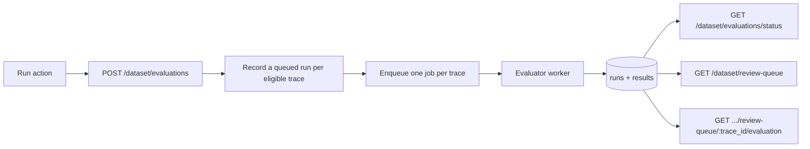

# Evaluation endpoints

## Summary

The evaluator worker produces runs and results, but the only way to start one was a manual
queen trigger and nothing read what came back. This change moves the API onto evaluations,
replacing the prediction endpoints rather than keeping them alongside, so the review queue
is broken until the UI cutover lands. The two deploy together.

It builds on the run store added in the evaluation run store change, which records a run at
request time and provides the queries these endpoints read.

## Design

All four endpoints share one scanner. `scanLangfuseReviewQueuePages` walks recent Langfuse
traces and applies local eligibility, and both the queue listing and the evaluation request
read through it, so the filter and the item shape change together for both.

### POST /dataset/evaluations

Replaces `POST /dataset/predictions`, which queued the judge and got one verdict per trace.
It queues the evaluator set instead, which returns one result per evaluator. The endpoint
also records the run itself rather than leaving that to the worker, so a requested trace
has a run from the moment the request returns.

### GET /dataset/evaluations/status

Replaces `/predictions/status`. It counts evaluation runs rather than prediction requests,
across the same four buckets, so polling for deployment-wide activity is unchanged.

### GET /dataset/review-queue

An item used to embed its whole prediction, plus the trace's output and user identity. It
now carries only a nullable run holding status and error. One verdict fits in a list row
and a set of evaluators does not, so the detail moved to its own endpoint. The
`prediction=present|absent` filter becomes `evaluation=evaluated|not_evaluated`.

### GET /dataset/review-queue/:trace_id/evaluation

New, and the reason the list could shed detail. It returns the selected trace in full with
each evaluator's result, taking over the user identity lookup the list dropped. It reports
what the run recorded rather than what is configured now, so an evaluator that has since
left the set still appears.

## Migration

`POST /dataset/predictions` becomes `POST /dataset/evaluations`, `/predictions/status`
becomes `/evaluations/status`, and `prediction=present|absent` becomes
`evaluation=evaluated|not_evaluated`. Queue items replace `prediction_status`,
`prediction_error`, and `prediction` with a nullable `run`, and drop `output`, `user_id`,
and `user_details`.

Nothing enqueues the legacy judge any more. Its worker and queue stay so queued jobs drain.
