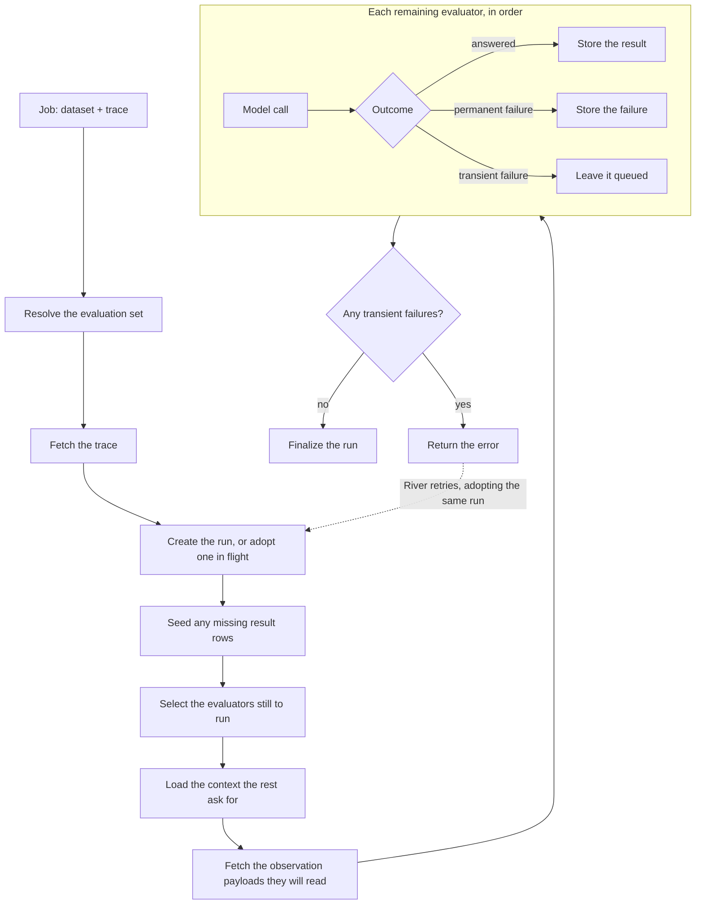

# Evaluator worker

## Summary

The evaluator package can run one evaluator and the preset registry resolves a reference
into a set of six, but nothing ran them and nothing stored what they produced.

This change adds the job that evaluates one trace and the two tables it writes. It is
triggerable from queen, so the whole path can be exercised against a real trace before any
HTTP endpoint exists.

## Design

A job takes a dataset and a trace, resolves the dataset's evaluation set, gathers what
that set needs from Langfuse, runs each evaluator, and records the results.

Everything before the loop is a trace-level step: if one of them fails permanently the run
is finalized as failed, and no evaluator runs.

**Results are recorded per evaluator, not per run.** Each evaluator commits on its own, so
one failure costs only its own result. A run reports what every evaluator concluded rather
than a single pass or fail, which is what makes the set useful: a builder acts on the
evaluator that fired, not on an aggregate.

**A run's status says whether it produced anything.** It completes when at least one
evaluator returned a verdict, and fails when none did, whether the trace could not be
loaded at all or every evaluator failed in turn. That keeps the status readable on its own:
a completed run has something to show, so nothing has to count result rows to find out.

**A retry redoes only what failed.** Evaluators are the expensive part, one model call
each, and a completed result is final. Re-running a trace after a transient failure skips
what already succeeded and loads only the context the remaining evaluators need. Repeating
a completed evaluator would also let its verdict change under a reader, since the same
input can produce a different answer.

**Re-requesting an evaluation already in flight joins it.** A database constraint covering
only unfinished runs makes concurrent requests for the same trace converge on one run,
while still allowing a fresh evaluation once that one finishes.

**The worker fetches only what some evaluator will read.** Trace reads return observations
without their payloads, so the worker fetches those separately, and only for observations
an evaluator can actually consume. This is specific to the current Langfuse read path; the
newer one returns payloads with the trace and the extra fetches go away with it.

Evaluation runs on its own queue rather than sharing the judge's, with a lower worker
ceiling, because one job now makes a model call per evaluator instead of one in total.

## Migration

None. The schema additions are additive, the old judge worker and its queue are untouched,
and nothing enqueues the new job automatically yet.

## Known gap

The worker creates the run row itself, because it needs the trace timestamp and only gets
that by reading the trace. So the checks that run before the row exists cannot record a
failure against it: if one attempt creates the run and fails transiently, and a later
attempt then finds the trace deleted or moved to another deployment, the job cancels and
leaves that run in progress.

The endpoint closes this rather than the worker. It already lists traces from Langfuse to
decide what to enqueue, so it has the timestamp and can create the run at enqueue time, the
way the judge path creates prediction requests. `EnsureRun` then only ever adopts, and no
failure can arrive before the row exists.
