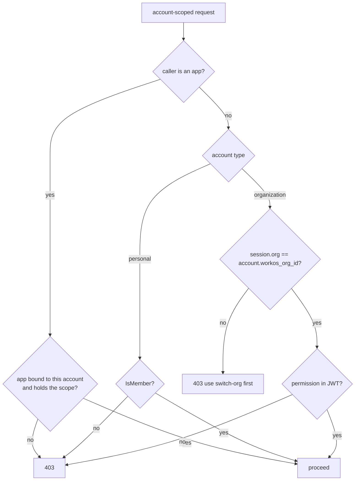
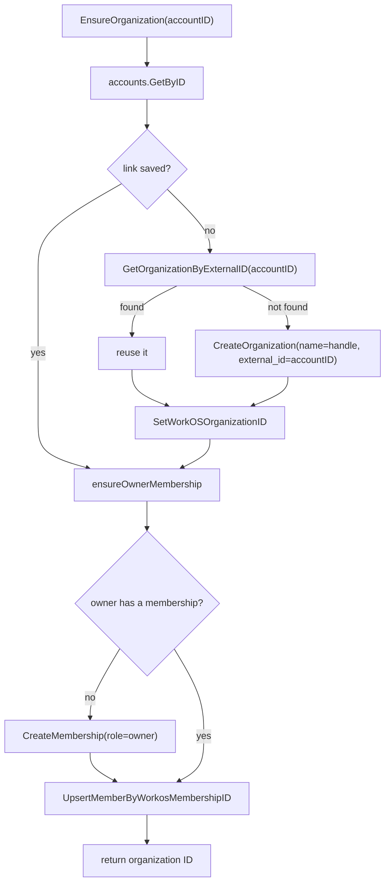
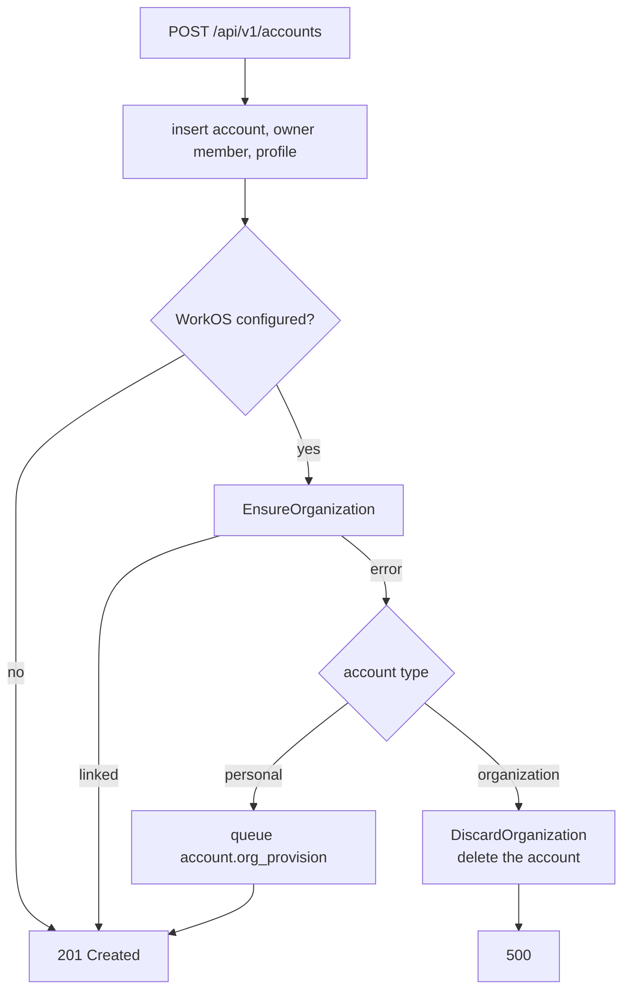
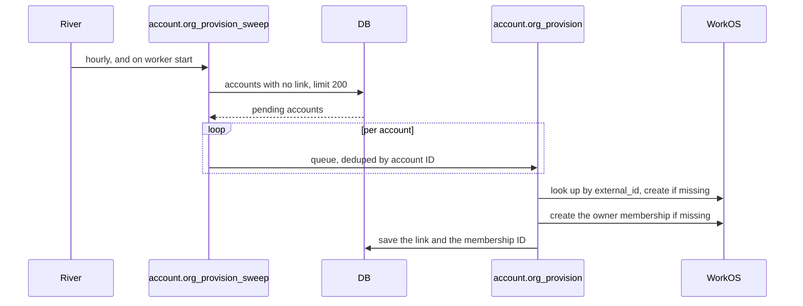

# Every account gets a WorkOS organization

## Summary

WorkOS scopes applications, roles, and groups to an organization. Until now, only organization accounts had one. Personal accounts had none, so they could not own any of those things.

OAuth apps hit this first. Creating an app needs an `organization_id`, so `POST /accounts/:account/apps` refused every personal account.

The real rule is that a personal account holds one person. The account type sets that, not the presence of a WorkOS organization. This change gives every account an organization and moves the one-person rule onto the type.

## Design

### What each check means

| Check | Meaning | Can it change? |
| --- | --- | --- |
| `Type == "organization"` | The account may hold more than one person | No |
| `WorkOSOrganizationID != ""` | The organization link exists | Yes. Empty only until provisioning finishes |

Four call sites read the link but meant the type: invitations, member roles in the member list, the alert manager lookup, and the Insights role fallback. They now check the type. So a personal account still cannot be invited into, even though it has an organization. `org.Sync` already checked the type when adding, removing, and re-roling members.

Where a path still reads the link, it needs the ID to call WorkOS. A missing link on an organization account is a broken state, not a normal one, so those paths say so instead of skipping quietly:

| Path | Missing link on an organization account |
| --- | --- |
| Create or list invitations | `409`, logged as an error |
| OAuth apps | `409`, so the caller can retry |
| Alert manager lookup | Returns an error. The deliverer logs it and still alerts the owner |
| `org.Sync` role and member changes | Already returned an error before this change |
| Insights role fallback | Returns false, which restricts the caller to their own rows |

Account creation rolls an organization account back when provisioning fails, so this state should not occur. The log line is there to prove that.

### Authorization does not change



Personal accounts still authorize by membership. Their new organization is not used here. No session is ever scoped to it, so reading permissions from the JWT would lock every owner out of their own account.

### Provisioning

`org.Provisioner.EnsureOrganization(accountID)` does three things:

1. Find or create the WorkOS organization.
2. Save the link in `account_organizations`.
3. Give the owner an `owner` membership.



You can call this as many times as you like. That matters because steps 1 and 2 write to two different systems, and no transaction covers both. A crash, a DB error, or a timeout can leave an organization in WorkOS with no link in the database. The account then looks unprovisioned, and the sweep picks it up again.

Each organization stores the account ID in its WorkOS `external_id`. So the next run looks up the organization by that ID first. If it finds one, it reuses it instead of creating a second one.

### Account creation



Both types now call the provisioner. They treat a failure differently:

- **Organization account:** the request fails and the account is deleted. Members get their permissions from the WorkOS JWT, so without an organization nobody could administer the account.
- **Personal account:** the request succeeds. The server logs the error and queues a retry. Personal accounts authorize by membership, so they work without the link.

### Backfill



Two River jobs do the work:

- `account.org_provision` provisions one account, deduped by account ID.
- `account.org_provision_sweep` runs hourly and on worker start. It queues up to 200 unlinked accounts per run.

The sweep looks for a missing row:

```sql
FROM accounts a
LEFT JOIN account_organizations ao ON ao.account_id = a.id
WHERE ao.account_id IS NULL AND a.deleted_at IS NULL
```

There is no "provisioned" flag. The missing row is the only signal, so one query covers old accounts, dropped signup retries, and accounts that lose the link later.

`account.org_provision` leaves `completed` out of its River unique states. Otherwise a finished job would stop the next sweep from queueing the same account again.

Both jobs run only when WorkOS is configured. Account deletion already deleted the linked organization, so that path is unchanged.

### OAuth apps

The apps routes were always account-scoped. Only the handler blocked personal accounts. It now checks for the link, and returns `409` when it is missing so the caller can retry. The panel moved to `AppsSettings.tsx`, and both the personal and organization settings pages render it.

## Migration

Nothing to do. The sweep starts with the worker and runs hourly, 200 accounts at a time.

Until an account is linked, its OAuth apps page says the account is still being set up.

Watch WorkOS rate limits during the first sweep. Each account costs one lookup, up to one organization create, and up to one membership create.
