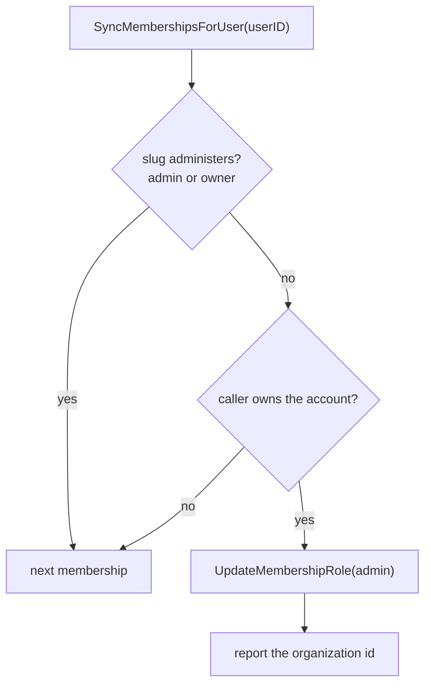

# Repair owners left below admin in WorkOS

## Summary

Organizations provisioned before `3971ea8d5` asked WorkOS for the role slug `owner`. The environment defines `member` and `admin` only, so WorkOS applied the default instead and every one of those owners holds `member`.

`accounts.owner_user_id` still names them, so nothing looks wrong in our own data. WorkOS is the only authority on roles since the local `role` column was dropped, and account-scoped routes answer from the JWT permission claims, so an owner on `member` loses `org:manage` on the account they own: settings, members, invitations, billing, and the audit log all refuse. The member list shows them as `member` beside everyone else.

The provisioning fix only covers new organizations. Nothing re-runs for the ones already linked, because the sweep selects accounts with no link at all:

```sql
WHERE ao.account_id IS NULL AND a.deleted_at IS NULL
```

The member-role endpoint cannot repair them either. Changing the owner to `admin` returns `ErrOwnerRequired`, and changing them to `owner` routes into `transferOwnership`, which returns immediately when the target already owns the account. There was no path back.

## Design

`SyncMembershipsForUser` already lists the caller's WorkOS memberships on login, on session refresh, and on an org switch that finds no membership id. Each membership arrives with its role slug, so the check costs nothing:



`owner` counts as administering even though WorkOS never returns it, so a membership carrying that slug is left alone rather than written down.

The write is best-effort. A failure is logged and retried on the owner's next sync, and it never fails a login. One successful write ends it: the slug is then `admin`, so later syncs do no work and issue no queries.

### The token in hand is older than the write

WorkOS mints the access token before any of this runs, so its `role` and `permissions` claims still name the role the repair replaced. `session.ExpiresAt` comes from `AUTH_SESSION_MAX_AGE`, 30 days by default, so nothing forces a refresh in between. Repairing WorkOS alone would leave the caller on `member` for up to a month, and a session that refreshed at the same moment would carry the stale claims for a second cycle.

`SyncMembershipsForUser` therefore returns the organization ids it repaired. Both paths that build a session act on it:

| Path | Without the re-issue | With it |
| --- | --- | --- |
| Login callback | The token minted by AuthKit names the old role | Administrator on the first page load |
| Session refresh | The refreshed token predates the write by microseconds | Administrator in the same response |
| Org switch | Already correct: the switch mints claims for the org being entered | Unchanged |

The re-issue is scoped to the organization the session records, because role claims are per organization. Re-issuing for an org the repair did not touch would change nothing. It reuses the exchange the login callback already performs to scope a session to a personal organization, so the extra WorkOS call is paid once per stale owner and never again.

A failed exchange keeps the token in hand and logs. The claims are then stale until the next login, which is where this started.

### Backfill

`cmd/backfill-owner-roles` repairs owners who are not coming back soon:

```
DATABASE_URL=postgres://... WORKOS_API_KEY=sk_... go run ./cmd/backfill-owner-roles
DRY_RUN=true ...   # report only
```

It groups accounts by owner, so it costs one WorkOS membership listing per owner rather than per account, and it delegates every decision to the same repair the login sync uses. Both account types are covered: personal accounts were linked to organizations an hour before the slug fix landed, so their owners can hold `member` too.

Re-running is safe. An owner already holding `admin` costs one read and no write. The command exits non-zero when any repair failed.

`ListMembershipsForUser` asks for 100 memberships and does not paginate, so an owner of more than 100 accounts would be partly skipped. No account is near that.

## Migration

Run `cmd/backfill-owner-roles` once per environment after deploy. Owners who log in first are repaired by the login sync, and the backfill then reports them as unchanged.
