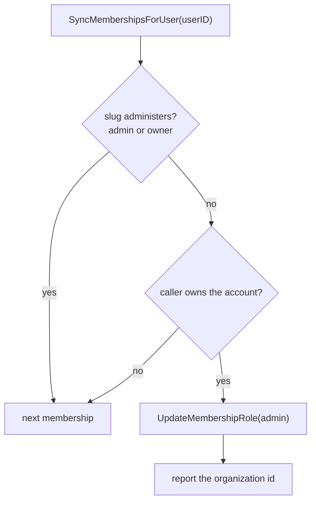

# Repair owners left below admin in WorkOS

## Summary

Organizations provisioned before `3971ea8d5` asked WorkOS for the role slug `owner`. The environment defines `member` and `admin` only, so WorkOS applied the default instead and every one of those owners holds `member`.

`accounts.owner_user_id` still names them, so nothing looks wrong in our own data. WorkOS is the only authority on roles since the local `role` column was dropped, and account-scoped routes answer from the JWT permission claims, so an owner on `member` loses `org:manage` on the account they own: settings, members, invitations, billing, and the audit log all refuse. The member list shows them as `member` beside everyone else.

The provisioning fix only covers new organizations. Nothing re-runs for the ones already linked, because the sweep selects accounts with no link at all:

```sql
WHERE ao.account_id IS NULL AND a.deleted_at IS NULL
```

The member-role endpoint cannot repair them either. Changing the owner to `admin` returns `ErrOwnerRequired`, and changing them to `owner` routes into `transferOwnership`, which returns immediately when the target already owns the account. There was no path back.

## Design

`SyncMembershipsForUser` already lists the caller's WorkOS memberships on login, on session refresh, and on an org switch that finds no membership id. Each membership arrives with its role slug, so the check costs nothing:



`owner` counts as administering even though WorkOS never returns it, so a membership carrying that slug is left alone rather than written down.

The write is best-effort. A failure is logged and retried on the owner's next sync, and it never fails a login. One successful write ends it: the slug is then `admin`, so later syncs do no work and issue no queries.

### The token in hand is older than the write

WorkOS mints the access token before any of this runs, so its `role` and `permissions` claims still name the role the repair replaced. `session.ExpiresAt` comes from `AUTH_SESSION_MAX_AGE`, 30 days by default, so nothing would force a refresh for a month.

`SyncMembershipsForUser` therefore returns the organization ids it repaired. When the session being built is scoped to one of them, the login callback exchanges the refresh token again and takes the claims from the newer token. That is the same re-mint the callback already performs to scope a session to a personal organization, so a repaired owner is an administrator on their first page load.

An org switch mints fresh claims for the organization being entered, so switching into a repaired account is correct without help. A long-lived session scoped elsewhere picks the change up at its next login.

## Migration

Nothing to do. Each affected owner is repaired on their next login.

Owners who do not log in stay on `member`, and other members keep seeing them that way. A one-off backfill over `accounts.owner_user_id` would close that gap if it matters before the next release.
