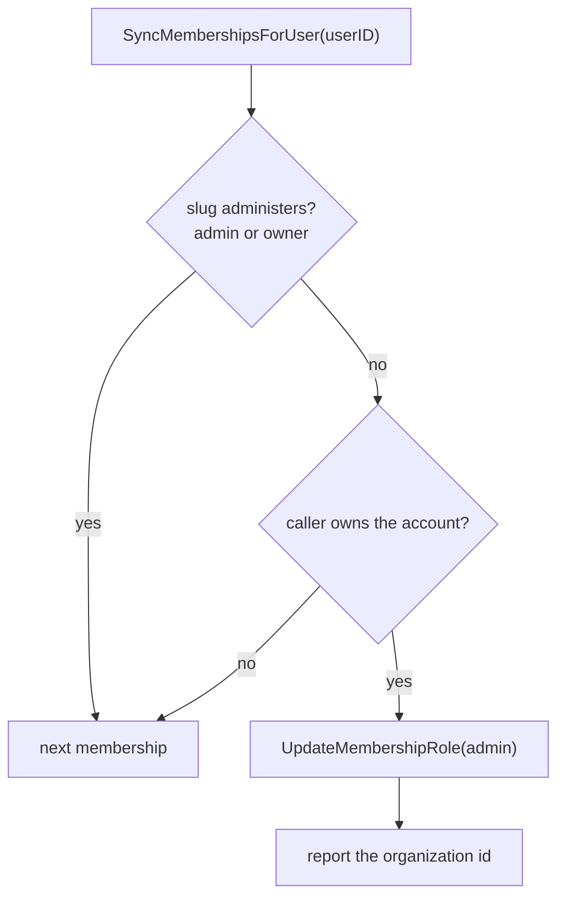

# Repair owners left below admin in WorkOS

## Summary

Organizations provisioned before `3971ea8d5` asked WorkOS for the role slug `owner`. The environment defines `member` and `admin` only, so WorkOS applied the default instead and every one of those owners holds `member`.

`accounts.owner_user_id` still names them, so nothing looks wrong in our own data. WorkOS is the only authority on roles since the local `role` column was dropped, and account-scoped routes answer from the JWT permission claims, so an owner on `member` loses `org:manage` on the account they own: settings, members, invitations, billing, and the audit log all refuse. The member list shows them as `member` beside everyone else.

The provisioning fix only covers new organizations. Nothing re-runs for the ones already linked, because the sweep selects accounts with no link at all:

```sql
WHERE ao.account_id IS NULL AND a.deleted_at IS NULL
```

The member-role endpoint cannot repair them either. Changing the owner to `admin` returns `ErrOwnerRequired`, and changing them to `owner` routes into `transferOwnership`, which returns immediately when the target already owns the account. There was no path back.

That set is closed. Provisioning writes `admin` now, so no new account joins it. One path still produces the same state, though: `transferOwnership` moves `accounts.owner_user_id` first and then promotes the new owner in WorkOS, and it reports a failed promotion as a warning rather than an error. The transfer stands and the new owner holds whatever role they had. So the repair below is a permanent backstop for that path, not only a sweep of the historical set.

## Design

`SyncMembershipsForUser` already lists the caller's WorkOS memberships on login, on session refresh, and on an org switch that finds no membership id. Each membership arrives with its role slug, so the check costs nothing:



`owner` counts as administering even though WorkOS never returns it, so a membership carrying that slug is left alone rather than written down.

The write is best-effort. A failure is logged and retried on the owner's next sync, and it never fails a login. One successful write ends it: the slug is then `admin`, so later syncs do no work and issue no queries.

### The token in hand is older than the write

WorkOS mints the access token before any of this runs, so its `role` and `permissions` claims still name the role the repair replaced. `session.ExpiresAt` comes from `AUTH_SESSION_MAX_AGE`, 30 days by default, so nothing forces a refresh in between. Repairing WorkOS alone would leave the caller on `member` for up to a month, and a session that refreshed at the same moment would carry the stale claims for a second cycle.

`SyncMembershipsForUser` therefore returns the organization ids it repaired. Both paths that build a session act on it:

| Path | Without the re-issue | With it |
| --- | --- | --- |
| Login callback | The token minted by AuthKit names the old role | Administrator on the first page load |
| Session refresh | The refreshed token predates the write by microseconds | Administrator in the same response |
| Org switch | Already correct: the switch mints claims for the org being entered | Unchanged |

The re-issue is scoped to the organization the session records, because role claims are per organization. Re-issuing for an org the repair did not touch would change nothing. It reuses the exchange the login callback already performs to scope a session to a personal organization, so the extra WorkOS call is paid once per stale owner and never again.

A failed exchange keeps the token in hand and logs. The claims are then stale until the next login, which is where this started.

## Migration

The historical set needs one pass per environment, which is an operator step rather than shipped code. Each promotion must name both the owner and the organization they own, because a listing filtered by `user_id` alone also returns the organizations where that person is only a member, and promoting those would hand out admin the account owner never had.

```sh
psql "$DATABASE_URL" -At -F' ' -c "
  SELECT a.owner_user_id, ao.workos_org_id
  FROM accounts a
  JOIN account_organizations ao ON ao.account_id = a.id
  WHERE a.deleted_at IS NULL AND a.owner_user_id IS NOT NULL" |
while read -r owner org; do
  curl -s -H "Authorization: Bearer $WORKOS_API_KEY" \
    "https://api.workos.com/user_management/organization_memberships?user_id=$owner&organization_id=$org" |
  jq -r '.data[] | select(.role.slug != "admin" and .role.slug != "owner") | .id' |
  xargs -r -I{} curl -s -o /dev/null -X PUT \
    -H "Authorization: Bearer $WORKOS_API_KEY" -H "Content-Type: application/json" \
    -d '{"role_slug":"admin"}' \
    "https://api.workos.com/user_management/organization_memberships/{}"
done
```

Both filters together return at most one membership, the owner's own, so the pass costs one listing per account rather than per owner. Preview holds 63 linked accounts with owners as of 2026-08-28. Drop the `xargs` line to see what would change first.

`repairOwnerRole` pairs the same two values for the same reason: it resolves the account from the membership's organization, then promotes only when that account's `owner_user_id` is the member in hand.

Anyone the pass misses is repaired when they next sign in, so the pass is a convenience, not a prerequisite.
