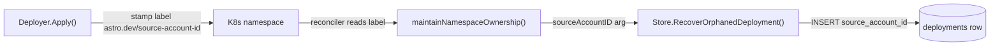

# Orphan Recovery Populates `source_account_id`

## Summary

When the reconciler finds a Kubernetes namespace it manages that has no matching `deployments` row, it inserts a stub "failed" record so an operator can redeploy or undeploy. That recovery path used to write `source_account_id` as `NULL` and `deployment_spec_json` as `'{}'`. The lineage column was salvaged a few minutes later by the startup `BackfillSourceAccountIDs` pass, which falls through to the deployer account when the spec has no `source.account` — but only on the next server boot, and only as a side effect of an unrelated batch routine.

This PR lands the correct value at write time. A new `astro.dev/source-account-id` namespace label carries the publishing account from deploy-time into the namespace's labels; the reconciler reads it back during orphan recovery and threads it into the `deployments` insert. Pre-PR2 namespaces lack the label and the reconciler defaults to the deployer account with an explicit warning log, matching the eventual state the backfill would have produced anyway.

## Design

### One write site, one read site, one insert column



The flow is intentionally narrow: one place writes the label, one place reads it, one column changes shape on insert.

**Write site.** A new `LabelKeySourceAccountID = "astro.dev/source-account-id"` constant in `internal/deployment/naming.go` documents the label. `Deployer.Apply` is the only place that stamps namespace labels; it now extracts `dep.SourceAccountID` (already populated everywhere else by `SaveDeploymentPending`) and adds the new label conditionally — when the field is unset (ancient row), the key is omitted entirely so the reader's missing-label fallback fires rather than the row recording an empty-string label value. The label set is built by a small `buildNamespaceLabels` helper at the bottom of `deployer.go` to keep the busy `Apply` body readable.

**Read site.** `ReconcileWorker.maintainNamespaceOwnership` already reads three labels (`account-id`, `agent`, `build`); a fourth read for `source-account-id` joins them. When missing, the worker logs `"orphaned K8s namespace missing source-account-id label, defaulting to deployer account"` and uses `accountID` as the source. The recovery success log line now also includes `source_account_id` so an operator can see exactly which lineage was recorded.

**Store signature.** `Store.RecoverOrphanedDeployment` gains a `sourceAccountID` positional parameter:

```go
func (s *Store) RecoverOrphanedDeployment(id, accountID, sourceAccountID, agentName, buildID, namespace string) error
```

The INSERT writes `source_account_id` as a real column. `deployment_spec_json` stays `'{}'` (cannot be reconstructed) and `error_message` is unchanged — the operator triage signal is still "redeploy or undeploy". The fallback warning lives in the reconciler log, not the row.

### Why fallback to `accountID` rather than `NULL`

A `NULL` would flow through PR1's `BackfillSourceAccountIDs` to the same value (deployer account) on the next boot, because the spec is empty. Writing `accountID` directly is observably equivalent to "let backfill fix it" but lands the correct value at write time and surfaces a single warning per recovery instead of a backfill-batch summary. PR4's planned FK on `(source_account_id, agent_name, build_id) → agent_versions(...)` will then accept the row only if a same-account version exists; if it doesn't, `ON DELETE SET NULL` semantics already keep the row alive.

### Why this matters now

The orphan-recovery codepath is rare — it only fires when a namespace exists in the cluster without a corresponding DB row, which usually means the row was hand-deleted or the recovery worker is racing a partially-failed deploy. But the existing behavior writes a *known-wrong* lineage (`NULL`) and depends on a separate scheduled job to repair it. Closing the loop at the write site removes that latency and removes a class of "lineage briefly missing" reads from anyone listing deployments between the recovery and the next boot.

## Tests

Three layers, each pinning a different segment of the data flow. The set was deliberately kept thin — for every assertion we asked "would a reviewer see this and say 'that's just restating the SQL'?" and dropped the ones that failed that test.

### Write site unit — `internal/deployer/deployer_test.go`

`buildNamespaceLabels` is the only place that stamps the new label, and a typo here (wrong constant, wrong field, wrong dereference) silently downgrades every recovered row to the deployer-account fallback regardless of the original deploy's lineage — read-side tests can't catch that because they fixture the label content themselves. Three cases pin the write site directly:

- `TestBuildNamespaceLabels_StampsSourceAccountID` — non-nil pointer with a non-empty UUID; both legacy and new label keys land with the right values.
- `TestBuildNamespaceLabels_OmitsLabelWhenSourceAccountIDNil` — nil pointer (legacy/ancient row); the new key is *absent* (not present-with-empty-value), so the reconciler's missing-key fallback fires.
- `TestBuildNamespaceLabels_OmitsLabelWhenSourceAccountIDEmptyString` — non-nil pointer dereferencing to `""`; same expectation as the nil case.

### Read site sqlmock — `internal/riverqueue/reconcile_test.go`

A new `k8sNamespaceListLabeledHandler` sibling helper accepts per-namespace label maps so a test can vary the labels under test without disturbing the existing `_PendingNotOrphaned` and `_AllLiveStatusesIncluded` callers of the simple varargs helper.

- `TestMaintainNamespaceOwnership_OrphanRecovered` — updated for the new INSERT arg shape; also pins the *fallback* path because the simple list handler doesn't stamp the new label, so this single test covers both "transaction shape correct" and "missing-label defaults to deployer."
- `TestMaintainNamespaceOwnership_OrphanRecovered_LabeledSource` — namespace stamped with `astro.dev/source-account-id=src-1`; the recovery exec must receive `"src-1"` as the third positional arg, not the deployer `"acct-1"`.

### Postgres integration (`-tags integration`)

PR1's tests in `e2e/transfer_test.go` and `e2e/rebind_stale_source_account_id_test.go` still pass against PR2's writes: orphan-recovered rows are lineage-correct on insert, so the rebind sweep stays a no-op for them.

### K8s integration (`-tags k8s`) — `e2e/orphan_test.go`

The `createOrphanedNamespace` helper takes an explicit `sourceAccountID` parameter; existing callers pass `""` to simulate pre-PR2 namespaces. A single new test covers what real Postgres adds beyond sqlmock — FK validity against `accounts.id`:

- `TestOrphan_RecoverWithSourceAccountLabel` — creates a *secondary* personal account, calls `RecoverOrphanedDeployment` with that account's UUID as the source, and asserts `deployments.source_account_id` reads back as the secondary account, not the deployer. The earlier draft included a sibling test for the legacy-no-label path; it was dropped because the store's behavior is identical regardless of which account ID is passed in — the meaningful coverage is on the read side, which the sqlmock test already pins.

## Migration

No operator action required. Live K8s namespaces created before this PR lack the new label, and the reconciler's missing-label fallback handles them — same eventual lineage as the pre-PR2 backfill route, but written at recovery time and with a per-recovery warning log instead of a periodic batch summary. A future one-shot script could stamp the label retroactively on existing namespaces if cross-account orphans become a triage burden, but that's out of scope here.
