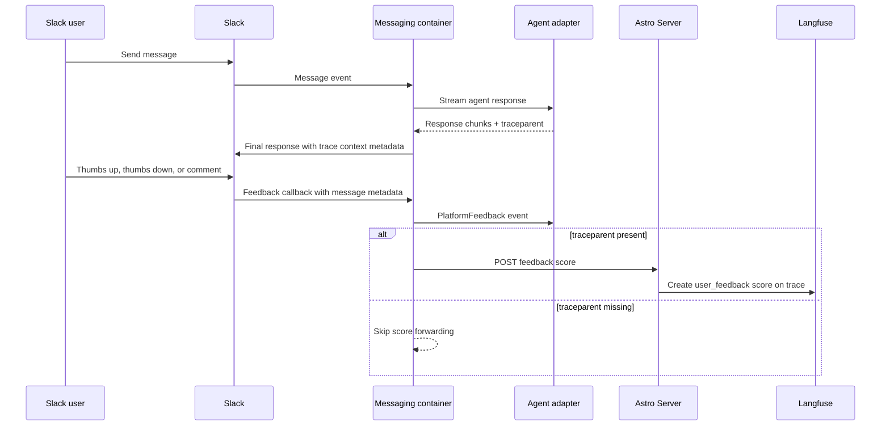

## Summary

Slack feedback can now be attached to the Langfuse trace that produced the rated response. The change carries trace context with agent responses, stores it on the feedback-bearing Slack message, and forwards Slack thumbs or text feedback back to Astro Server as a trace score.

## Design

The adapter bridge exposes a vendor-neutral trace context hook instead of making the messaging container or platform adapters Langfuse-aware. Framework adapters emit the trace context for the response they created, using shared core helpers to format native trace/span IDs as W3C `traceparent`; the messaging bridge attaches that context to streamed response chunks and platform feedback.

Slack writes the trace context into message metadata on the final response chunk, where the feedback controls live. Feedback callbacks read that metadata and forward the original `PlatformFeedback` to the agent as before, while also sending a deployment-token-authenticated score request to Astro Server.

Astro Server owns the Langfuse integration. It resolves the deployment from the deploy token, loads that account's Langfuse credentials, parses the trace ID from `traceparent`, and creates a categorical `user_feedback` score with value `thumbs_up`, `thumbs_down`, or `comment`. Reaction scores do not set a score comment. Comment scores store only the submitted feedback text in the score comment field; platform context is used for stable score IDs but is not persisted as Langfuse score metadata.

## Rollout

1. Deploy the Astro Server change first (this PR). This adds the deploy-token-authenticated feedback score endpoint and Langfuse score creation, but does not change runtime behavior until messaging starts calling it.
2. Publish the updated messaging SDK packages: `@astropods/messaging` and `astropods-messaging`.
3. Publish the updated adapter packages: `@astropods/adapter-core`, `astropods-adapter-core`, `@astropods/adapter-langchain`, `astropods-adapter-langchain`, and `@astropods/adapter-mastra`.
4. Deploy the updated messaging container. This stores response trace context in Slack message metadata and forwards feedback scores only when feedback includes `traceparent`; feedback without trace context remains a no-op for scoring.

## Migration

No user-facing migration is required. Local adapter testing should publish the updated messaging SDK to the local registry before installing adapters, so adapter runtime proto descriptors include the new trace context fields.
