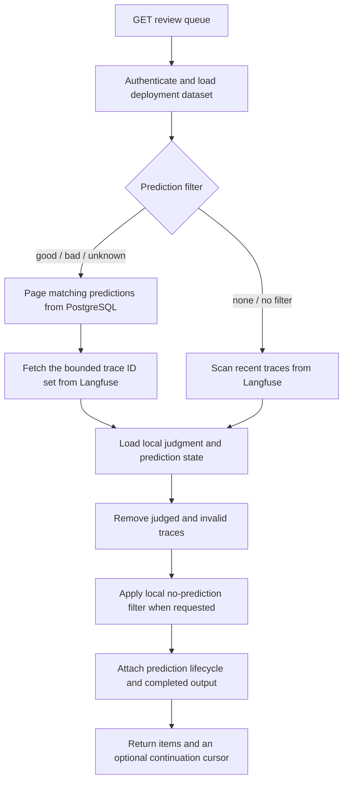

# Prediction-aware review queue

## Summary

The dataset review queue now exposes asynchronous prediction state and completed judge output while retaining Langfuse as the source of trace ordering.

## Design

One cursor contract covers filtered and unfiltered queue reads. Good, bad, and unknown filters use prediction trace timestamps to keyset-page matching trace IDs, then ask Langfuse only for that bounded set. Unfiltered reads return all eligible traces. No-prediction reads scan Langfuse pages and retain only traces without a stored completed prediction. All paths remove human-judged traces, enrich candidates from local prediction storage, and return a continuation cursor when more of the fixed trace snapshot remains.

## Migration

The prediction table gains the required source trace timestamp and an index for trace-recency pagination. Verdict matches are sparse relative to the full trace history, so they are selected from PostgreSQL before Langfuse is queried. Persisting the original trace timestamp lets that local query retain Langfuse's newest-first queue order without loading every matching trace ID first or ordering by prediction creation time. The worker copies the timestamp from the Langfuse trace when storing a prediction.

Prediction storage has no existing rows to backfill. The Astro client moves from offset and snapshot parameters to the opaque cursor. No user action is required.
